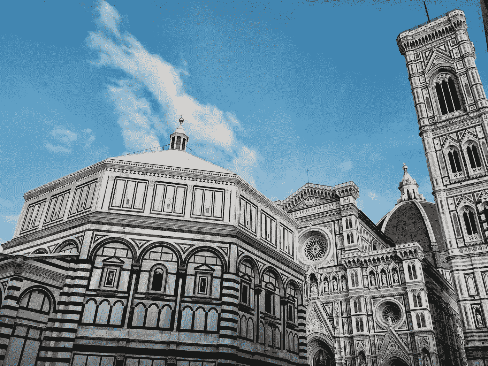
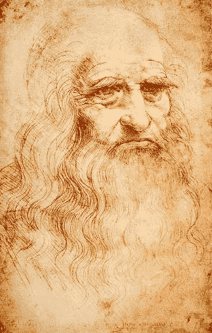
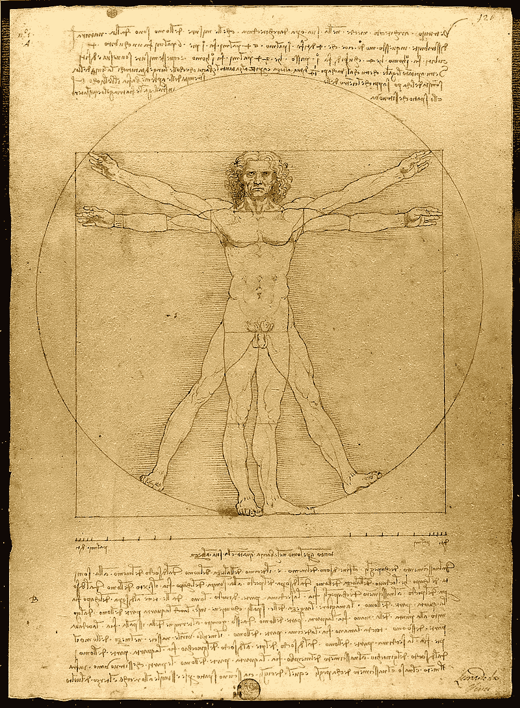

# 艺术和科学之间没有冲突

> 原文：<https://medium.datadriveninvestor.com/there-is-no-clash-between-art-and-science-3028d0420fbe?source=collection_archive---------10----------------------->

## 向人类最伟大的天才之一学习

直升机的发明者、水肺潜水装备的发明者、设计降落伞的第一人、正确描述心脏血液流动的第一人有什么共同点？

他们都在旁边画了一点。

…他们都是同一个人。

也许我们应该比说他画了一点点更进一步。因为他画了有史以来最著名的画。

莱昂纳多·达·芬奇(Leonardo da Vinci)是一名左撇子同性恋素食和平主义者，喜欢穿色彩鲜艳的衣服，他可能会在柏林的电子音乐舞台上度过一生，但事实证明 15 世纪的佛罗伦萨也不太糟糕。在后来被称为 ***文艺复兴*** 的初期，像佛罗伦萨、米兰和威尼斯这样的意大利城市充满了活力和创造力，像美第奇家族这样的富裕赞助人为艺术家舒适地追求他们的兴趣提供了充足的资金。

Photo by [Nicole Ferzoco](https://unsplash.com/@nferzoco?utm_source=medium&utm_medium=referral) on [Unsplash](https://unsplash.com?utm_source=medium&utm_medium=referral)

这种环境成了一些人类最伟大天才的培养皿。米开朗基罗、拉斐尔或列奥纳多的艺术至今仍激励着我们。

## 好奇心的力量

> 描述啄木鸟的舌头。
> ***达芬奇***

与同时代的米开朗基罗不同，达芬奇不是一个冷漠的天才。他善于社交，迷人，张扬，但最重要的是:极度好奇。正如沃尔特·伊萨克森在他的伟大的列奥纳多传记中所写的，从他的天才，从他看世界的方式，从他不断驱使和驱使自己去探索，去学习和挑战他所知道的东西，可以学到一些东西。并且从他仔细观察的方式(描述一只啄木鸟的舌头，读他的一篇日记条目)结合一个领域的观察，得出其他领域的创造性突破。

 [## 良好的生活是习惯的形成|数据驱动的投资者

### 过度思考是过度紧张。仅仅几个简单的习惯就会在一天中产生巨大的影响。那是…

www.datadriveninvestor.com](https://www.datadriveninvestor.com/2020/01/17/a-good-life-is-habit-forming/) 

他的观察技巧，首先也是最重要的，使他成为了他那个时代最伟大的科学家和艺术家。

他雄心勃勃的好奇心使他参与了大量看似无关的项目:他解剖了人体和马，对化石有了重大发现，弄清楚了鸟类如何飞行，研究了光学，制造了仪器并能够熟练地即兴创作，在宫廷上演戏剧作品，为米兰公爵建造了一座巨大的马雕像，规划了一条河流的改道，为坦克、堡垒和大教堂绘制了草图。名单几乎是无穷无尽的，从来没有停下来留下深刻印象。

> "最崇高的快乐是理解的快乐."
> ***达芬奇***

列奥纳多是文艺复兴时期的杰出人物，他掌握了他所能掌握的每一项努力。

许多人可能会说，文艺复兴时期的人、各行各业的伟人的时代至少已经过去了 200 年(阿尔伯特·爱因斯坦认为歌德是“世界上最不可能知道一切的人”)。我们认为，在我们这个时代，越来越狭隘的专业化已经成为游戏规则。

艺术和科学之间的巨大鸿沟会让列奥纳多感到困惑。

但事实证明，什么都不知道和只知道一件事是有很大区别的。我们关于专业化在我们的知识产业中如何至关重要，关于现代科学家和艺术家应该如何运作以及现代职业应该如何发展的许多想法都存在严重缺陷。正如大卫·爱泼斯坦在他的书 ***Range*** 中所展示的那样，在许多情况下，广度胜过狭窄。如果每个人都试着更像莱昂纳多一点，这对我们大家都有很大的帮助。

## 范围的优势

> 我们不能用创造问题时所用的同一种思维来解决问题。
> ***爱因斯坦***

我们倾向于认为，现代科学过于专业化，以至于孩子们有必要选择一个他们想从事的领域(就像 10 岁的孩子选择一个他们想用余生研究的特定蛋白质折叠机制)，如果你想在任何地方取得成功，你需要尽早努力专注。

但是没有提出突破性想法的公式。的确，很多时候好主意来自意想不到的地方。高度专业化的人不会给领域带来革命性变化，正如爱因斯坦已经指出的，突破通常不是基于特定领域的专业知识，而是来自一个领域到另一个领域的见解的创造性组合。

许多创新者在学校经历挫折，因为他们太宽泛，无法归入整齐的类别。如果目标变得不那么严格，领先就越来越没用了。探索知识边界的世界当然不是一个有明确目标的僵化过程。

许多转行的人实际上在新领域经历了巨大的增长率。成功的人经常改变和探索。正如大卫·爱泼斯坦 在 ***Range*** 中指出的那样，一项针对科学和商业领域高度成功人士的研究表明，几乎每个人都认为自己走了一条“不寻常的路”，他们实际上是局外人，只是运气好而已。

如果所有的成功人士都不认为自己符合成功的标准，也许这个标准一开始就有缺陷？

## 类比的力量

> "最伟大的科学家也是艺术家。"
> ***爱因斯坦***

爱因斯坦的名言总是很好，我永远不会厌倦使用它们，但幸运的是，有证据支持他的说法。

鲁特等人的一项研究表明，诺贝尔奖获得者在业余时间追求艺术兴趣的可能性是普通科学家的三倍，在业余时间演戏、唱歌或表演的可能性是普通科学家的二十二倍，而那些缺乏业余审美兴趣的人往往不会对自己的领域做出多少创造性贡献。正如现代神经科学之父 Cajal 所说:“看起来他们在分散精力，但实际上，他们在挑战这些精力。”

认知壁垒描述了一种僵化的思维，如果某些想法和行为在个体中根深蒂固，就会出现这种思维。专家们在一个狭窄的领域呆得越久，他们的创造力就会越来越弱，因为没有来自任何地方的新思想输入。

> “我写诗是为了洞察我周围的世界，并理解我对它的反应……科学的语言天生就是诗意的。”
> ***罗阿尔德·霍夫曼，1981 年诺贝尔化学奖获得者***

在达芬奇的例子中，他对光学和解剖学的研究使他能够画出真实的灯光和暧昧的微笑。他被水的漩涡和水流迷住了。这不仅改善了他画水的方式，还让他了解了血液在心脏中流动是如何产生关闭心脏瓣膜的涡流的，这在当时是一个完全新奇的猜想，直到 20 世纪后期才通过经验得到证实。

类比是解决问题的基础。约翰尼斯·开普勒喜欢类比，并在他革新天文学时积极地使用它们。查尔斯·达尔文思想极其开放，博览群书，对艺术有着明显的兴趣。闲暇时阅读经济学书籍有助于激发他对进化过程的关键见解:

> “我碰巧读了马尔萨斯关于人口的书，并准备好欣赏 T21 的生存斗争，我立刻意识到，在这种情况下，有利的变化将被保留，不利的变化将被摧毁。”
> ***查尔斯·达尔文***

达尔文甚至在他的书房里挂了一幅达芬奇的照片，如果这能告诉你什么的话。

类比允许开普勒、达尔文和列奥纳多考虑不相关的理论，并在它们的结构中找到共同点，这些共同点可以在解释新的观察结果时加以利用。不同的背景，无论是其他艺术还是社会科学，提供了不同的类比，因此往往会增加想法之间产生富有成效的协同作用的可能性。

## 向达芬奇学习

Leonardo da Vinci / Public domain

在文艺复兴时期，灵活性和范围是值得称道的。但时至今日，它们仍然同样有价值，在人工智能崛起的时代，它们的重要性只会增加，挑战一个很容易被互联网知识库取代的狭窄技能集。消除边界的思维变得越来越重要，人类需要创造性地结合来自不同领域的想法。看看就业市场的未来，有固定的梦想和追求狭窄的职业道路越来越像是一个坏主意。

The Vitruvian man. Leonardo da Vinci / Public domain

列奥纳多并没有把他的爱好视为局限于他空闲时间的无关紧要的兴趣。他不仅仅是科学家或艺术家。莱昂纳多在保持多种职业道路畅通方面是个天才。他本可以成为一名画家、建筑师、工程师、医生、歌手、演员。他没有区分艺术和科学，因为正如 [Root 等人在他们的研究结果](https://psycnet.apa.org/record/2009-22160-003)中所说，“对于这些科学家来说，科学只是作为人类的一部分，而不是他们存在的最终目的和全部”。对于《维特鲁威人》的画家莱昂纳多来说，一种整体的人道主义方法始终是他所有努力的中心。

当然，并不是每个人都像他一样有天赋，但他的榜样可以继续鼓舞人心，从他的好奇心和挑战旧思想并创造性地将其与新思想相结合的意愿中汲取的经验教训仍然具有现实意义。