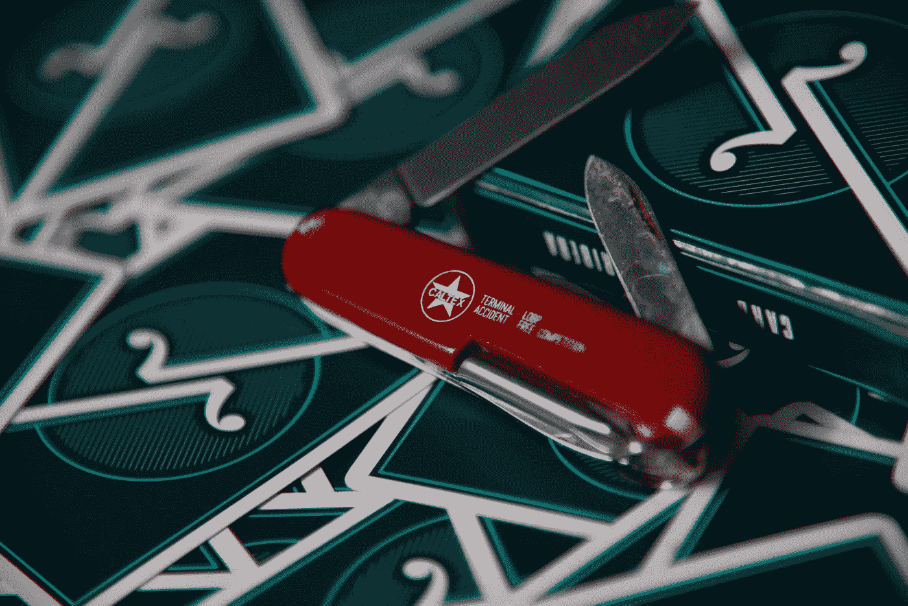

# 太多用例的单一情况

> 原文：<https://medium.datadriveninvestor.com/there-is-such-a-thing-as-too-many-use-cases-497d9477dd19?source=collection_archive---------33----------------------->

## 试图吸引所有人，不会让任何人喜欢你。

Photo by [Michael Heng](https://unsplash.com/@michaelhlk?utm_source=medium&utm_medium=referral) on [Unsplash](https://unsplash.com?utm_source=medium&utm_medium=referral)

多功能性往往是值得称赞的，然而，自由职业者和组织需要小心。大多数情况下，具体要比笼统好得多。这不仅表明你知道并理解自己的能力，还能确保你吸引的是合适的人。

例如，我是一名作家。事实上，我几乎可以写任何东西，然而，如果你问我以什么为生，你会得到不同的答案，这取决于你是谁。

如果你是一家出版物的编辑，我就是一名记者；如果你代表一家公司，我就是一名公关和传播专家。如果你是一个普通人，我可以成为一个博客写手，我很可能最终成为一个品牌信息咨询顾问，同时也是一个记者博客写手。

不管是哪种方式，关键不在于你能做什么，而在于你在和谁交谈。

这也是大多数自由职业者和公司误解的地方。

他们试图同时和每个人交谈。

不是这么回事。

我见过几十个非常好的区块链项目，它们只是试图同时与太多的人进行太多的交流。

他们没有关注任何特定的人真正关心的事情，而是面向大众，这是一个重大的错误。试图让每个人都开心(或者对他们的产品/服务/项目感兴趣),他们最终会处于平庸或可信的边缘。

对品牌信息进行概括是最简单的方法。具体化需要一系列困难的问题和答案，每一个都有自己的权衡。然而，如果你希望脱颖而出，就必须做出牺牲。

你是愿意告诉你的朋友提供交换的项目(而且只是交换，但是有很好的用户体验)，还是愿意告诉你的朋友提供相对较好的交换，但是也是钱包、社交网络和自由职业者工作平台的项目？

赢家是只能互换的产品。总是如此，尤其是在创业阶段。在你经商这么久，人们已经非常了解你，你不能被忽视(谢谢 Cal)之后，你就可以开始考虑用你的品牌做更多的事情了。

但首先，你必须为某事而出名。

苹果早期并没有做出成千上万种不同的产品。他们本可以制造出世界上最酷的(字面上的)冰箱，但他们坚持己见，只制造电脑。

自然地，你可以为不同类型的人服务，但是，你不能同时和所有的人交谈，除非你和这些人有共同的想法。

现在，在这篇博文中，我正在与自由职业者、创始人和营销主管交谈。他们都有一个共同的倾向，那就是立刻追求一切。

我的建议是，你要等待时机，投入精力和精力去了解你是谁，你想为谁服务，并专注于为这些人提供价值。你不需要全世界都喜欢你的品牌，只需要那些关心你的人。

不要担心成为你所在行业的瑞士军刀，只要确保你是你所在行业中最好的(在此插入优势)供应商。