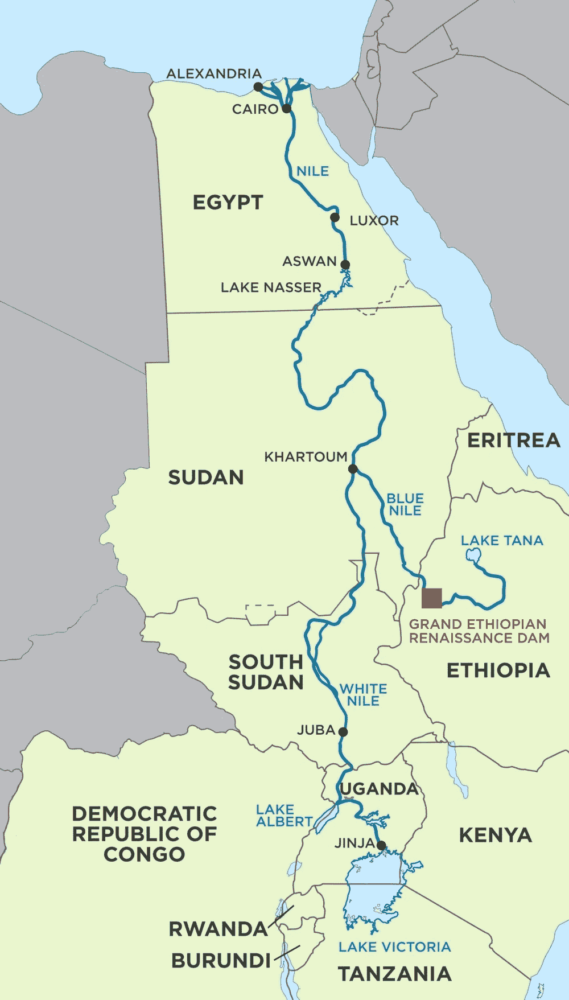
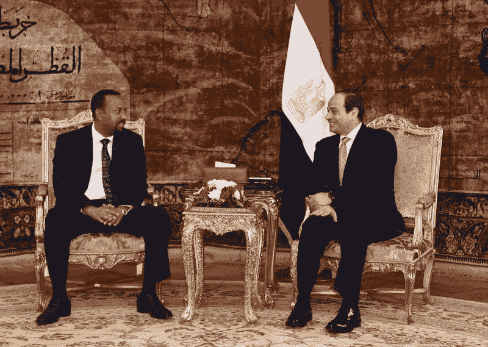

# 埃及和埃塞俄比亚之间的战争迫在眉睫

> 原文：<https://medium.datadriveninvestor.com/there-is-war-looming-between-egypt-and-ethiopia-a3b377469a80?source=collection_archive---------5----------------------->

## 这是为了尼罗河

[Map Indicating location of GERD](https://www.atlanticcouncil.org/blogs/menasource/the-politics-of-water-what-we-know-about-the-grand-ethiopian-renaissance-dam/)

2020 年 2 月 14 日[埃及外交部](https://www.voanews.com/africa/no-deal-us-brokered-nile-dam-talks)宣布，埃及已经签署了一份由美国财政部起草的关于大埃塞俄比亚复兴大坝(GERD)蓄水和运行规则的协议。这项签署是在埃塞俄比亚代表团不在场的情况下进行的。这个项目，以前被称为千年大坝，是埃塞俄比亚蓝尼罗河上的一个重力坝。自从这个地方被美国开垦局发现以来，大坝一直处于半搁置状态。终于在 2011 年 3 月 30 日，[项目在](https://www.bloomberg.com/news/articles/2011-03-30/ethiopia-plans-to-build-new-hydropower-plant-to-generate-5-250-megawatts)公之于众。

然而，这个项目遭到了埃及的强烈反对，埃及认为这个项目威胁到了本国的供水和阿斯旺大坝的水力发电厂。这种担心的原因分两步走。首先，青尼罗河贡献了流入埃及尼罗河的 60%的水量。第二，埃及担心一旦埃塞俄比亚的大坝建成，它将单方面控制水流。多年来，埃及和埃塞俄比亚在外交和其他方面加大了压力，以确保他们达成妥协。这场危机现在达到顶峰的原因是因为它接近完成并开始运作。根据埃塞俄比亚水利、灌溉和能源部长的说法，大坝已经完成了将近四分之三。它将在今年的某个时候开始填充。

 [## 保护主义、政治和经济动荡|数据驱动的投资者

### 美国股市昨日出现 400 多点的大幅反转，为未来的事情发出了警告信号。市场…

www.datadriveninvestor.com](https://www.datadriveninvestor.com/2018/06/28/protectionism-politics-economic-turmoil/) 

如果到那时还没有达成妥协，战争或至少敌对行动的增加就迫在眉睫。埃塞俄比亚现任总理阿比·艾哈迈德曾宣称*大坝的竣工“没有任何力量可以阻挡”。与此同时，他试图向埃及公众和领导人保证，*

> *[*“我发誓，我发誓，我们不会伤害埃及的供水。”*](https://www.nytimes.com/interactive/2020/02/09/world/africa/nile-river-dam.html)*

**

*[Ethiopian Prime Minister Abiy Ahmed (Left) Egyptian President Abdel Fattah al-Sisi (right)](https://www.reuters.com/article/us-egypt-ethiopia/egypt-ethiopia-agree-to-settle-differences-over-nile-mega-dam-idUSKBN1J60YL)*

*埃及总统阿卜杜勒·法塔赫·塞西最近(3 月)就埃塞俄比亚局势与高级军事官员举行了一次会议。埃及还从德国、法国和俄罗斯获得了广泛的军事装备。埃及也警告说，它将使用“所有可用的手段”来保护埃及人民的利益，他们依赖尼罗河来满足国家 90%的用水需求。埃及前总统穆罕默德·穆尔西(Mohammed Morsi)将这一威胁推进一步，称政府将，*

> *[*“用鲜血捍卫每一滴尼罗河水”*](https://www.thecairoreview.com/essays/myths-about-food-security-and-water/)*

*随着美国介入并与埃及签署协议，这场危机的任何结果似乎都有利于埃及的利益。从美国的战略角度来看，在这场危机中支持埃及最符合美国的利益。对于美国提出的中东和平计划，埃及的支持至关重要。埃及在经济和军事上也更强大——因此它在中东政治中发挥着有影响力的作用——与政府建立战略伙伴关系对美国更有利。*

*对埃塞尔比亚来说，这个项目的好处是巨大的，有可能每年为[带来大约 10 亿美元的出口收入。埃塞俄比亚在这个项目上已经花费了大约 48 亿美元，其中](https://www.nytimes.com/2014/10/12/world/dam-rising-in-ethiopia-stirs-hope-and-tension.html)[18 亿美元由中国的银行资助](https://www.max-security.com/reports/strategic-analysis-reprecussions-of-chinese-investments-in-the-nile-river-basin/)。埃塞俄比亚政府还与中国葛洲坝集团有限公司签订了合同。完成这个项目。尽管中国没有介入此事，但其经济和战略利益足以让它在该项目受到严重威胁时采取行动。*

*埃塞俄比亚外交部长对 2 月 14 日签署的协议发表评论，称之为:*

> *[*“不可接受&高度党派化，埃塞俄比亚认为应继续与埃及&苏丹接触，以解决悬而未决的问题，并在对各方共赢的基础上最终确定指导方针和规则”*](https://twitter.com/geduandargachew/status/1233797172950392832)*

*[3 月 30 日](https://aawsat.com/english/home/article/2208731/hamdok-visit-cairo-addis-ababa-resume-renaissance-dam-talks)宣布，在谈判短暂停顿(埃塞俄比亚退出谈判，以便重新评估其选择)之后，苏丹总理阿卜杜拉·哈姆杜克将访问开罗(埃及首都)和亚的斯亚贝巴(埃塞俄比亚首都)，以便继续谈判。Andargachew 部长本月说，埃塞俄比亚也在准备解决这个问题。*

*有一点是肯定的，这场危机很快将达到顶峰。埃塞俄比亚政府(和中国政府一起)在大坝上投入了这么多钱，它不会因为埃及的军事威胁而退缩。另一方面，埃及过于依赖供水，以至于无法相信埃塞俄比亚政府(不仅是现政府，还有未来的政府)不会随意切断供水。以这种方式进行谈判，保证埃及人的供水安全，符合美国的最大利益。陈述这一点很简单，然而，在全球政治中没有信任这回事，只有杠杆。*