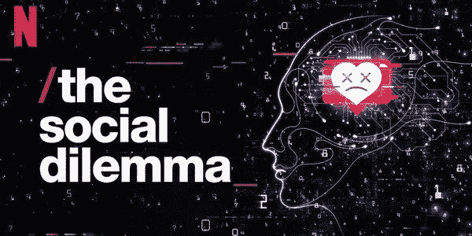
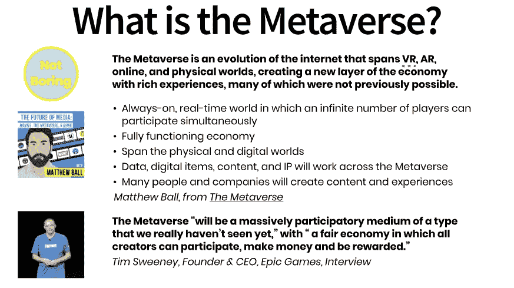
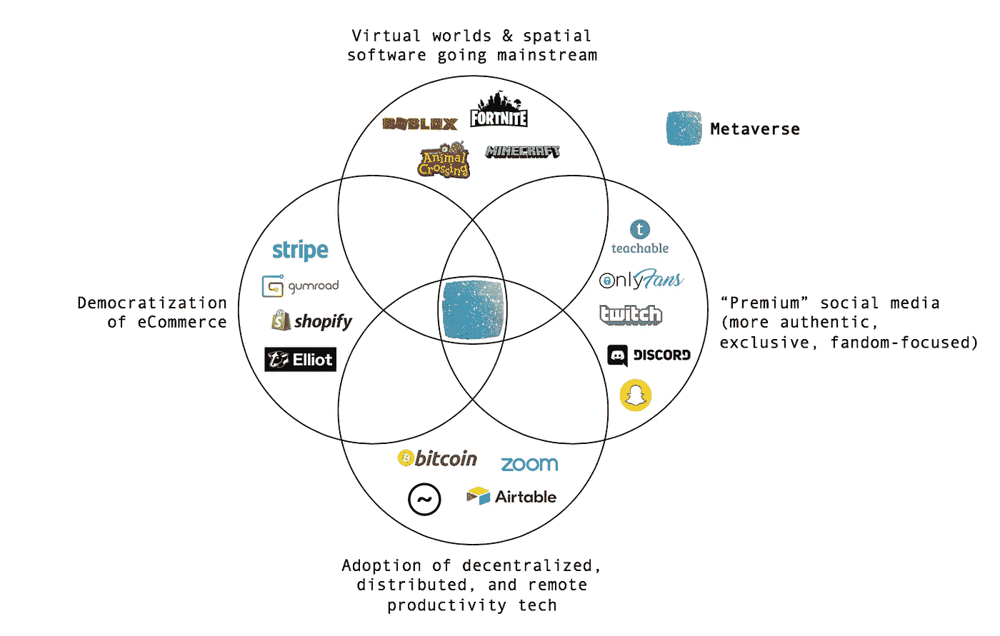
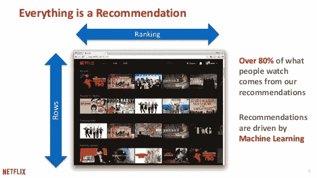
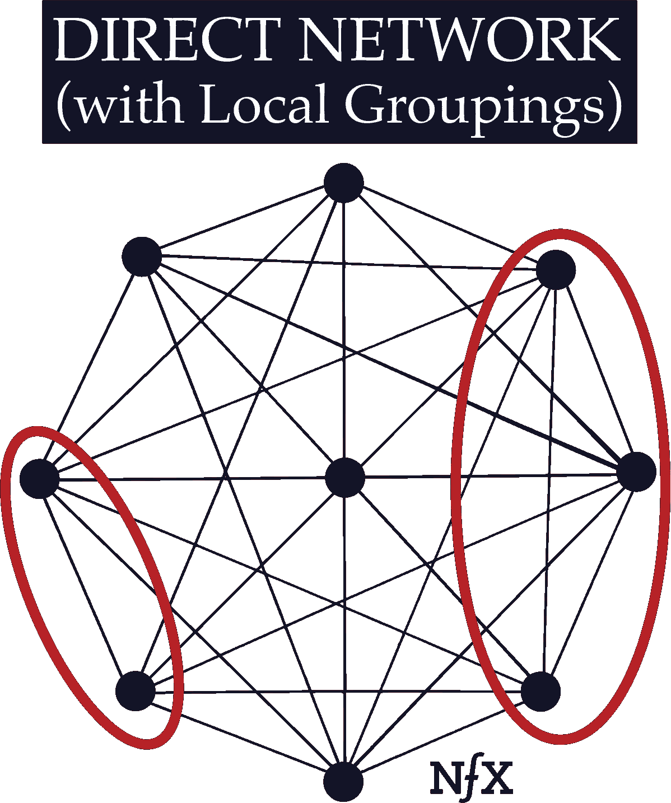
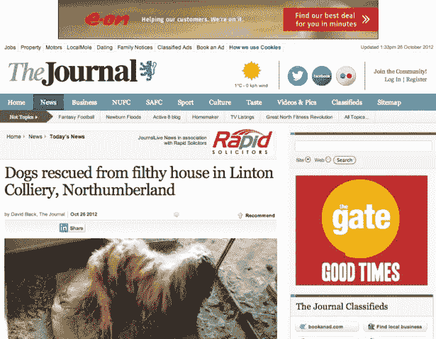

# 没有社会困境，只有元宇宙困境

> 原文：<https://medium.datadriveninvestor.com/theres-no-social-dilemma-only-the-metaverse-dilemma-62798f34b56b?source=collection_archive---------5----------------------->

监控资本主义是未来。随着我们在网上花的时间越来越多，我们无法逃避它。

网飞最新的纪录片《社会困境》已经火了🔥

对那些没看过的人来说，《社交困境》是关于…..

1.  互联网上最受欢迎的产品(如谷歌、脸书、Instagram 等)。)跟踪用户的行为，销售有针对性的广告，诱导用户上瘾的行为
2.  大量采访硅谷巨头的前员工(尤其是脸书/insta gram/谷歌/Pinterest 的前产品经理/高管)
3.  科技公司如何影响选举、种族暴力以及抑郁症和自杀率
4.  一个戏剧性的总体情节涉及沉迷于发送快照和保存条纹的青少年🔥
5.  监督资本主义(我知道的大词)

令我高兴的是，该节目还邀请了一些外部评论家，如哈佛教授和《监控资本主义时代》的作者肖莎娜·祖博夫。除了常见的[科技兄弟，节目中的人真是健康的组合！](http://www.uscannenbergmedia.com/2020/09/29/the-social-dilemma-review-netflix-docudrama-fails-to-hold-tech-bros-accountable/)

在节目的最后，它建议我们不要观看推荐算法所建议的内容。但我看这个节目正是因为网飞算法向我推荐了这个。很讽刺。

这篇文章不是对纪录片的评论或批评。如果你想知道纪录片是否准确地指出了社交媒体的缺陷，请点击这里查看威尔·奥雷莫斯的评论:

 [## “社会困境”带给我们什么

### 广受欢迎的新网飞纪录片是一个没有答案的警钟

onezero.medium.com](https://onezero.medium.com/where-the-social-dilemma-gets-us-1a9c91e2c48b) 

相反，我认为监控资本主义是不可避免的。我们有一个比社会困境更大的问题。我们面临着元宇宙困境。

# 元宇宙困境

> 随着我们花更多时间上网和数字化我们的日常生活:
> 
> 1)要么我们的隐私屈服于元宇宙的“监视”性质
> 
> 2)或成为元宇宙“资本主义”性质的产物

没有任何解决方案能够同时解决这两个问题。

本文将涵盖:

**👉🏻什么是元宇宙？**

**👉🏻推荐算法和监控**

**👉🏻《资本家上瘾的商业模式》(CABM)**

**👉🏻我们能做些什么吗？**

# 什么是元宇宙？

这个术语是由科幻作家尼尔·斯蒂文森在他 1992 年的*中首次提出的，让这个想法听起来很傻，很像游戏。让人想起 90 年代初的万维网？没错。在 90 年代，没有人能预测到网络的力量和影响。数万亿的产业和公司被创造出来。同样，现在没有人知道元宇宙能做什么，它会是什么样子。*

**

*From [Packy McCormick](https://medium.com/u/26016f95748?source=post_page-----62798f34b56b--------------------------------)’s NotBoring newsletter [here](https://twitter.com/packyM/status/1298273427678142468) — my inspiration on the future of metaverse (although I disagree with his optimistic outlook)*

*著名早期风险投资人、迪士尼未来的思想领袖马修·鲍尔(Matthew Ball)在 [*、元宇宙*](https://www.matthewball.vc/all/themetaverse) *:* 中普及了“元宇宙”*

> *元宇宙将是一个永远在线的实时世界，无数的人可以同时参与其中。*
> 
> *它将拥有一个功能齐全的经济体，跨越物理世界和数字世界。数据、数字项目、内容和知识产权(“IP”)将在整个元宇宙工作，许多人和公司将创建内容、商店和体验。*

*此外，Epic Games 首席执行官蒂姆·斯维尼评论说，“这将是一种我们尚未真正看到的大规模参与式媒体”，“一个所有创作者都可以参与、赚钱并获得回报的公平经济”*

*目前，元宇宙听起来像是黑客帝国和准备好的玩家一号。但我相信，在未来，它会向真实世界的精确复制品靠拢。*

*在 VR 和 AR 技术的帮助下，它看起来会很像真实世界。借助远程协作工具，它将对现实世界产生巨大影响。它将和现实世界一样重要，因为我们将更多的时间花在网上，并将线下活动转移到网上。*

* [## 创业公司的顾问？与他们合作的 4 种最佳方式|数据驱动型投资者

### 顾名思义，顾问能给你的建议对一个人来说是成功还是失败的关键

www.datadriveninvestor.com](https://www.datadriveninvestor.com/2020/09/27/advisors-in-your-startup-4-ways-to-best-work-with-them/) 

很明显，在这个元宇宙中，它将有不同的层次和不同程度的“数字渗透”——也许在一些层次中，数字空间的使用在其他层次中没有那么普遍/高比例。

The Minimum Viable Metaverse from [here](https://vividandvague.substack.com/p/the-minimum-viable-metaverse)

如上图所示，元宇宙需要几种催化剂。首先，虚拟世界和空间软件(尤其是 AR 眼镜和 VR 工具)正在成为主流。其次，社交媒体越来越倾向于取代现实生活中的交流。第三，生产力工具套件使 100%的远程工作成为可能(此外还有数字游牧生活方式+许多知识型员工的 WFH 文化)。第四，电子商务使得做生意比以往容易得多。Stripe 处理支付，而 shopify 为您处理所有其他方面。

# **推荐算法和监控**

我们花在网上的时间越来越多。

多亏了 COVID，我们甚至将线下活动转移到了线上。教育和医疗这两个世界上最官僚、最传统、最能抵御技术颠覆的万亿美元产业已经向疫情低头。请注意从面对面教育到 MOOCs 再到在线教学平台的转变。还要注意远程医疗和远程医疗平台的兴起。他们现在给病人提供的不仅仅是虚拟咨询。

随着我们在网上花的时间越来越多，这些平台和整个元宇宙会收集更多关于我们的数据。

我们在不同平台上创建账户时收集的✅个人信息

当我们在元宇宙上花更多时间发消息、互动和做决定时，✅应用程序内的行为数据被追踪

✅我们对应用程序通知的回应也被收集，因为不同的平台争夺我们有限的注意力。例如，Tinder 会提醒你，让你想在这个平台上花越来越多的时间(惊人的 UX 分析[这里](https://growth.design/case-studies/tinder-monetization/)

所有这些数据都用于支持推荐算法。

包括推荐我观看网飞社交困境的推荐算法:

推荐算法是一把双刃剑。一方面，你得到了效率和更好的 UX，因为这台机器似乎真的能给你提供你喜欢的和你想看的东西。另一方面，在您点击“同意”条款和条件的那一刻，您就自愿放弃了您的隐私。

对于我个人的用例来说，推荐算法相当有用:当我在 Youtube 上学习编码或计算机科学时；当我在媒体上阅读关于产品管理的文章时；当我在阅读关于战略/创业的子堆栈时。

随着元宇宙成为现实，越来越多的关于我们生活的数据将被收集。这是不可避免的。

更重要的问题是:这些数据是如何使用的？

不幸的是，由于公司的利润动机，推荐算法被使用。

*他们想让你沉迷于这个平台。*

# **《资本家上瘾的商业模式》(CABM)**

> 如果你免费得到产品，你就是产品

如今许多社交媒体应用对用户来说都是免费的。不幸的是，这意味着用户本身就是被平台货币化的产品，被卖给客户(通常是广告公司/企业等)。)

产品是免费的。所以产品的用户就是产品。

这是多么的资本主义啊！

元宇宙几乎肯定会采用同样的商业模式。这是因为基于广告的商业模式适用于高流量的可扩展平台。不幸的是，元宇宙很快就会被这些平台占据。

> 实际上，基于广告的企业正在出售改变用户行为的机会。他们的用户的注意力和行为就是他们的产品。

如果你拥有一个社交网络，或者元宇宙上的一个平台，你的用户在上面花费越来越多的时间，你如何赚钱💰？

1.  您扩大了您的**可货币化用户群**(例如，更高的 dau)
2.  你**增加用户广告负载**(向用户展示更多广告！)
3.  你**诱导** **更高的使用率**(争取用户的注意力跨度，让他们花更多时间在你的平台上)

## **1。扩大您的可盈利用户群**

利用 FOMO，害怕错过。告诉你的用户与新的人接触(“导入你的联系人列表！”)，通知他们可能感兴趣的操作(“您在照片中被标记了！”)，并操纵你的用户对社交认可的需求(“Sally 和其他 5 个人喜欢你的帖子！”).

安德森·霍洛维茨(A16z)和 NFX 喜欢称之为网络效应。

我想称之为:

> 扩展你的业务，让它变得大而不倒

## **2。增加用户广告负载**

听起来很容易，但也很容易越过一个临界点。大多数人都不喜欢在很短的时间内看到太多的广告。

Worst website ever…. full of ads

## **3。诱导更高的使用率**

又名，让你沉迷于这个平台，以便你总是回来。

推荐算法和脸书的“有机”新闻订阅实现了适当的社交媒体成瘾。

资本主义上瘾的商业模式(CABM)是阴险的，不可避免的，结构性的。

元宇宙无法逃脱 CABM，因为元宇宙必须以某种方式遏制:1)广告，2)用户生成的内容，以及 3)诱导成瘾行为的机器学习。

记住:元宇宙想要成为现实的替代品。它的保真度越高，你就越有可能回到它那里。

没有例外。只是不可避免。

# 我们能做些什么吗？

节目接近尾声时,《社会困境》表明，政府控制/监管对于补救社交媒体的负面影响是必要的。

我可以看到监管元宇宙也有类似的理由。

政府监管有帮助吗？这有助于隐私和数据所有权。这有助于元宇宙减少监视。但是我们必须划清界限。

正如彼得·泰尔[和](https://www.inc.com/sonya-mann/thiel-ai-cryptocurrency.html)所说，“加密是自由主义的。AI 是共产主义者”，想象一下，如果一个威权国家获得了网络空间和元宇宙的控制权。

元宇宙应该把用户从专制现实中解放出来，而不应该被用作专制者的镇压工具。

元宇宙监管资本主义现实中的“T0”资本主义“T1”又如何呢？

我确实看到了一些值得测试的替代商业模式。关键是让用户激励与公司激励相一致。

一个有前途的商业模式是，如果用户实际上在产品上花费的时间更少，就向他们收费。电子邮件生产力套件 [Superhuman](https://medium.com/@jackchong0828.jc/superhuman-is-not-enough-for-productivity-heres-why-1b4a30024f9f) 提供了类似的价值主张。你付费使用该产品是因为你想在日常的电子邮件任务上花费更少的时间。* 

*如果机器可以操纵我们的弱点，让我们远离现实，那么元宇宙奇点将是我们的末日。*

*想想准备好的一号玩家。*

**

*地球变成了一片废墟。人们花时间在绿洲上，作为一种逃避现实的机制。*

*可怕吧？*

*我们有很多好生意。我们需要优秀的利益相关者。*

*如果你是一个用户，请阅读 Caroline Luu 的关于如何重新获得你的注意力的指南。如果你是一名设计师，也可以看看如何用设计伦理重新吸引用户的注意力。*

* [## 所以你看了《社交困境》……现在呢？

### 从用户和设计者的角度来看

uxdesign.cc](https://uxdesign.cc/so-youve-watched-the-social-dilemma-f85a03218ea6) 

如果你是一个有抱负的企业家，我希望这篇文章能启发你深入思考技术的社会意义，尤其是当我们迈向元宇宙的时候。* 

*欢迎分享这篇文章，并在 LinkedIn[上联系我](http://www.linkedin.com/in/jack-chong)*

## *访问专家视图— [订阅 DDI 英特尔](https://datadriveninvestor.com/ddi-intel)*