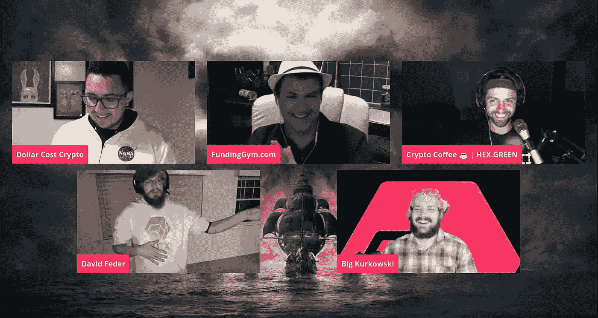
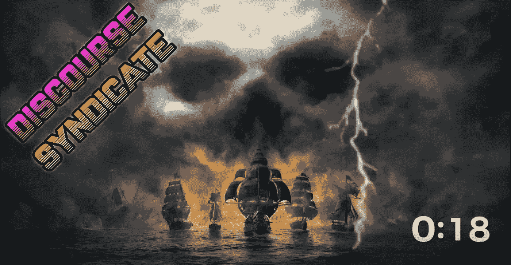
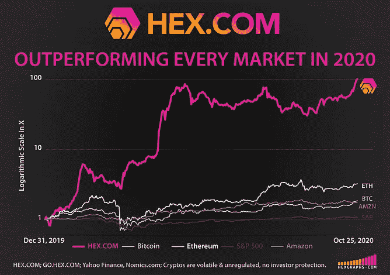
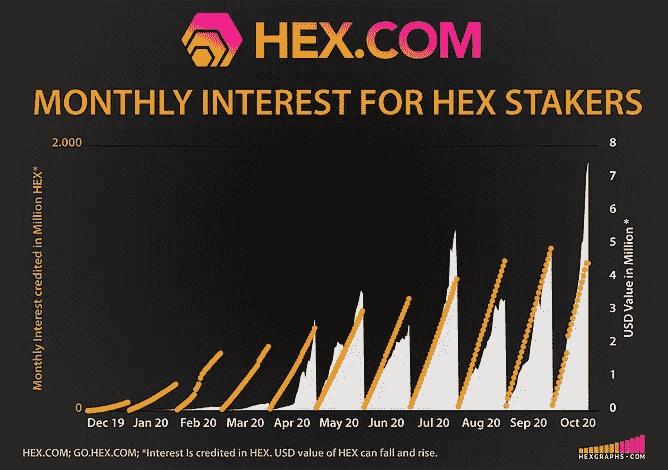
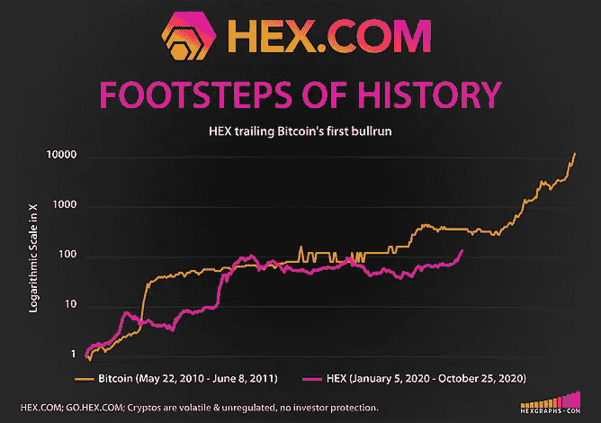

# 这 3 分钟捕捉到了一些非常特别的东西

> 原文：<https://medium.datadriveninvestor.com/these-3-minutes-may-have-captured-the-most-beautiful-of-things-ever-seen-in-cryptocurrency-7a0a3de53749?source=collection_archive---------7----------------------->

## 令人耳目一新，令人惊叹:没有比这更好地展示感激、谦逊和信念的了

大卫·费德是一位 34 岁的丈夫和三个孩子的父亲，他描述自己“只是一个在电脑商店工作的 IT 人员”，他传递了一个非常勇敢和感人的信息

David Feder Delivers a 3 Minute Heartfelt Message

**我不认识大卫·费德，但他昨天创建了他的第一个 YouTube 视频。他把自己的脸放在那里，并在一条充满感激和对加密货币的信心的非常真诚的消息中谦卑自己。大卫自己已经参与加密货币多年，他的证词是这个领域最受欢迎的灵感。**

坦率地说，在我参与金融市场的 20 多年里，包括近 10 年专注于比特币和加密货币的时间，我从未见过类似于我现在在[HEX.COM](https://hex.com/)看到的东西——第一张高息区块链存单。

[HEX 的](https://hex.com/)采用，[在 chain](https://hex.vision) 上得到验证，规模巨大且不断增长:在撰写本文时，已经在 [Nomics](https://nomics.com/) ( [BTI 在市场数据完整性方面验证排名第一](https://btiverified.com/crypto-market-data-report-2020/))中排名第九，拥有超过 5.4 亿美元的 HEX 活跃股份，支付可变的 29% APY。平均持股时间为 5 年；最长的赌注是 15 年。这种在 HEX 中看到的[可验证的链上承诺在加密货币中是前所未有的。](https://hex.vision/goto/610cdd1b335c2fbccd70ef56296bf782)

# 大卫在话语辛迪加上讲述一切

David Feder on Discourse Syndicate’s Live Stream

**大卫昨晚也加入了 Discourse Syndicate 的讨论小组，进一步分享了他的生活在许多方面发生了积极的变化。他的证词很感人。大卫讨论了他在 IT 领域的长时间工作、加密货币、他的投资方法，以及他如何受到启发来巩固他的时间，以提高效率，更好地为家人提供服务。总之，大卫确实是一个鼓舞人心的人。**

> 看到这种温暖和友善开始回归加密货币，真是令人耳目一新。

## 什么是话语辛迪加？

Subscribe on YouTube

> 话语联盟是一个免费直播节目，每周播出三天:周一、周三和周五晚上。

是什么样的？它有一种有趣的感觉，我会描述类似于乔·罗根的经历和 T2·伊万在科技上的相遇。这确实是一个伟大的时代(也应该注意到，该节目是专为成年观众)。你可以在[dlife](https://dlive.tv/Discourse_Syndicate)或 [YouTube](https://www.youtube.com/c/DiscourseSyndicate) 上轻松关注 Discourse Syndicate，并在 [Twitter](https://twitter.com/RG3_Pirate) 上关注。

> ***话语辛迪加也即将举行 300 万 HEX 赠品活动，详情敬请关注。***

## 特别感谢大卫。人们已经开始说，现在我们看到:HEX 使加密再次变得有趣。

# 开始

**HEX 由连环创业者、早期比特币采用者发明，** [**理查德心先生**](https://www.forbesindia.com/article/brand-connect/richard-heart-and-the-influence-of-bitcoin-on-the-hex-blueprint/62095/1#) **。如今，Heart 先生是以太坊的精通支持者，也是各种主题中令人振奋的思想领袖。**

凭借他鼓舞人心的舞台表现和坦率流畅的采访，哈特先生的观众总是座无虚席。

# 赌注十六进制&看它倍增

[桩工。App](https://staker.app/invite/PQn8) 可以让你安全可靠地在网上积累 100%的财富，并实时观察财富的增长:

**更多资讯**:[**HEX.COM**](https://hex.com/) **新闻及更新:关注 Twitter**[**@ hex crypto**](https://twitter.com/HEXcrypto) **社区:互动、提问、玩乐:**[**https://t.me/HEXcrypto**](https://t.me/HEXcrypto)

# 相关文章

