# 这是美国最富有的 20 个千禧一代——以及他们是如何做到的！

> 原文：<https://medium.datadriveninvestor.com/these-are-the-20-richest-millennials-in-the-usa-and-how-they-did-it-38fd5f64ee57?source=collection_archive---------8----------------------->

## 这 20 位美国千禧一代的总净资产超过 1250 亿美元。

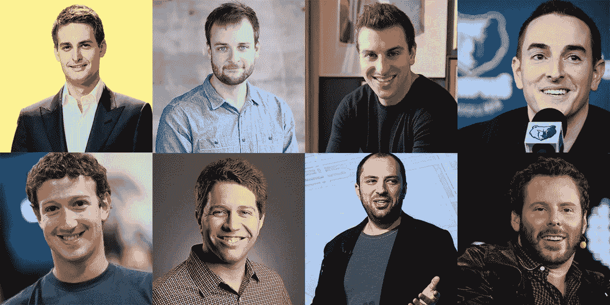

并非所有的千禧一代都和父母住在一起——事实上，有些人是世界上最富有的人。这些千禧一代由企业家和那些足够幸运继承了家族财富的人组成。

当今世界有 2153 位亿万富翁，其中 20 位是来自美国的千禧一代。

他们都出生于 1981 年至 1997 年，或者说是今天，年龄在 22 岁至 38 岁之间。

从脸书的马克·扎克伯格到 Snapchat 的埃文·斯皮格尔，再到凯莉化妆品公司的凯莉·詹娜，浏览一下美国最富有的年轻人以及他们是如何致富的。

# 20.凯莉·詹娜

**凯莉化妆品**

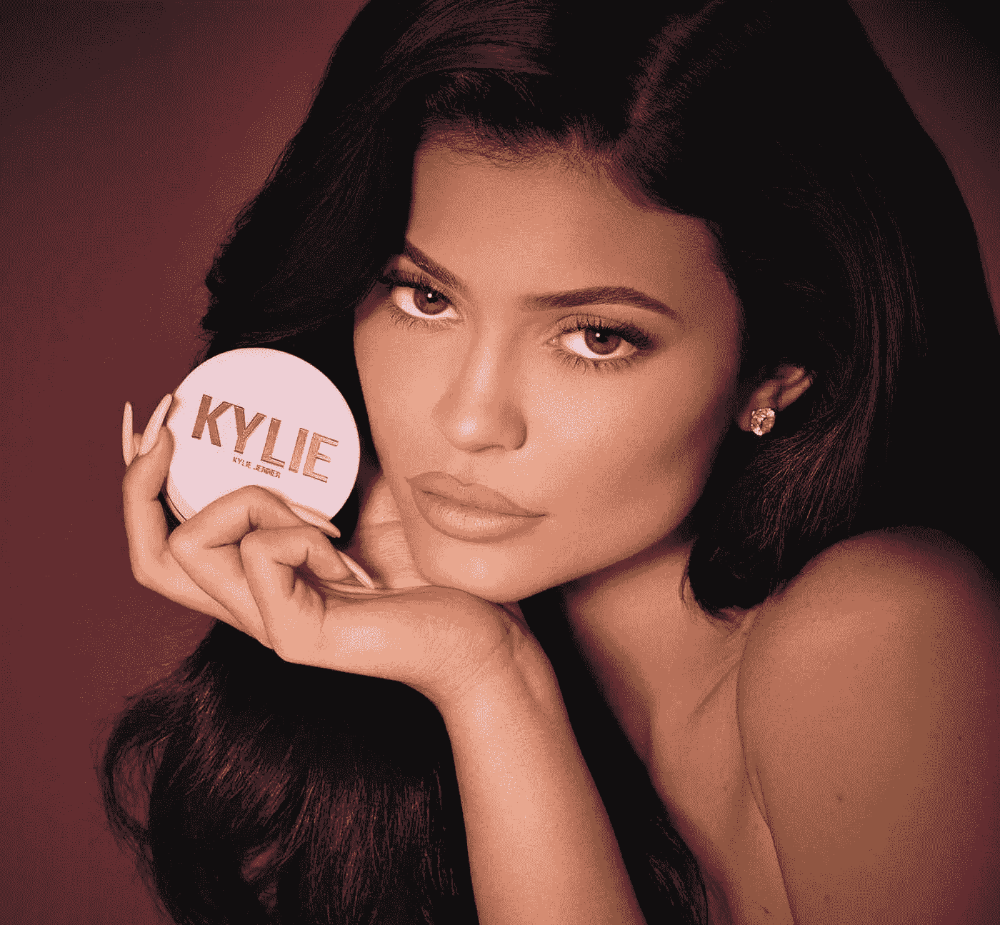

**身家:***【10 亿美元】*

年龄: 22

**财富来源:**凯莉化妆品，媒体，白手起家

**职位:**创始人兼 CEO

**她是如何做到的:**凯莉·詹娜在 Instagram 上拥有超过 1.5 亿粉丝，是 Instagram 上最受关注的人之一。《时代》杂志认为她是时尚界最有影响力的名人。2007 年，9 岁的詹纳和她的父母及兄弟姐妹开始出现在电视真人秀《跟上卡戴珊姐妹》中。2012 年，14 岁的她和姐姐肯德尔共同创立了一个服装系列“肯德尔 T28 凯莉”。2015 年，詹纳推出了自己的化妆品系列，名为 Kylie Lip Kits，次年更名为 Kylie Cosmetics。詹纳用她从模特演出中获得的 25 万美元支付给一家外部公司，生产她的第一批 15000 套唇膏，她在 2015 年开始以 29 美元的价格出售。詹纳在 2018 年出售了价值约 3.6 亿美元的凯莉化妆品。2018 年 11 月，詹纳与美容零售商 Ulta 达成分销协议，在短短 6 周内销售了估计 5500 万美元的产品。2019 年 5 月，她宣布推出素食主义者凯莉皮肤系列。她最近为一个可能的婴儿产品系列申请了商标。由于其超低的管理费用和大量的销售，该公司价值至少 10 亿美元，詹纳拥有 100%的股份。

# 19.埃文·夏普

**Pinterest**

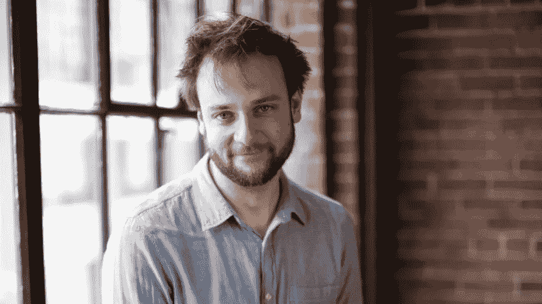

**身家:***【10 亿美元*

年龄:36 岁

**财富来源:** Pinterest，白手起家

**职位:**Pinterest 联合创始人兼首席合规官

小时候，夏普花了大量时间摆弄他父亲的麦金塔电脑，并自学编码。在宾夕法尼亚州乡村的高中时代，他利用空闲时间创作图标和用户界面。他们三人与联合创始人本·希伯尔曼和保罗·西拉一起，在纽约市西 103 街的一个非常小的公寓里创建了 Pinterest 的第一个版本，此后不久，他们搬到了加州，并在脸书找到了一份工作。Pinterest 的第一个桌面版本是 2010 年在加州帕洛阿尔托的一个小的两居室公寓里推出的。夏普因设计和编写 Pinterest 和 Pinterest 网格而受到好评。这些年来，他负责管理创意、产品和设计团队。

# 18.布莱恩·阿姆斯特朗

**比特币基地**

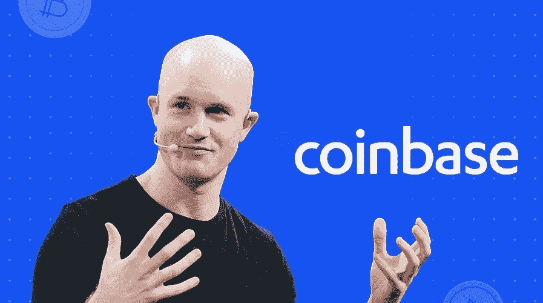

**身家:***【13 亿美元*

年龄: 36

**财富来源:**加密货币，自制

**职位:**联合创始人兼首席执行官，比特币基地

**职位:**forte invest 首席执行官

**他是如何做到的:**阿姆斯特朗拥有莱斯大学的三个学位，起初是 IBM 的一名开发人员，后来转到 Airbnb 担任软件工程师——在那里，他在他们 190 个国家的全球支付系统中占据了前排座位。2012 年，他联合创立了比特币基地，从包括安德森·霍洛维茨在内的几家领先的科技投资者那里筹集资金。自那以后，比特币基地一直在将加密货币引入美洲大部分地区(甚至更远)。如今，比特币基地只有 200 名员工，为 32 个国家的 1000 多万客户提供服务，托管价值 100 亿美元的数字资产。2018 年底，比特币基地在 Tiger Global 牵头的一轮融资中筹集了 3 亿美元，对该公司的估值为 80 亿美元。

# 17.彼得·舒尔茨舍夫斯基

**祝愿**

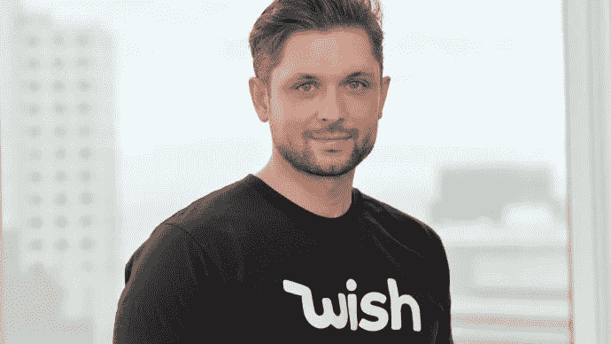

**身家:***【14 亿美元】*

年龄:37 岁

**财富来源:**电商，白手起家

职位:首席执行官兼董事长，Wish，ContextLogix

**他是如何做到的:**2004 年，23 岁刚从学校毕业的 Szulczewski(发音为“shool-chess-key”)开始了为期四个月的谷歌实习编码，然后成为一名全职员工，在那里他编写了关键字扩展的原型算法，这是一种帮助搜索广告商产品的功能。2007 年 6 月，Szulczewski 搬到韩国，在谷歌的新办公室工作。韩国市场需要比谷歌在美国和欧洲使用的更详细的搜索门户，这有效地训练了 Szulczewski 如何迎合公众的微观需求。2009 年，他离开谷歌，在家花了六个月时间为一个广告推荐平台编写代码，该平台分析一个人的浏览行为，以预测他们的兴趣。2010 年，他创办了一家名为 ContextLogic 的软件公司。投资 170 万美元，将 Szulczewski 更名为 Wish.com，目标是打造“世界上最大、最方便、最实惠的购物中心”，面向中低收入家庭。到 2016 年，Wish.com 的日访问量超过 500 万。尽管他很成功，但他远离聚光灯，很少接受采访。

# **16。凯文·斯特罗姆**

**Instagram**

**身家:***【14 亿美元*

年龄: 35 岁

**财富来源:** Instagram，白手起家

**职位:**insta gram 联合创始人

**他是如何做到的:**从斯坦福大学毕业后，Systrom 加入了谷歌，从事 Gmail、日历、文档、电子表格和其他产品的工作。他在谷歌工作了两年，由于未能进入助理产品经理项目而感到沮丧，他离开了谷歌。在墨西哥度假时，Systrom 的女朋友不愿意上传她的照片，因为它们看起来不够好——所以他想出了使用滤镜的主意，有效地隐藏了照片的质量低劣。随后，Systrom 开发出了今天 Instagram 上仍在使用的 X-Pro II 滤镜。Systrom 从投资者那里获得了 50 万美元的种子资金，这些投资者包括 Baseline Ventures 和 Andreessen Horowitz，他和朋友 Mike Krieger 一起开发了一个产品，该产品有一个特定的功能，即照片共享。这一发展导致了 Instagram 的诞生。推出一个月后，Instagram 的用户已经增长到了 100 万。一年后，Instagram 的用户数量超过了 1000 万。2012 年 4 月，Instagram 连同 13 名员工被以 10 亿美元的现金和股票价格卖给了脸书。截至 2015 年 10 月，Instagram 上分享了 400 亿张图片，截至 2016 年 6 月，Instagram 的活跃用户超过 5 亿。

# 15.克里斯·万斯特拉斯

**GitHub**

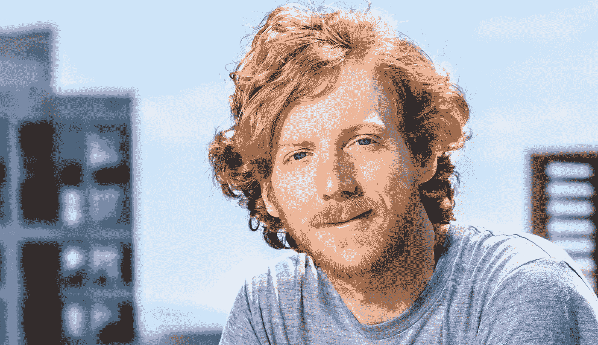

**身家:***【15 亿美元】*

年龄:33 岁

**财富来源:**协作软件，白手起家

**职位:**GitHub 前联合创始人兼 CEO 微软技术研究员

**他是如何做到的:**2005 年从辛辛那提大学辍学后，万斯特拉斯搬到了旧金山，在 CNET 网络公司担任工程师，负责 Gamespot 和 Chow 的发布。2008 年，万斯特拉斯与汤姆·普雷斯顿-沃纳(Tom Preston-Werner)一起创立了以软件开发为中心的社交网络 GitHub。这个网络背后的概念是彻底改变 IT 行业，并在社会上发挥有意义的作用，使这部分技术世界成为一个地球村。今天，它是世界上最大的软件协作和托管服务，支持超过 2000 万用户，包括谷歌和美国宇航局，他们使用在线平台来协作，构建和存储软件。2018 年，微软收购了 GitHub，Wanstrath 辞去了首席执行官的职务，成为微软的技术研究员，从事战略软件计划。

> 看看… [这些创业公司筹集了数十亿资金，然后解雇了数千人！](https://www.anthonyblumberg.com/blog/these-startups-raised-billions-and-then-laid-off-thousands)

# 14.瑞安·格雷夫斯

**优步**

**身家:***【16 亿美元*

年龄:35 岁

**财富来源:**优步，白手起家

**职位:**创始人兼 CEO，盐水；优步

**他是如何做到的:**2010 年 1 月，格雷夫斯的工作经历包括在通用电气担任数据库管理员，以及在 Foursquare 从事商业开发工作(在最初被该公司拒绝后，他免费为该公司工作)。当时优步还不到一岁，时任首席执行官的特拉维斯·卡兰尼克在推特上写道:“寻找创业产品经理/商业开发杀手，一个基于位置的服务。预发布、大股权、大利益相关者——有什么建议吗？?"。格雷夫斯看到了卡兰尼克的推文，回应道:“给你一个提示。发邮件给我:)”。他还附上了自己的电子邮件地址。格雷夫斯成为优步的第一个雇员——他的非传统工作申请使他成为优步任职时间最长的人之一——他甚至比 2017 年辞去首席执行官职务的卡兰尼克还长。格雷夫斯最近担任公司全球运营高级副总裁，但他在优步担任过几个职位，甚至在 2011 年将控制权交还给卡兰尼克之前短暂担任过首席执行官。经常被称为“二号人物”的格雷夫斯在优步期间一直被称为“好好先生”，与卡兰尼克咄咄逼人的个性形成鲜明对比，据说他在优步和更大的技术界都很受同龄人的喜爱和钦佩。格雷夫斯仍然是该公司的董事会成员。

# 13.本·希伯尔曼

**Pinterest**

**身家:***【16 亿美元*

**年龄:** 36

**财富来源:** Pinterest，白手起家

职位:Pinterest 首席执行官

2003 年从耶鲁大学毕业后，西尔伯曼在谷歌找到了一份工作。他被邀请为该网站设计产品，包括展示广告，并表示考虑到他在该领域缺乏经验，公司“几乎没有雇用”他。在苹果公司工作了一段时间后，他离开了苹果公司，开始和大学朋友保罗·西拉一起设计自己的 iPhone 应用程序。在最初的应用程序 Tote 未能获得显著的关注后，两位创始人与埃文·夏普(Evan Sharp)合作开发了一款 pinboard 产品，最终被命名为 Pinterest。西尔伯曼说，Pinterest 的起源真的来自他小时候对收集的热爱。在创办 Pinterest 九年多一点后，该公司于 2019 年 4 月进行了首次公开募股，估值为 120 亿美元，超出预期。如今，在西尔伯曼担任首席执行官的情况下，Pinterest 声称拥有超过 2000 万活跃用户。

# 12.胡利奥·马里奥·圣多明各三世

**巴伐利亚、南非米勒、安海斯-布什投资啤酒**

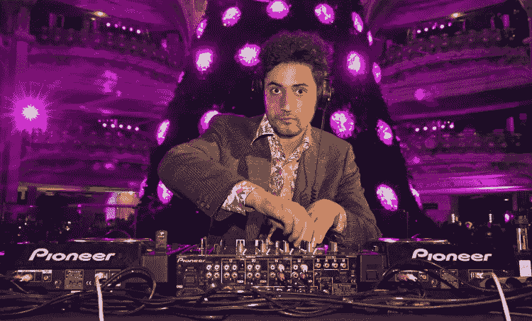

**净资产:***【20 亿美元*

年龄: 33 岁

**财富来源:**啤酒、遗产

**职位:**创始人，斯开克·恩巴克

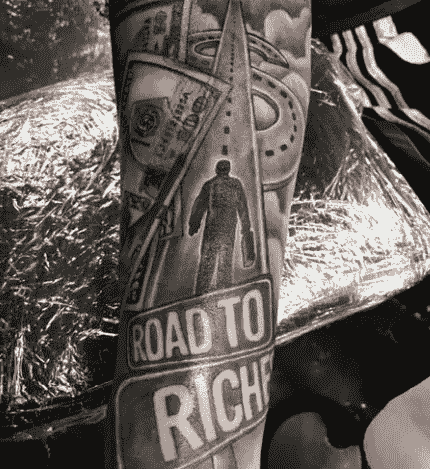

Millennial Billionaire Julio Mario Santo Domingo, III’s custom “Road to Riches” tattoo

他是如何做到的:胡里奥·马里奥·圣多明各三世是哥伦比亚最富有的啤酒家族的继承人。他毕业于波士顿大学，获得建筑学学位。圣多明各集团拥有哥伦比亚最大的啤酒厂——巴伐利亚啤酒厂的多数股权，该啤酒厂于 2005 年被 SABMiller 集团收购了 15%的股权。交易的 6%留给了圣多明各三世。2016 年，百威英博(Anheuser-Bush InBev)以 1000 亿美元收购 SABMiller，留下圣多明各三世(Santo Domingo III)目前价值 21 亿美元的个人股份。他住在纽约一套价值 1600 万美元的公寓里，在他的 Sheik 'n' Beik 乐队做 DJ。胡里奥的父亲也给他留下了世界上最大的鸦片烟管收藏遗产——目前被长期租借给哈佛大学。

# 11.鲍比·墨菲

**Snap 公司**

**身家:***【21 亿美元】*

年龄:30 岁

**财富来源:** Snapchat，白手起家

**职位:**Snap Inc .联合创始人兼 CTO。

**他是如何做到的:**鲍比·墨菲是美国跨国科技和社交媒体公司 Snap Inc .的联合创始人兼首席技术官，他与埃文·斯皮格尔和雷吉·布朗在斯坦福大学读书时创建了这家公司(即 Snapchat Inc .)，并获得了数学和计算科学的理学学士学位。他也是卡帕适马兄弟会的成员，还有斯皮格尔和布朗。墨菲是在他们结束了一个名为“未来新生”的失败创业公司的工作后被 Spiegel 聘用的，这是一个帮助高中生申请大学时获得建议的网站。2011 年，墨菲与人合作创建了一款名为 Picaboo 的消失图像信息应用。后来名字改成了 Snapchat。从斯坦福大学毕业后，墨菲在 Revel Systems(一种用于餐厅的 iPad 销售点系统)担任了一年的软件工程师。在 Snapchat 获得风险投资之前，他用一半的薪水来支付 Snapchat 的服务器费用。在 Snapchat，墨菲领导着工程和研究团队。墨菲还与 Snapchat 的 Snap Labs 团队合作过，该团队在 2018 年生产了 Spectacles 相机眼镜。在 Snapchat 2017 年 IPO 时，墨菲和斯皮格尔持有该公司总股票的 45%以上。他们还拥有超过 70%的投票权。

# 10.埃文·斯皮格尔

**Snap 公司**

**身家:***【21 亿美元*

年龄: 28

**财富来源:** Snapchat，白手起家

**职位:**Snap Inc .联合创始人兼首席执行官。

**他是如何做到的:**埃文·斯皮格尔是一位美籍法国商人，是美国社交媒体公司 Snap Inc .的联合创始人兼首席执行官，他与鲍比·墨菲和雷吉·布朗在斯坦福大学读书时创建了这家公司(即 Snapchat Inc .)。斯皮格尔被评为 2015 年世界上最年轻的亿万富翁。2018 年，获得法国国籍。2011 年 4 月，在斯坦福大学学习产品设计时，斯皮格尔提出了一个带有短暂消息的应用程序作为产品设计课程项目，他的同学嘲笑了这个想法。当年晚些时候，斯皮格尔与斯坦福大学的同学鲍比·墨菲和雷吉·布朗合作，推出了这一概念的原型，名为“Picaboo”，他们后来将其重命名为 Snapchat。这款应用的受欢迎程度显著上升，2012 年，埃文在完成学位前不久离开斯坦福，专注于 Snapchat。截至 2012 年底，Spiegel 的 Snapchat 应用日活跃用户已达 100 万。2017 年 1 月，华尔街日报报道称，在 Snap Inc .预计于 2017 年 3 月 IPO 后，墨菲和埃文·斯皮格尔将持有该公司“70%的投票权”，并拥有约 45%的总股份。2018 年 7 月 19 日，斯皮格尔完成了学位要求，于 2018 年从斯坦福毕业。他指出，生孩子是他完成大学教育的动力。

# 9.德鲁·休斯顿

**Dropbox**

**身家:***【23 亿美元*

年龄: 36

**财富来源:**云存储服务，自制

**职位:**Dropbox 联合创始人兼首席执行官

**他是如何做到的:**2006 年从麻省理工学院获得电子工程和计算机科学学位后。在那里，他遇到了阿拉什·菲尔多西，后者后来成为 Dropbox 的联合创始人兼首席技术官。休斯顿把他在大学时携带 u 盘和通过电子邮件发送文件的挫败感变成了 Dropbox 的演示。2007 年，24 岁的休斯顿和菲尔多西共同创立了 Dropbox。从那以后，休斯顿作为首席执行官领导该公司从一个简单的想法发展成为全球 5 亿人使用的服务。2013 年 6 月，麻省理工学院邀请休斯顿担任其年度毕业典礼的演讲人。在他的讲话中，休斯顿给出了这样的建议:

“他们说你是和你相处时间最长的五个人中的平均水平。想一想:谁会在你的五人圈里？我有一些好消息:麻省理工学院是世界上开始建立这个圈子的最好的地方之一。如果我没有来到这里，我就不会遇到我令人惊叹的联合创始人 Arash，也就不会有 Dropbox。我学到的一件事是，现在和有才华或努力工作一样重要的是和鼓舞人心的人在一起。你能想象如果迈克尔·乔丹不在 NBA，如果他的五人圈是一群意大利人吗？你的圈子推动你变得更好，就像 Arash 推动我一样。

2018 年 3 月，Dropbox 上市，上市首日股价涨幅超过 35%。休斯顿拥有该公司 25%的股份，是 Dropbox 最大的个人股东。如今，Dropbox 拥有 1100 万付费用户和 12 个全球办事处的 1800 名员工。

# 8.林西·斯奈德

**In-N-Out 汉堡**

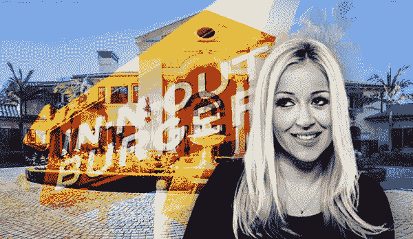

**身家:***【35 亿美元】*

年龄: 36

**财富来源:**遗产——In-N-Out 汉堡

**职位:**In-N-Out 汉堡公司总裁兼唯一所有者

**她是如何做到的:**斯奈德是 In-N-Out 汉堡公司的唯一所有者和继承人。2012 年，斯奈德是排名最年轻的美国女亿万富翁。作为家族信托的唯一受益人，她目前是 In-N-Out 的大股东，并最终在她 35 岁生日时获得了该公司全部股票的控制权，成为其唯一所有者和第六任总裁。她占据了与她祖父哈里、叔叔里奇、父亲盖伊和祖母埃丝特之前相同的位置。Snyder 是加利福尼亚州布拉德伯里的居民，是一名狂热的赛车迷，也是 NHRA 的成员，定期参加赛车比赛。

# 7.内森·布莱查尔奇克

**Airbnb**

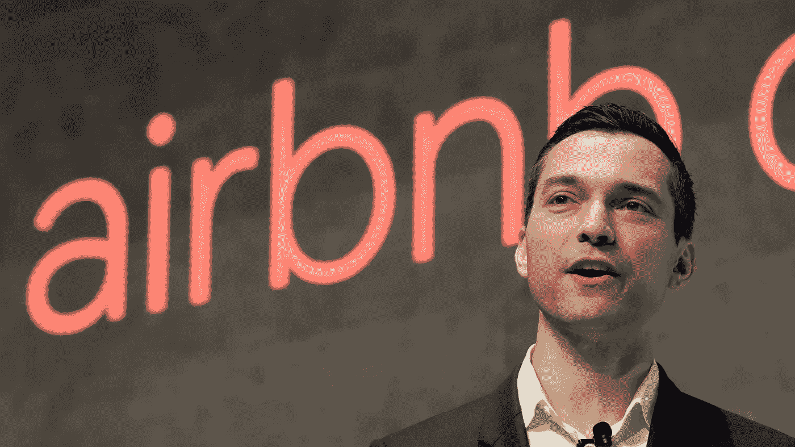

**身家:***【38 亿美元*

**年龄:** 35

财富来源: Airbnb

**职位:**Airbnb 联合创始人兼首席战略官

**他是如何做到的:**在高中期间，Blecharczyk 通过创建自己的软件和虚拟主机业务为垃圾邮件发送者提供服务来赚钱，并一度被列入 Spamhaus 的“已知垃圾邮件运营商(ROKSO)”名单，该名单列出了顶级垃圾邮件服务。他在哈佛大学攻读计算机科学学士学位期间继续编写程序，并在 2002 年放弃虚拟主机业务之前赚了足够的钱来支付学费。大学毕业后，Blecharczyk 开始了他在 OPNET Technologies 的工程师生涯，后来在 2007 年担任 Batiq 的首席开发人员。2008 年，Blecharczyk 与 Brian Chesky 和 Joe Gebbia 合作创建了 Airbnb，他担任了该公司的第一任首席技术官，并使用 Ruby on Rails 为该公司的原始网站编写了代码。那年晚些时候，在未能筹集到资金后，创始人购买了大量的谷物，设计了包装品牌为“奥巴马的”和“麦凯恩船长的”谷物，在科罗拉多州丹佛市的民主党全国代表大会上出售。最初，该公司打算作为一种营销策略，销售了足够多的谷物以筹集 3 万美元，并最终吸引了 Y combinator 联合创始人保罗·格拉厄姆的注意，他在 2009 年初给了他们 2 万美元，并接受该公司加入 Y Combinator 的种子资金计划。2017 年，Blecharczyk 从 Airbnb 的首席技术官转型为首席战略官，并被宣布为 Airbnb 中国的董事长，也被称为 Aibiying。截至 2015 年 3 月，Airbnb 的估值为 200 亿美元。

# 6.布莱恩·切斯基

**Airbnb**

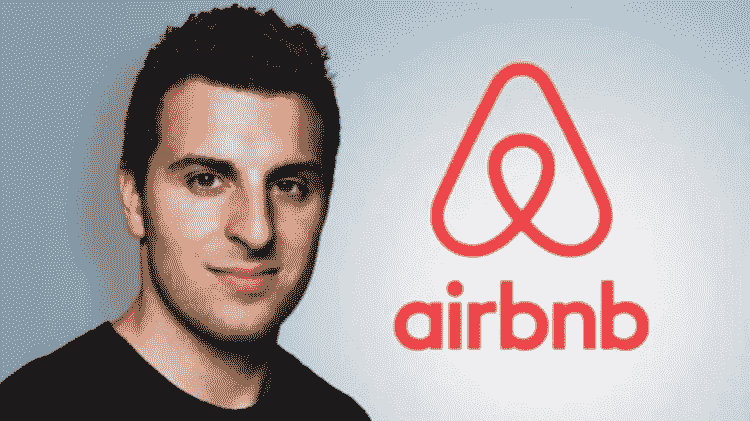

**身家:***【37 亿美元】*

年龄: 37

**财富来源:** Airbnb，白手起家

**职位:**Airbnb 联合创始人兼首席执行官

他是如何做到的:1999 年，切斯基开始就读于罗德岛设计学院(RISD)，并于 2004 年获得工业设计艺术学士学位。在 RISD 时，切斯基遇到了乔·格比亚，他后来成为 Airbnb 的联合创始人之一。大学毕业后，切斯基在洛杉矶的 3DIDmin 担任工业设计师和策略师，后来搬到旧金山，与格比亚合住一套公寓。2007 年 10 月，美国工业设计师协会(Industrial Designers Society of America)在旧金山举办了一次会议，所有酒店房间都被预订一空。这对夫妇付不起当月的租金，决定以现金的方式出租他们的公寓。他们购买了三个充气床垫，并将这一想法推销为“充气床垫和早餐”，第一个晚上有三位客人入住。2008 年 2 月，哈佛毕业生、技术建筑师内森·布莱查尔奇克(Nathan Blecharczyk)成为 Airbnb 的第三位联合创始人。每个联合创始人都在新公司中担任一个角色，切斯基成为领导者和首席执行官。为了筹集资金，切斯基和他的联合创始人以总统候选人巴拉克·奥巴马和约翰·麦凯恩为原型，创造了名为“奥巴马 O’s”和“麦克凯恩船长”的特别版麦片。Y Combinator 对麦片盒子印象深刻，接受了 Airbnb 的种子基金项目。第一年，公司开始国际化，在欧洲开设了几个办事处。2015 年，切斯基宣布 Airbnb 是 2016 年巴西里约热内卢夏季奥运会的官方赞助商，后来又强调，在 2014 年国际足联世界杯期间，有超过 12 万人住在 Airbnb 的家中。截至 2015 年 3 月，Airbnb 的估值为 200 亿美元。

# 5.乔·格比亚

**Airbnb**

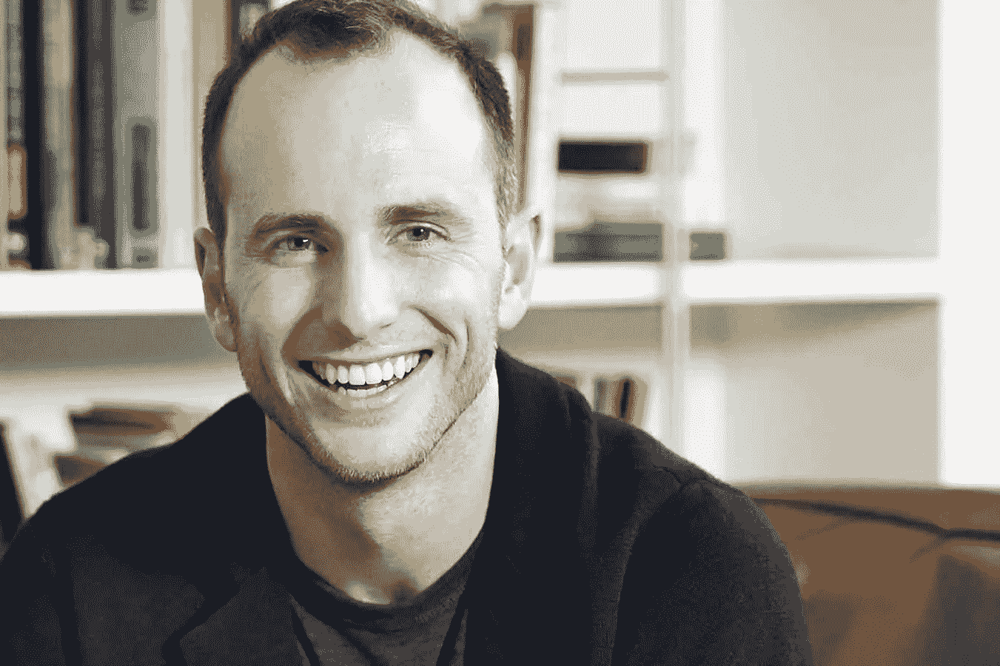

**身家:***【37 亿美元】*

年龄: 37

**财富来源:** Airbnb，白手起家

**职位:**Airbnb 联合创始人兼首席采购官

**他是如何做到的:** Gebbia 于 2005 年毕业于罗德岛普罗维登斯的罗德岛设计学院(RISD ),获得了平面设计和工业设计的艺术学士学位。在 RISD，他遇到了布莱恩·切斯基，后来他成为了他的室友和 Airbnb 的联合创始人。2007 年，格比亚说服他的朋友布莱恩·切斯基搬到旧金山一起创业。他们的房东提高了房租，所以他们需要钱。Gebbia 知道美国工业设计协会会议将在旧金山举行，许多酒店都被预订了，他相信他们可以将公寓中的充气床垫出租给与会者。他们通过创建一个名为“充气床垫&早餐”的网站来推广这个想法这是 Airbnb 的基础。2008 年，Gebbia 的另一位室友，哈佛毕业生兼技术建筑师 Nathan Blecharczyk 成为 Airbnb 的第三位联合创始人。在一次筹款活动中，该团队以 2008 年总统候选人巴拉克·奥巴马和约翰·麦凯恩为原型，设计了麦片盒子，“奥巴马 O”和“麦凯恩上尉”，并在大会上出售。2009 年，当格比亚与 Y Combinator 的创始人保罗·格拉厄姆分享他们的工作时，他对他们的毅力印象深刻，并在 2009 年给了他们第一轮种子资金。截至 2015 年 3 月，Airbnb 的估值为 200 亿美元。

# 4.斯科特·邓肯

**企业产品合作伙伴**

**身家:***【62 亿美元*

年龄: 36

**财富来源:**遗产——管道

**职位:**共同所有者，企业产品合作伙伴

**他是如何做到的:**2010 年，斯科特·邓肯(Scott Duncan)和他的三个哥哥姐姐每人继承了父亲丹·邓肯(Dan Duncan)的管道公司 Enterprise Products Partners 31 亿美元的股份。由于 2010 年取消了遗产税，邓肯成为自遗产税颁布以来第一位不用缴纳遗产税的美国亿万富翁。自那以后，邓肯和他的兄弟姐妹在 EPP 的股份价值翻了一倍多。Enterprise 成立于 1968 年，拥有天然气加工厂、石油和天然气储存设施以及大约 50，000 英里的石油和天然气管道。邓肯曾就读于休斯顿社区学院，现居德克萨斯州休斯顿。

# 3.达斯汀·莫斯科维茨

**脸书**

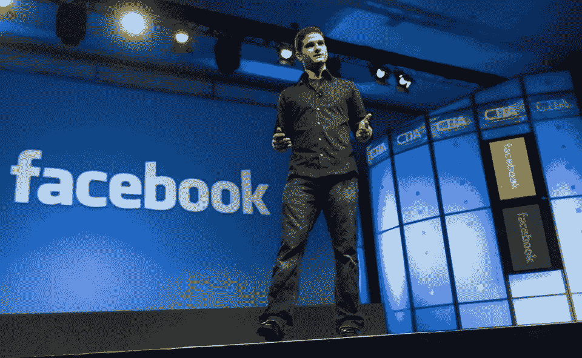

**身家:***111 亿美元*

*年龄:34 岁*

*国家:美国*

***财富来源:**脸书，白手起家*

***职位:**联合创始人，脸书；Asana 联合创始人*

*2004 年 2 月，四个人，其中三个是室友——马克·扎克伯格、爱德华多·萨维林、克里斯·休斯和达斯汀·莫斯科维茨，在他们哈佛大学的宿舍里创建了脸书。它最初被称为 thefacebook.com 的 T2，目的是作为所有哈佛学生的在线目录，帮助住校学生根据吸引力对其他学生进行排名。2004 年 6 月，扎克伯格、休斯和莫斯科维茨离开哈佛一年，将脸书的运营基地搬到了加州的帕洛阿尔托，并雇佣了八名员工。肖恩·帕克后来加入了他们的行列。在脸书，莫斯科维茨是公司的第一任首席技术官，然后是工程副总裁；他领导技术人员，监督网站的主要架构，并负责公司的移动战略和开发。2008 年 10 月，莫斯科维茨宣布，他将离开脸书，与脸书的工程经理贾斯汀·罗森斯坦(Justin Rosenstein)成立一家名为 Asana 的新公司。*

# *2.卢卡斯·沃尔顿*

***沃尔玛***

**

***身家:***【157 亿美元**

*年龄: 32 岁*

***财富来源:**遗产——沃尔玛*

***职位:**沃尔顿家族基金会主席*

***他是如何做到的:**卢卡斯·沃尔顿是约翰·沃尔顿(1946-2005)和他的妻子克里斯蒂·沃尔顿唯一的孩子，也是创建沃尔玛帝国的美国商人萨姆·沃尔顿的孙子。据报道，在他的父亲约翰于 2015 年死于空难后，卢卡斯继承了他三分之一的财产。沃尔顿在加利福尼亚州的国家城和怀俄明州的杰克逊霍尔长大。2010 年，沃尔顿获得了科罗拉多学院环境可持续商业学士学位。沃尔顿目前是沃尔顿家族基金会和 True North Venture Partners 的主席，拥有 First Solar 16%的股份和 aressel Bank 8%的股份。沃尔顿目前居住在怀俄明州的杰克逊、伊利诺伊州的芝加哥和加利福尼亚州的圣地亚哥。*

# *1.马克·扎克伯格*

***脸书***

*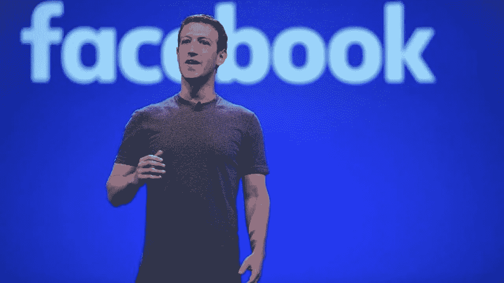*

***净资产:***【820 亿美元】**

*年龄:34 岁*

***财富来源:**脸书，白手起家*

*职位:脸书首席执行官*

*扎克伯格出生于纽约的怀特普莱恩斯，曾就读于私立学校菲利普斯埃克塞特学院，在那里他获得了数学、天文学、物理学和古典研究方面的奖项。年轻时，他还参加了约翰·霍普金斯青年才俊中心的夏令营。在他的大学申请中，扎克伯格表示他可以读写法语、希伯来语、拉丁语和古希腊语。扎克伯格从中学开始使用电脑和编写软件。他的父亲在 20 世纪 90 年代教他雅达利基础编程，后来聘请软件开发商戴维·纽曼私下辅导他。扎克伯格还在上高中时，就在他家附近的仁慈学院(Mercy College)上了这个课题的研究生课程。在一个项目中，因为他父亲的牙科诊所是在家里操作的，所以他开发了一个软件程序，他称之为“ZuckNet ”,可以让家里和牙科诊所之间的所有计算机相互通信。它被认为是 AOL 即时通讯软件的“原始”版本，于次年问世。扎克伯格就读于哈佛大学，2004 年 2 月 4 日，他在自己的宿舍里与大学室友爱德华多·萨维林、安德鲁·麦科勒姆、达斯汀·莫斯科维茨和克里斯·休斯一起推出了脸书社交网络服务。在大二的时候，他写了一个程序，他称之为 CourseMatch，允许用户根据其他学生的选择做出选课决定，并帮助他们组成学习小组。不久之后，他创建了一个不同的程序，他最初称之为 Facemash，让学生从一系列照片中选出最帅的人。该网站在周末上线，但到周一早上，该学院将其关闭，因为它的受欢迎程度超过了哈佛的一个网络交换机，导致学生无法访问互联网。此外，许多学生抱怨他们的照片被未经许可使用。扎克伯格公开道歉，学生报纸发表文章称他的网站“完全不当”。*

**

*Mark Zuckerberg*

*接下来的一个学期，2004 年 1 月，扎克伯格开始为一个新网站“thefacebook”编写代码，该网站最初位于 thefacebook.com。该网站更名为脸书，迅速扩张，并最终超越了大学，到 2012 年达到 10 亿用户。扎克伯格于 2012 年 5 月将公司上市，持有多数股份。截至 2019 年 2 月，他的净资产估计接近 820 亿美元，与脸书股票整体相比，去年有所增加。2007 年，23 岁的他成为世界上最年轻的白手起家的亿万富翁。截至 2019 年，他是福布斯十大富豪榜中唯一一个 50 岁以下的人，也是前 20 名亿万富豪榜中唯一一个 40 岁以下的人。自 2010 年以来，时代杂志将扎克伯格列为世界上最富有和最有影响力的 100 人之一，作为其年度人物奖的一部分。2016 年 12 月，扎克伯格在福布斯全球最有权力的人排行榜上排名第十。*

**

*本文原载于我的财经网站:【anthonyblumberg.com[。请查看以了解更多关于我的信息，并查看更多独家内容！如果你喜欢这篇文章或者学到了什么，请给我留下评论和一些掌声。别忘了跟随我的媒介！](https://www.anthonyblumberg.com/)*