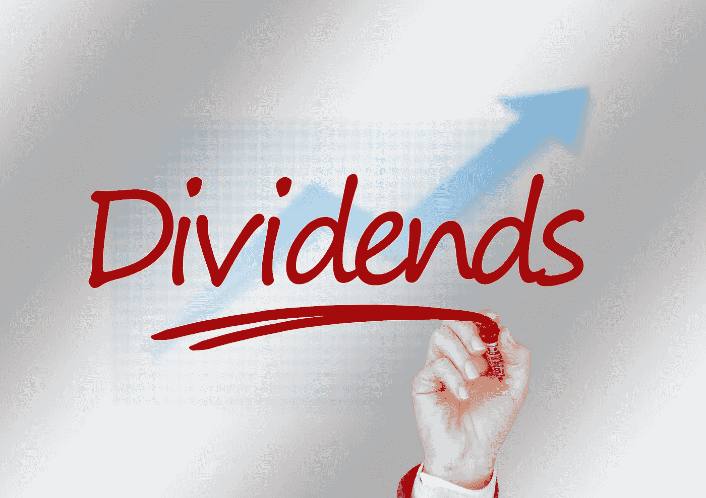
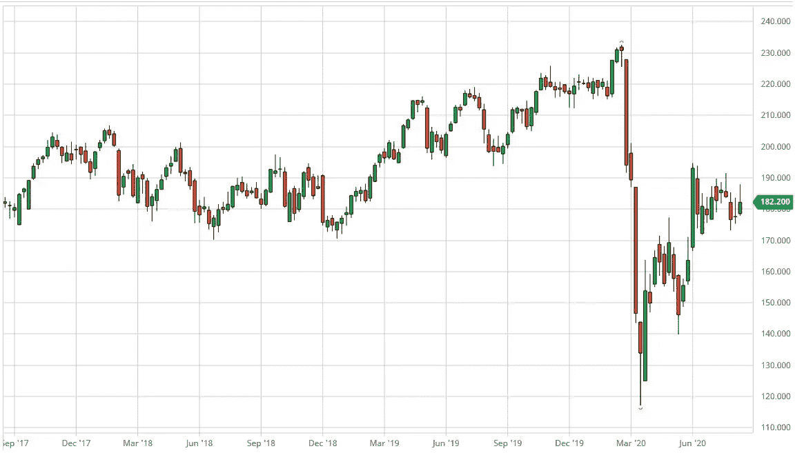
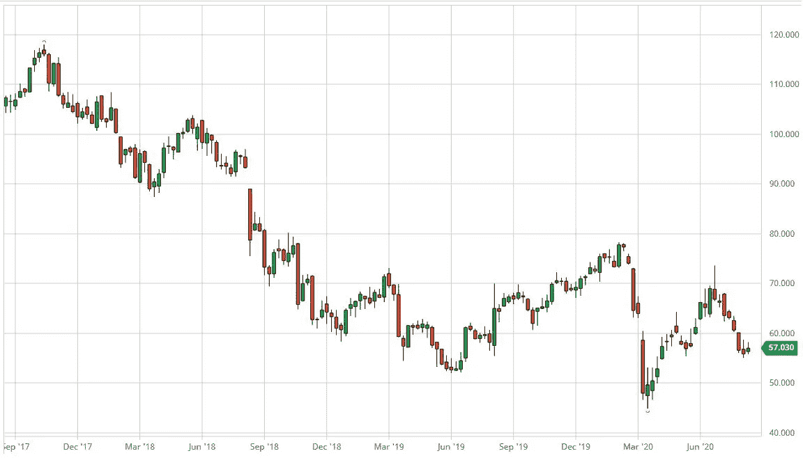
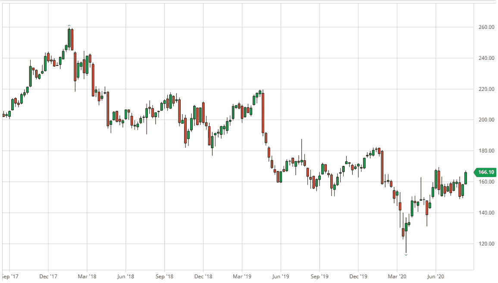
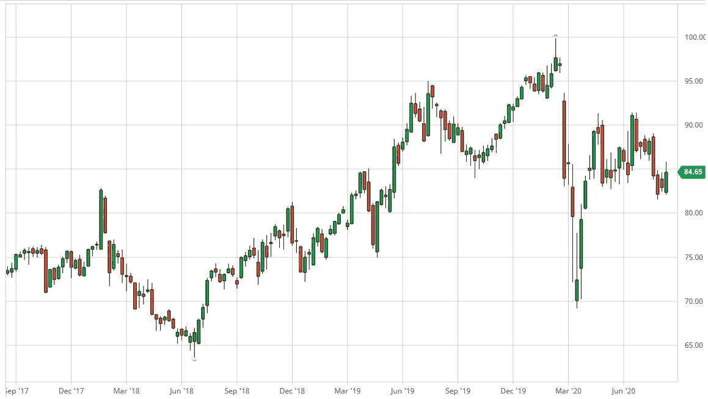
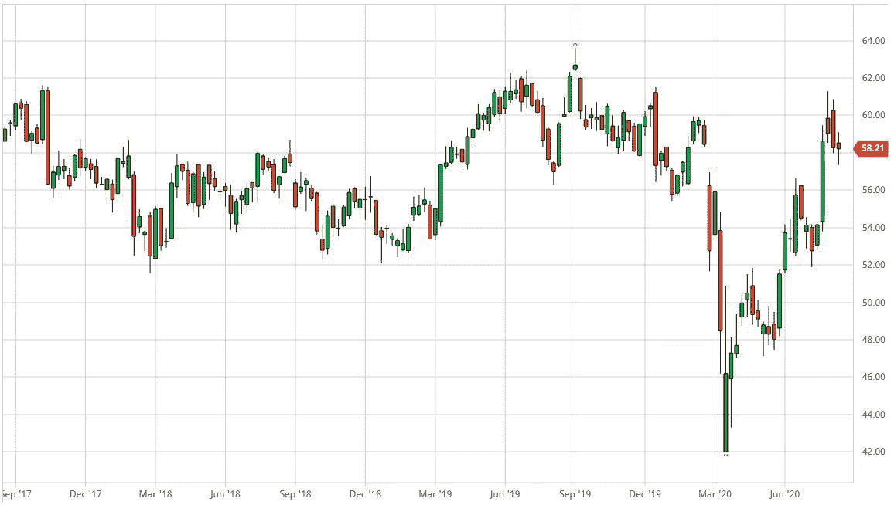
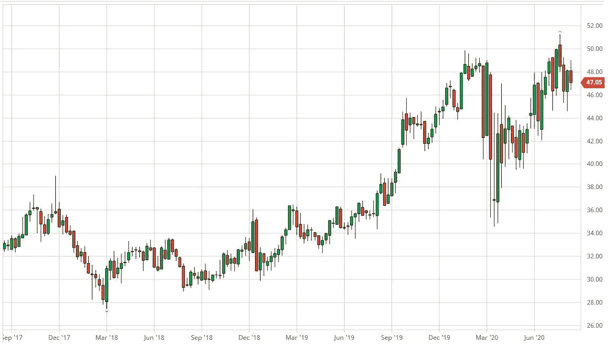
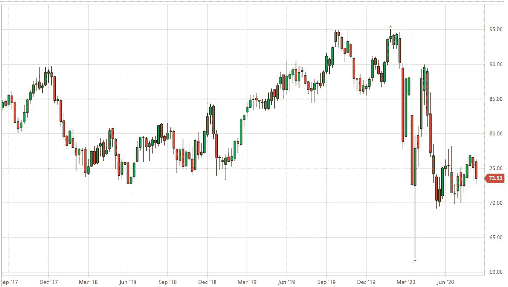
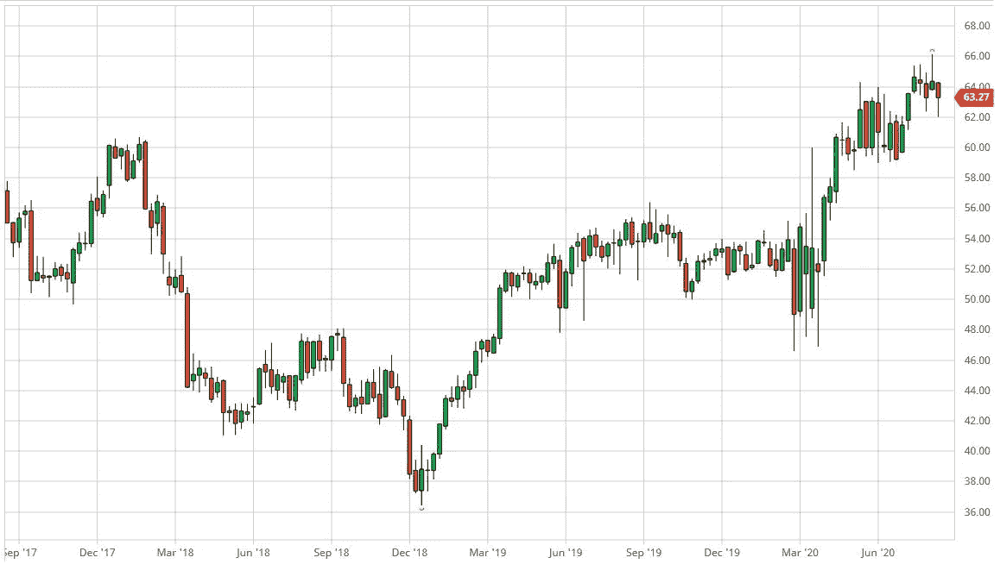
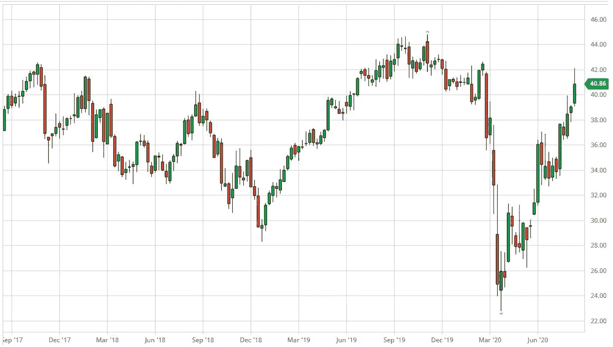

# 100 年来，这些股息珍珠一直在说服投资者

> 原文：<https://medium.datadriveninvestor.com/these-dividend-pearls-have-been-convincing-investors-for-100-years-f821c54be275?source=collection_archive---------28----------------------->

(Picture by Gerd Altmann on pixabay.com)

你想要支付可靠红利的股票吗？那你应该看看这两个车厂。一些股票已经支付股息至少 100 年了。

让你开始的一个小脑筋急转弯:把自己放回到还有兴趣的日子里。当时，政府债券的年回报率达到 3%、4%或更高是完全正常的。

当时持有这些票据五年甚至更长时间并享受定期回报不是很常见吗？当市场收益率水平发生变化时，债券会剧烈波动，这一事实很少有人感到不安。一般来说，在到期日，它们会被 100%保留，直到被偿还。

投资者也应该以同样的方式投资高股息股票。把它们当成有息票据，不要让自己被间歇性的价格下跌所困扰。即使是稳健的股票，在绝大多数情况下，任何价格挫折都会在三到五年后完全消除，甚至经常会有不错的价格收益。

# 与安联或宝洁一起返回

“我只希望我的钱能带来回报”——这是像美国消费品巨头宝洁公司或德国保险公司安联保险公司这样的报纸完全符合的。

我向你展示两个具体的投资组合，每个组合有五个可管理的价值，它们带来的股息收益率高达 4.4%。投资组合以国际股票为基础，以便在地理上分散(经济)风险，平均收益率为 3.7%。

 [## 关于数字化转型的 8 个问题投资者应该从每位首席执行官那里得到答案|数据…

### 几乎没有什么比做生意更令人兴奋的了。最吸引人的方面之一当然是投资于年轻的…

www.datadriveninvestor.com](https://www.datadriveninvestor.com/2020/07/06/8-questions-about-the-digital-transformation-investors-should-get-answers-from-every-ceo/) 

另一个投资组合专注于美国的股票，美国是世界上最强大的经济体，所有这些股票都连续支付股息超过 100 年，有一个案例长达 204 年(平均回报率:3.1%)。

在选择股票时，主要关注的是体面的、最重要的是稳定的股息，而不是目前最高的股息。因为数据清楚地表明，尤其是那些持续支付高于平均水平股息的股票，而不是那些股息收益率绝对最高的股票。

# 稳定的现金流

资金在几只股票之间的分配稳定了股息的流动。如果一家公司支付得更少，另一笔存款很可能会支付更多。由于不同的分红日期，最重要的是，因为大多数美国公司，但也有一些来自其他国家的公司，每季度支付一次股息，你不像有息证券那样每年只收到一次股息。

这有利于流动性，但也提供了心理优势:如果你定期在存款账户对账单上看到股息，你可以立即感觉到你的钱在为你工作。这样，投资者更容易度过间歇性的价格损失，并避免在不利的价格下恐慌性抛售。

# 没有“新的兴趣”——但这不重要

人们可以一次又一次地读到股息是新的利息。投资者应该意识到事实并非如此。有了利息投资，无论是银行账户还是债券，无论提供者是否成功，年收入都会流动(尽管由于发行者的风险，这里也可能出现违约)。

另一方面，股息是股东对公司业务的参与。正如 corona 危机所显示的，即使是稳健的公司，这些溢价也会暂时下降，甚至被取消。但即便如此——现在是我们心理游戏的第二部分——投资者也只会落得利率投资的下场:即零回报。

虽然利率在未来许多年可能会非常低，甚至是负的，甚至可能是你投资者的余生，但大多数股票公司在危机后不久就会恢复派息。客观地说:在 2008 年至 2010 年金融危机的高潮阶段，经济影响比科罗纳疫情(至少到目前为止)严重得多，德国股票指数的 160 家公司中只有 38 家取消了股息。

这些主要是小公司。所列的任何值都不是这种情况。另一个积极的方面是，与利率不同，未来也几乎不会有任何负红利！

# 股息投资组合:国际化且非常传统

在这里，你会发现两个投资组合有特别有利可图的股息股票，投资者通过它们在几个国家分配收益机会和风险——或者押注于美国已经支付了 100 多年的股票。

美国公用事业公司 York Water 自 1816 年以来一直向其股东支付股息——从其成立的第一年开始。最重要的是:没有任何中断，尽管经历了两次世界大战、上世纪 30 年代的大萧条或 2008 年的金融危机。

当然，宾夕法尼亚公司向当地居民供水的业务一直非常稳定，保证了定期汇款。但绝不仅仅是约克水公司一个多世纪以来一直源源不断地涌出。

慷慨的传统主义者包括企业集团江森自控(自 1887 年起)和消费品巨头宝洁(自 1890 年起)。这些价值观可以在“百岁以上老人作品集”中找到。

它完全由美国的股票组成，因为由于资本市场的原因，大多数有如此长分红历史的股份公司都在美国上市。

选择这种投资组合选项的投资者是在押注这个以美元为主要货币的全球最强经济体。然而，你应该注意，如果美元暂时疲软，以欧元计算的投资者的回报也可能暂时较低，反之亦然，额外的货币收益就会增加。

因此，如果您希望将您的工作分散到几个国家，同时也为了补偿不同的商业周期，您可以选择国际投资组合。在那里，你可以找到德国、瑞士、英国的股票，当然还有美国的股票。

国际托管账户的回报值是由柏林的特殊证券交易服务公司(Dividendenadel)对本年度(2021 年派息)的估计值，美国投资组合的回报值来自已建立的美国金融门户网站 kiplinger.com。

当然，两个投资组合的十个值的单独混合也是可能的，没有任何缺点！

# 国际投资组合——平衡现金流

## 安联保险

慕尼黑保险集团是德国交易所名单上最慷慨、最可靠的支付者之一。保险公司的核心业务和资产管理的收入都在增长(安联全球投资公司，AGI)

由于电晕疫情，对健康保护的需求甚至会长期增加。AGI 应该受益于这样一个事实，即利率将在很长一段时间内保持非常低的水平，因此越来越多的人正在寻找更有价值的替代品，如共同基金。

(Allianz SE — Weekly Candstick Chart for the last 3Y, bartchart.com)

(ISIN: DE0008404005，股息率:4.4%，市值:788 亿欧元)。

## 拜耳

来自德国的两个价值进入托管账户，因为它们是以欧元报价的，欧元是这个国家的投资者计算和产生费用的货币。

拜耳股票的最高价格损失(五年内下降 53%)是由于与收购竞争对手孟山都公司及其可能致癌的除草剂农达(含草甘膦)有关的大量索赔。形势正在逐渐缓和，农用化学品仍然是一个增长领域，因此有相当大的追赶潜力。

(Bayer AG— Weekly Candstick Chart for the last 3Y, bartchart.com)

(ISIN: DE000BAY0017，股息率:4.0%，市值:613 亿欧元)。

## 3M

当然，来自美国的价值也属于国际投资组合。选择落在了 3M 公司身上。它是股息贵族之一，即那些不仅保持了股东红利至少 25 年，而且还稳步增加的公司。

(3M Company— Weekly Candstick Chart for the last 3Y, bartchart.com)

(ISIN:88579 亿美元，股息率:3.3%，市值:787 亿欧元)。

## 诺华公司

作为世界上最大的制药和生物技术集团之一，诺华为价格上涨提供了良好的机会——尤其是生物仿制药(生物技术仿制药)业务增长强劲。该报的另一个优势是它以瑞士法郎报价，而瑞士法郎往往很坚挺。

(Novartis AG— Weekly Candstick Chart for the last 3Y, bartchart.com)

(ISIN: CH0012005267，股息率:3.2%，市值:1707 亿欧元)。

## 联合利华（公司）

即使在经济危机期间，食品、清洁和个人护理产品也继续畅销——这是高于平均水平的股息的坚实基础。

总部设在伦敦的荷兰-英国集团(税收较低)在这一细分市场提供强大的国际品牌，例如，在欧洲，这些品牌包括多芬、朗格尼斯和克诺尔。

(Unilever NV— Weekly Candstick Chart for the last 3Y, bartchart.com)

(ISIN: GB00B10RZP78，股息率:3.6%，市值:571 亿欧元)。

# 百岁以上老人作品集:好名声使然

## 约克水务公司

诚然，York Water 1.7%的回报率并不是最高的。从 1816 年开始不间断的分红，也就是 204(！)多年来，该公司真正在 100+投资组合中赢得了一席之地。

由于两次世界大战都没有中断付款，投资者未来可以继续依赖宾夕法尼亚州相对较小的当地供水商的转账。

(York Water Company — Weekly Candstick Chart for the last 3Y, bartchart.com)

(ISIN: US9871841089，股息率:1.7%，市值:5.758 亿欧元)。

## 爱迪生联合公司

这家能源公司也属于那些绝对应该捍卫自己良好声誉的精英圈子——换句话说，就是股息。纽约公司经营着美国最大的区域供热网。这也是一项高于平均水平的稳定业务，允许定期付款。自 1885 年以来，该公司一直不间断地支付成功奖金。

(Consolidated Edison Company of New York— Weekly Candstick Chart for the last 3Y, bartchart.com)

(ISIN: US2091151041，股息率:4.3%，市值:215 亿欧元)。

## 通用磨坊公司

这家食品制造商专注于长期蓬勃发展的谷物，并在 mueslis，grain bars & Co .中发现，尽管有电晕危机，但仍能增加收入。有机增长，即在没有收购的情况下，今年的增长率预计为 4%到 6 %,而之前的预测仅为 2%到 4%。

自 1898 年以来，该公司一直不间断地支付股息——几乎没有迹象表明这种成功势头会被打破。

(General Mills — Weekly Candstick Chart for the last 3Y, bartchart.com)

(US3703341046 美元，股息率:3.2%，市值:341 亿欧元)。

## 宝洁

世界各地的许多家庭都可以找到 P&G 的产品。这里只是品牌名称的一小部分:海飞丝，潘婷，吉列，威克，博朗，Blend-a-med。该公司是华尔街的大公司之一，在传统的道琼斯指数中有代表。

仅在过去三年中，该公司就让其股东欣喜地获得了 43%的价格涨幅——而且还有获得更多收益的绝佳机会。股息自 1890 年以来就一直存在。

(Procter & Gamble Company— Weekly Candstick Chart for the last 3Y, bartchart.com)

(ISIN: US7427181091，股息率:2.8%，市值:2716 亿欧元)。

## 江森自控

自 1885 年以来，纽约证券交易所(NYSE)历史最悠久的上市公司一直向其股东支付成功奖金。这家工业服务提供商是出于税收原因将法定注册地迁至爱尔兰的美国公司之一，但仍以全球主要货币美元上市。

(Johnson Controls— Weekly Candstick Chart for the last 3Y, bartchart.com)

(ISIN: IE00BY7QL619，股息率:3.6%，市值:237 亿欧元)。

约翰尼·亨德森

**进入专家视角—** [**订阅 DDI 英特尔**](https://datadriveninvestor.com/ddi-intel)