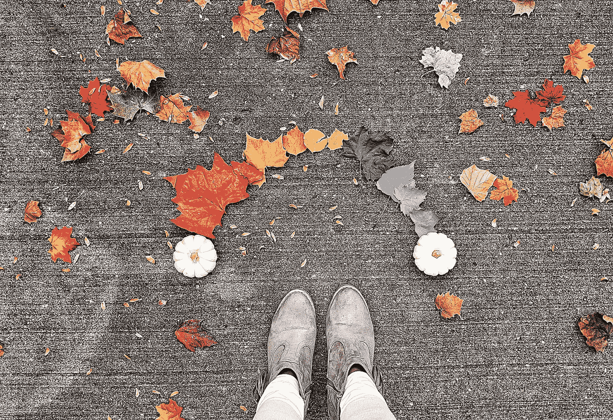

# 这些障碍正在吞噬你的创造精神

> 原文：<https://medium.datadriveninvestor.com/these-obstacles-are-starving-your-creative-spirit-f01d22fd88a1?source=collection_archive---------53----------------------->

## 研究支持的战略，以培养和促进企业家的创造力

Photo by [Joyce Adams](https://unsplash.com/@hebrews12girl?utm_source=unsplash&utm_medium=referral&utm_content=creditCopyText) on [Unsplash](https://unsplash.com/s/photos/creativity?utm_source=unsplash&utm_medium=referral&utm_content=creditCopyText)

作为企业家，我们提出创造性想法和创造性方法来发展它们的能力是我们企业的命脉和生计。有些日子，这些想法很容易流动。这是美好的日子，但也有糟糕的日子，无论我们如何努力，创造力都不会出现。在那些日子里，我们的想法就像盛夏的莫哈韦沙漠一样干涸。任何地方都没有一点灵感。那么，是什么阻碍了我们，我们如何克服它呢？

# 创造的压力

随着我们的经验和专业知识的增长，我们不断提高自己的标准。更多数量，更高质量。再做一次。又来了。又来了。后来有一天，我们碰壁了。职业员工并不是唯一遭受职业倦怠的人，企业家也一样。

当哈佛商学院教授特里萨·阿马比尔在布兰代斯大学时，她研究了压力对作家和艺术家创造力的影响。她的目标是看看他们的创造力是否更多地受到内在激励因素的影响，而不是外在激励因素。她的研究表明，外部激励因素，如交易和需求，会对创造力施加压力，从而扼杀创造力。那么，这对创业者意味着什么？

我们需要放松一下。我们需要退一步，不抱任何期望，为了乐趣而创造一些东西，而不是专注于生产符合配额或质量标准的工作。例如，几个月前我撞上了一堵创意墙。没有想法也没有动力。我为自己设定的所有期限和标准都毫无意义。我没有试图冲破这个障碍，强行做我讨厌的事情，而是写了关于[章鱼](https://medium.com/on-being-a-writer/be-like-the-octopus-13e0f8df6a61)，只是为了好玩。我从没想过这篇文章会引起读者的注意，事实也的确如此，但我仍然喜欢它。写它让我很开心，之后我感觉更自由了。我以一种全新的态度恢复了日常写作。

> “做某事的愿望是因为你发现它非常令人满意并对个人具有挑战性，这激发了最高水平的创造力，无论是在艺术、科学还是商业领域
> 。”――特蕾莎·阿马比尔博士

# 孤立和孤独

我在加州写这篇文章，加州正在遭受迄今为止最严重的新冠肺炎疫情。我们已经处于隔离的第十个月了，这并不奇怪，对我们大多数人都有影响。这对我们的创造力有什么影响？

隔离是一个孤独的地方。作为人类，我们在部落中进化，这是生存、繁衍和安全所必需的。隔离和被驱逐出部落是可怕的惩罚，意味着几乎必然的死亡。我们仍然是需要人的部落有机体，但社会隔离已经扼杀了我们许多人的这条重要生命线。根据 [Valerie Soleil，文学士，法学学士](https://www.learning-mind.com/author/valerie/)，写作于 [*学习头脑*](https://www.learning-mind.com/social-isolation-brain/) *:*

> “当你花很多时间独处时，你可能会发现自己一遍又一遍地思考消极的事情，并批评自己。与他人隔绝，沉思和自我批评更有机会在你的头脑中茁壮成长。”

这种倾向会导致抑郁，削弱我们的自信，引发对我们能力的不确定性，并降低我们的自尊。它是一种强效毒药，会迅速扼杀我们的创造力。通常，我们没有意识到负面信息的循环正在后台运行。只有当我们的情绪低落时，我们才意识到这一点，我们感觉自己在下水道里打转，但我们不知道为什么。

关注我们的情绪给了我们关于我们内部信息的信息，但是只有当我们变得正念时，我们才能获得这些信息。有很多关于正念的书，特别是当它与冥想有关时，但它也在帮助我们意识到我们的内在信息方面发挥着作用。这种意识是一个警报，警告我们停止消极，通过记住过去的成就并将注意力转向更积极的想法来增强我们的自信。它帮助我们走出自己的路。

我们现在能够通过聚会、葡萄酒时间、早午餐和午餐、野餐等方式接触我们的网络，这一切都要归功于技术和虚拟会议软件。它不能取代拥抱的温暖或他人的靠近，但当我们一起分享和讨论想法时，它可以振奋我们的精神，激发我们的创造力。我们需要我们的部落。

# 激发你的创造力

作为创意人员，我们需要源源不断的想法，就像生活中的大多数事情一样，我们经历的输出与输入的质量成正比。正如社会心理学家罗恩·弗里德曼所说，“我们所创造的是我们所消费的信息的函数。”

当我们的创造力受到外部环境或我们自身的局限性、消极思维的威胁时，我们不能让它继续下去。我们等待行动的时间越长，就越会扼杀我们内心脆弱的创造性火花。我们的创造力需要探索、接触新的想法和对立的观点，以及建立和保持联系的新方法。

参加一个你感兴趣的在线课程。学习艺术，音乐，伟大的文学。玩数独、国际象棋和多人游戏。加入在线图书和电影俱乐部。改变你的常规，创造新的。做一些不同的事情，接受新的挑战，学习新的东西——做任何能激发你创造力的事情，给它一些可咀嚼的东西。

**进入专家视角—** [**订阅 DDI 英特尔**](https://datadriveninvestor.com/ddi-intel)

> “这是创造力的秘密。并不是说那些有创造力的人比其他人更聪明或更有天赋。而是他们拥有产生创造性思维的知识或经验。换句话说，创造性思维需要你给自己的大脑注入新的想法。”— [霍夫菲尔德集团](https://www.hoffeldgroup.com/)