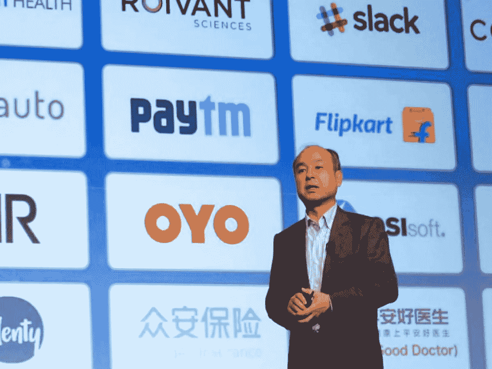
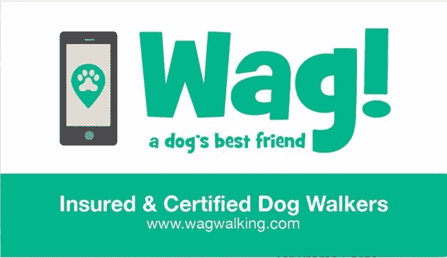
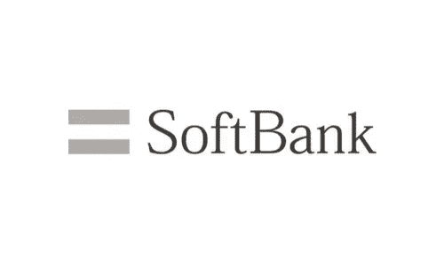
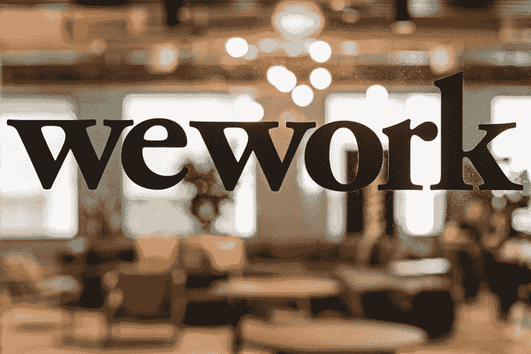
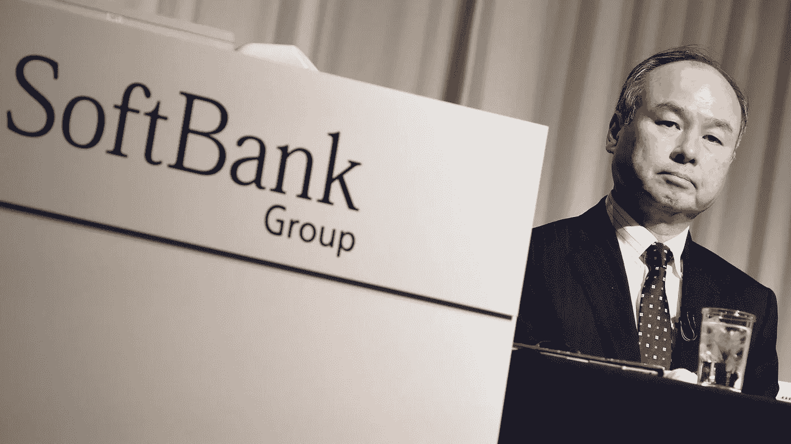
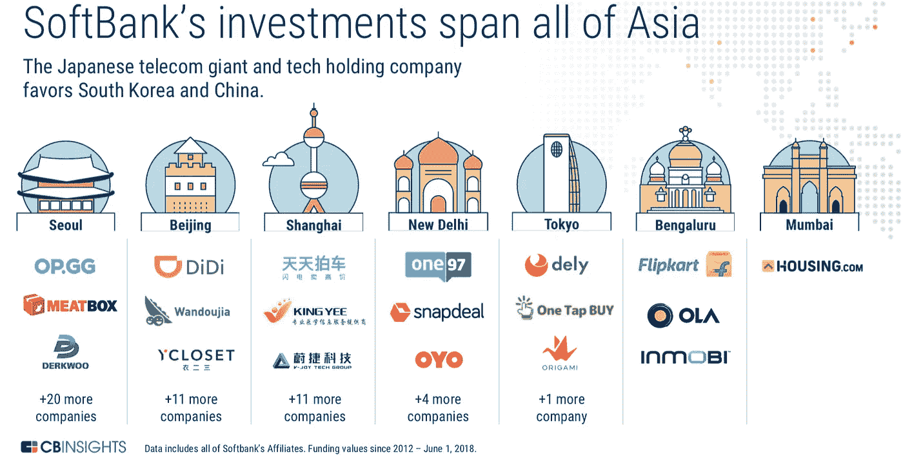

# 这些初创公司筹集了数十亿美元，然后解雇了数千人

> 原文：<https://medium.datadriveninvestor.com/these-startups-raised-billions-and-then-laid-off-thousands-a87b5b69310?source=collection_archive---------3----------------------->

## 工人和投资者感到震惊和沮丧

安东尼·布隆伯格

就在几个月前，连锁折扣酒店 **OYO** 似乎势不可挡。这家总部位于印度的初创公司宣扬全球扩张计划，并在 10 月份将其估值翻了一番，达到 100 亿美元。但在 1 月中旬，该公司开始大规模裁员，导致数千人失业。

去年 9 月，【Fair.com】，一家汽车租赁初创公司，在大约一年前筹集了近 4 亿美元的资金，收购了其竞争对手之一 **Canvas** ，几周后却裁员 40%。根据当时流传的一份备忘录，目标是“成为一个更小的团队，专注于做好更少的事情。”一名被解雇的帆布转向公平的员工说，这是“一个过山车。”

与此同时，初创公司 **Wag** 在 2018 年初为其优步风格的遛狗业务筹集了 3 亿美元，在周五举行了一场旧金山假日派对，据公开报道，他们租出了一个提供餐饮的休息室、一个开放的酒吧和一个照相亭。接下来的周一，该公司解雇了至少 90 名员工，并宣布一家主要投资者已经出售了其在该公司的股份。

在整个科技领域，从纽约到旧金山，再到印度的古尔冈，一些雄心勃勃、迅速崛起的初创公司现在正在接受现实的检验。由于筹集了令人瞠目结舌的资金，企业似乎准备占据主导地位——直到它们没有。他们最大的支票往往来自同一个来源:软银，一家拥有近 1000 亿美元空前资金的日本企业集团。

但是，许多软银支持的创业公司，包括 Fair.com 的 OYO、大众和最近都经历了裁员。根据最近一项基于公司来源、媒体报道和公司文件的公开调查，在过去的四个月里，总共有超过 7300 人在 12 家软银支持的私营公司中失去了工作。受影响的人包括在工程、营销、人力资源和并购等部门工作的人。

两年来，软银的愿景基金颠覆了科技世界，该基金试图迅速向科技公司注入 930 亿美元。从事协同工作、垂直农业和比萨饼制作机器人等服务的公司筹集了数亿甚至数十亿美元。接受者继续疯狂招聘，收购其他创业公司，并以极快的速度扩张。在该基金成立前的几年里，初创企业的估值已经因过高而受到批评，现在却越来越高。

> 想了解更多关于创业公司的信息吗？看看这个人工智能初创公司，它筹集了数百万美元来自动化你的工作！

然后，就像突然发生的那样，华尔街发出信号，表示它对无利可图的企业的容忍已经达到了极限。**优步**上市后遭投资者打压。 **WeWork** 尝试 IPO 失败。这些影响在整个行业引起了反响。而**软银**，向**优步**、 **WeWork** 等众多创业公司投入数十亿资金的软银，也已经底气不足。

这个数字还不包括大约 1000 名建筑维护人员，他们在失业时可以选择为第三方外包公司工作。这也不包括公司上市几个月后，今年秋天优步解雇的 1100 多人。这家叫车公司是软银最大的赌注之一，已经获得了超过 70 亿美元的资金。

 [## 数据驱动投资的兴起|数据驱动投资者

### 当 JCPenney 报告其 2015 年 2Q 的财务结果时，市场感到非常震惊。美国零售巨头…

www.datadriveninvestor.com](https://www.datadriveninvestor.com/2019/02/28/the-rise-of-data-driven-investing/) 

“随着市场情绪的变化，企业面临着更快实现盈利的压力，”软银愿景基金发言人在最近的一份公开声明中表示。“我们投资组合中的许多公司迅速而负责任地做出了一些艰难的决定，以更好地为自己的长期成功定位。我们预计——并且已经看到——其他公司也会适应。”

正在进行的剧变的细节因公司而异。根据之前的公开披露，甚至在软银出售其公司股份之前，Wag 就一直在努力跟上竞争的步伐，忍受着一些裁员。

在最近一次裁员时发送的一封现已公开的电子邮件中， **Wag 的** CEO 告诉员工，该公司正在与**软银**“友好地分道扬镳”,并表示裁员是“极其痛苦和艰难的一步”,但却是“对我们的未来至关重要的一步”。

最近倒闭的零售创业公司 Brandless 也在今年早些时候更换首席执行官时发出了麻烦的信号。在一份关于关闭的声明中， **Brandless'** 首席执行官说:“我为我们在 **Brandless** 创造的一切以及团队中每个人的辛勤工作和奉献精神感到骄傲……我相信明天的下一个伟大品牌将从这次经历中建立起来。”

随着裁员和重组的进行，许多公司都在强调盈利能力。对一些人来说，这种转变令人震惊地迅速。

一名前雇员说，Compass 在纽约总部的 11 楼举行了一场“招聘人员答谢”活动，表扬员工并展望未来一年，并指出一些领导也出席了活动。该人士称，仅仅几周之后，Compass 就在裁员中解雇了十几名招聘人员。各团队约 40 人失业。Compass 拒绝置评，但该公司首席商务官罗布·雷曼当时表示，“我们将继续投资，并以我们一贯的速度增长，我们预计今年每个月都会增加员工人数。”

OYO 内部的员工不禁注意到去年员工人数增长有多快。新员工每周加入两次，分别在周一和周四，有些人会挠头想知道他们都是谁。

但在 2019 年 11 月，有报道称 **OYO** 实施了招聘冻结。OYO 已经在全球范围内裁员至少 3300 人。OYO 的一位发言人说，该公司目前有 25，000 人在 OYO T21 工作。在最近的一次采访中， **OYO** 首席执行官 Ritesh Agarwal 说，“市场对高增长公司有明确的反馈，盈利的道路是非常有价值的，我们完全承认这一点。”

> 我们谈论的这些公司有多大？看看他们如何与特斯拉和其他数十亿和数万亿美元的公司相抗衡！

在一份声明中，OYO 的发言人说:“公司由管理层掌控，没有来自任何人的压力。我们与所有投资者和董事会都有持续的对话……在 OYO 旅程的这一点上，精简工作非常重要，是公司领导团队做出的决定。”

这种调整让人想起 2000 年科技泡沫破裂时的情景——数十万科技工作者失业，科技公司市值损失数万亿美元——尽管规模较小。但 2000 年的科技股崩盘集中在上市公司，而这次主要涉及私营公司。因此，受到间接伤害最严重的是被瞄准的初创企业员工。

震惊和沮丧是陷入困境的初创公司员工的普遍感受。

总部位于旧金山的初创公司 Zume 以其披萨机器人而闻名，12 月中旬，当一些 2020 年的规划会议被取消时，一面红旗升起。“突然间，我找不到答案，”据报道，一名前高级雇员在接受采访时说。几周后， **Zume** 解雇了数百名工人，关闭了披萨制作和配送业务，专注于食品包装创新。

心情只是悲伤。我们都在建造惊人的东西。就像是，‘为什么会这样？’

通过给历史记录如此短暂的公司开出如此巨额的支票，**软银**创造了一个王者的光环。这位前高管说，一些员工表示，他们有这样的印象，无论是起起落落，它都准备好了

虽然 Zume 的业务没有达到其承诺，但这位前员工表示，员工至少部分将裁员归咎于软银在 2018 年底筹集的 3.75 亿美元之外没有投入更多资金。“心情只是悲伤。我们都在建造惊人的东西。就像是，‘为什么会这样？"

据报道，就在几年前，**软银传奇的首席执行官孙正义告诉 **WeWork 的**联合创始人，“疯狂的家伙”在与“聪明的家伙”的斗争中获胜，而他们认为“不够疯狂”。**

本月早些时候，软银的首席运营官 Marcelo Claure 在美国消费者新闻与商业频道的一次电视采访中说“不惜任何代价的增长”是一种“误解”，他在九月下旬被任命为 WeWork 的执行主席他补充道:“我们喜欢加速增长。我们喜欢能占据大量市场份额的公司。我们喜欢盈利和现金流清晰的公司，就像其他投资一样。”他还表示，愿景基金到目前为止的表现“非常好”

迄今为止的结果讲述了一个不同的故事。软银报告称，由于技术投资，最近两个季度的运营损失总计 110 亿美元。

虽然多年来一直有关于私人市场泡沫的说法，但行业观察人士表示，软银试图向市场注入数十亿美元，而且往往估值很高，从而使泡沫变得更加严重。

复兴资本(Renaissance Capital)负责人 Kathleen Smith 表示:“毫无疑问，私人市场上的资金过剩，而且这种情况因**软银的愿景基金**而加剧。”复兴资本管理着专注于 IPO 的交易所交易基金。

宾夕法尼亚大学沃顿商学院金融高级研究员大卫·埃里克森说，**愿景基金**的前提“从一开始就考虑不周”该基金最大的优势——其无与伦比的规模——可能也是其主要缺陷。“基金的规模确实让他们处于一种几乎必须做出这些重大押注的境地，”他表示。现在，我们看到了当一些大赌注失败时会发生什么。

软银正在计划第二个**愿景基金**，但与第一个有所不同。Son 在本月最近的收益电话会议上表示:“目前，我认为我们的下一只基金规模应该小一点，因为我们已经引起了很多人的担忧和焦虑。”

Venky Ganesan 是 Menlo Ventures 的合伙人，他投资了一些公司**软银**后来资助了如**优步**等公司，他公开表示，虽然“否定**软银**和 Masa【Son】…故事还远未结束。”

但是，即使软银能够获得另一笔巨额资金，一些员工也在重新考虑一个大的名字和一个大的支票簿能在多大程度上保证成功。

据报道，一名前 OYO 招聘人员表示希望去一家成立时间更长的公司。“我可能会减薪，但(我)再也不会去创业公司，或者软银支持的创业公司。”

这篇文章最初发表在我的博客上。查看[anthonyblumberg.com](https://www.anthonyblumberg.com/)更多关于金融、技术和投资的文章，作者是一家华尔街金融科技公司的前首席执行官和行业专家，我！

## 阅读更多内容:

**> >** [**三星掀掉苹果**](https://www.anthonyblumberg.com/blog/samsung-flips-off-apple)

**> >** [**苹果在 2019 年以超过 1000 万只手表的销量超过整个瑞士钟表业**](https://www.anthonyblumberg.com/blog/apple-outsells-the-entire-swiss-watch-industry-in-2019-by-more-than-10-million-watches)