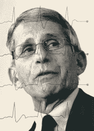

# 事情和想法-我

> 原文：<https://medium.datadriveninvestor.com/things-and-thinks-i-94e5e621afb6?source=collection_archive---------13----------------------->

通过一个典型的工作日，我们大多数人最终都会阅读相当多的东西，有些与工作有关，有些则无关。有些是速读，而有些会把我们吸进兔子洞。从这篇文章开始，我将发布一些让我印象深刻的有趣的阅读材料，主要是在医疗保健、技术、领导力和治理领域。所以这是第一版…

## [福奇博士——成长、人文、流行病学和政治](https://www.newyorker.com/magazine/2020/04/20/how-anthony-fauci-became-americas-doctor)

这是我过去几天读到的最有趣的简介之一；读到他在工作场所处理政治的方法尤其令人着迷。

> 你只是有工作要做。即使有人的行为很可笑，你也不能因此责备他们。你必须和他们打交道。因为如果你不和他们打交道，你就出局了

同样有趣的是他对教育的看法以及他对医学和人文学科的看法。

> 会是人文和经典，还是科学？当我分析这一点时，在我看来，成为一名医生是这两种愿望的完美融合。

## [供应链和医疗保健](https://www.nejm.org/doi/full/10.1056/NEJMc2010025)

新冠肺炎带来了冲突和难题，这些冲突和难题对一般公众来说是隐藏的，只有某个领域的专家/内部人士知道。阅读《新英格兰医学杂志》关于个人防护装备(PPE)采购的评论，揭示了由于疫情局势带来的危机所导致的可怕冲突。

> 作为一名在一个富裕、高度发达、拥有最先进的科学技术和令人难以置信的人才的国家工作的卫生系统领导人，我是否预见到我的组织会面临这样一系列情况？当然不是。

## [科学方法与有效性](https://science.sciencemag.org/content/early/2020/04/22/science.abc1731)

虽然对疫情的情况有效，但这种解读对任何时候危机被用作科学方法的捷径也很重要。除了不符合科学标准的明显缺点外，这种捷径导致稀缺资源的分流，对患者造成的伤害大于好处。

> 不属于精心设计的发展轨迹的小型研究的激增是产生错误引导的处方，这些错误引导有可能将本已稀缺的资源转移到无效的实践中，因为无法可靠地检测较小但具有临床意义的益处而减缓有效干预的吸收，并产生使患者和临床医生不愿参与随机试验的治疗偏好。

 [## 领导力。赢得|数据驱动型投资者需要更广阔的视角

### 不管他们愿不愿意，领导者都是快速运转的机器中的齿轮，这就要求他们夹住自己的爪子…

www.datadriveninvestor.com](https://www.datadriveninvestor.com/2020/02/07/leadership-it-takes-a-wider-perspective-to-win/)