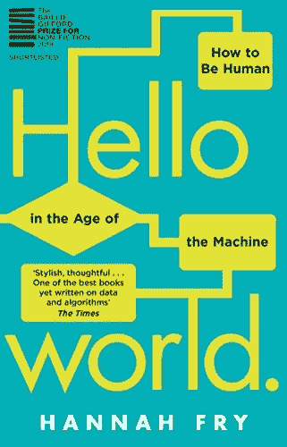
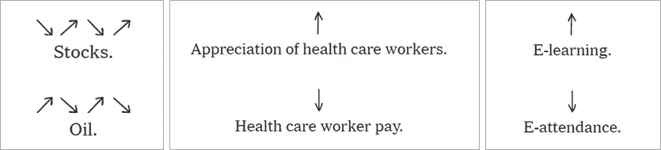

# 事物与思考-四

> 原文：<https://medium.datadriveninvestor.com/things-and-thinks-iv-6881a2ca7ff7?source=collection_archive---------10----------------------->

本版通过巧合的阅读和事件，致力于我们与各种形式的数据的接触，从书评、科学丑闻以及对数据隐私和利益冲突的关注开始。在结尾，一些花边新闻；快乐阅读！

## 书评——汉娜·弗莱的《你好，世界》

《Hello World》有趣地展示了我们所谓的“算法”是如何存在了一段时间，并随着时间的推移而发展，越来越多地影响到我们受科技影响的生活。Hannah Fry 在考虑数据及其用途的不良影响以及可能的用途时，走了一条微妙的平衡线。她毫不犹豫地提供了实验失败的详细例子，同时也毫不避讳地指出所谓的“人情味”是如何远离我们指责对方的相同陷阱的。这本书借鉴了不同领域的经验，如乐购早期对购物者数据的实验，包括 Palantir 等数据经纪人在内的新型业务以及不同级别的无人驾驶汽车，是对算法广泛存在的一个很好的介绍。

这本书里有几行我最喜欢的，但最喜欢的是-

> 你可以用一个技巧来识别垃圾算法。我喜欢称之为**魔法测试**。每当你看到一个关于算法的故事，看看你是否能换出任何一个流行词，比如“机器学习”、“人工智能”和“神经网络”，换上“魔法”这个词。一切还合乎语法吗？有什么意义丢失了吗？如果不是，我会担心有些东西闻起来很像废话。因为我担心——在可预见的未来很久——**我们不会‘用魔法解决世界饥饿’**或**‘用魔法写出完美的剧本’**就像我们不会用 AI 一样。

## 数据在哪里？！

根据收集学术出版质量信息的出版物卡贝尔列表，三分之一与医疗保健相关的期刊值得列入掠夺性/不可信期刊黑名单！发表在所谓值得信任的期刊上的研究怎么样？

当你的家庭 whatsapp 小组谈论科学出版物出错时，你知道该领域陷入了困境！本周就是这样的一周，两家最古老和最知名的医学期刊不得不撤回关于羟氯喹的研究( [***【柳叶刀】***](https://www.thelancet.com/journals/lancet/article/PIIS0140-6736(20)31180-6/fulltext) 、[***【NEJM】***](https://www.nejm.org/doi/full/10.1056/NEJMoa2007621))，这些研究是使用一个名为 **Surgisphere** 的所谓观察研究数据库进行的。至少有一项研究导致世卫组织停止招募他们的一项临床试验。在全球科学界开始对研究数据和分析提出质疑后不久，两家杂志都发表了担忧的言论，随后(一些)作者完全撤回了这些研究。要更详细地了解整个问题，请阅读本报告中的 [***科学***](https://www.sciencemag.org/news/2020/06/mysterious-company-s-coronavirus-papers-top-medical-journals-may-be-unraveling)

这就引出了几个问题，科学界的许多批评家已经指出了这些问题，但是这些问题经常被掩盖起来

*   使用观测数据有几个缺点(当它存在的时候！)最重要的是忽略了所有的混杂因素。
*   盲目相信新的数据科学技术也有一些缺点，许多研究人员没有提供足够的细节，如原始数据源、使用的代码/算法等
*   一些研究出版物的作者对用于相同研究的原始数据及其来源一无所知。
*   所有这些导致不幸的不祥之兆:同行评审期刊不再保证科学/医学研究的质量和有效性！

## **数据共享、隐私和冲突**

数据所有权是近来的热门话题；医院和其他医疗保健服务提供商可以像其他服务提供商一样访问他们“客户”的数据。除了最初收集这些数据的原因之外，这些数据还能被“重用”吗？谁决定这种再利用的条款？患者是否应该有所回报？回答这些问题变得越来越重要。最近一份关于美国梅奥诊所的报告提出了一些问题。

 [## 认知计算——一套被广泛认为是……

### 作为它的用户，我们已经习惯了科技。这些天几乎没有什么是司空见惯的…

www.datadriveninvestor.com](https://www.datadriveninvestor.com/2020/02/19/cognitive-computing-a-skill-set-widely-considered-to-be-the-most-vital-manifestation-of-artificial-intelligence/) 

同样，印度的国民健康体系继续*关注与私人合作伙伴和风险投资公司可能的利益冲突。*

> *我的想法是，虽然政府、政策制定者和隐私专家与服务提供商和供应商一起研究解决这个问题，但患者至少应该期待谁在使用他们的数据，出于什么目的以及如何使他们受益的完全透明。*

## *花絮*

*   *在乔治·弗洛伊德惨淡离世的余波中，有一些改变的迹象正在发生；Reddit 的联合创始人亚历克西斯·奥哈尼安(Alexis Ohanian)从 Reddit 董事会辞职，并敦促他们用一名黑人候选人来填补他的席位。*
*   *《纽约时报》展示了一组极简主义的标志 ，美丽地描绘了我们的世界因新冠肺炎而发生的变化；我的最爱-*

**

*   *摩根·豪斯列出的 [***【永久假设】***](https://www.collaborativefund.com/blog/permanent-assumptions/) 和我最喜欢的永久假设*

> *更多的人每天早上醒来想解决问题，而不是醒来想造成伤害。但是造成伤害的人比解决问题的人得到更多的关注。因此，在一片坏消息声中进展缓慢是常态。*

*你觉得这份时事通讯怎么样？通过评论和“鼓掌”留下您的反馈:*