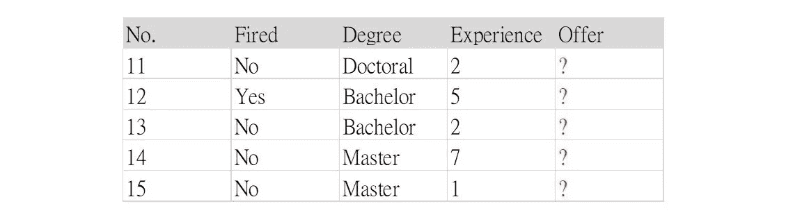

# 决策树方法背后的东西——算法、模型建立和问题

> 原文：<https://medium.datadriveninvestor.com/things-behind-the-decision-tree-method-algorithm-model-building-and-issues-199670478a6f?source=collection_archive---------2----------------------->


Photo by [Robin Glauser](https://unsplash.com/@nahakiole?utm_source=medium&utm_medium=referral) on [Unsplash](https://unsplash.com?utm_source=medium&utm_medium=referral)

**什么是决策树？**使用树状模型进行分类和回归的监督学习方法。它有助于找到大量候选输入变量和目标变量之间的关系。然而，这是一种贪婪的算法，不能产生使误差最小化的最优决策树。

决策树使用带有 if-then-else 决策规则的变量将大量记录划分为连续的较小记录集。目标是探索训练数据，并通过将大量异质群体清晰地分成更小且更同质的群体(即，杂质的最大减少)来构建模型。然后将相同的模型应用于测试数据，以预测特定的目标变量。

# 通过简单的例子理解决策树

为了解释决策树算法的思想，我将从一个简单的二进制分类问题开始。我构建了一个包含 4 列和 10 条记录的训练数据集。“以前被炒过”、“学位水平”、“工作经验”是自变量，“拿到 Offer”是我们的目标变量。


接下来，我们构建决策树来分割数据，直到没有剩余的属性用于进一步划分，这意味着，通常，其中一个类别达到 0。


在这个图表中，树中的每条路径都是一条规则(从根到叶)，所以在这个树中有 5 条规则。然后我们把这些规则放在我们想要预测的数据上。

*   R1(否):已被解雇+工作经验< 3 years
*   R2 (Yes): has been fired + working experience > 3 年
*   R3(是):从未被解雇+硕士或博士学位
*   R4(否):从未被解雇+学士学位+3 年工作经验
*   应用上述规则，我们可以得出这样的结论:一个人是否获得 offer 的结果从第 11 行到第 15 行:“是”、“是”、“否”、“是”、“是”。这只是解决方案之一，可能不是最佳方案，但它解释了算法背后的一般思想。



用 Python 构建决策树模型

# 在手工构建决策树之后，我现在使用相同的数据，并用 Python 来做。

由于 [DecisionTreeClassifier()](https://scikit-learn.org/stable/modules/generated/sklearn.tree.DecisionTreeClassifier.html#sklearn.tree.DecisionTreeClassifier) 通过考虑和计算准则、分裂器、树的深度、样本叶数等来确定分裂变量的顺序。，我们得到了与手动做不同的预测:“不”，“是”，“不”，“是”，“不”。也可以改变参数或参数组合以期望更好的性能。

```
import pandas as pd
import graphviz
from sklearn import tree
from sklearn.tree import DecisionTreeClassifier
from sklearn.tree import export_graphviz#create train and test data
train = pd.DataFrame({'Fired': list('YNNNYNNYNN'), 'Degree': list('BMBMMBBBDB'), 'Experience': [1,0,6,6,2,8,10,4,15,1], 'Offer': list('NYYYNYYYYN')})
test = pd.DataFrame({'Fired': list('NYNNN'), 'Degree': list('DBBMM'), 'Experience': [2,5,2,7,1]})#one hot encoding for categorical variables
train_copy = train.iloc[:, :-1]
categoricalFeatures = ['Fired', 'Degree']
combine = pd.concat([train_copy, test], keys=[0,1])
combine = pd.get_dummies(combine, columns=categoricalFeatures)#seperate features and target variable
xtrain = combine.xs(0)
ytrain = train['Offer']
xtest = combine.xs(1)#bulid default model
clf = DecisionTreeClassifier()
clf.fit(xtrain, ytrain)
clf_pred = clf.predict(xtest)
```

这是模型中的树形图。注意，我们可以在树生长时再次使用同一个分裂变量(本例中为“Experience”)。此外，为了确定最佳分割，我们不仅试图使标准值(本例中的 Gini)变得更低，显示出低程度的不纯，而且还希望我们的节点尽可能均匀分布，以便结果大部分聚集在同一类中。

```
#visualize decision tree
graph_tree = export_graphviz(clf, max_depth=3, feature_names=xtrain.columns, filled=True, rounded=True)
graph = graphviz.Source(graph_tree)
```


处理过拟合问题的方法

# 在使用决策树方法进行分类时，我们可能会面临两个问题:欠拟合和过拟合，尤其是后者。当开发的模型过于简单时，会出现欠拟合问题，导致训练误差和测试误差都很大。相比之下，当模型过于复杂时，会出现过拟合问题，但实际上并不应该如此，这使得训练误差较小，而测试误差较大。


公平算法|数据驱动的投资者

[](https://www.datadriveninvestor.com/2020/02/22/algorithms-for-fairness/) [## 许多人都有算法偏见。软件工程师关心算法偏差，因为我们关心…

### www.datadriveninvestor.com

决策树容易过度拟合的原因是我们没有限制最大深度。因为它具有无限的灵活性，所以它可以不断增长，直到对于每一次观察都有一个叶子节点。为了解决过度拟合问题，除了改变模型的参数之外，我们还可以通过仅选择有效变量来进行修剪过程。](https://www.datadriveninvestor.com/2020/02/22/algorithms-for-fairness/) 

**预修剪**是在决策树变成完全成长的树之前停止的修剪过程。也就是在划分之前，对每个节点进行估算。如果当前节点的划分不能提高树的泛化性能(熵或基尼指数)，则停止划分，并将当前节点标记为结束节点(叶)。

**后期修剪**是在决策树成长为整体后进行修剪。从树枝(树叶)末端到树干(屋顶)方向对树进行调查。如果在修剪后泛化误差得到改善，那么这种修剪用一个结束节点(叶子)代替子树。

决策树的影响

# 优势:

易于理解和解释

*   应用于实际问题，通常有助于绘制业务规则
*   不需要准备数据，对缺失值不敏感
*   能够处理数值和分类数据，而其他方法需要数据类型的一致性
*   缺点:

关联的结果会使计算变得非常复杂

*   需要对时间顺序数据做更多的预处理
*   数据的微小变化会导致最佳决策树结构的巨大变化
*   对于样本大小不一致的数据，结果可能偏向于具有更多值的那些要素
*   如果类别太多，会给出相对不准确的结果，而其他方法在处理类似数据时会表现得更好
*   关于我

# 嘿，我是凯莉。我喜欢探索数据，寻找生活中有趣的事情。如果你觉得我的文章有帮助，请为我鼓掌分享。我也欢迎任何反馈，评论和建设性的批评，以使我的文章更好。你可以打[k*elly.szutu@gmail.com*找到我](mailto:kelly.szutu@gmail.com)

Hey, I’m Kelly. I like to explore data and find interesting things in life. If you think my article is helpful, please clap for me and share it. I also welcome any feedback, comments, and constructive criticism to make my articles better. You can reach me at [k*elly.szutu@gmail.com*](mailto:kelly.szutu@gmail.com)