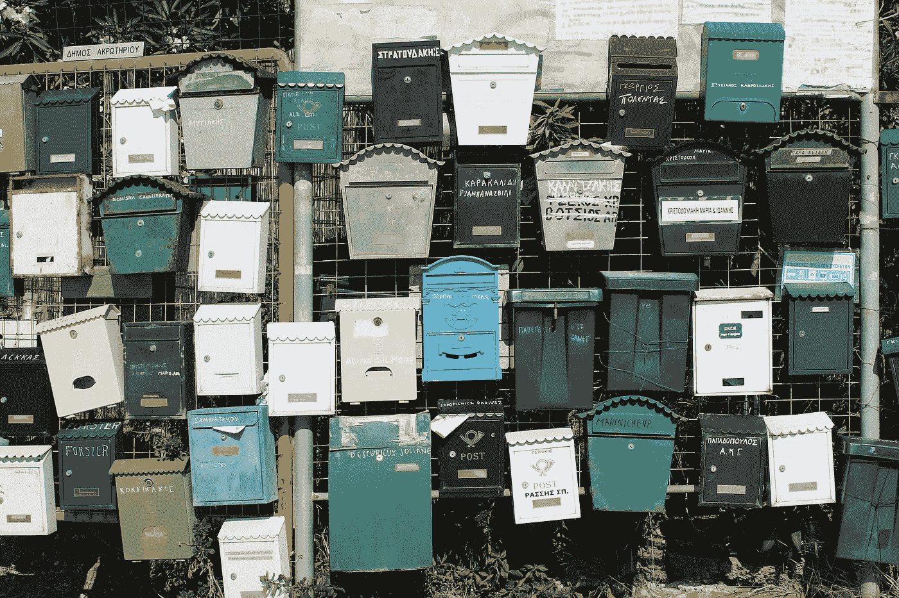
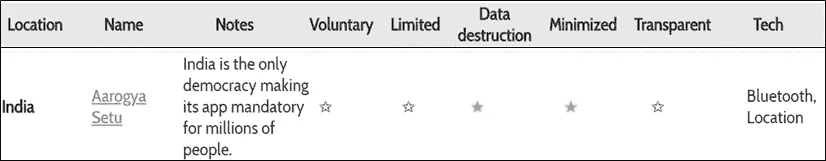

# 事物与思想-II

> 原文：<https://medium.datadriveninvestor.com/things-thinks-ii-9f295bf7b63d?source=collection_archive---------14----------------------->

## 我们是否从过去吸取了教训？

人们非常关注针对新冠肺炎的新型诊断、预防和治疗产品。美国 FDA 已经批准了数百个紧急使用授权(eau ),其中 18 个给予呼吸机和医疗设备，3 个给予包括 Remdesivir 在内的新疗法。由于疫情的性质和疾病负担，新药和新器械的常规审批步骤被跳过、绕过或缩短。然而，我们过去的经验是什么？利巴韦林，一种在 2003 年 SARS-CoV 爆发中广泛使用的药物，被证明是有害无益的。《新英格兰医学杂志》的这篇文章对此做了最好的总结

*“我们应该记得理性地接受不确定性，并警惕我们本能地希望在随机事件中看到模式的潜在不良后果。”*

## 接触追踪背后的理念是什么？有用吗？

关于联系追踪技术的使用有很多讨论，最重要的讨论是与联系追踪应用程序/应用程序开发人员/政府共享的数据的隐私。《麻省理工科技评论》有一个有趣的追踪器，记录了 25 个这样的联系追踪应用 ，根据 5 个基本原则对它们进行了排名——是自愿的吗？数据使用是否仅限于新冠肺炎跟踪？一段时间后数据会被破坏吗？数据收集是否最小化？最后，这项工作是否透明？这是印度的阿罗格亚·塞图的样子-

From MIT Technology Review

然而，除了隐私问题之外，该方法似乎只是部分有用，并且由于各种限制，包括智能手机渗透、误报和标记低风险/短暂相遇，仅依赖这种技术解决方案可能不是完全可靠的。

**最后，一些非 covid…**

from kk.org

《连线》*杂志*的联合创始人凯文·凯利 68 岁了，他写了一本精彩的“ [***不请自来的建议***](https://kk.org/thetechnium/68-bits-of-unsolicited-advice/) ”集；有很多很有用，很酷，很棒，但我最喜欢的是-

*   你做什么就是什么。不是你说了什么，不是你相信什么，不是你怎么投票，而是你把时间花在了什么上面。
*   学习如何不尴尬地小睡 20 分钟。
*   从长远来看，未来由乐观者决定。 ***做一个乐观主义者，你不必忽视我们制造的所有许多问题***；你只需要想象提高我们解决问题的能力。

## 花絮

*   CB Insights [*报道*](https://twitter.com/CBinsights/status/1253492551950241792) 称，公司在 2020 年盈利电话会议上以“前所未有”的规模使用了“前所未有”一词！
*   伯克希尔·哈撒韦公司出售了其在美国四大航空公司的所有股份。在伯克希尔 2013 年的年会上，巴菲特告诉与会者，航空业是一个 [*【死亡陷阱】*](https://www.ft.com/content/0f440f48-aab3-11e6-9cb3-bb8207902122) 。
*   创业竞赛是愚蠢的。作为一家初创公司，你已经置身于一场名为“市场”的竞争中

希望你喜欢收藏；我将很高兴听到你的想法和反馈。你也可以随时留下一些‘掌声’！

 [## 在医疗保健中使用人工智能的伦理|数据驱动的投资者

### 人工智能(AI)正被应用于任何管理大量数据的行业，在一个…

www.datadriveninvestor.com](https://www.datadriveninvestor.com/2020/03/21/the-ethics-of-using-ai-in-healthcare/)