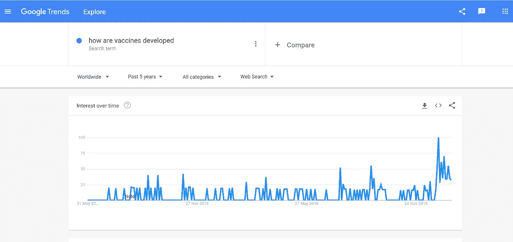
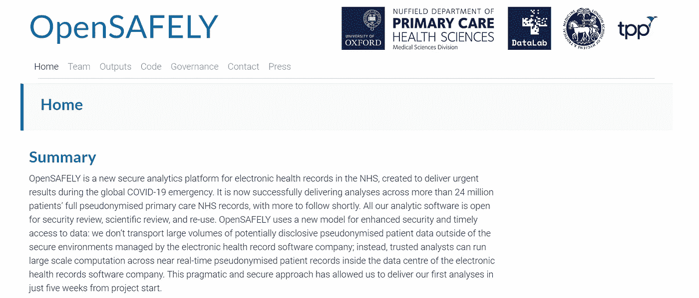

# 事物与思考-三

> 原文：<https://medium.datadriveninvestor.com/things-thinks-iii-8ef6ed28f2d0?source=collection_archive---------17----------------------->

> 在本期杂志中，我们将了解新冠肺炎世界的制药行业，一种有趣的医疗保健数据分析新方法，关心我们的精神饮食和一些花絮！

## **制药公司在管理疫情中的角色**

制药行业一直没有良好的声誉，在过去的几年里，它一直受到打击，特别是考虑到价格上涨和准入问题。在印度，声誉可能不像在美国或其他西方国家那样负面，但也从来没有特别正面。

然而，新冠肺炎·疫情不知何故把焦点从通常的问题上移开了一点，打开了人们对这个行业知之甚少的一些方面的大门。作为一名研究和开发人员，我个人很高兴看到人们对药物/疫苗开发过程如此感兴趣；此外，供应链和药品再利用等不那么引人注目的方面也受到了很多关注。

Google Trends Snapshot-’How are vaccines developed’

在接下来的几个月里，还有一些其他复杂的重要问题需要解决，尤其是关于知识产权的问题。许多有趣的想法正在流传，世界卫生组织 ***提出了一个“专利池”的概念*** 。这篇 [***StatsNews 文章***](https://www.statnews.com/pharmalot/2020/05/15/who-covid19-coronavirus-patents-intellectual-property/) 给出了更多的细节，发布本身很可能会在未来几天内发生。

## 一个有前途的医疗数据分析模型

分析医疗保健数据的常见挑战包括碎片化电子健康记录系统(EHR)和数据共享的隐私问题。由两名 NHS 医生领导的研究小组想出了一个巧妙的解决方案，名为[***open safely***](https://opensafely.org/)。根据他们的网站，该平台不是从各种 EHR 系统中提取数据，试图将它们合并然后分析，从而导致各种隐私和安全问题，而是在 EHR 软件公司的数据中心内实时分析数据。

OpenSAFELY

研究人员已经公布了他们对超过 2300 万份 NHS 记录进行的首次此类分析的结果，以了解新冠肺炎患者的特征并确定可能的风险因素。虽然该平台的应用目前仅限于 NHS 和英国生态系统，但它无疑是医疗保健数据之旅的积极一步。

## 你想过你的精神饮食吗？

[***这个有趣的片段***](https://www.theatlantic.com/ideas/archive/2020/05/commencement-address-too-honest-have-been-delivered-person/611572/) 是大卫·布鲁克斯的建议，作为 2020 届的毕业典礼致辞而写的，而且同样适用于所有年龄段的人，让我产生了很大的共鸣！

> 几年前，我在一所竞争激烈的大学教学生。与此同时，我在为 30 多岁和 40 多岁的人主持研讨会，他们中的许多人曾在同一所大学学习。我给两组学生布置了同一篇文章，是政治哲学家以赛亚·伯林写的关于托尔斯泰的文章。大学生发现它很容易阅读；这篇文章不难理解。三四十岁的人真的很挣扎。自大学以来的几十年里，他们的阅读理解能力下降了，他们玩弄思想的能力也下降了。他们思想的上限比过去低了。

一定要读完整本！

## 花絮

*   [***伊丽莎白·比克***](https://www.nature.com/articles/d41586-020-01363-z?utm_source=twt_nnc&utm_medium=social&utm_campaign=naturenews) 是科学论文中重复图片的超级观察者；说说有意思的职位描述！
*   我很惊讶地得知，一个团队相对较小的初创公司最终可以使用大约 [***64 种商业工具***](https://twitter.com/spencerfry/status/1263555141795491840) ，每年花费 50 万美元多一点！需要更多的时间来思考和消化这些信息..

请留下您对该系列的反馈/评论！如果你喜欢这篇时事通讯，你可以留下一些‘掌声’！