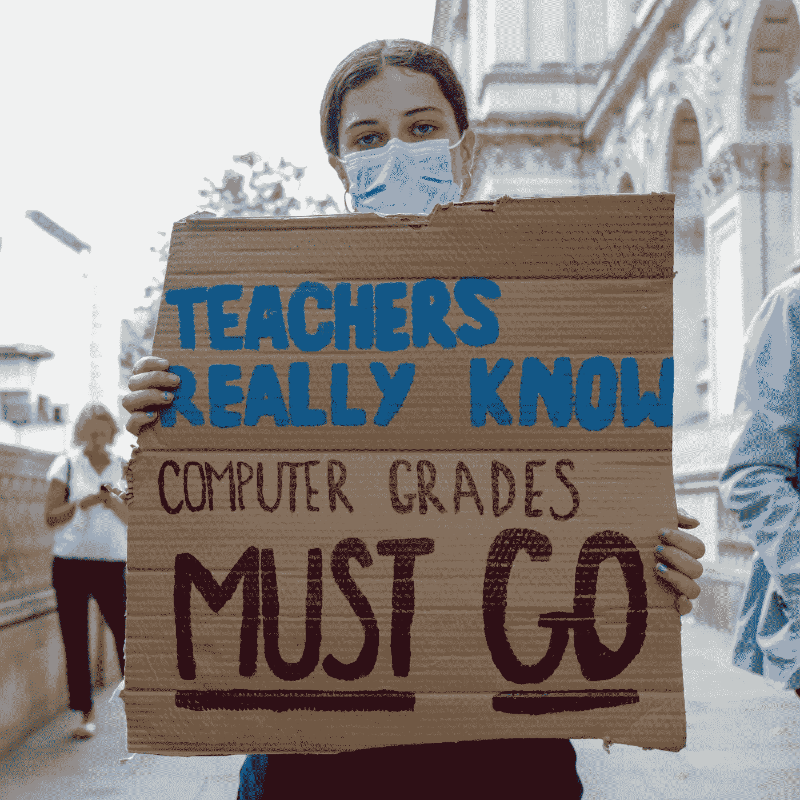
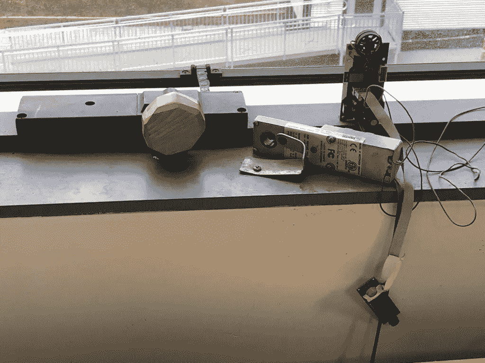

# 事物与思想 IX

> 原文：<https://medium.datadriveninvestor.com/things-thinks-ix-129e2274e0dc?source=collection_archive---------31----------------------->

在《事物与思考》的第九版中，你将从两个角度阅读系统，一个是过去问题的共同线索；有一篇关于“书呆子气”的很长的文章，当然还有一些趣闻

## 系统思维与医疗保健

我正在读一本名为《系统思维:初级读本》的书，作者是已故的 Donella H. Meadows，这本书是对系统理论的精彩介绍，用简单流畅的语言写成，概念清晰，例子恰当。

Thinking in Systems by Donella H. Meadows

以下是一些早期摘录，它们与我每天在医疗保健系统中观察到的现象产生了共鸣；我把它们和这本书似乎在我脑海中产生的问题/想法联系在一起。

*   一个系统不仅仅是其各个部分的总和。它可能表现出适应性、动态性、追求目标、自我保护，有时还有进化行为。 *这句话中使用的所有形容词似乎都与我们所看到的当今医疗保健系统的本质相符。*
*   **系统的目的不一定是人类的目的，也不一定是系统中任何一个行动者的意图。事实上，系统最令人沮丧的一个方面是，子单元的目的可能会累积成一个没有人想要的整体行为。即使是局外人也应该清楚地看到这一点——我们的医疗保健系统明显的分散性。像医院、供应商、付款人和供应商这样的子单位有不同的目的，总体行为的总和肯定不适用于社会的许多部门。**
*   **系统可以嵌套在系统中。因此，目的中可以有目的。保持子目标和整个系统目标的和谐是成功系统的基本功能。**

这一个-

> **系统中最不明显的部分，其功能或目的，往往是系统行为最关键的决定因素。**

*医疗保健系统中最不明显但却是最关键的决定因素是什么？是基于结果的交付吗？是以病人为中心吗？是性价比吗？看起来我们还没有解决这个问题……*

## 考虑不周的算法

我过去写过关于算法设计和它们在已建立的系统中的实现的问题，重点是医疗保健。

大约两周前，教育界出现了一个有趣、忙乱而又混乱的案例。由于新冠肺炎疫情，英国的学生、家长和学校在没有考试的情况下接受了该机构的评分任务，这让他们大为震惊。一种基于估计分数给学生打分的算法&“在同一估计分数内与学校其他学生相比的排名”，两者都是由学校提供的。该算法还考虑了学校在过去三年中每门学科的表现。

 [## 医疗保健行业的螺旋式项目管理方法|数据驱动的投资者

### 项目管理就是将知识、技能、工具和技术应用到活动中，以…

www.datadriveninvestor.com](https://www.datadriveninvestor.com/2020/08/04/spiral-project-management-methodology-in-healthcare/) 

结果是相当戏剧性的-近 40%低于教师的评估，降级对公立学校的影响比私立学校大得多。大量的 [***事后分析***](https://www.bbc.com/news/explainers-53807730) 关于这个问题的技术、政策和法律方面正在进行中，然而有一点是清楚的- ***选择一个技术解决方案，在一个复杂的系统中部署而不考虑互联组件肯定会产生而不是解决问题。现在想象一下——如果这不是给学生评分，而是给病人提供治疗会怎么样？！***

Source: Lucy North/The Verge

## 向设计、文化和团队致敬

麻省理工学院媒体实验室的 Ethan Zuckerman 发表的这篇文章，表面上讲了一个关于他的窗户和一个设计实验室同事的非常深奥的设计问题。然而，这是一个很好的窥视团队如何相互合作，官僚机构如何工作，什么可能驱动它的一些组成部分，并最终驱动人和团队的古怪性质。绝对值得一读！

Source: Ethan Zuckerman

花絮

*   在苹果-史诗/堡垒之夜的战斗中，福奈特用他们半开玩笑的 [***1984 年视频***](https://vimeo.com/447590857)——一个对 [**苹果自己的 Mac one**](https://www.youtube.com/watch?v=VtvjbmoDx-I) 的可怕恶搞赢得了一些粉丝！
*   **神秘人&反垄断**:如果你不想让监管机构查看你的业务文件，只需更新员工沟通代码。举个例子——在谷歌，“市场”、“进入壁垒”和“网络效应”，都是 [***禁忌***](https://themarkup.org/google-the-giant/2020/08/07/google-documents-show-taboo-words-antitrust)
*   [***随着亚马逊推出其服务、Reliance 收购 Netmeds 以及其他一些较小的投资和整合，印度电子药房市场正在升温***](https://www.moneycontrol.com/news/business/ril-buys-netmeds-sets-up-hot-e-pharmacy-contest-with-amazon-5725191.html) 。目前该领域还没有太多的监管，随着这些巨头的进入，肯定会有很多游说活动要求有利的政策。

你觉得这份时事通讯怎么样？通过评论和“鼓掌”留下您的反馈:

**访问专家视图—** [**订阅 DDI 英特尔**](https://datadriveninvestor.com/ddi-intel)