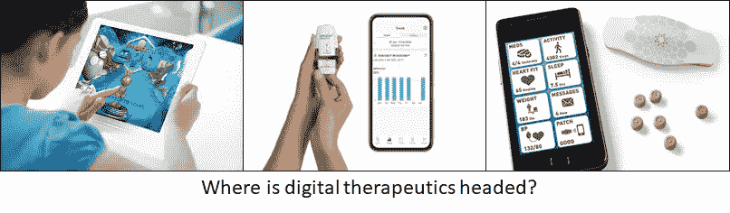

# 事物和想法 VI

> 原文：<https://medium.datadriveninvestor.com/things-thinks-vi-a1e584d60c39?source=collection_archive---------21----------------------->

在本期节目中，我们将通过创新生态系统、企业文化和市场成功的定义等不同主题来探讨一些相互联系的线索。快乐阅读！

## 创新政策、生态系统和一些差距

创业公司基因组发布了其 2020 年 [***全球创业公司生态系统报告***](https://startupgenome.com/report/gser2020) 。其成功生态系统的标准包括“在这些参数上，印度的生态系统似乎仍处于萌芽阶段。我们有两个生态系统，**班加罗尔**(排名第 26，比 2019 年下降了 8 位)和**德里**(排名第 36，新进入者)。虽然这样的报告和排名有其积极和消极的一面，但在全球初创企业生态系统中，印度似乎还有很长的路要走。

Source: GSER 2020

报告还谈到了“首尔创业生态系统的迅速崛起”，并对其投资策略、资金和组织网络进行了热情洋溢的描述。另一方面，政治发表了一篇关于其他因素如何影响创业公司和其他小企业成功的精彩分析。成功的大企业通常被称为在位者，在创新方面通常被认为是落后者。然而，在韩国，*财阀*(韩国类型的家族企业集团)作为快速追随者，在执行和运营能力方面表现出色，对当地的创新生态系统产生了令人沮丧的影响。结果-

> *财阀们只占了****10%的工作岗位，却占了 80%的市值和三分之二的出口*** *。最重要的是，中小企业的工资水平是压榨它们的财阀的 60%。*

## 企业创新呢？

几乎作为抑制创新的大公司的对比， [***大卫·罗森塔尔***](https://blog.dshr.org/2020/05/the-death-of-corporate-research-labs.html) 的这篇博客很好地诠释了阿罗拉等人关于创新生态系统和网络效应的研究论文。研究人员研究了美国的创新生态系统，在其最新版本中，该生态系统由“专注于研究的大学、专注于开发和商业化的大公司、&衍生公司、初创公司以及负责连接这两者的大学技术许可办公室”组成然而，在缺乏企业实验室研究(著名的“贝尔实验室”类型)的情况下，这在想法到市场的旅程中留下了缺口。潮流正在逆转，美国科技巨头正在稳步投资企业创新，所以也许还有一些希望？

## 数字健康:阿基利、普罗特斯和螺旋桨

Source: Akili Interactive, Propeller Health, Proteus Digital Health

我经常在 Things & Thinks 和其他地方写关于数字健康的文章(更多信息请见我的 [*媒体主页*](https://medium.com/@santosh_39555) )。过去几周这个地区比往常更加繁忙-

*   Akili Interactive 通过其数字疗法的 novo pathway 获得了美国 FDA 的批准。Akili 的 EndeavorRx 应该是一种针对注意力缺陷多动障碍(ADHD)儿童的交互式视频游戏疗法。他们似乎做了所有正确的事情，包括通过“关键、多中心、随机、盲法、对照临床研究”发表临床证据。
*   Propeller Health 是另一家提供基于传感器的药物治疗坚持方法的公司，其传感器数字健康平台与诺华公司的哮喘药物治疗相结合，获得了欧盟*的批准。*
*   *然而，在缺乏明确的支付途径的情况下，监管机构的批准可能意义不大。这一点在 Proteus Health 身上体现得很明显，该公司过去曾与几家制药公司合作，但*申请破产。显然，制药-数字治疗合作需要更多的时间(和实验！)才能称之为成功进入市场的经过检验的方法。**

## ****花絮****

*   **继续在家工作会让你感到失落吗？也许你需要这个[*【75 美元】的音叉-水晶组合*](https://shop.konmari.com/products/konmari-decor-konmari-tuning-fork-crystal-set-rose-quartz?variant=31174148653127&gclid=EAIaIQobChMIwpT09eWd6gIVBLLICh133wY9EAQYASABEgJ6GfD_BwE) (由玛丽·近藤设计)来“恢复平衡感”？！**
*   **公司在最初三到五年的失败率很高。然后挑战进入平台期。从各行业的平均水平来看，一家企业在第 25 年和第 10 年死亡的概率大致相同。**
*   **总结一下，这条微博-**

****

**Source: [@zhuowei](https://twitter.com/zhuowei)**

**像往常一样，很高兴听到你的反馈，评论，(和“掌声”和喜欢！)…**