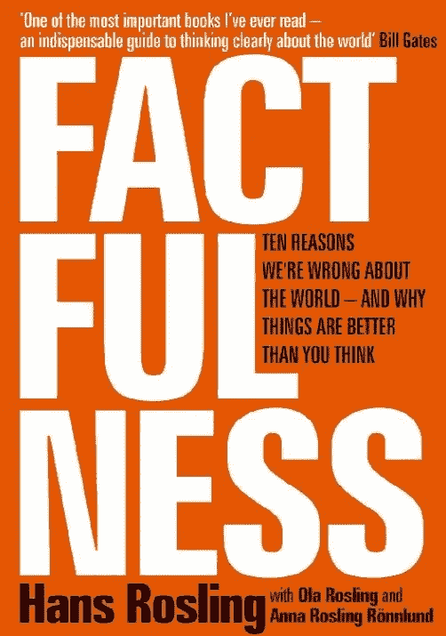
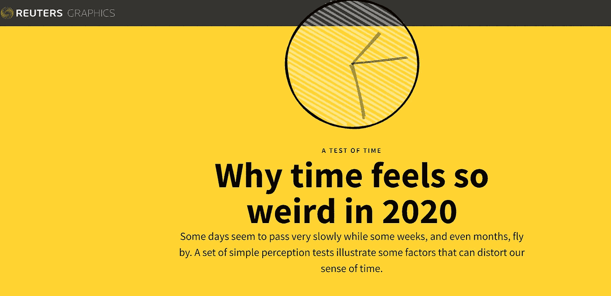

# 事物与思想 VII

> 原文：<https://medium.datadriveninvestor.com/things-thinks-vii-a3a77eef5cf2?source=collection_archive---------20----------------------->

在这一版中，我写了关于提高对印度药物/疫苗开发过程的普遍认识、最近一项关于移动健康应用使用的研究的发现，以及我最喜欢的一本书的摘录，最后还有一些花絮。快乐阅读！

## 印度，Covid 药物-疫苗开发和公共利益

在公元前(新冠肺炎之前)时代，大多数印度公众与他们消费的药物有交易关系，并且很可能没有太多兴趣，因此不了解药物审批系统是如何工作的。然而，在过去的几周里，媒体报道和社交媒体对这些话题的提及明显增加。

我认为这种兴趣在几周前达到了顶峰，当时印度生物医学研究的最高机构——印度医学研究委员会(ICMR)的领导人公开谴责了一封信。这封信是写给几个可能参与 ICMR 与一家知名疫苗制造商联合开发的本土疫苗试验的临床试验点的。这封信似乎鼓励( [***或基于谁在阅读它而进行胁迫或威胁***](https://thewire.in/health/icmr-balram-bhargava-covaxin-clinical-trials-bharat-biotech-politics) )这些网站进行试验活动并方便地招募患者以避免“严重后果”。一部分公众对一个月后疫苗上市的前景充满热情，但这种期望的气球很快被许多公共卫生专家和制造商本身打破，概述了疫苗开发的正常缓慢过程，专家们直接指责这种做法来自本应防止临床试验中道德不端行为的组织。

 [## 医疗保健行业的精益项目管理|数据驱动的投资者

### 有一个分类的项目管理程序制定了许多业务，可以属于一个…

www.datadriveninvestor.com](https://www.datadriveninvestor.com/2020/07/02/lean-project-management-in-healthcare/) 

对该领域的关注并未就此停止。由于法匹拉韦( [***【格伦马克】***](https://www.telegraphindia.com/india/scan-on-covid-drug-cost-claims/cid/1786810) )和伊托单抗( [***Biocon***](https://www.moneycontrol.com/news/business/companies/explainer-why-is-biocons-covid-19-drug-itolizumab-is-kicking-up-a-controversy-5556981.html) )等药物的简短试验和缺乏公布的结果，地方当局对监管审批提出了更多的问题。下一组问题也来了，询问这类药物的价值与它们在市场上的销售价格。虽然这些问题与媒体早先缺乏兴趣相比是一个可喜的变化，但对我来说，这也是印度当局明显缺乏尽职调查，他们应该首先寻找这些问题。

## 医疗保健、数字干预和用户参与

我一直对数字健康应用中用户参与的各种理论定义和现实世界影响感到好奇。在其他干预措施中，通过影响的时间性质(即干预时间和预期影响的关系)以及通过绘制努力与影响的关系图来测量相对容易，这在药物中最常见的是“剂量-反应曲线”。即使在这些情况下，因果关系也可能令人困惑，尤其是与所谓的混杂因素。

在移动应用等数字干预的世界里，我们如何处理这些问题？我们应该只考虑与应用程序使用和预期效果的时间关系吗？持续参与是什么样的——坚持使用应用程序？通过其他功能与应用程序进行交互？问题数不胜数。

[***最近一篇文章的作者***](https://jamanetwork.com/journals/jamanetworkopen/fullarticle/2768347?utm_source=For_The_Media&utm_medium=referral&utm_campaign=ftm_links&utm_term=071720) 通过对患有抑郁症和焦虑症的用户进行基于互联网的认知行为疗法的研究来探讨这个问题。他们对大量此类患者的分析表明，应用程序的参与和使用不是线性的、统一的现象。他们将用户群分为 5 个子类——低接合装置、后期接合装置、快速脱离的高接合装置、适度降低的高接合装置和最高接合装置。虽然整篇文章都是必读的，但这里有一些他们的发现-

> 我们根据超过 14 周的程序使用情况确定了 5 种不同的用户类型。这些亚型的使用模式表明，从与治疗的相互作用中获得的临床结果并不总是与花在该项目上的时间成比例。在超过 14 周的时间里，参与度适度下降的高参与度者更多地参与基于目标的活动和情绪跟踪，并访问许多核心模块，而参与度最高的参与者不太可能访问核心模块，而是使用放松和正念工具。

还有这个-

> 有效的参与可能不仅仅取决于对项目的绝对参与，还取决于患者参与的特定部分或元素。这反过来支持了活性治疗成分的观点，34 也就是说，任何治疗的成分都有经验支持，并可能影响治疗的变化。正是这些活性成分结合在一起形成了连贯的治疗

## 来自 2018 年的疫情警告

《真实》于 2018 年首次阅读，仍然是我读过的最有见地的书籍之一。这本书的整体基调和印象是关于我们与我们生活的世界的数据的互动，以及我们为什么应该保持乐观。在整本书中，汉斯·罗斯林一次又一次地展示了我们在看待生活水平、经济和感觉事情不顺利的各个方面的信号时所犯的错误。然而，他指出了我们应该担心的五个全球风险，其中第一个是——流行病！这是两年半前这本书出版时他写的-

> 像流感这样的空气传播疾病传播速度非常快，比埃博拉或艾滋病等疾病对人类构成更大的威胁。委婉地说，以各种可能的方式保护我们自己免受一种高度传播的病毒的侵害，并忽略各种类型的防御，这是值得努力的。….我们需要确保基本卫生保健覆盖所有地方的所有人，以便能够更快地发现疫情。我们需要世界卫生组织保持健康和强大，以协调全球应对措施。

## 花絮

*   你有没有感觉到自从疫情/禁闭周期开始以来，时间变得很奇怪？来自路透社的 [***这个互动解释***](https://graphics.reuters.com/HEALTH-CORONAVIRUS/TIME/gjnvwwjegvw/) 也许能帮你理解为什么！

*   来自 [***经济学家***](https://www.economist.com/science-and-technology/2020/07/08/this-years-aids-conference-has-brought-snippets-of-good-news) 关于艾滋病的一些好消息:包括博茨瓦纳、柬埔寨、卢旺达、赞比亚和津巴布韦在内的 14 个国家报告说**他们已经达到 90:90:90 的目标**。其中两个国家，瑞士和埃斯瓦蒂尼(前斯威士兰)报告 95:95:95，这实际上是 2030 年的目标。
*   我喜欢骑自行车(尽管由于封锁，我已经有几个月没有骑自行车了:)，当我得知 [***骑自行车极大地推动了女权运动***](https://www.youtube.com/watch?v=LPLJgkVsXpE) 时，我更加喜欢它了！

一定要让我知道你的反馈和意见；如果你喜欢的内容，请做‘拍手’！

**访问专家视图—** [**订阅 DDI 英特尔**](https://datadriveninvestor.com/ddi-intel)