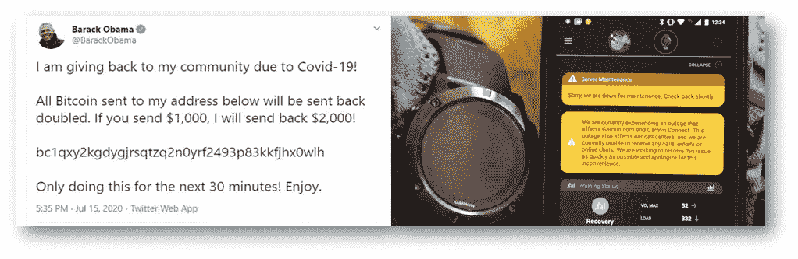
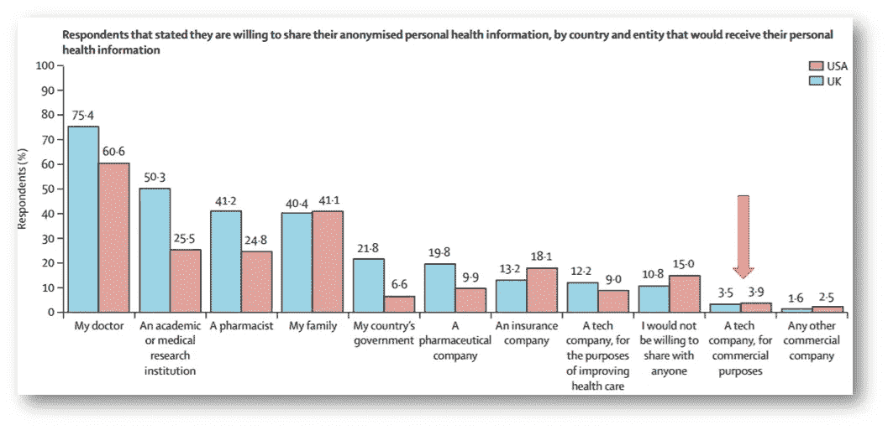
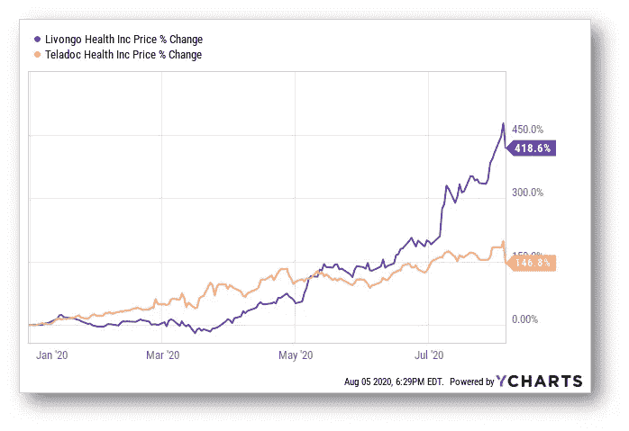

# 事物与思想 VIII

> 原文：<https://medium.datadriveninvestor.com/things-thinks-viii-4cac1f336aeb?source=collection_archive---------10----------------------->

Image by [MichaelGaida](https://pixabay.com/users/MichaelGaida-652234/?utm_source=link-attribution&utm_medium=referral&utm_campaign=image&utm_content=3394375) from [Pixabay](https://pixabay.com/?utm_source=link-attribution&utm_medium=referral&utm_campaign=image&utm_content=3394375)

我的这期双周刊时事通讯收集了 Twitter 黑客和 Garmin 勒索软件、Teladoc-Livongo 合并、印度国家卫生栈以及经常令人困惑的成为专家问题的共同线索。快乐阅读！

## 黑客、信息安全和医疗保健

过去几周科技公司的日子不太好过。到目前为止，每个人都知道有一个巨大的 Twitter 黑客攻击，影响了包括埃隆马斯克，奥巴马和盖茨在内的高调 Twitter 账户。一周之内，消费者可穿戴/活动跟踪器公司 Garmin 报告了一次勒索软件攻击，据报道金额达 1000 万美元。

这种对数据安全的威胁对医疗保健来说也不是什么新鲜事；根据 [***Protenus 漏洞晴雨表***](https://www.protenus.com/resources/2020-breach-barometer/) 的数据，2019 年有超过 4100 万份患者记录被攻破，其中报告的黑客事件激增约 48%。印度医疗保健在 2019 年尝到了这种攻击的滋味，当时印度一家医疗保健网站遭到黑客攻击，[***680 万份患者记录***](https://health.economictimes.indiatimes.com/news/industry/hackers-attack-indian-healthcare-website-steal-68-lakh-records/70781751) 被盗。

 [## 医疗保健行业的螺旋式项目管理方法|数据驱动的投资者

### 项目管理就是将知识、技能、工具和技术应用到活动中，以…

www.datadriveninvestor.com](https://www.datadriveninvestor.com/2020/08/04/spiral-project-management-methodology-in-healthcare/) 

网络安全专家认为，医疗保健技术特别容易受到攻击，因为医疗保健专业人员对此类问题的认识较低。多因素身份认证、零特权和可疑活动的算法检测可能是一些基本工具，应该是一些最基本的信息安全工具，我们都应该开始适应。有如此多的利害关系，难怪人们对与科技公司分享甚至匿名的数据都持谨慎态度…

Source: S Ghafur et al; Lancet Digital Health Jul 2020

## 医疗保健走到一起？

医疗保健行业的合作、整合、兼并和收购继续加速，呈现出各种色调和颜色，包括纵向和横向协同效应，扩大市场定义和创造新市场。这是一些最新的例子-

*   药房福利管理公司 CVS Caremark 通过向其点解决方案管理服务添加 5 个解决方案 ，扩展了其数字健康实施 [***。这是一个有趣的模型，有助于 PBMs 成为一个中间机构，类似于他们在管理传统药物的市场准入方面的作用。***](https://medcitynews.com/2020/07/cvs-builds-out-digital-health-program-with-five-more-companies/)
*   最成功的远程数字健康管理公司之一 Livongo 和美国远程医疗巨头 Teladoc 同意合并(然而，Teladoc 保留了自己的首席执行官和董事会成员的 8-5 比例，这看起来更像 Teladoc 收购 Livongo)。合并后的单位的愿景是“为以消费者为中心的虚拟医疗服务创建一个综合平台”。时间会证明这是否会发生，然而两家公司的投资者都不太高兴- ***Teladoc 的人认为交易规模过大，Livongo 的人认为这意味着增长率较低。***

Stock prices of Teladoc and Livongo crashed after the deal was announced; Source-SeekingAlpha

*   在印度前线，一个不同的故事正在上演。备受关注的国民健康体系正在形成， [***私人参与者***](https://www.medianama.com/2020/07/223-health-stack-swasth-alliance-livehealth-ispirt/) 对这一体系产生了浓厚的兴趣。也有关于药品市场整合的讨论，当然[***Reliance***](https://economictimes.indiatimes.com/small-biz/startups/newsbuzz/with-ril-eyeing-netmeds-deal-epharmacy-in-for-consolidation/articleshow/77341675.cms?from=mdr)也在考虑这个领域…

## 谁有“技术”手册？

Siva Vaidhyanathan 的这篇连线文章确实引起了我的共鸣——他写道，在当今复杂的技术环境下，任何人都很难成为“技术专家”。整篇文章都是可读的，但这里有一些很酷的摘录-

> 1787 年，我们决定由公民来统治我们，而不是由牧师、教授或专业人士来统治。我们不坚持要求国会中的每个人都理解 B2 精神“隐形”轰炸机是如何工作的，或者血清素再摄取抑制剂是如何帮助管理抑郁症的，甚至是内燃机是如何工作的。然而，我们有理由期待我们的政府对它们进行监管。

这一个-

> 当我们看到谷歌和脸书让我们失望并把我们引入歧途的无数方式时，让我们记住没有人有手册。没有人完全理解这些系统，即使是在它们诞生时设计它们的人。让谷歌和脸书与众不同且有用的算法曾经令人印象深刻，但现在却是基本的，它们早已被更复杂、更不透明的数据集和机器学习所掩盖。对于监管者、记者和学者来说，它们不仅仅是黑匣子。对于在那里工作的工程师来说，它们就是黑匣子。

我认为我们可能还没有在许多其他领域实现技术改造，特别是在医疗保健领域，但是随着医疗保健技术的进步，也许有一天我们也不再有手册了？

## 花絮

*   [***对于电晕疫苗，存在着一场考虑不周的、危险的准入竞赛***](https://www.ft.com/content/99f167ea-875b-4add-b3e2-749d208619f6)--“由此产生的拼凑协议提出了关于全球疫苗准入的重大问题，并引发了关于定价、供应安全和可能副作用的责任的争论。”
*   微软 Excel 是 [***基因更名***](https://www.theverge.com/2020/8/6/21355674/human-genes-rename-microsoft-excel-misreading-dates) 的幕后推手！
*   在 8 周的时间里，德国的 80，000 家医疗机构无法通过安装在他们办公室的远程信息处理系统(Telematik-Infrastruktur，或 TI)访问来自付款人的患者索赔/遭遇数据'[***@ Lisa Bari***](https://twitter.com/lisabari/status/1285499291092606977)

你觉得这份时事通讯怎么样？通过评论(和“鼓掌”)留下您的反馈！)

**访问专家视图—** [**订阅 DDI 英特尔**](https://datadriveninvestor.com/ddi-intel)