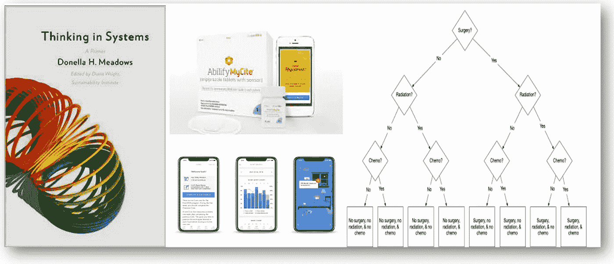
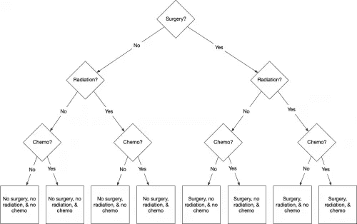

# X 事物和想法

> 原文：<https://medium.datadriveninvestor.com/things-thinks-x-d035c902e9db?source=collection_archive---------26----------------------->

这是《Things&Thinks&的第十版,它几乎完全专注于医疗保健问题——涵盖系统思维、一些新闻分析和病人的视角，以一些花絮结尾。希望你喜欢这个选择！

## 系统思维与医疗保健

在上一版中，我写了 Donella H. Meadows 的书《系统思维:入门》；我读完了这本书，并继续思考系统、信息流、系统中的参与者和医疗保健。像上次一样，我从书中摘录了一些关于系统如何给我们带来惊喜的内容来标记我的思考-

*   **系统中的许多关系都是非线性的。反馈系统中的非线性产生循环优势的转移和系统行为的许多复杂性。**这随后反映在由于患者人口统计学、不良操作效率实验的不规则结果等导致的不同结果中。

 [## 医疗保健行业的螺旋式项目管理方法|数据驱动的投资者

### 项目管理就是将知识、技能、工具和技术应用到活动中，以…

www.datadriveninvestor.com](https://www.datadriveninvestor.com/2020/08/04/spiral-project-management-methodology-in-healthcare/) 

*   **系统结构是系统行为的来源。随着时间的推移，系统行为表现为一系列事件。我们对它们产生的事件太着迷了。我们对他们的历史关注太少。我们没有足够的技巧在他们的历史中发现行为和事件发生的结构线索。** *从针对慢性病的疾病治疗模式到针对严重事件的服务导向，我们随处可见这一点——强调事件而非系统参与者的行为；我们现在才开始意识到，也许我们也需要注意随着时间的推移导致这些事件的行为变化。*
*   **系统中每个参与者的有限理性——由影响该参与者的信息、激励、抑制、目标、压力和约束决定——可能会也可能不会导致促进系统整体福利的决策。如果他们不这样做，将新的参与者放入同一个系统也不会提高系统的性能。有所作为的是重新设计系统，以改善对特定行为者有影响的信息、激励、抑制、目标、压力和约束。对已经不堪重负的系统添加额外的修复措施，对于那些曾经关注过医疗保健创新项目的人来说，听起来一定很熟悉！**

我将在下一版中写下我从这本书中学到的最有趣(也是最实用)的一个方面。

## 独角兽、遵守和法规

这是我在数字健康新闻中看到的-

*   **Proteus health care**2020 年 8 月，药丸传感器独角兽公司倒闭；价值 15 亿美元并因获得 FDA 批准而轰动一时的 Proteus 被日本制药公司 Otsuka 及其前合作者 [***以 1500 万美元的微薄价格选中。*** 技术本身的有效性是有问题的，进入市场的道路是混乱的——这增加了医疗创新领域的每个人在接近市场之前应该已经掌握的知识。](https://www.fiercepharma.com/drug-delivery/otsuka-s-15m-purchase-smart-pill-developer-proteus-wins-court-backing-despite)
*   在监管方面，英国宣布创建一个名为 [***UKCA(英国合格评定)***](https://www.gov.uk/guidance/using-the-ukca-mark-from-1-january-2021) 的新产品标志，该标志将在英国退欧后取代 ce 标志，北爱尔兰除外。对于数字健康公司来说，这是一个新的挑战，但在大多数情况下，如果设备已经有 CE 标志，那么在 2022 年 1 月 1 日之前似乎会有一个过渡时间。
*   **Pear Therapeutics** 在查看了他们在慢性失眠中的数字认知行为疗法的用户旅程数据后，发布了有趣的数据。他们特别注意思考 [***为什么数字干预***](https://peartherapeutics.com/pear-therapeutics-announces-data-from-two-studies-evaluating-somryst-for-chronic-insomnia-presented-at-virtual-sleep-2020/) 的患者会中途退出，并尝试使用患者参与度特征来预测退出率。正如我之前提到的，数字医疗领域很少有人关注这些数据，而没有意识到这些见解对产品开发和商业化的价值和影响。
*   Rahul Mathur 写了印度医疗保险如何与新兴技术结合的新兴场景。**印度保险监管机构，**在其沙盒倡议中，为 [***提供了关于将激励措施纳入这些早期试验的进一步指导***](https://www.irdai.gov.in/ADMINCMS/cms/whatsNew_Layout.aspx?page=PageNo4236&flag=1) 。

## 决策——病人的观点

在过去的几年里，医疗保健领域的一个流行词是“以病人为中心”*；大多数情况下，这意味着将患者作为各种医疗保健系统工作的主要利益相关者。我不时会读到一个故事，它真实地展现了病人是如何看待并发症的，以及在这方面还有多少工作要做。*

*比尔·加德纳是一位受人尊敬的精神病学研究者和医疗保健经济学家，在被查出患有癌症后，他写了 [***这样一篇文章，作为他经历***](https://theincidentaleconomist.com/wordpress/treating-cancer-so-many-decisions/) 的一部分。对我来说，有两个方面非常突出-*

**

*Bill Gardner’s depiction of his treatment choices; Source: Incidental Economist*

*   *在比尔的案例中，由于癌症的性质，他不得不会见三位不同的专家；凭借他的科学和更重要的医疗保健背景，他以系统的逻辑方式思考他的治疗方案。 ***不确定有多少病人有这个能力？我们如何帮助他们带领他们走过这段旅程？*** 其他场景下的决策可能会变得更加复杂，甚至复杂的决策树也不一定有帮助。有哪些工具可以帮忙？*
*   *比尔注意到决策的一个重要方面- ' ***医疗决策总是以孤立患者的利益和信念为框架。*** 但我不仅仅是我。我有配偶，是 5 个孩子的父母(尽管现在已经成年了)。”*

*一个真正非凡的阅读！*

*花絮*

*   *真的很喜欢这个 [***保罗·格拉厄姆推文***](https://twitter.com/paulg/status/1300018054240317440)——“在很多不同的领域，外人高估了想法的价值，低估了执行的难度。因此，对于学习任何新领域来说，问“为什么执行比外人看来更难？”可能是一个好策略'*
*   *[***这个来自 2015 年的 TED 演讲***](https://www.ted.com/talks/tony_fadell_the_first_secret_of_design_is_noticing) 非常有用——谈论了注意的力量，观察需要什么以及我们从中获得了什么！*
*   *米尔肯研究所已经 [***编制了一个追踪器***](https://covid-19tracker.milkeninstitute.org/) ，为新冠肺炎整理所有正在研发的治疗方法和疫苗的信息。*

*我将很高兴听到你的反馈，评论，(和“掌声”和喜欢！)…*

***进入专家视角—** [**订阅 DDI 英特尔**](https://datadriveninvestor.com/ddi-intel)*