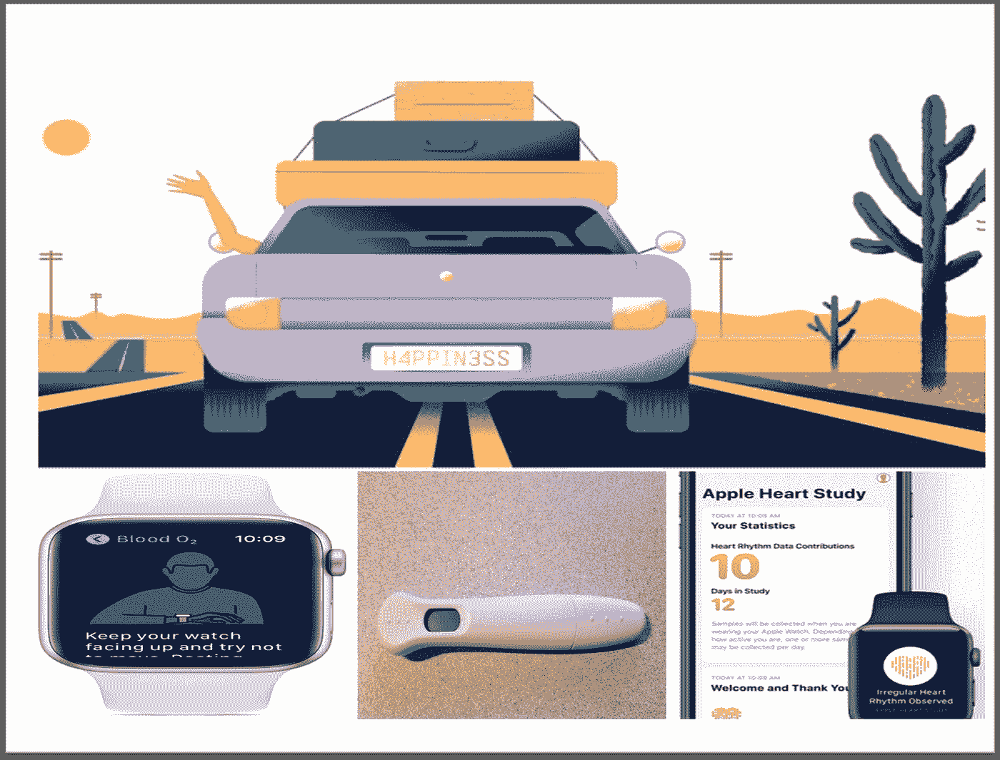
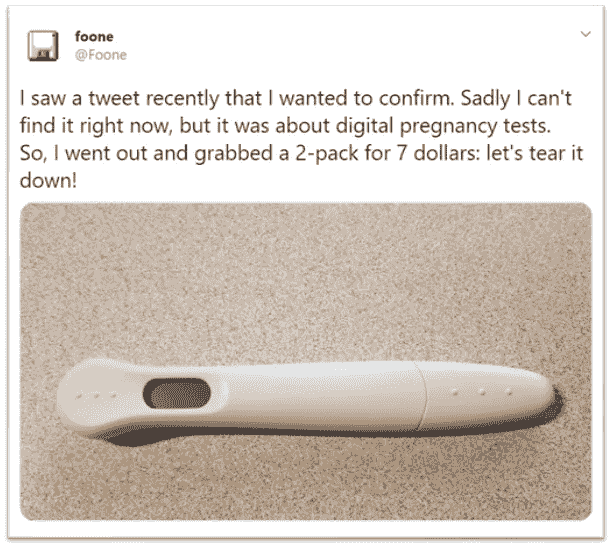
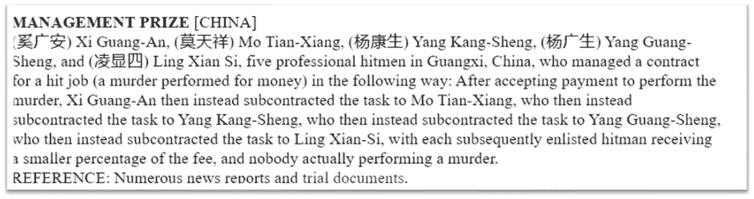

# 事情& Xi 认为

> 原文：<https://medium.datadriveninvestor.com/things-thinks-xi-db4ab0e3da94?source=collection_archive---------27----------------------->

Credits: Guardian, Apple, @Foone

在《Things&Thinks&Thinks**第十一版**中，我整理了关于数字健康产品漫长的市场之路的想法，对“数字”怀孕工具包的奇妙解构，以及奥利弗·伯克曼的一些思考。结尾有一些有趣的花絮；快乐阅读！

## 数字健康新闻-漫长的市场之路！

过去几周，传感器驱动的移动医疗技术一直是新闻焦点。当然，到现在大家都知道 [***苹果给 AppleWatch 增加了新的功能，包括血氧测量***](https://support.apple.com/en-us/HT211027) 。虽然这种能力存在于苹果的竞争对手中，但苹果似乎通过更好的传感器增强了检测能力。苹果也将从一体化平台中获益。

Fitbit 获得了美国 FDA 的 510(k)许可——这并不是第一个进入市场的产品，尽管如此，它还是为这家健身追踪公司不断增长的健康传感器系列增添了一员。

这对病人和医生意味着什么？医疗保健创新面临的挑战是巨大的:找到正确的市场并开始产生影响，即使你的产品正在做它声称正在做的事情。

 [## 这么说一家大型风投基金正在投资你的初创公司？4 实际考虑|数据驱动的投资者

### 首先，恭喜你。融资总是需要努力的，一个大的风险投资基金当然是一个大的…

www.datadriveninvestor.com](https://www.datadriveninvestor.com/2020/08/09/so-a-big-vc-fund-is-investing-in-your-startup-4-practical-considerations/) 

我想到两个最近的例子-

*   在苹果心脏研究中研究苹果心电图传感器实施的苹果研究人员对此非常了解。这项研究想要评估经常未被发现的房颤，而晚发现可能会有更严重的变异。共有 420，000 名参与者以非常非传统的方式加入了这项研究，全部通过苹果健康平台进行。捕捉是在下一阶段——大约 2200 名参与者收到了关于可能的 AFib 的通知。然而，只有 945 名参与者进行了随访研究。参与这项研究的斯坦福医生 Turakhia 博士的这些想法非常有意义

> 让病人参与进来并不容易。**你不能一直给他们发送通知和推送提醒，提醒他们在研究中这样做。那么，我们如何激励他们呢？我们如何以一种有意义的方式，但以一种可推广的方式做到这一点？**

*   第二个这样的观察来自欧盟方面，杰西卡·舒尔，数字治疗联盟的欧洲领导人-

> 我们看到的是那些有这些框架的国家，产品已经被批准，它们被证明是有效的，它们甚至被证明有健康的经济数据，但是医生仍然没有以我们希望的速度开处方。

## 解构“数字”创新

自称硬件/软件死灵法师的@foone 解构了一个“数字怀孕测试”,接下来是对现有解决方案看似简单的修复如何增加价值的精彩解读。原来“数字”测试实际上有一个简单的非数字传统测试条，“数字部分，电池，IC，led 和光电二极管的全部意义在于读取线条，告诉你“怀孕”和“未怀孕”，而不是“||”或“|+”

一定要看完整个帖子！

## 肿大和轻微不适

《卫报》专栏作家奥利弗·伯克曼(Oliver Burkeman)， [***对普遍福祉有精彩的思考，***](https://www.theguardian.com/lifeandstyle/2020/sep/04/oliver-burkemans-last-column-the-eight-secrets-to-a-fairly-fulfilled-life)；有两个让我印象深刻-

*   当被生活的选择难倒时，选择“扩大”而不是快乐- 重大的个人决定不应该问“这会让我快乐吗？”，而是“这个选择会放大我还是缩小我？”我们很难预测什么会让我们快乐:这个问题很快就陷入了我们对安全和控制的狭隘偏好中。但扩大问题引发了更深刻、更直观的回应。
*   **每个人都完全是在即兴发挥-** 要吸取的教训不是我们注定会陷入混乱。那就是你——不自信、自我意识强、非常清楚自己的缺点——和其他人一样，有潜力为你的领域或世界做出贡献。

## 花絮

*   使用人工智能(AI)的临床试验干预现在在 SPIRIT-AI & CONSORT-AI 中有 [***标准化协议和报告***](https://www.clinical-trials.ai/) 指南。
*   随着我们开始适应数字健康，数据安全威胁正在增加-[***2019 年，只有 44%的医疗保健机构***](https://www.healthcaredive.com/news/CynergisTek-healthcare-cybersecurity-compliance-2019/585442/) 符合国家网络安全标准。
*   搞笑诺贝尔奖 2020 于上周揭晓——尽管几乎所有的参赛作品都值得一读(和娱乐)，但管理类作品却独占鳌头！

期待大家的评论、想法和喜欢！

**进入专家视角—** [**订阅 DDI 英特尔**](https://datadriveninvestor.com/ddi-intel)