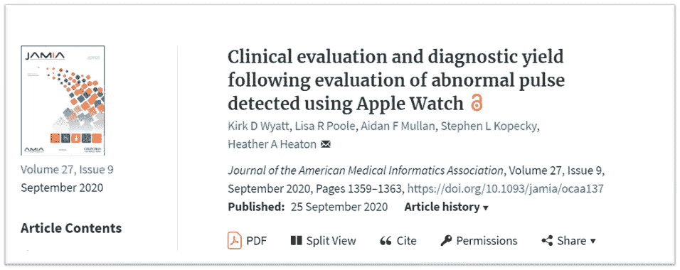
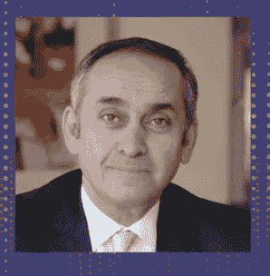
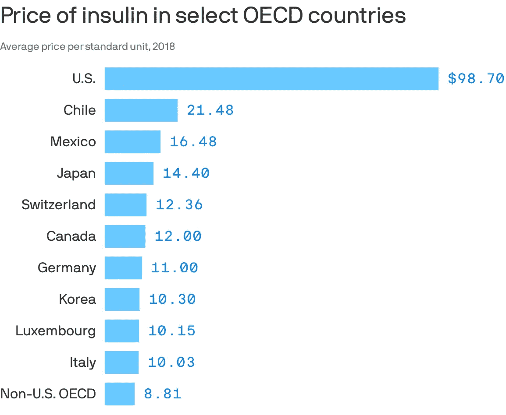
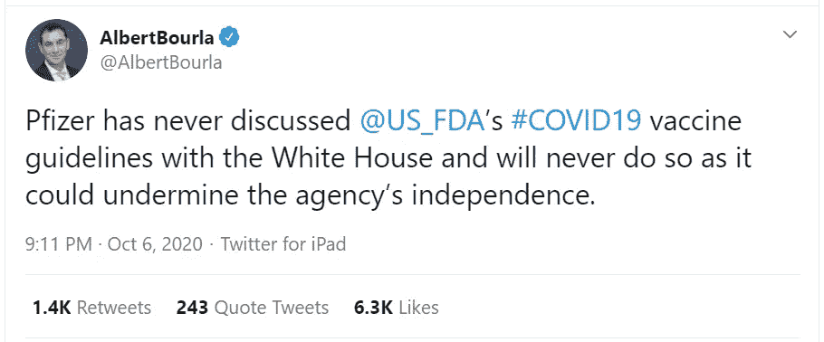

# 事物与思想十二

> 原文：<https://medium.datadriveninvestor.com/things-thinks-xii-e55289969a57?source=collection_archive---------15----------------------->

有了新设计的横幅，我很高兴推出第**12 版**Things&Thinks with digital health news，和两个关于医疗保健系统的故事，都有关于设计、创新和实施的线索。从这一版开始，花絮部分看起来也不一样了！我将很高兴听到您的反馈…

## 数字健康新闻-新市场、新伙伴关系和新欺诈！

[***Rock Health 报道***](https://rockhealth.com/rock-weekly/q3-funding-bonanza-drives-largest-annual-deal-volume-ever/) 到 2020 年第三季度，2020 年*已经是*数字健康有史以来最大的资助年；仅美国的数字健康初创公司就在第三季度获得了 40 亿美元的投资，使今年迄今为止的 311 笔交易的总融资额达到 94 亿美元。即使我们认为由于医疗创新的高失败率，这些投资中的一部分会付诸东流，我们也可以对信噪比的提高抱有希望？！

合作/收购场景也相当活跃- [***Amwell 宣布与 Tyto Care***](https://business.amwell.com/press-release/amwell-expands-partnership-with-tyto-care-to-extend-healthcare-at-home/) 合作，从而通过 Tyto 的联网远程设备增强了他们的远程医疗能力，这些设备可以提供生物特征数据以获得实时见解，有望为患者带来更好的互动和护理。联合健康集团(UHG)，全球最大的医疗保健组织之一， [***以 3 亿美元 ***收购 divydose******](https://www.cnbc.com/2020/09/29/unitedhealth-acquires-divvydose-an-amazon-pillpack-competitor.html?mc_cid=8e98335211&mc_eid=e9a98874b5)*。考虑到像 UHG 这样的大型组织可以很容易地在内部开发 DivvyDose 功能，分析师还不清楚这里的价值主张。*

*虽然这种繁忙的活动受到欢迎，但欺诈和数据安全的挑战仍然是一个主要问题。美国联邦机构指控 100 多家供应商和 4 名远程医疗高管向付款人 提交了超过[***60 亿美元的欺诈索赔。同时，临床试验机构有***](https://oig.hhs.gov/newsroom/media-materials/2020takedown/) ***[***举报勒索病毒攻击***](https://www.nytimes.com/2020/10/03/technology/clinical-trials-ransomware-attack-drugmakers.html) ***。*** 无论是现有组织还是初创公司，每个人都需要更加关注这个问题，并为他们的产品和服务调整安全设计方法。****

* [## 新的健康技术如何让我们活过 100 岁？数据驱动的投资者

### 不久前，我们都在看一台黑色电视，不得不带着天线跑遍整个公寓，以确保…

www.datadriveninvestor.com](https://www.datadriveninvestor.com/2020/08/12/how-new-health-technology-makes-us-live-past-100-years/)* 

## *将数字创新融入医疗保健系统*

**

*[***事情中提到&认为 Xi***](https://medium.com/datadriveninvestor/things-thinks-xi-db4ab0e3da94)*随着 Apple Watch 中 SPO2 功能的推出，它已经成为一个传感器强国。然而, [***发表在《美国医学信息学协会杂志》上的***](https://academic.oup.com/jamia/article/27/9/1359/5911974?mc_cid=8e98335211&mc_eid=e9a98874b5) 新研究表明，新的能力可能并不立即意味着更好的结果。在一项回顾性研究中，研究表明，大约需要 7 名患者在出现异常脉搏警报后才能确定一项临床可行的心血管诊断。这当然会给卫生保健系统带来额外的负担，尤其是在资源匮乏的情况下。**

**在印度方面，全球个人心电图设备的先驱 AliveCor， [***在印度市场推出了两款心电图设备***](https://www.alivecor.com/press/press_release/alivecor-brings-worlds-only-six-lead-fda-cleared-personal-ecg-to-india/) 。虽然印度的慢性心血管问题是 AliveCor 的正确选择，但该设备的价格和价值主张可能不适合大多数人。考虑到从 Apple Watch ECG 和 O2 体验中获得的经验，AliveCor 如何帮助整合已经支离破碎的印度医疗保健生态系统将是一件有趣的事情。**

## **伦敦中风倡议-医疗保健系统，创新和领导的传播**

****

**Dr Ara Darzi**

**我是通过《新英格兰医学杂志》对在这项工作中发挥了重要领导作用的外科医生阿拉·达尔齐、勋爵的采访偶然发现这个故事的。这确实是一个关于医疗保健系统的迷人故事。**

**这是这个故事的一个简要介绍-**

*   **2010 年之前，伦敦有 34 家医院提供急性中风护理，每家医院每年接收约 150 至 450 名中风患者。**
*   **这个系统有几个问题——不能平等地获得专家的评论和指导，对指南的坚持程度不一，不能使用包括成像和药物在内的最新创新技术。**
*   **Darzi 博士领导了一个多学科团队，以一种令人着迷的建立信任和透明的方式创建了超急性卒中单元(HASUs ),该单元将治疗伦敦所有早期(最初 72 小时)急性卒中患者。**
*   **随着这一变化，急性卒中后患者的死亡率在事件发生后 3 个月下降了 25%，而治疗每位卒中患者的成本在同一时间点降低了 6%。**

**这是一个真正非凡的故事，Darzi 博士提到的一些轶事确实是很好的教训，告诉我们如何在一个相互关联的系统中整理相互竞争的利益，如何思考实际护理方面与护理指南，最重要的是，如何将患者安全和护理质量作为系统中任何变化/创新的核心。这句话总结了所有这些想法-**

> **我们需要一个过程，在这个过程中，当我们评估一项新技术或一项新创新或一项新的颠覆时，我们不仅需要看技术，还需要看整个路径的重新设计，如果你想从创新中创造最大价值的话。**

## **花絮**

*   ****两周医疗保健图表:**美国任何类别的胰岛素产品的价格总是比其他国家的价格高(通常高五到十倍)。**

****

**Credit: [RAND](https://www.rand.org/pubs/research_reports/RRA788-1.html?utm_source=newsletter&utm_medium=email&utm_campaign=newsletter_axiosvitals&stream=top)/Axios**

*   ****两周医疗保健推特:**在所有新冠肺炎疫苗政治中，大型制药公司坚持监管标准的公开立场确实是一个受欢迎的迹象。**

****

## **访问专家视图— [订阅 DDI 英特尔](https://datadriveninvestor.com/ddi-intel)**