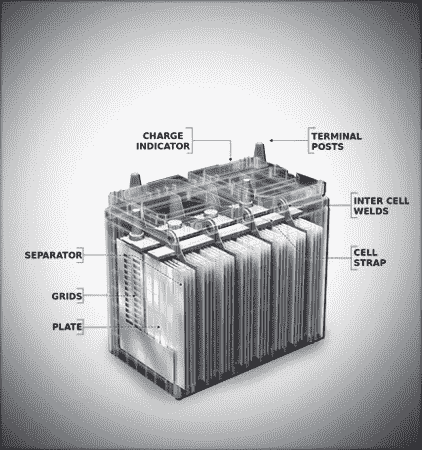

# 购买电池时需要考虑的事项

> 原文：<https://medium.datadriveninvestor.com/things-to-consider-while-buying-a-battery-3840b43d47ab?source=collection_archive---------14----------------------->

**退房:** [**星崎屋**](https://starbatteryhouse.com/)

> **购买新电池时，请检查以下内容**

检查你当前电池的状况，你的电池是否真的没电了。有时，你的车辆的电气系统可能会有问题。因此找出问题的根本原因(打电话给我们或你的机械师，做一次 [**电池健康检查**](https://starbatteryhouse.com/product/car-batteries/) 以找到问题的根本原因)。

请参考车辆手册中制造商推荐的电池组尺寸。电池组尺寸表示最适合您的车辆物理尺寸的电池尺寸。许多车辆可以容纳一个以上的群体规模。正确的电池尺寸应该完全适合您的电池托盘，以防止进一步的损害。

在安装新电池之前，请检查车辆的电气系统

检查起动电压，它应该高于蓄电池端子上的 9.8 伏。如果你生活在寒冷地区，一定要选择带 CCA(冷启动电流)的电池。

检查交流发电机充电电压。蓄电池端子间的电压应在 13.8 伏至 14.5 伏之间

> **检查新鲜度**

学习解读电池日期代码。你的电池里会有一个由数字和字母组合而成的代码。或者请你的电池零售商确保你购买的是“最新鲜”的电池。长时间搁置的电池可能会失去一些电量，可能无法提供您第一次使用时所需的性能。当你走进电池商店购买电池时，你可以避免这些事情。 ***切勿购买制造日期超过 6 个月的电池。*** 然而，长期性能可能不会受到影响，因为电池可以通过车载充电或使用外部充电器恢复到其原始性能水平。

> **寻找无忧保修**

***保修是否在全印度有效*** 允许您在任何地方获得服务？

***免费更换期多长？这将帮助你在要求免费更换时避免任何意外。确保选择长期免费更换的电池(3-5 年)。***

> 不仅要考虑价格，还要考虑价值

你可能想要得到专业的建议，为此你可以走进最近的电池商店。他们将为您提供帮助，以及无障碍的安装和服务。永远记得在你现有的电池失效之前购买一个新电池。

在你开始一次长途旅行之前，或者在你的汽车维修后，确认你的电池已经过测试。定期监控您的电池；它会帮助你在被一个没电的电池诅咒之前买一个新电池！。这将避免你的大量时间和金钱。务必了解适合您应用的电池型号。务必检查产品选型表，检查为您的车辆/应用指定的电池型号，然后购买电池。

> **考虑旧电池处置**

请确保除了将电池存放在当地经销商/制造商/注册回收公司/进口商/回收公司或指定的回收中心之外，不要以任何方式处理电池。更重要的是，作为一个负责任的公民，你会得到报酬！ 您的经销商将向您支付没电电池的费用或从新电池价格中扣除！