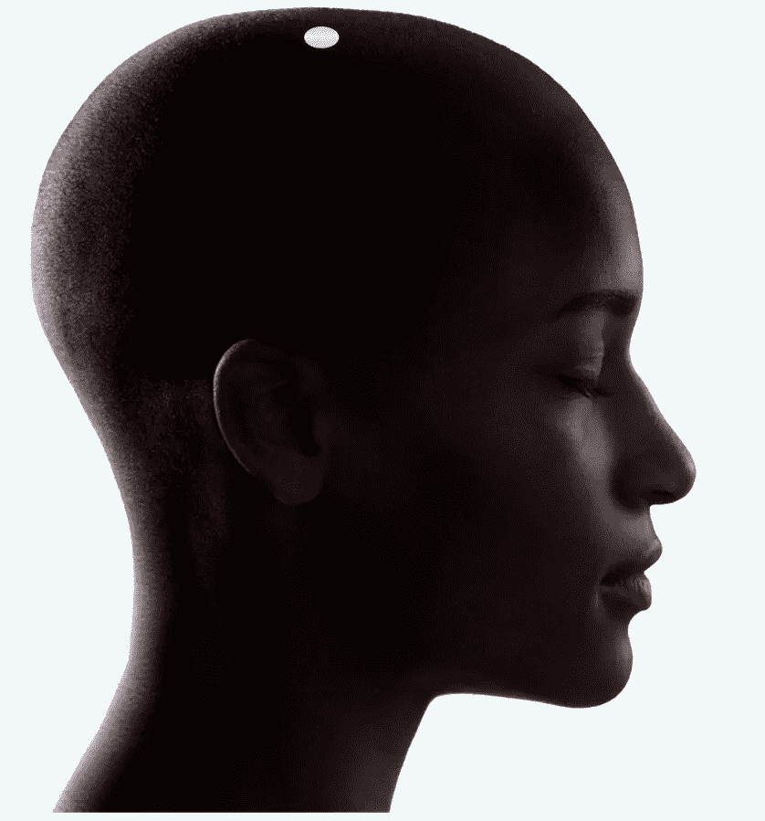
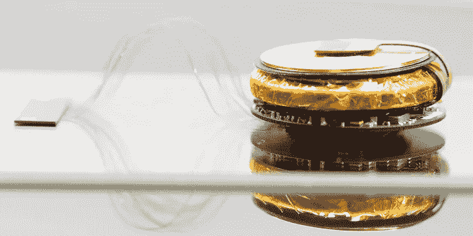

# 关于你未来大脑的 5 件事

> 原文：<https://medium.datadriveninvestor.com/things-to-know-about-your-future-brain-neuralink-a116302080ae?source=collection_archive---------17----------------------->

Screenshot (Source: [Neuralink](https://neuralink.com/))

如果你仍然认为我们远远落后于创造我们在电影中看到的技术(或)我们曾经梦想过的技术。那你可能错了。

科学和技术已经准备好入侵人类生活的下一个十年。像人工智能和机器学习这样的技术正在为更好的生活发展设定高标准。

已经有 [AI 机器狗在网上生产销售](https://shop.bostondynamics.com/spot?cclcl=en_US&pid=aDl6g000000XdpZCAS)

 [## 创造人工智能机器狗背后的公司和旅程

### 这是否意味着机器人帝国的开始？

medium.com](https://medium.com/@thakur.rahulsingh1997/the-company-and-the-journey-behind-creating-ai-robot-dogs-6ef82ede0686) 

AI 创造的另一个优秀例子是 Neuralink。

整篇文章基于最近的 Neuralink 直播流，这里提到的要点来自这个视频:-

# neural ink——未来的大脑

Screenshot (Source: [Neuralink](https://neuralink.com/))

Neuralink 是一家神经技术合作公司，开发无线芯片作为大脑接口。Neuralink 技术可以让人类治愈疾病，与机器人竞争。

这是一种旨在植入人脑的无线芯片技术。这种芯片使用电信号来了解人体，它正在工作。它被开发来治疗医学问题，并仅使用我们的大脑与其他设备进行通信。

Neuralink 的创始人是[埃隆·马斯克](https://www.google.com/url?sa=t&rct=j&q=&esrc=s&source=web&cd=&cad=rja&uact=8&ved=2ahUKEwilqrX4k_jrAhWcILcAHYgkD9oQmhMwMHoECA0QAg&url=https%3A%2F%2Fen.wikipedia.org%2Fwiki%2FElon_Musk&usg=AOvVaw3selC4uTI0I48OniaEb08T)，他在 2016 年开始了这个项目。人们在 2017 年和两年内注意到了这一点。它引起了许多人和科学家的注意。

与 Neuralink 有关的一次埃隆·马斯克说

> 随着时间的推移，我认为我们可能会看到生物智能和数字智能更紧密的融合

埃隆·马斯克是一个非常乐观的人，他认为，人工智能可以让人类生活变得更好，并将以一种好的方式对我们的世界产生影响。

在这篇文章中，我想分享你可能没有听说过的关于“Neuralink”的四件事。

 [## 未来科技:Neuralink 更新|数据驱动的投资者

### 8 月 28 日，埃隆·马斯克提供了他的公司 Neuralink 的最新进展，该公司旨在创造植入式…

www.datadriveninvestor.com](https://www.datadriveninvestor.com/2020/09/03/futuristic-tech-neuralink-update/) 

# Neuralink 的技术可以治愈一切

现在说一个芯片能治百病还为时过早。但是，如果你看看当前的现实与 Neuralink，它正在开发治愈:-

*   失明
*   聋
*   麻痹
*   记忆
*   中风

一旦成功，这种芯片仍有可能治愈一系列疾病。

因为 Neuralink 致力于理解大脑信号。如果一个设备能够理解并解决你大脑中的问题。然后，有许多疾病和残疾可以用大脑治愈，因为像脊髓这样的重要身体部位是根据我们的大脑信号工作的。

# 你甚至可以打败机器人

Photo by [Andy Kelly](https://unsplash.com/@askkell?utm_source=unsplash&utm_medium=referral&utm_content=creditCopyText) on [Unsplash](https://unsplash.com/s/photos/robots?utm_source=unsplash&utm_medium=referral&utm_content=creditCopyText)

Neuralink 的另一个目的是将人类与智能手机等其他设备连接起来。没有说一句话或采取任何行动。我们可以通过大脑发送信号来操作机器和设备。

这意味着人类将能够管理机器人而无需任何手动操作，并且你可以用你的思维与其他人交流。

Neuralink 技术可以让你变得不像人。“非人类”的意思是，你可能会看到一些能力正在发展，如心灵感应，电信，这将使我们成为超人。作为一个个体，你的性格会有一个彻底的改变。

我知道这听起来像电影里的情节。但埃隆·马斯克对 Neuralink 在通过我们的大脑与其他设备交流方面的影响充满信心。

因为大多数好事都是有代价的。如果这种心灵交流的技术是可能的。那么很可能你大脑的想法和信号也能被其他人获取。这会给人们带来很多问题和恐惧。

但是现在，Neuralink 还没有接近做到这一点，时间会告诉我们真正会发生什么

# 机器将被用来植入芯片

在人脑中植入芯片就像听起来一样复杂。用人脑植入芯片的确会引起人们的恐惧。许多神经科学家表示，在大脑中植入芯片会损害周围的脑细胞。

为了植入芯片，专家需要在头骨上钻一个洞。然后插入芯片并钩住电线。植入芯片的过程使用显微镜完成，手术将在局部麻醉下持续 2 小时。

像这样的人工操作任务是不可能的。为了以 100%的精度操作，使用了一台感应充电的机器，它看起来有点像“缝纫机”。

使用现代设备是将 Neuralink 芯片植入人脑的最佳和可能的方式。这台机器的制造和操作费用将超过 1000 美元。

# 重温，重放，并记住一切

我已经谈到了获得超能力的问题。但是 Neuralink 的这部分是需要注意的。如果无线芯片能理解你的大脑。那么很有可能它会控制你的感觉、情绪和记忆。

作为人类，我们为记忆而活。经常发生的情况是，我们可能无法回忆起记忆中的每一个细节。即使你在努力回忆你生命中最美好的记忆。你不可能记得你记忆中的每一个细节。

Neuralink 技术确实涉足了将你的记忆存储为数据的领域。储存和传递你的记忆的好处是

*   你可以一次又一次地重温每一段记忆
*   一旦你读到一些东西。你有可能一辈子都记得它
*   作为一个个体，你也许可以移除那些你不想重温和记住的记忆

# 结论

Neuralink 芯片开发最初耗资数百万美元。但是它被买到每芯片 5000 美元。有大量资金参与其中，超过 10 名投资者对该芯片充满信心。

该公司正在加快这一进程，但我们知道还有几年的时间。这东西是否真的有用。

此时，三只名叫乔伊斯、多萝西和格特鲁德的猪正在接受这些芯片的测试。植入芯片后，猪的反应正常，研究人员正在监测猪的肢体运动。

Neuralink 仍处于初始试验阶段，没有在人体上进行测试。但马斯克表示，Neuralink 已经准备好在人类身上进行测试，并可以在 2020 年底前进行人类试验。

## 获得专家视图— [订阅 DDI 英特尔](https://datadriveninvestor.com/ddi-intel)