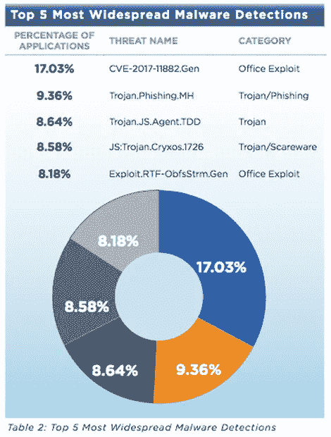
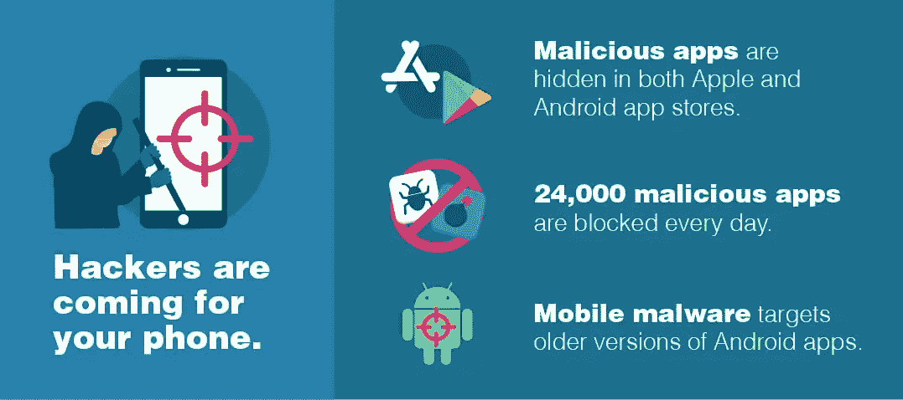
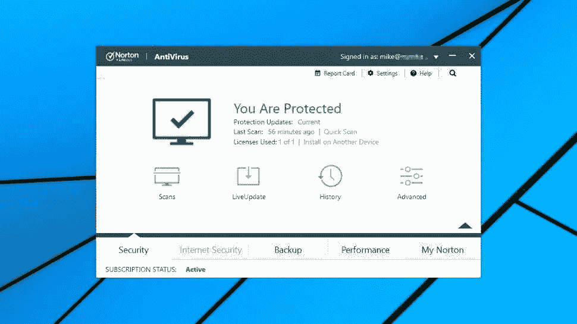
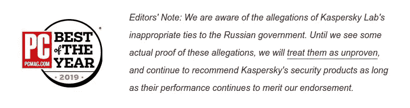
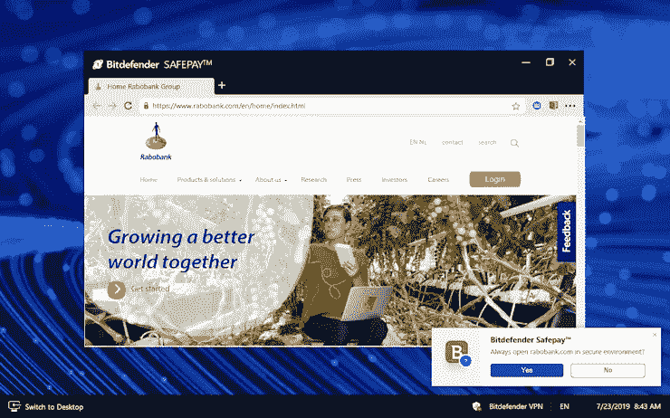

# 清除病毒必须做的事情

> 原文：<https://medium.datadriveninvestor.com/things-you-must-do-to-get-rid-of-the-virus-4486b89d9739?source=collection_archive---------14----------------------->

*忘记口罩、护目镜、酒精、喷雾酒精、洗手液、杜松子酒&滋补品、* [*Spirytus*](https://www.thewhiskyexchange.com/p/9042/spirytus-delikatesowy-vodka) *伏特加和* ***指向下面的****——因为它们总是高效且据称超安全——****解决方案*** :

## 1.MICROSOFT DEFENDER 高级保护

谁会想到，这位多产的开源被告老兄，会谈论这个由你可爱的[微软公司](https://www.microsoft.com)提供的令人惊叹的“**完整端点安全解决方案**”?…

显然，像 Petrofac、Christus Health、Clover Imaging Group 和其他公司这样的客户并没有疯狂地咳嗽。Defender Advanced Protection 发出警报、采取补救措施、阻止和做许多我不在乎的事情但是，很明显，它很有效。尽管 25%的恶意软件伪装成 MS Word 文档。但是，嘿…那对你来说只是运气不好。

顺便说一句，当我们开始谈论关于病毒的盲目数据和统计时，这里有一张免费的图片，免费的**病毒:**

#stayathome #goNokiaagain

如果你在想“**我是 Mac 用户，laaaaaame** ！”这里有一些让你沾沾自喜的东西:“基于 Mac 的恶意软件的这种**增长进一步揭穿了 Mac 对病毒和恶意软件免疫的神话**，并加强了高级威胁保护对所有设备和系统的重要性”，[一些网站](https://www.zdnet.com/article/malicious-microsoft-word-docs-warning-think-before-you-click-on-unexpected-emails/)也说。

 [## 软件开发过程:如何选择正确的过程？数据驱动的投资者

### 软件是任何企业组织成功的生命线。没有软件的帮助，一个…

www.datadriveninvestor.com](https://www.datadriveninvestor.com/2020/01/16/software-development-process-how-to-pick-the-right-process/) 

## 2.诺顿防病毒升级版

诺顿先生是这个行业的老前辈，但是根据 pcmag.com 的说法，如果威胁是你的“单一桌面”，他是最好的选择。来自世界各地的黑客肯定选择了这个(一次或两次)，尽管“**它很贵，并且不为多电脑家庭提供优惠**”。如果你有适当的保险，库里奥。如果你没有一个稳固的*病毒关怀*系统，**忽略并拒绝这些人抛给你的任何术语**。

see? Mike started his treatment already

## 3.卡巴斯基反病毒软件

在考试分数时踢各种屁股的那个**我不知道有一个人在使用它，也不知道有几个关于“在办公室”的人喜欢它的故事。**

这可能是你几个月来一直在寻找的面具。

你还不拥有的酒。

**来自四个独立测试实验室的完美和接近完美的分数**。近乎完美？！来吧… **现在就去买吧，然后永远免疫(或几乎免疫)**！

just read left, whatever’s on the right doesn’t cure shit

## 4.BITDEFENDER ANTIVIRUS PLUS

“好吧，所以你有一些病毒”，因为她应该唱。

别担心， **BD 是你最新的 BFF** 。在 [PCMag](https://www.pcmag.com/) ，他们称之为 ***形容词星期二***:**发光的实验室测试分数**”、**令人印象深刻的恶意软件防护**”、**惊人的网络钓鱼防护**、**用户界面上壮观的景象**。等等。最后一个是我编的。

嗯，可能是因为*形容词星期二* **随着对这个软件**的测试和测试，速度有点慢:“对连接速度的平均影响”，“为在线安全而安全支付”(这可能是也可能不是一个形容词，你的选择；如果你搜索得太多，你可能最终会为此付出代价:)或者如果你仍然不相信这个家伙能治疗这些症状，那么这个总是有用的"**更多功能**"

#stayathome and #safepay. Because it’s… safer. Right?!

## 5 或 6 或 72，我可以这样做一整天。—F-安全防病毒

好吧，现在这是我对该出版物的评论感到困惑的地方。

让我们原谅并忘记*形容词星期二*之前的摊牌和**锁定这个 Infierno de Todos los Vírus 评论**。

这是一个 **Pro** :

"**基于行为的 DeepGuard 检测到全新的恶意软件，包括勒索软件。**

这里有一个缺点:

"**在测试中，针对一个真实样本的勒索软件防护失败。**

所以我不知道我的代码，也不知道技术人员，但这就像说“**是的，我有点被感染了，但让我只是众筹 5 分钟，我们稍后会冷静下来，好吗**”，不是吗？！启发我。他们基本上是这么说的

err… “can I go now?”

> 不恰当的提及:

## 停

如果你有任何从混乱、疾病和绝望中恢复的计划，这是**有史以来最糟糕的解决方案。#远离这个家。它破坏了你的 CPU 的性能，可信度，在这个时代是完全无用的。**

最糟糕的是…在过去的日子里，它曾经很有用。至少，当我第一次听说它的时候，是在“比伯只是一个没有计划毁掉一代人的孩子”的日子里。显然，根据这个网站[这里](https://www.av-comparatives.org/vendors/avast/) Avast 这些天有点烂。一些 [reddit 的人可能不同意这一点](https://www.reddit.com/r/antivirus/comments/83nnr7/is_avast_still_good/)，但从我的角度来看，它**只会让你的生活一团糟，毁掉你的机器**。

## 结论

选择 Linux。这些天基本上生活在基里巴斯、密克罗尼西亚、帕劳或汤加。[完全没有病毒](https://www.aljazeera.com/news/2020/04/countries-reported-coronavirus-cases-200412093314762.html)。你可以随心所欲地谭灿和冲浪。

虽然:D 的无线网络可能很慢

*   *PUX —个人用户体验*