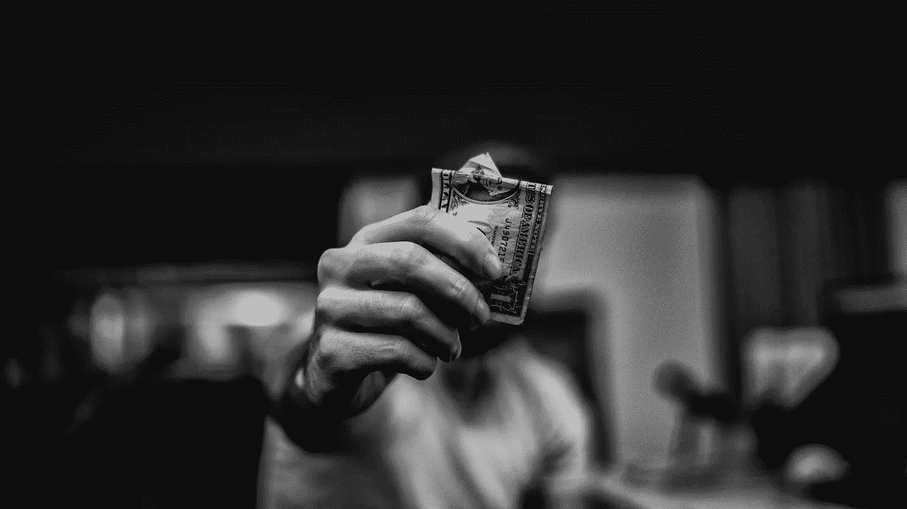

# 用不同的眼光看待金钱——变得富有

> 原文：<https://medium.datadriveninvestor.com/think-different-about-money-get-rich-99fc7eb1e7b9?source=collection_archive---------17----------------------->

Photo by [Lucas Favre](https://unsplash.com/@we_are_rising?utm_source=unsplash&utm_medium=referral&utm_content=creditCopyText) on [Unsplash](https://unsplash.com/s/photos/money?utm_source=unsplash&utm_medium=referral&utm_content=creditCopyText)

> “人生就像一场游戏，首先你要学会游戏规则，然后玩得比谁都好。”——阿尔伯特·爱因斯坦

我花了很长时间才明白为什么有些人最终会变得富有。变得富有不是运气或智慧的游戏。财富对应的是一定的心态或对金钱概念的认知。让我带你走一遍。

# #1 做你时间的主人

世界的秘密货币是什么？人际技能、资本、权力？

不，是关注。一个专注的头脑能使最疯狂的梦想具体化。可悲的是，很少有人花时间去释放它隐藏的潜力。

A focused person always gets attention. Photo by [Travis Yewell](https://unsplash.com/@shutters_guild?utm_source=unsplash&utm_medium=referral&utm_content=creditCopyText) on [Unsplash](https://unsplash.com/s/photos/flip?utm_source=unsplash&utm_medium=referral&utm_content=creditCopyText)

你知道活着的时间和死去的时间的区别吗？

当你做某些活动时，你会感到精力充沛、兴奋和有联系；你感觉充满活力。

但是，如果没有家庭、收入或社交网络的基础，你就无法实现这些追求。这就是为什么我们有死亡时间，在这段时间里，我们磨出杂货，家务和任何不愉快的事情。

变得“富有”意味着牺牲我们宝贵的活着的时间来改变这种平衡。富人运用复合效应，即从看似微不足道的小行动中获得巨大回报的策略。方法很简单，每天衡量小步骤，保持一致，尤其是在失败的时候。

# #2 永远不要停止做

心理学家卡罗尔·德韦克研究了儿童如何应对错误。她发现，一些孩子对挫折的反应是无能感，而另一些孩子则感到被鼓励去解决这个问题。

德韦克把通过试错学习的心态称为成长心态。固定的心态意味着当你感到不舒服时就放弃。成年人在生活的不同领域会在这些心态之间转换。

例如，大多数员工喜欢在工作中变得更好，并通过学习来提高效率。但是，在我看来，当涉及到交流时，他们不想花时间去研究避免冲突或说不的能力。

我的朋友和家人经常阅读书籍，却从来没有将他们学到的东西付诸实践，这让我感到惊讶。想象一下，你必须学习如何驾驶汽车，而你只能阅读规则和玩模拟汽车游戏。你怎么拿到驾照的？

为了整合洞察力，你需要创造一个惯例——一套重复的精神或身体练习。随着时间的推移，惯例变成了习惯，新学到的思维方式变成了原则。当你改变了原来的系统或实践来适应你的生活时，学习的过程就完成了。

> “在我的职业生涯中，我已经错过了 9000 多次投篮。我已经输了将近 300 场比赛。有 26 次我被信任去投决定胜负的一球，但都没投进。我一生中一次又一次地失败。这就是我成功的原因。”—迈克尔·乔丹

# #3 承担合理的风险

在人生的游戏中，你会拿到一手特别的牌。也许你很幸运，在一个繁荣的国家长大，或者有好的父母。或者不是。

我很感激生长在荷兰的一个较高的中产阶级家庭——钱从来不是问题。在我们家，我的祖父母有一份结构良好的股票和房地产养老金。每当家庭成员陷入经济困境时，他们都会伸出援助之手。

当我问我的祖父母他们经济成功的关键是什么时。他们回答:**“简单生活，投资房产。”**

换句话说，这是一种本质主义的生活方式，在这种生活方式中，你不想要更大的房子、更豪华的汽车或美食餐厅的晚餐。相反，你选择支持和投资你所爱的人。

> \ ' \ '生活中最危险的事情就是小心行事。’——凯西·奈斯塔特

如果按照这三个原则投资，风险微乎其微。

*   只投资一小部分稳定收入。
*   选择一种你直观理解的投资方法。
*   当生活给你一拳时，不要冲动。

如果你能预料到像 COVID 病毒或特朗普总统任期的潜在延续这样的不可预见的后果，你将在危机时刻处理得很好。

# 进一步阅读

所有伟大的人都会阅读。为了理解这个主题，我建议你至少读一本书。玩弄这些金钱哲学，当你理解了其中的含义或有了直觉时，就实施这些想法。

[自动百万富翁——大卫巴哈](https://amzn.to/3h3mBHA) →储蓄、投资和偿还债务/抵押贷款的自动化。

[每周四小时工作制——蒂姆·费里斯](https://amzn.to/2F7AZkG) →生活体验哲学>唯物主义。

我会教你如何变得富有——Ramit Sethi→金融永远是可以商量的。

[聪明的投资者——本杰明·格拉哈姆](https://amzn.to/2Z9FWkl) →如何管理风险。