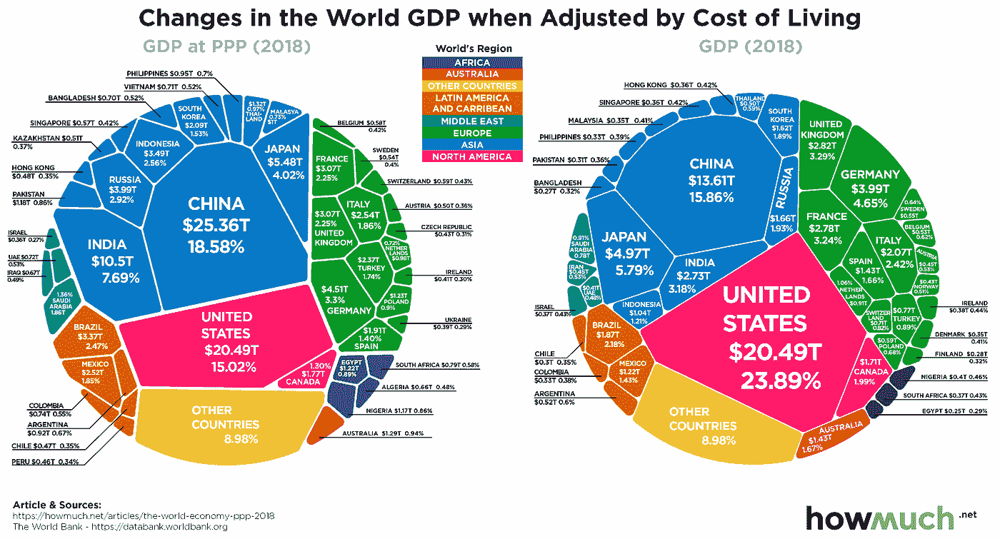
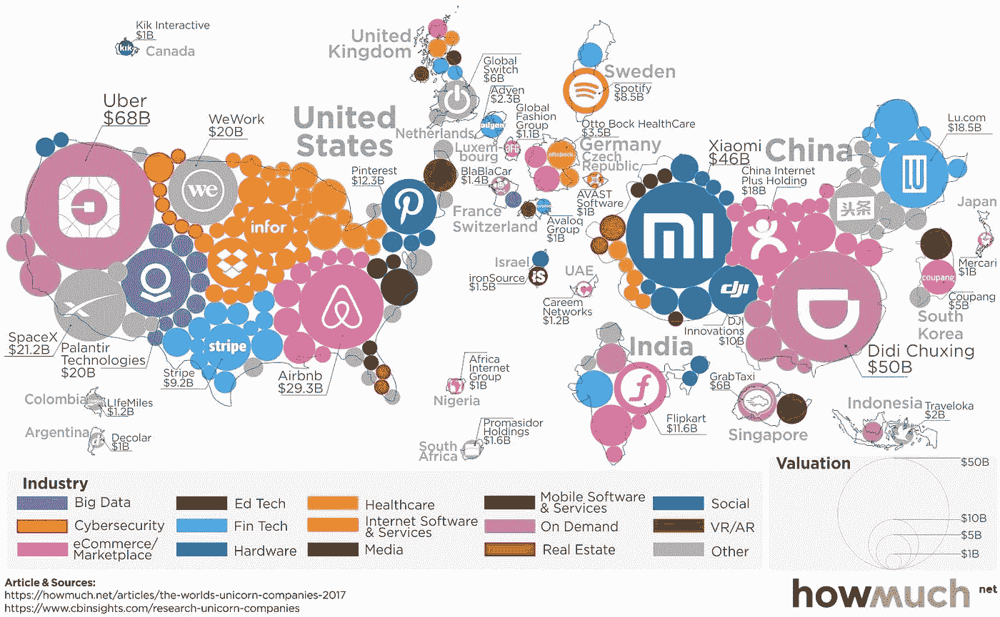

# 放眼全球，立足本地:创业公司拓展新市场的 4 个关键

> 原文：<https://medium.datadriveninvestor.com/think-global-act-local-4-keys-for-startups-to-expand-into-new-markets-1680eb50ddd6?source=collection_archive---------7----------------------->

你是一家初创公司，在你的本土市场上表现出色。恭喜你。你能在新的市场重复它吗？这篇文章关注的是如何思考这个问题，集中在 4 个关键的杠杆上。

**1)指标** — GDP 和人均收入(GDP 除以人口)是被高度引用的统计数据，部分原因是它们更容易测量和计算。但它们有很大的局限性，因为它们忽略了你在一个国家能真正买到多少东西，以及收入分配的差异有多大。例如，购买力平价即每平价购买力显示了一个非常不同的现实:

仅仅这个指标就引发了许多问题。许多欧洲国家都很富裕，但你应该首先向这些国家扩张吗？什么才是真正的印度中产阶级？巴西以围绕消费品的高参与度而闻名，你对货币化的预期是多少？我们的世界起伏不定，而且瞬息万变。曾经正确的先入为主的框架真的没有空间了。给初创公司的可行建议:自下而上的分析是关键，因为如果你关注错误的指标，你很可能会失败。

**2)定价** —确定正确的定价同样需要建立正确的模型。例如，众所周知，制药公司在不同的市场收取非常不同的价格。其中一些是由监管、包括补贴在内的政治或慈善事业推动的，相当一部分可以归因于经济现实。一种几千美元的药物对于世界上大多数人来说是遥不可及的，尤其是当你没有保险的时候。但是至少对于药品来说，巨大的成本是研发成本，生产它的边际成本要低得多。因此，一家公司可以通过向一小部分人收取高价，向大量人收取低价来建立有效的战略。此外，还有专利、品牌、交叉销售和追加销售等方面的考虑。给创业公司的可行建议:不要简单地应用在你的本土市场有效的框架，不要犹豫购买本地知识以获得最佳决策。

**3)特质**——如果你在加拿大雇佣员工，加拿大会报销高达 50%的工程费用。新加坡没有资本收益税。在你提供全国性的服务之前，美国几乎总是要求你在每个州获得医疗执照。日本有自己的照片尺寸偏好。在巴西，人们经常在 WhatsApp 上留下语音邮件，而不是打字。下面这张关于 2017 年独角兽的地图并不完美地展现了世界在增长和机遇方面是多么不平衡:

确实有成千上万的规范在任何地方都很少被写出来。只有当地的专家知道它们。这些知识大部分应该直接或间接地来自你的投资者。这就是为什么融资过程应该是相互努力的过程——风投对你的业务有信心，你也相信风投有知识、人脉和主动性在你需要的时候帮助你。给初创公司的可行建议:如果这个新市场对你来说非常重要，那么绝对要找当地投资者，他们会物有所值，即使这意味着在某些条款上做出妥协。

内置定位系统(T1)——1999 年，美国国家航空航天局(Nasa)失去了[一颗价值 1 . 25 亿美元的火星卫星(T3)，它本应是另一个世界的第一颗气象观测卫星，因为工程师们没有将英制转换成公制单位。在这种特殊情况下，合作是在同一个国家的两个团体内进行的，按照不同的规范运作。当你把产品推向全球时，这个问题会变得更加复杂。你真的需要在你的代码中硬编码一些东西吗？或者你能在将来把它作为一个具有不同值的变量吗？这个 UI 元素是可替换的吗？在用户将收到的信息周围是否可以有一个占位符，以便它可以在不同的法律集内快速适应？重构已经很痛苦了，再加上国际化几乎肯定是一个痛苦的过程，会耗费时间和精力。对初创公司的可行建议:首先绝对要专注于在第一个市场生存下来，但从第一天起就尽可能地打造可全球扩展的产品。](https://www.wired.com/2010/11/1110mars-climate-observer-report/)

 [## 创业顾问委员会的来龙去脉|数据驱动的投资者

### 作为技术、生命科学、医疗设备、清洁能源和…

www.datadriveninvestor.com](https://www.datadriveninvestor.com/2020/07/03/the-ins-and-outs-of-advisory-boards-for-startups/) 

*原载于* [*数据驱动投资人*](https://www.datadriveninvestor.com/2020/08/23/think-global-act-local-4-keys-for-startups-to-expand-into-new-markets) *，《我很乐意在其他平台上辛迪加。我是*[*Tau Ventures*](https://www.linkedin.com/pulse/announcing-tau-ventures-amit-garg/)*的管理合伙人和联合创始人，在硅谷工作了 20 年，涉足企业、创业公司和风险投资基金。这些都是专注于实践见解的有目的的短文(我称之为 GL；dr —良好的长度；确实读过)。我的许多文章都在*[*https://www . LinkedIn . com/in/am garg/detail/recent-activity/posts*](https://www.linkedin.com/in/amgarg/detail/recent-activity/posts/)*上，如果它们能让人们对某个话题产生足够的兴趣，从而进行更深入的探讨，我会感到非常兴奋。如果这篇文章有对你有用的见解，请评论和/或给文章和* [*Tau Ventures 的 LinkedIn 页面*](https://www.linkedin.com/company/tauventures) *点赞，感谢你对我们工作的支持。这里表达的所有观点都是我自己的。*

**访问专家视图—** [**订阅 DDI 英特尔**](https://datadriveninvestor.com/ddi-intel)