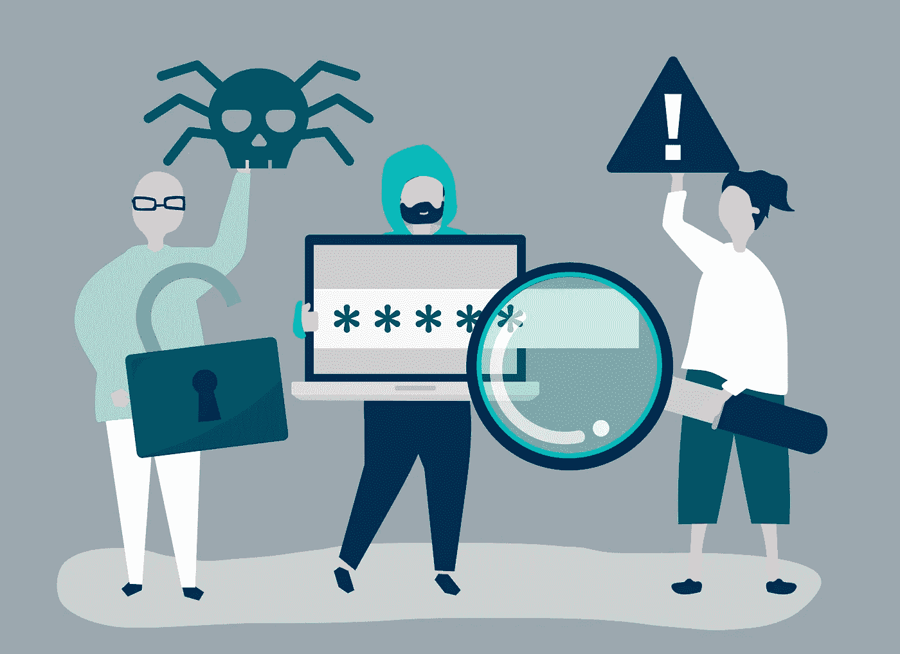

# 第三方风险管理(TPRM)

> 原文：<https://medium.datadriveninvestor.com/third-party-risk-management-tprm-7cd20a85fe26?source=collection_archive---------6----------------------->

## 如今，第三方在金融服务领域提供和支持业务，变得越来越重要和必要。许多企业完全依赖第三方为其客户和对手提供基本资源。

第三方利用是对您组织的安全和财务状况最重要的风险之一。由于第三方可以访问他们的网络并代表他们处理敏感数据，一般组织都有一个很大的接口，容易受到潜在的网络攻击。

PCI 数据安全标准(PCI -DSS)将第三方供应商定义为代表客户组织传输数据的供应商，这可能会危及其环境的安全性，并要求遵守 PCI-DSS。

第三方之间的任何关系都涉及跨组织多个级别的多种多维风险，如安全性、法规遵从性和财务风险。第三方可能会危及您的业务、您的客户，甚至您员工的生活和生计。

为了充分识别第三方风险，您必须从全面分析贵公司当前和潜在的第三方开始。在确定风险的过程之后，应详细分析具体的驱动因素，这会增加第三方的风险以及这些驱动因素的影响。

 [## 区块链降低商品交易的风险和成本|数据驱动的投资者

### 我们将讨论 DLTs 在商品领域的当前实现，包括贸易和供应链管理…

www.datadriveninvestor.com](https://www.datadriveninvestor.com/2020/06/17/blockchain-reduces-risk-and-costs-in-trading-commodities/) 

与第三方的关系包含需要随着时间的推移而认识到的风险，并且它们包含自己的风险。这些风险可能是多方面的，并超越个人关系延伸到更广阔的世界，因为它们可能会对您的组织产生负面影响。

第三方风险管理(TPRM)是贵组织最重要的方面之一，它可以帮助您识别和分类第三方关系，并通过关注构成最大风险的合作伙伴来限制第三方风险管理的范围。TPRM 还可以帮助您收集、维护和评估您的第三方风险，大大提高合规性和风险管理，同时降低您组织的成本。在识别风险的过程之后，应识别增加第三方风险的具体驱动因素，这从全面识别及其风险概况开始。TPRM 决定您的供应商是否符合安全要求和行业标准。

第三方风险管理(TPRM)涉及评估与第三方和卖方交易产生的风险。通过对您的第三方风险进行尽职调查，您的组织可以降低合规问题的风险和合规成本。

## 应该如何进行有效的第三方风险管理？

许多法规和合规性要求涉及第三方供应商，甚至可以作为管理供应商风险的框架。对于组织来说，通过同意要求供应商证明符合要求的未来审计程序和治理措施来满足这些要求是很重要的。自动化这些任务的解决方案可以帮助您管理供应商风险，并支持其他国家/地区的合规工作。

项目管理办公室(PMO)小组应参与监控与整个组织的第三方风险管理和法规遵从性工作相关的各种风险领域的缓解策略。PMO 小组还应该作为项目管理团队的一部分进行互动和行动，以及管理其他领域的供应商风险。

有效的第三方风险管理还包括在第三方关系的整个生命周期中不断变化的供应商环境，如供应商业务模式、业务战略和业务环境的变化。

一旦你决定雇佣一个伙伴来帮助你，是时候管理你的内部期望和你的新伙伴了。他们必须在发生数据泄露时分配责任，并且每个人都必须了解对方的期望和该过程需要什么。例如，您希望将这一流程整合到您工作的每个部门，以便每个人都了解对他们的期望。第三，承包商有义务遵守您的组织必须遵守的法规和行业标准。

最终，备份您的数据、解决理解上的差距以及实施流程和协议将使您的企业更加强大，并有助于保持和发展您的企业。

简而言之，高层管理人员需要意识到他们的公司和第三方服务供应商容易受到网络安全威胁和隐私滥用的严重风险。不管公司的风险状况如何，由第三方创建风险评估框架是内部评估和风险暴露缓解的核心组成部分。

## **引用来源**

*   [https://www . GEP . com/white-papers/third-party-risk-management-take-charge-approach](https://www.gep.com/white-papers/third-party-risk-management-take-charge-approach)
*   [https://www . panorays . com/blog/third-party-risk-management-cyber security/](https://www.panorays.com/blog/third-party-risk-management-cybersecurity/)
*   [https://www.optiv.com/third-party-risk](https://www.optiv.com/third-party-risk)
*   [https://ciso share . com/blog/understanding-third-party-risk-management/](https://cisoshare.com/blog/understanding-third-party-risk-management/)
*   [https://reciprocity labs . com/resources/what-is-third-party-risk-management/](https://reciprocitylabs.com/resources/what-is-third-party-risk-management/)
*   [https://www . cisomag . com/third-party-risk-management-process/](https://www.cisomag.com/third-party-risk-management-process/)
*   [https://www . metric stream . com/insights/best-practices-third-party-mgmt-program . htm](https://www.metricstream.com/insights/best-practices-third-party-mgmt-program.htm)
*   [https://www . acfeinsights . com/acfe-insights/5-您的第三方风险管理计划的考虑事项](https://www.acfeinsights.com/acfe-insights/5-considerations-for-your-third-party-risk-management-program)

**访问专家视图—** [**订阅 DDI 英特尔**](https://datadriveninvestor.com/ddi-intel)