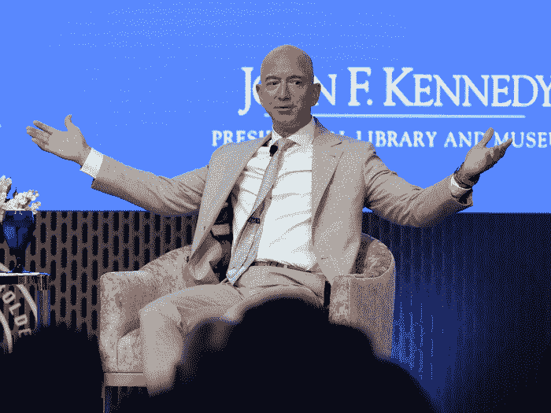
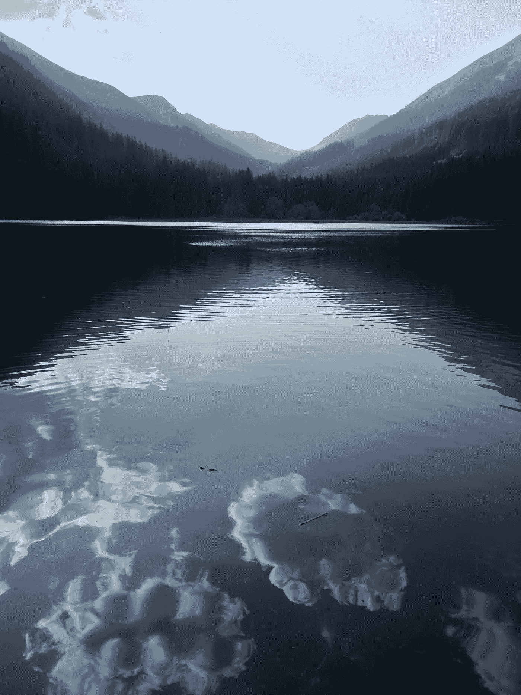

# 这种决策方法让杰夫·贝索斯在 2021 年成为全球第二富有的人

> 原文：<https://medium.datadriveninvestor.com/this-1-decision-making-method-made-jeff-bezos-the-2nd-richest-man-on-the-planet-in-2021-1ca696a4ec8?source=collection_archive---------5----------------------->

## 心理学

## 杰夫·贝索斯如何做出他一生中最艰难的决定

Source: [Business Insider](https://www.businessinsider.com/jeff-bezos-net-worth-life-spending-2018-8?r=DE&IR=T)

1995 年，我结束了在奥地利军队的服役期，在家乡的一家当地乳品厂做暑期工。

一年前，我以优异的成绩完成了高中学业，工作邀请源源不断。我就读的商学院教授西班牙语技能，凭借出色的表现，我成为了许多关注西班牙和拉丁美洲的公司的完美员工。

但这些工作都是标准的朝九晚五的办公室工作，我觉得我的职业有所不同。从我记事起，我就一直是一个好奇的男孩，以至于有时会让成年人感到厌烦。

今年夏天，我要么选择一份高薪工作，要么大胆尝试，开始学习。坦率地说，我的家人和密友圈子里没有人认为我报名学习经济学是一个明智的想法。

“你总是一个懒惰的学生，你永远也不会在大学里取得成功，”这是我的朋友和大家庭的普遍反应。

“我们养不起你 4 年。我父母的回答是:“你必须自己筹集资金”。

一方面，高薪工作意味着财务独立；另一方面，学习意味着对生活有更多的见解，但潜在的负面影响是成为一名靠低收入工作度日的穷学生——就像在 90 年代一样，这两种方式是不可结合的。

我必须做出决定，所以我跳上我的自行车，去骑了很长一段时间来理清我的思绪。当我回来时，我很清楚自己想要什么。

# 后悔最小化方法

> 我想尽量减少后悔的次数
> 
> —杰夫·贝索斯

当我读到杰夫·贝索斯的新书《发明与漫步》时，我笑了，因为杰夫·贝索斯的故事让我想起了 25 年前我自己改变人生的决定。

我们都用同样的方法来做决定。一年前，也就是 1994 年，杰夫·贝索斯读到了互联网令人难以置信的增长速度，他想为此做点什么。

他想出了通过互联网销售产品的主意。由于这个想法引起了他的兴趣，他坐下来列出了一张值得在网上销售的产品清单。

最重要的是书籍，这是他最初的商业理念。

当他提出这个模型时，他已经是大卫·e·肖管理的对冲基金的副总裁了。

当杰夫有了创办一家网上书店的好主意时，他和老板一起去散步讨论。这是大卫·e·肖对杰夫·贝索斯说的话:

> “你知道吗，杰夫。这真是个好主意。我认为你的想法很好，但对于那些还没有好工作的人来说，这个想法更好。”

他答应老板在做最后决定前花几天时间考虑他的想法。

杰夫·贝索斯当时做的是想象他 80 岁生日时的样子，并考虑他是否会后悔做出这个决定。

> “我知道当我 80 岁的时候，我不会后悔尝试过这个。我不会后悔尝试参与这个被称为互联网的东西，我认为这将是一件非常重要的事情。我知道如果我失败了，我不会后悔，但我知道我可能会后悔的一件事是从未尝试过。我知道这将每天困扰着我。”

读完这篇文章后，我想象了另一个世界，年轻的杰夫·贝索斯做出了另一个决定:留在大卫·肖的对冲基金，而不是创建亚马逊。

57 岁的杰夫·贝索斯会在睡梦中梦见我们的宇宙，醒来时隐约记得自己曾是地球上最富有的人吗？

# 80 岁生日聚会练习

内在动机的人可能会从杰夫·贝索斯方法中受益，而那些更受外在动机驱使的人可能会有另一种选择。

我是在学习商业教练和心理学的时候学会这个方法的。这一个和杰夫·贝索斯做的相似，但是采取了另一个角度。

坐下来闭上眼睛。想象一下，你有可能穿越时空去参加你的 80 岁生日派对。你置身于宾客之中，有机会采访他们每一个人。

利用这个机会写下几年后你会在聚会上遇到谁。

> 他们会讲述你生活中的哪些故事？

与客人交谈后，铃声响起，所有人都变得沉默。你 80 岁的自己走上舞台进行演讲。

> 在你的聚会上，你会讲述哪些关于你生活的故事？

对于你即将做出的决定，80 岁的你会告诉你什么？

这是杰夫·贝索斯“后悔最小化框架”的扩展版本，为决策所处的环境增加了更多的信息。

这项技术会耗费一些时间，但在得出结论之前，深入研究我们生活中的重大决策是值得的。

回到 1995 年，夏天，我骑车去了离老家 10 公里外的一个小湖。这是奥地利山区七月一个可爱的夏日。湖边不太暖和，也不太冷。

早在 1995 年，只有当地人在附近，而在 7 月份，他们大多数人都在国外度假。湖边安静而孤独，是享受户外生活时思考问题的最佳地点。

我坐在水边，看着湖面上云彩的倒影。

在群山之中，云似乎移动得很快。它们迅速改变形态，合并，分离，消失，同时新的云形成和出现。

生活节奏很快，有一点是肯定的。如果我在大学里失败了，我不会后悔，但是如果我没有尝试成功，我会后悔到死。

> 努力的痛苦是暂时的，遗憾却是永远的。

**更多关于创业的故事:** [**点击这里**](https://christian-soschner.medium.com/resources-for-the-aspiring-entrepreneur-fc07414073d4)

自 1999 年以来，我是各行各业公司的执行官、顾问和教练。我专攻企业发展和金融，从种子轮到 IPO 级别，从 2006 年开始专注于生命科学。

[**加入我的邮件列表，保持联系！**](https://mailchi.mp/5a50875fb5ea/newsletter)