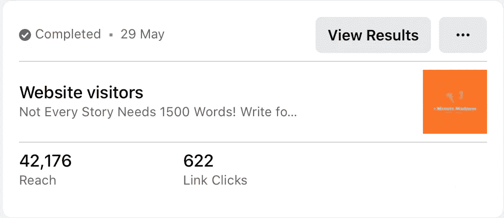
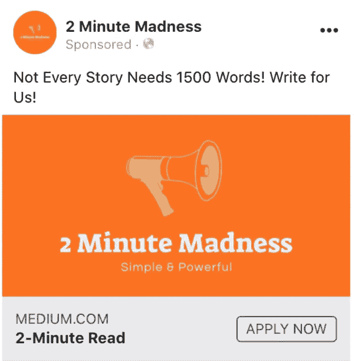
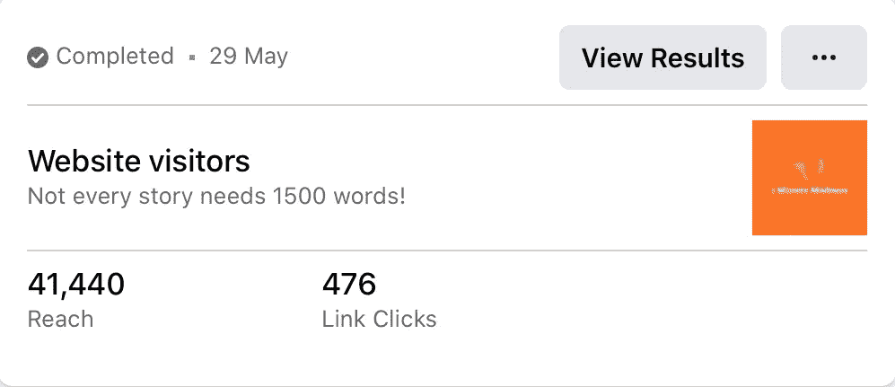

# 这 25 美元的投资证明了为什么你应该总是添加一个行动号召

> 原文：<https://medium.datadriveninvestor.com/this-25-investment-proves-why-you-should-always-add-a-call-to-action-fdc82482d432?source=collection_archive---------5----------------------->

## 避免 CTA 会让你的内容业务陷入困境。

Image by [Денис Марчук](https://pixabay.com/users/Manuchi-1728328/?utm_source=link-attribution&utm_medium=referral&utm_campaign=image&utm_content=3295856) from [Pixabay](https://pixabay.com/?utm_source=link-attribution&utm_medium=referral&utm_campaign=image&utm_content=3295856)

[行动号召](https://www.google.com/url?sa=t&rct=j&q=&esrc=s&source=web&cd=&ved=2ahUKEwi8mv-l6pHqAhURMewKHY63BPEQFjAFegQICxAI&url=https%3A%2F%2Fvtldesign.com%2Fvital-design-news-jobs-and-culture%2Funcategorized%2Fwhat-is-a-cta%2F&usg=AOvVaw3m39oIPPMckKr_Qf5lLxXv)是文案的必备工具。CTA 代表了您的信息的最后一部分——对您的受众来说是一个可操作的步骤。

你经常阅读和收听各种 CTA。每一篇好文案都有一个 CTA。但年轻的企业往往不愿提示受众注册或购买产品。

**CTA 实例:**

*   现在订购
*   点击这里
*   我们的作家
*   现在打电话
*   立即购买
*   与我们联系
*   在此注册

从内容创建者的角度来看，编写 CTA 听起来可能很愚蠢。*你为什么告诉别人点击哪里，这不是很明显吗？*

但是 CTA 是营销人员武器库中的重要工具，因为人们不喜欢过多地考虑促销材料。如果你不告诉他们点击，他们可能只是阅读你的副本，发出轻快的声音，然后滚动。

巧妙的想法无法弥补直接沟通的不足。确切地告诉观众你想从他们那里得到什么。否则，你可能会失去很多潜在的线索。

Source: [Author](https://medium.com/@ToniKoraza)

# 27 美元的脸书运动

本月早些时候，我们启动了一系列脸书活动。我们的目标是通过投放各种不同的广告，找到清晰有效的品牌信息。

当谈到选择正确的广告时，营销人员会观察点击率。你的成本、参与度和利润与术语 *CTR* 联系在一起。你可以通过有多少人点击你的广告来区分好的广告和代价高昂的错误。

脸书的点击率是用印象数除以点击数计算出来的。10 次点击和 100 次展示构成 10%的点击率。

[2 分钟疯狂](http://Image by Денис Марчук from Pixabay)活动已经交付了结果和有价值的数据，其中一些完全是营销的副作用。两个广告以相同的信息和图像同时开始，针对相同的受众(对在线写作感兴趣的印度人)。)唯一的区别就是加了 CTA。

*   不是每个故事都需要 1500 字！( **476 次**点击/ 41.440 次展示)
*   不是每个故事都需要 1500 字。我们的作家！( **622 次**点击/ 42.176 次展示)

第二条消息的参与度提高了 30.67%。尽管脸书有一个内置的 CTA 按钮——立即申请——添加另一个更具体的行动号召可以进一步增加你的转化率。

Source: [Author](http://2madness.com)

两个广告的点击率都在 1%以上，根据 [Wordstream 的研究](https://www.wordstream.com/blog/ws/2017/02/28/facebook-advertising-benchmarks)判断，这还不错。所有行业的平均 CTR 为 0.90%。就业和工作培训行业平均最低，为 0.47%，法律行业最高，为 1.61%。

*“为我们而写”*运动可以说是一个就业和工作培训运动。从这个意义上说，与 Wordstream 研究中的行业标准相比，我们的 CTR 并不差。

来自 Databox 的优秀人士[向 30 多名营销人员](https://databox.com/average-facebook-ctr)询问了他们对脸书广告的点击率，超过一半的人报告平均点击率在 2-5%之间。从这个意义上说，我们的竞选表现不佳。

尽管如此，获得超过 1088 次点击的成本，并加强 70+新的作家正好是 25.74 美元。

这两个广告的唯一区别是增加了行动号召。当你确切地告诉观众该做什么时，观众的反应会更好。不要担心被操纵或措辞强硬。不想要你的产品的人是不会被说服去买的。

Source: [Author](https://medium.com/@ToniKoraza)

# 最后的话

你的听众的注意力持续时间很短，如果你失去一秒钟，你可能会失去一个潜在的领导或一个商业伙伴。互联网和生活充满了干扰。

事实证明，写一个 CTA——通常不止一个——可以促进付费广告、时事通讯和各种形式的在线营销。30.67%的差异，在这种情况下，是很多的，它可以节省你的钱，增加在线参与度。

有时候，你必须说出你到底想要什么。观众读不出你的心思。在整个信息中重复你的 CTA。