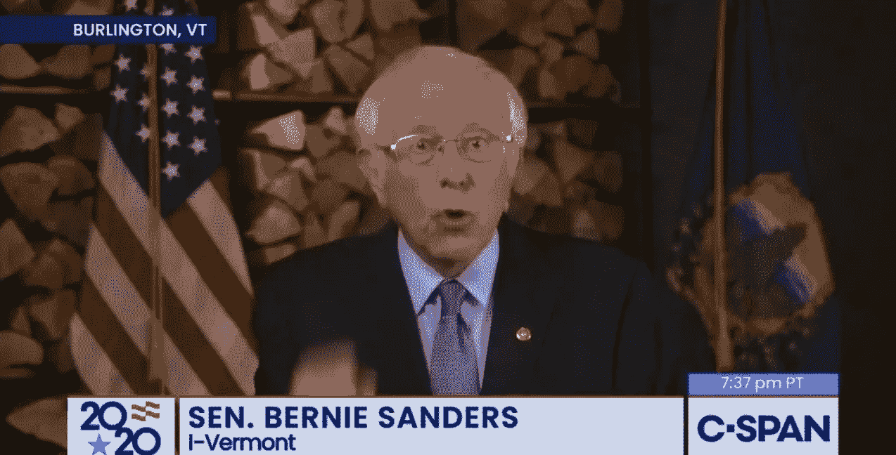

# 这不是派对

> 原文：<https://medium.datadriveninvestor.com/this-aint-no-party-7bde0164b12b?source=collection_archive---------0----------------------->

Michelle Obama headlines first night of Democratic National Convention (click on the photo to watch)

## 不管怎样，现在真的不是开派对的时候…

听着，我们不会在民主党全国代表大会第一天晚上的不寻常上花太多时间，因为很多比我们聪明得多的人已经在这样做了。

只是，在我们看来，虚拟是好的。

人们在没有现场观众的情况下发表演讲也不错。天哪，我们真的没有错过 T2 的壮观场面、气球、五彩纸屑和滑稽的服装，每一个演讲都被反复打断，令人痛苦地拉长。以及对每一次演讲的荒谬的、经常是夸张的、多专家小组的即时分析，因为在行动中也没有太多的自然休息来提供这种分析。(我们是在 C-SPAN 上看的，当我们迅速切换到一个更传统的新闻频道时，他们似乎做了更多，但仍然没有那么多。)在这一点上，虽然我们理解为什么该活动的制片人(笨拙地)试图带来一些(也是虚拟的)反应和掌声，但这也是不必要的。(尽管提醒人们要热情或许是有道理的。)

而且，所有参与的人看起来都非常真诚。从一名护士，到一名农民，再到伯尼·桑德斯(出于某种原因，他站在一堆木头前)，清楚地阐述了乔·拜登的一些政策，并解释了为什么尽管这些政策可能不完全符合进步人士的要求，但它们的方向是正确的，足以让我们值得为这位前副总统投票。

Bernie Sanders makes his case for voting for Joe Biden

更重要的是，它清楚地传达了一个鲜明的信息(不管是有意还是无意):如果这个国家的人民想要更换总统，他们必须开始工作。现在。他们必须下定决心。不需要电视上的人上蹿下跳。在他们自己的客厅和公寓里，鼓起他们自己的决心。制定投票计划。确保你的朋友和邻居有一个投票计划。没有什么是容易的。但这也不像特朗普试图做到的那样不可能(至少对于不倾向于投票给他的选民来说)。这并不是说，不管你打算投票给谁，如果你遇到障碍，就没有足够的帮助。有来自全国国务卿协会的无党派[投票网站；还有](https://www.nass.org/can-I-vote)[投票者](https://www.voteriders.org/)，仅举两个我们喜欢的例子(它们不会试图向你“推销”任何特定的候选人)。

米歇尔·奥巴马在她的精彩演讲(我们给你一个[到这里](https://www.c-span.org/video/?c4900203/user-clip-michelle-obama-speech)的链接)中最有力地表达了这一点:她一次又一次地敦促人们，用她所能的一切方式，只是为了投票。

> *"* 我们知道这个国家正在发生的事情是不对的。这不是我们想要成为的人*。*

这就是为什么当她说:

> “我们必须投票给乔·拜登，就像我们的生活依赖于此一样。”

我们希望她能加上一句:

> *因为他们做*。**

*但不幸的是，这一点被克里斯汀·乌尔基萨的一条同样私人的信息所揭示，她将自己描述为一个“正常人”，她的特朗普支持者爸爸死于新冠肺炎。她说:*

> *他唯一的先决条件是信任唐纳德·特朗普，为此他付出了生命的代价*

*这是:*

*

Click on the photo to watch.*