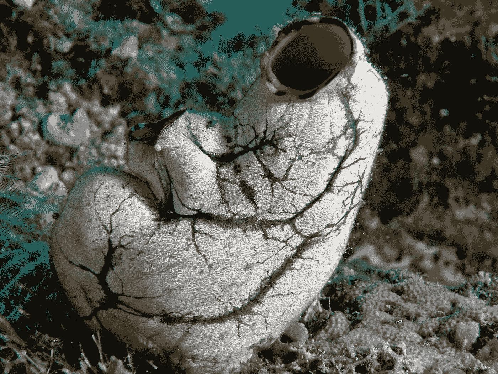

# 这种动物吃掉自己的大脑，变成植物，通过军舰来到欧洲，通过射掉性器官来繁殖

> 原文：<https://medium.datadriveninvestor.com/this-animal-eats-its-brain-becomes-a-plant-came-to-europe-via-warship-and-reproduces-by-58ab261cc6ee?source=collection_archive---------3----------------------->

## 从海鞘看大脑。

By Nick Hobgood, [Creative Commons](https://creativecommons.org/licenses/by-sa/3.0)

ea 喷射听起来像一个不好的迷因:一些物种[在受到威胁时会喷射出它们的内脏](https://www.discovermagazine.com/planet-earth/nervous-sea-squirts-squirt-out-their-stomachs-and-grow-new-ones)。换句话说，当他们害怕的时候，他们会变得毫无勇气。

从卵开始，它们变成了像[蝌蚪一样的生物](http://www.mesa.edu.au/tunicates/)，有一只眼睛、一条尾巴、一个脊椎和一个原始的大脑，四处游动寻找休息的地方*直到永远*。

然后他们“以头朝下的姿势……在海底安顿下来”——字面意思是把他们的头埋在沙子里——“脸朝下，肛门朝上”。这些雌雄同体的生物产生带有卵子和精子的性腺，它们将卵子和精子排出体外进行繁殖(如果你对这类事情感兴趣，这里有一篇 22 页的关于海鞘繁殖的研究论文)。不幸的是，生活在被污染的海洋中的它们会在性腺中积累重金属。

 [## 当科幻进入现实|数据驱动的投资者

### 科幻小说以其疯狂的技术故事统治了世界，充满了诸如读心术和人类的想法…

www.datadriveninvestor.com](https://www.datadriveninvestor.com/2020/04/17/when-science-fiction-enters-reality/) 

当曾经活跃的生物变得静止时，它的大脑不再被需要，它们“[吃掉自己的大脑](http://www.columbia.edu/itc/cerc/danoff-burg/invasion_bio/inv_spp_summ/Didemnum_sp.html)”它成年后也会变得没有骨气。[神经系统瓦解](https://ucmp.berkeley.edu/chordata/urochordata.html)，因为这只是一种不需要运动的能量浪费。

海鞘作为入侵物种在欧洲实际上是一个巨大的问题，“1951 年朝鲜战争结束后，[可能被引入到军舰的船体上。”](https://www.marlin.ac.uk/species/detail/1883)

海鞘的平衡囊，用于保持平衡，最终进化成我们自己的前庭系统，我们用它来理解空间和运动，正如 Llinás 在《漩涡》的 *I 中所讨论的。*

这些没有骨气、食脑、生殖腺旺盛、在军舰上旅行的生物不仅是无尽阴谋的来源，也是解开大脑奥秘的潜在钥匙。

# 对大脑的洞察

神经科学先驱鲁道夫·里纳斯(Rodolfo Llinás)提出了一个观点，即*预测*是拥有复杂神经系统的主要原因。

一只年轻的海鞘需要像小蝌蚪一样在水中主动移动，以找到一个合适的地方安家。它需要一个精确的*预测*控制系统来避免碰撞、躲避其他动物等等。

在变成类似植物的形式后，它不需要运动，因此消除了自己的神经系统。虽然我们倾向于认为神经系统的出现是进化中的一种“下一阶段”，但它比这更复杂。

海鞘愿意放弃它的神经系统，因为它并不便宜——它消耗了大量的能量。天下没有免费的午餐，所以它会吃掉自己的神经系统来省电。

这意味着大脑是用来预测我们的行为的，尤其是用来运动的。正如 Llinás 在他的《漩涡之我》一书中所写的:

> “运动的产生和正念的产生是密切相关的；它们实际上是同一过程的不同想法。在我看来，从进化开始，正念就是运动的内在化。”

换句话说，“大脑只对活跃移动的生物是必要的。”Llinás 提出的一个简单的思维实验是这样的:试着闭着眼睛四处走走。你不会成功很久(显然假设你还没有失明)。

简而言之，大脑是从我们的神经系统对促进运动的预测器官的需求中进化出来的。

## 访问专家视图— [订阅 DDI 英特尔](https://datadriveninvestor.com/ddi-intel)