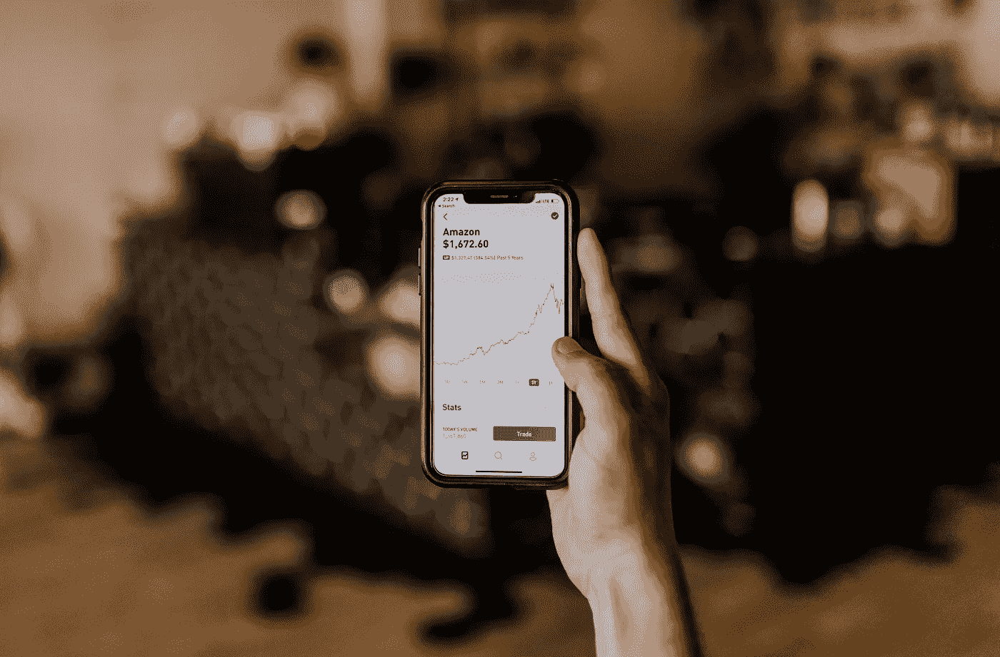

# 这个应用程序给你在你最喜欢的商店购物的股票

> 原文：<https://medium.datadriveninvestor.com/this-app-gives-you-stock-for-shopping-at-your-favorite-stores-9b750f63551e?source=collection_archive---------10----------------------->

## **利用技术创造财富——前所未有的好时机**

大多数痴迷于技术的未来思想家都犯有过多谈论人工智能和增强现实的疯狂可能性的错误，而不是涵盖今天实用、有影响力的技术。以我们身边的财富积累技术为例。

一个允许 12 岁的孩子和 25 岁的莱恩·库克向伯克希尔·哈撒韦公司投资 1 美元的应用程序将比 Magic Leap AR goggles 产生更广泛的影响。事实就是如此。

 [## 幸福的算法？数据驱动的投资者

### 从一开始，我们就认为技术正在使我们的生活变得更好、更快、更容易和更实用。社交媒体…

www.datadriveninvestor.com](https://www.datadriveninvestor.com/2019/03/08/an-algorithm-for-happiness/) 

围绕[简单(却深刻)的财富积累创新的讨论还不够多。在 Cash App 和 Robinhood 上购买零股。使用数字钱包整合您的整个金融足迹。这些是我们目前正在进入的现实。这是一场金融革命。](https://inevitablehuman.com/cash-app-digital-wallets-fractional-shares-and-the-next-20-years-of-digital-finances/)

 [## 现金应用、数字钱包、零股和未来 20 年的数字金融…

### 积累财富的关键是在睡觉的时候让你的钱发挥作用。我们通过购买土地来实现这一目标…

inevitablehuman.com](https://inevitablehuman.com/cash-app-digital-wallets-fractional-shares-and-the-next-20-years-of-digital-finances/) 

最近偶然发现一个叫[撞了](https://bumped.com/)的 app。部分忠诚度奖励计划。部分投资 app。

Bumped 让您可以在您通常购物的商店免费购物。研究发现，当客户拥有一家公司的股票时，他们会对该品牌更加忠诚。— [先于爸爸退休](https://www.retirebeforedad.com/bumped-app-review-free-stock/)

《颠簸》利用一些最古老、最明智的投资建议，让“投资不足”的人更容易投资:投资你所知道的。投资于你所使用的东西。

我记得在年轻的时候得到了这个合理的建议，投资了麦当劳、耐克、塔吉特和百胜。我 11 岁时的品牌。持有了几年，卖了，赚了几百块。—瑞恩，[必然/人类未来思想家](https://inevitablehuman.com/)

我们中没有足够的人意识到简单的财富积累应用程序对整个社会的价值。对于那些通常在月底没有足够的钱购买哪怕一股耐克股票的人来说，这种影响将会非常明显。但是，有了橡子、现金 App、Robinhood、凹凸等。他们可以分享投资的收益。

这些早期的财富积累应用是创造未来消费金融技术的重要一步。

 [## 科技的下一场竞争:优步钱包大战苹果钱包——不可避免/人性

### 控制资金流动。这是大型科技公司的最新集体任务之一。从苹果的数字钱包到…

inevitablehuman.com](https://inevitablehuman.com/techs-next-rivalry-uber-wallet-vs-apple-wallet/) 

[数字钱包](https://inevitablehuman.com/techs-next-rivalry-uber-wallet-vs-apple-wallet/)将我们的整个金融足迹整合到一个易于使用的界面中。下层银行将更快地获得资金。被动财富积累将提供给每个人。[我们正处于一场金融革命之中，而我们当中没有足够的人谈论它。](https://inevitablehuman.com/cash-app-digital-wallets-fractional-shares-and-the-next-20-years-of-digital-finances/)

所以我问你，你是如何在睡觉的时候让你的钱发挥作用的？