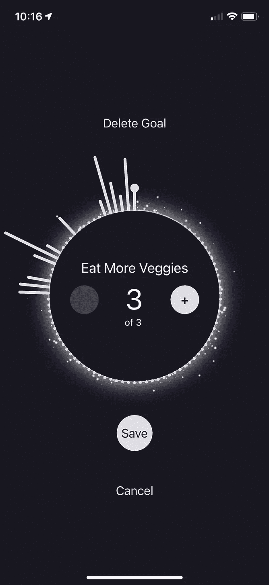

# 我用西方世界的技术解决了苹果手表戒指的最大问题

> 原文：<https://medium.datadriveninvestor.com/this-app-solves-the-biggest-problem-with-apple-watchs-rings-using-tech-from-westworld-28954480612b?source=collection_archive---------4----------------------->

几年前，我买了我的第一块苹果手表，它真正改变了我的生活。通过关闭手表的活动环，我开始形成健康的习惯，并最终实现了真正长时间的日常记录。这是值得的，它提供了一种成就感。在短时间内，它变成了一个附加物。虽然站立、锻炼和燃烧卡路里是健康的，但它仍然是一种瘾。当你需要请一天病假，但你也想关闭你的戒指，会发生什么？一切都崩溃了。

几乎所有使用条纹来促进养成良好习惯的应用都面临这种困境。整合病假可能是一个解决方案，但你内心深处知道这种情况已经结束，你的图表将永远反映这一点。

# **未来一瞥**

在《西部世界》第三季中，我们认识了一家名为“煽动”的数据收集公司。他们的算法被称为 Rehoboam，可以预测人类的行为模式。在一个场景中，煽动的所有者 Serac 戴着一个简单的智能手表，上面有一个月食。

这个想法是，如果煽动的算法按预期工作，那么日食是完整的。然而，如果它的预测和现实之间存在差异，太阳和月亮就不再对齐，需要采取行动来恢复和谐。

# **将概念移植到今天**

我发现罗波安的日蚀的概念很吸引人。不需要展示数字或任何细节，只需要太阳和月亮——它是如此纯粹、简单和禅意。如果这个概念被应用到一个每日跟踪器上，而不是图表和条纹，我们会看到自己的日蚀吗？

[iPhone 和 Apple Watch 输入 Apoklis](https://apps.apple.com/us/app/id1527930366) 。

 [## 我作为软件工程师学会的 4 个关键习惯|数据驱动的投资者

### 我从事软件工程已经快 3 年了。老实说，我不认为我擅长这个(我不知道我会不会…

www.datadriveninvestor.com](https://www.datadriveninvestor.com/2020/10/12/4-key-habits-i-learned-as-a-software-engineer/) 

# **工作原理**

像任何其他日常习惯追踪器一样，你首先要建立几个可衡量的 s.m.a.r.t .目标。设定每个目标的具体时间(例如，每天 30 分钟，每天 5 次)以及你想在哪天实践这个目标。你唯一需要做的就是跟踪你的进度。之后，算法接管。Apoklisi 将会把你一段时间内的进步列表化，并向你展示你自己的日蚀，一张你做得有多好的快照。月亮的偏离和大小是由错过的目标决定的。

# **解决条纹问题**

通过引入这种新颖的界面，Apoklisi 正在帮助解决条纹问题。如果你生病了，累了，或者无法实现你的目标，你不需要为错过一天而感到内疚。像罗波安一样，当你回到小树林时，你的日蚀会自我修正。此外，如果你一直在超越你的目标，你会得到奖励，甚至可能在你的月食中看不到任何分歧。

# **各方面都极简**

在构建 Apoklisi 的过程中，我决定去掉你通常在应用程序中看到的几乎所有东西。该应用程序完全是单色的，这使得一个伟大的黑暗模式。你看到的是日蚀，仅此而已。一切都发生在一个屏幕上。默认情况下，目标是隐藏的，直到您需要查看它们。通过点击 eclipse，您可以看到哪些目标导致了偏差。如果您进一步点击，您将看到您的目标的详细信息，包括显示您一段时间内的进度的图表。

Minimalistic by design

Apple Watch 和 iPhone 应用程序共享相同的 eclipse 界面，一切都通过 iCloud 保持同步。尽管拥有除了习惯追踪器之外的所有功能，Apoklisi 的体积还是小于 3MB。

Apoklisi 现已在[苹果应用商店上架，iPhone 和 Apple Watch 均可使用。](https://apps.apple.com/us/app/id1527930366)

## 获得专家观点— [订阅 DDI 英特尔](https://datadriveninvestor.com/ddi-intel)