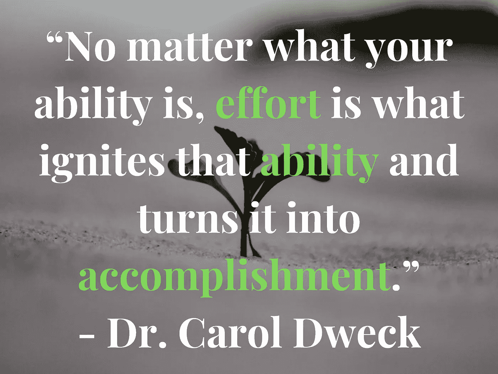
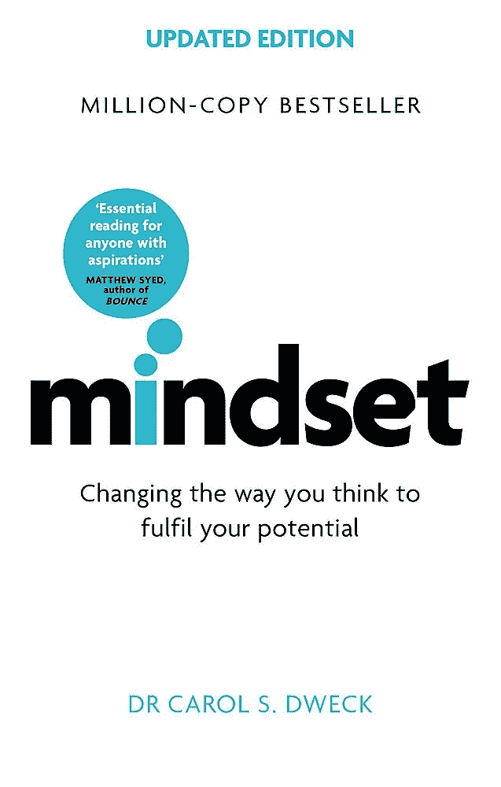
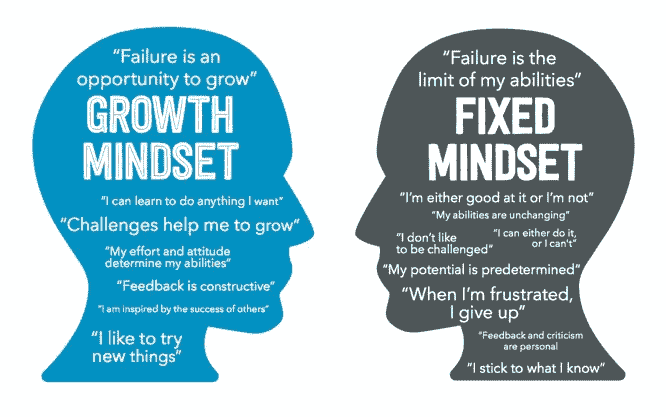
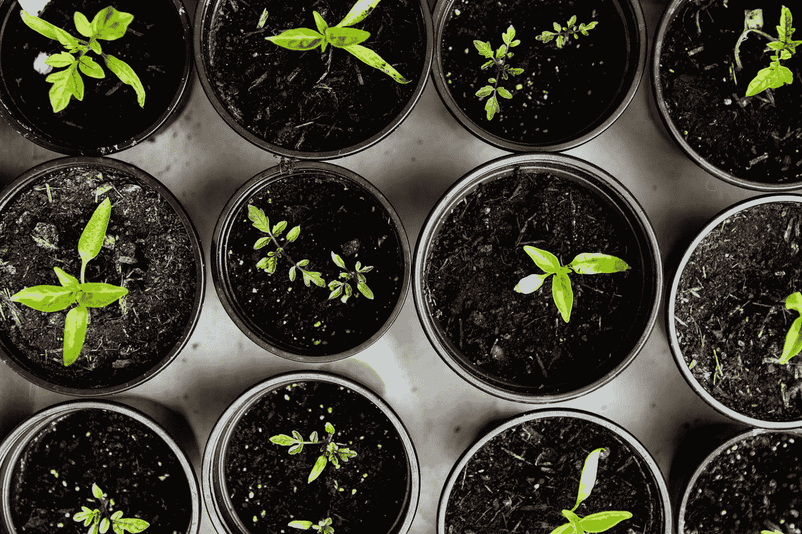
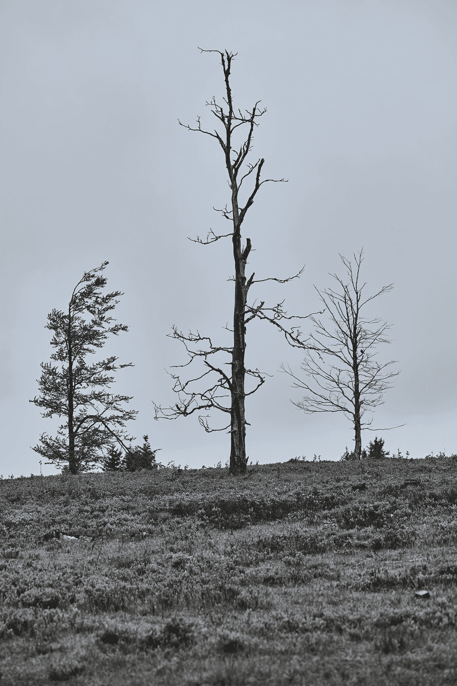
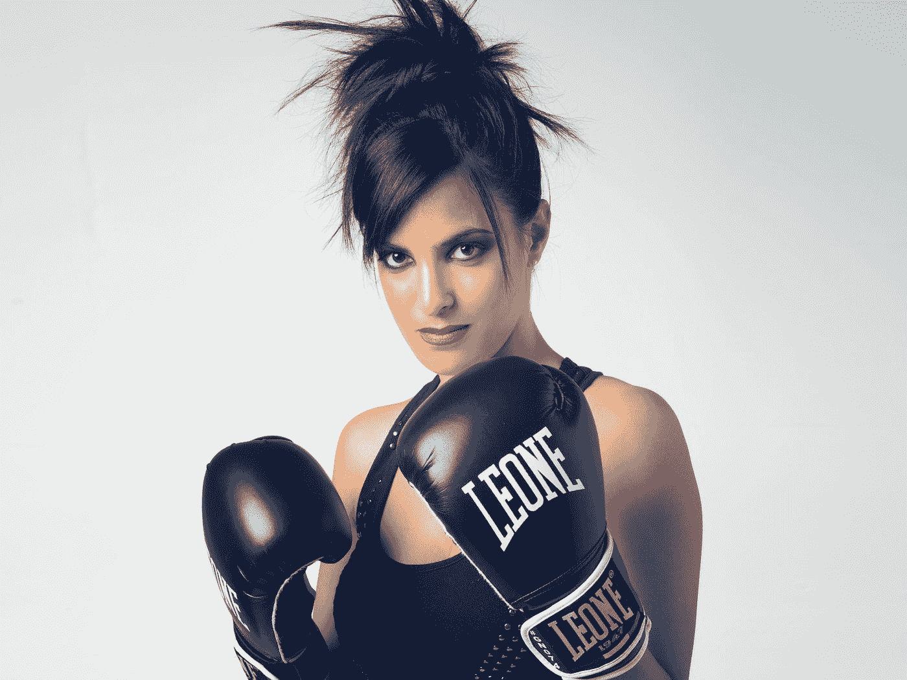
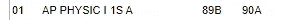

# 这本书挽救了我的物理成绩

> 原文：<https://medium.datadriveninvestor.com/this-book-saved-my-physics-grade-dc043d1c8a44?source=collection_archive---------28----------------------->

## 一些思考

## 成长心态的重要性

我一个月的大部分时间(超过一半)都用来准备期末考试了。特别是，AP 物理是我最重视的一门，虽然 AP Calc + AP Comparative + French 也不差太多。

物理期末考试尤为重要，因为它将决定我这门课最终是得 A，还是得 b。而对于我的其他课程来说，更多的是为了坚持不懈而学习。

最后，我记得考试前两天，我哭了。不断告诉自己我会失败，哒哒哒哒。我学到的所有思维方式都被抛到了九霄云外。

然后，我拿起这本书: [**《心态》，**卡罗尔·德韦克著。](https://www.amazon.com/Mindset-Updated-Changing-Fulfil-Potential/dp/147213995X/ref=sr_1_2?dchild=1&keywords=mindset+carol+dweck&qid=1609376221&sr=8-2)

在这本书中，她定义了我们所认为的成长心态。

**在固定的思维模式中——**人们相信他们的智力是固定的。他们认为自己不擅长这个感兴趣的特定主题，结果，他们放弃了。

**在成长心态中——**总是有成长和学习的机会，但你必须为此付出努力。

The importance of a growth mindset — courtesy to [The North Start Book Report](https://www.google.com/url?sa=i&url=https%3A%2F%2Fnorthstarrestaurantpos.com%2Frestaurant-technology-guys-podcast-ep-032-mindset-carol-dweck-book-report%2F&psig=AOvVaw3rLBKkNK1vPTb_QXrcHi6w&ust=1609465221741000&source=images&cd=vfe&ved=0CA0QjhxqFwoTCJDY0KmL9-0CFQAAAAAdAAAAABAJ)

这里有一个视频，突出了这本书的所有重要部分:

A really good, highly recommended explanation!

# 以前

这一年来，我一直在物理学上贯彻这种心态。我搞砸了一次考试，因为我低估了它——让我从高分降到了低分。我是典型的优等生——所以我有点沮丧。谢天谢地，这是在最开始的时候。我把这当成一个提高的机会。📈

I tried to grow — like these plants! Photo by [Markus Spiske](https://unsplash.com/@markusspiske?utm_source=medium&utm_medium=referral) on [Unsplash](https://unsplash.com?utm_source=medium&utm_medium=referral)

我运用了成长思维的元素——我尝试了我的学习技巧。我练习了提问。我学习了又学习，直到内容中没有可察觉的漏洞。

然而，在考试的前一天，我总是会哭，相信自己什么都不会知道。😞

我通常在考试前几个小时醒来，大部分时间都在恐慌中度过。

这转化为我的测试表现。虽然我的实验室和工作表现通常在 A 区，但我会在测试中得到 b(和 C)。这是一个小小的减少，特别是因为在化学和生物等学科，我总是得到 A(考试+总成绩)。

但是——我无法去想我过去的成功，以及今年我的分数是多么的可怜。我要做的就是一直努力变得越来越好。我一直告诉自己要继续前进，因为这个成绩不会自己恢复。

> 在 11 月份参加旋转运动和动力学测试时，我意识到它不像以前那么难了。那时我在一次考试中得了最高分之一。

这也反映在我的总成绩上——从第一次考试的 83 分，我把自己的成绩提高到了 89.0 分。6 %,这完全是因为这一学期的努力。

一个 89.5 分会四舍五入到一个 90 分，那就是一个 A(在我的 AP 课上)。

我开始变得越来越冷静。感恩节假期来了——我终于有了一点放松的时间。

然而，结束后的两个星期，决赛周将开始。

开始的时候，我试着按照一贯的惯例练习。实施方法，如间隔重复与实践测试。即便如此，被*庞大的内容*所淹没，我有时会放弃并离开。

家庭作业和实验室让我坚持下来——但总有一些关于模拟考试的事情让我想放弃。

期末考试前一周，我们进行了一次波浪和运动的测试。这是一个小测验——长度较短，但由于一个愚蠢的概念问题，我的分数从 89.3 降到了 88.9。

## *我开始失去希望。*

为了瞄准更多的题目，我说服自己终于要坐下来完成一次模拟测试。然而，当我拿起它的时候，有些事情仍然让我困惑。我在考试中得了 75 分——就 AP 考试而言(最高分 5 分是 70 分或更高),这已经很不错了。就我的成绩而言，它是糟糕的。

我失去了更多的希望。关于进步和学习物理的一切都被抛到了九霄云外。老板心态、弹性和抗脆弱性？那些是什么？

## 我倒退回一个非常完整的**固定心态。**

my tree of growth had died….Photo by [Bastian Pudill](https://unsplash.com/@bastianp?utm_source=medium&utm_medium=referral) on [Unsplash](https://unsplash.com?utm_source=medium&utm_medium=referral)

尽管如此，我还是继续做练习题。我把它们做到了无法再处理的地步。然后，我会哭——说自己是个失败者。这样一直持续到考试前两天。这是一次提前解散——给了我一个额外提前开始的机会。

我的大脑感觉死了。我需要分散注意力。所以看着书，我想*“为什么不呢？”*

我会花 3 个小时读这本书。起初，我不停地回头看我的物理练习单。但是随着我越来越深入，物理学已经正式离开了我的头脑。

# 在...之后

有一段话让我印象深刻，我没有具体的引用，但是 TL；她采访了一位相当成功的 CEO，并询问了他对学校的态度。我甚至写了这篇文章，并在几天后发表。

> ***他说他不注重成绩，而更看重学到的东西才是最重要的——这不就是教育的目的吗？他在考试中尽了最大努力——仅此而已。尽力而为，不断学习。那是一种成长的心态。***

我实现了。我开始想——“一个物理 B 不会杀了我，一个物理 B 不会杀了我。”

我也开始思考:**在我学习物理的过程中，我发现物理很有趣。观看视频，从特斯拉线圈到扭矩的基本动画，再到观看加来道雄用果壳解释宇宙:我发现这绝对有趣——这显然是因为我在学习。**

然后，我采取了行动。拿出以前的作业。用过的旧练习题。我在以前做过四次的事情上操练自己。

> *不同的是，以前，我做的时候很害怕。现在，我已经接受了现实。如果我哭着担心，我就会失败。我能做的就是练习，不让自己筋疲力尽，尽我所能做到最好。*
> 
> *至少，我在四个月里学会了一年的物理知识。这是一个令人印象深刻的壮举，我很感激我能做到这一点。*

当我累了，我停下来，然后我读更多的书。我和我的小妹妹看了一些电视。我吃了晚饭。我做了一点调查。我又跳回到两个练习题上。

最后，晚上 10 点熄灯——这是我这么久以来睡得最早的一次。

Photo by [Kinga Cichewicz](https://unsplash.com/@all_who_wander?utm_source=medium&utm_medium=referral) on [Unsplash](https://unsplash.com?utm_source=medium&utm_medium=referral)

快进到第二天——早上，我没有迷失方向。我做了早餐。我叫醒妹妹，给她读了一个故事。我和妈妈谈了我的担心，一吐为快。我拥抱了我的父亲——感谢他在物理方面给了我这么多帮助。

最后，是早上 6 点 57 分。在 3 分钟内，我将不得不登录我的谷歌会议。再过 13 分钟，我就要开始测试了。在 1 小时 43 分钟内，我必须提交它。

我的 Chromebook 坏了。没问题。我拿出我的个人电脑，在聊天中给我的老师留了一张纸条，解释了我的原因。

我削尖了我的铅笔——点击了好几次。

我盯着屏幕上朋友们的脸——都带着某种程度的恐惧。

我意识到，我不是一个人在做这件事。

然后，她发布了测试。

> 我的第一个想法是，“哦，这还不算太糟。”
> 
> 我的第二个想法:**“是时候碾压了！”**

Photo by [Monica Silva](https://unsplash.com/@monicasilva?utm_source=medium&utm_medium=referral) on [Unsplash](https://unsplash.com?utm_source=medium&utm_medium=referral)

我检查了所有的问题，系统地检查了我的工作，用我所知道的一切刮擦我的铅笔，如果这是我做的最后一件事，就拿出答案。

最后，我有足够的时间进行双重检查，甚至三重检查。我在到期前几分钟交了。我相当自信我没有失败。

考试一结束，老师就让我离开教室，我拿起手机给妈妈发短信。

> “我没有失败！我感觉很好！我做到了！”

我继续参加其他考试。幸运的是，我已经知道如何对付他们。

快进到两天后。我一直在冷汗中醒来，检查我的结果。我不得不强迫自己离开电脑。过了一段时间，我就看了几本书。

第二天，我醒来，看到了朋友们的留言。我的老师前一天晚上已经把乐谱放进来了——当时我正在愉快地阅读。最高分是 56/60。最低为 46/60。我需要 58 分才能得 a。

我进入了学生门户网站。我点击了显示我物理成绩的按钮。

然后我尖叫起来。

🥁🥁🥁...

That B was from the last quarter — the A at the right was cumulative from 2 quarters. Yay!

# **我得了一个 A！**

*我以 58/60 的高分离开了那场考试——这是我很久以来在物理考试中取得的最高分。*

这一切都是因为那本书，它提醒我应该优先考虑什么。

# 🔑外卖:

*   不要小看你的课程— **从头开始碾压各方面。不要犯最初的错误。**
*   当你在上课时——分数可能是优先考虑的，但是**最关注的是你学到了什么。**
*   如果是非常基于测试的— **练习，练习，练习！你的努力会带你去那里。**
*   保持头脑冷静，随时准备粉碎它。一场考试可能是令人生畏的，但最终，它只是一张纸。它不是你自我价值的决定因素！
*   动作>哭泣(虽然你可能已经知道了😉)

这些都是我将在任何地方实施的建议——不仅仅是测试。然而，我希望你喜欢这种基于学术的对成长思维的思考。

# 👋嘿！我希望你喜欢这篇文章！

*我是 Orna，15 岁，目前对生物技术(特别是—* [*长寿*](https://medium.com/carre4/our-alive-time-is-ticking-but-why-798ef41e93c6) *，如果你有兴趣看我的文章的话)、人工智能、压电和替代能源感兴趣。我一直在尝试实现一些心态，比如前面提到的增长心态，以及复利和抗脆弱性。请务必期待下个月的相关文章！*

同时，这里有一些行动项目👇：

*   在 [Twitter](https://twitter.com/OrnaMukhs) 和 [Linkedin](https://www.youtube.com/redirect?event=video_description&v=-YB5lXejMFE&q=https%3A%2F%2Fwww.linkedin.com%2Fin%2Forna-mukhs%2F&redir_token=QUFFLUhqbE5QTllTVXd2WFl2YVFvemRwblByUV83MGQxQXxBQ3Jtc0tsdzFhOUNlQi1CNGUxX3h5QVUxMEI4dUFMOXVVdGJTTjNxdlhQYkV4bW9qSTRKR1hJYW1kekdlc2lDN2FvOFpIQ1F6bG5ST1JtMnpmamV3WjdXTnM2WlZfTmNDZXplUDMtaXRnMmFkNFBMY2pMVkV3Yw%3D%3D) 上与我联系。
*   订阅我的[时事通讯](https://ornamukhopadhyay.substack.com/) + [Youtube](https://www.youtube.com/channel/UCPQfmnlPfPuacJaxI0tgRUg) 频道。

更多链接+作为替代，请查看我的[链接树！](https://linktr.ee/ornamukhs)

**访问专家视图—** [**订阅 DDI 英特尔**](https://datadriveninvestor.com/ddi-intel)