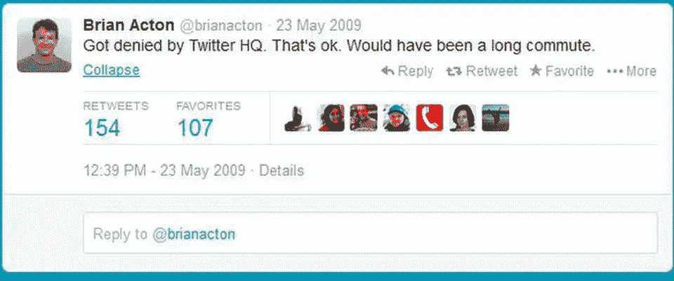

# 这个清洁工在被脸书拒绝后，花了 190 亿美元开发了这个应用

> 原文：<https://medium.datadriveninvestor.com/this-cleaner-built-19-billion-app-after-getting-rejected-from-facebook-9efc884746a7?source=collection_archive---------1----------------------->

## 令人难以置信的鼓舞人心的旅程——一个关于厄运、辩护和坚持的故事…

Pic credits : Pinterest

1976 年出生于乌克兰基辅(前苏联的一部分)的一个小村庄，在一个没有自来水的家庭，他开始在杂货店当清洁工，以养活母亲和家人。他的母亲在他 16 岁时移民到加利福尼亚，靠食品券和政府援助生存，他在十几岁时发现了自己对技术的热情，并通过从旧书店里买的书自学了计算机网络。

# 其他一些最好的系列—

> [**三十天的机器学习 Ops**](https://medium.com/coders-mojo/day-1-of-30-days-of-machine-learning-ops-7c299e4b09be?sk=4ab48350a5c359fc157109e48b1d738f)
> 
> [**30 天自然语言处理(NLP)系列**](https://medium.com/coders-mojo/quick-recap-30-days-of-natural-language-processing-nlp-with-projects-series-ceb674e3c09b?sk=ca09b27b3d5867f23ab4dc367b6c0c32)
> 
> [**30 天数据工程与项目系列**](https://medium.com/coders-mojo/day-1-of-30-days-of-data-engineering-894822fcb128?sk=76ba558bfe2d9f85cbe741e505295531)
> 
> [**数据科学与机器学习研究(论文)简体**](https://medium.com/coders-mojo/day-1-data-science-and-ml-research-papers-simplified-a68b00a3b1c4?sk=56136229ff738bd734f19d2b6953f78c) ******
> 
> [**60 天数据科学与 ML 系列带项目**](https://medium.com/coders-mojo/day-1-day-60-quick-recap-of-60-days-of-data-science-and-ml-6fc021643d1?sk=4e75e043b7630a9f963562ebac94e129)
> 
> [**100 天:你的数据科学与机器学习学位系列与项目**](https://medium.com/coders-mojo/100-days-your-data-science-and-ml-degree-part-3-c621ecfdf711?sk=1a8c7b0c204d73432d56b7d1a3a26474)
> 
> [**你应该知道的 23 个数据科学技巧**](https://ai.plainenglish.io/23-data-science-techniques-you-should-know-61bc2c9d1b3a?sk=1680c36193eb22198974c9008d62a33c)
> 
> [**技术面试系列—编码问题精选清单**](https://medium.com/coders-mojo/mega-post-tech-interview-the-only-list-of-questions-you-need-to-practice-ee349ea197bb?sk=fac3614684daff4b50a70c0a71e4d528)
> 
> [**完成系统设计与最热门问题系列**](https://medium.com/coders-mojo/system-design-made-easy-quick-recap-of-complete-system-design-34af7e3aedfb?sk=bdd6a19edc1f3ce4a5064923f5b68721)
> 
> [**完成数据可视化及预处理系列与项目**](https://medium.com/coders-mojo/complete-data-preprocessing-and-data-visualization-with-projects-mega-compilation-part-2-41584ef0920e?sk=842390da51689b8d43148c3980570db0)
> 
> [**完整的 Python 系列与项目**](https://medium.com/coders-mojo/complete-python-and-projects-mega-compilation-7ec8f7adfe71?sk=ee0ecf43f23c6dd44dd35d984b3e5df4)
> 
> [**完成高级 Python 系列与项目**](https://medium.com/coders-mojo/complete-advanced-python-with-projects-mega-compilation-part-6-729c1826032b?sk=7faffe20f8039fa57099f7a372b6d665)
> 
> [**Kaggle 最会教你的笔记本**](https://medium.com/coders-mojo/my-list-of-kaggle-best-notebooks-topic-wise-data-science-and-machine-learning-part-2-84772863e9ae?sk=5ed02e419854a6c11add3ddc1e52947f)
> 
> [**Git 完整开发者指南**](/the-complete-developers-guide-to-git-6a23125996e1?sk=e30479bbe713930ea93018e1a46d9185)
> 
> [**打赏 Github Repos**](https://medium.com/coders-mojo/6-exceptional-github-repos-for-all-developers-part-1-21e8fa04e150?sk=9140b249af6fe73d45717185fad48962) **—第一部分**
> 
> [**打赏 Github Repos**](https://medium.com/coders-mojo/6-exceptional-github-repos-for-all-developers-part-2-3eec9a68c31c?sk=8e31d0eb7eb1d2d0bbbcecaa66bd4e7e) **—第二部**
> 
> [**所有数据科学和机器学习资源**](/best-resources-for-data-science-and-machine-learning-full-list-5ceb9a2791bf?sk=cf85b2cef95560c58509877a794577ff)
> 
> [**210 机器学习项目**](/210-machine-learning-projects-with-source-code-that-you-can-build-today-721b035649e0?sk=da5f593572a0261a6314afad99a0356c)

## 科技时事通讯—

> 如果你感兴趣，你可以加入我的时事通讯，通过它我向超过 30，000 名读者发送技术面试技巧，技术，模式，黑客——软件开发，ML，数据科学，创业公司和技术项目。可以订阅 **Tech Brew :**

 [## 点火器

### 数据科学，人工智能，人工智能和更多…点击阅读由 Naina Chaturvedi 撰写的 Ignito，子堆栈出版物。推出 7 个月…

naina0405.substack.com](https://naina0405.substack.com/) 

## Github —

 [## 编码器-world 04-概述

### 此时您不能执行该操作。您已使用另一个标签页或窗口登录。您已在另一个选项卡中注销，或者…

github.com](https://github.com/Coder-World04)  [## 程序员 vs 普通人

### 用 20 幅图像概括…你能理解吗？

medium.datadriveninvestor.com](/programmers-vs-normal-people-bf387b5be11c) 

1996 年，他成为 Efnet 互联网中继聊天网络上一个名为 w00w00 的黑客组织的成员，在那里他提高了自己的技术技能，并结识了 Napster 的创始人肖恩·范宁。

 [## SlashData 调查了 159 个国家的 17000 多名开发人员，分析结果如下…

### 惊人的洞察力…

naina0412.medium.com](https://naina0412.medium.com/slashdata-surveyed-more-than-17000-developers-in-159-countries-heres-what-the-analysis-says-d25484a42051) 

> 用他自己的话说，在他基辅郊外的家乡，“我们学校太破旧了，甚至没有室内浴室。想象一下乌克兰的冬天，零下 20 度，小孩子不得不穿过停车场去上厕所。社会极度封闭:你可以阅读《1984》，但生活在那里就是在经历它。”

 [## 编写高效的 Python 代码—第 2 部分

### 使用这些技巧和技术…

naina0412.medium.com](https://naina0412.medium.com/writing-efficient-python-code-part-2-4bf876712677) 

当他报名参加圣何塞州立大学深造时，命运开始自己的转变，但在 1997 年晚些时候，在 EY 短暂担任兼职安全测试员后，他辍学为雅虎工作，担任基础设施工程师。2000 年，他的母亲死于癌症，他独自一人寻找自己的生活，这后来成为一个十亿美元帝国的一线希望。

***他的名字叫“简·库姆”。***

 [## 【假期提醒】:你可以完成的前 5 名免费数据科学、AI & ML 课程

### 令人惊叹的课程…

naina0412.medium.com](https://naina0412.medium.com/holidays-alert-top-5-free-data-science-ai-ml-courses-you-can-finish-8067ecff7c1d) 

# “不废话，让我们开门见山”的关系

就在那时，他遇到了雅虎的第 44 名员工阿克顿。谁[形容](https://www.forbes.com/sites/parmyolson/2014/02/19/exclusive-inside-story-how-jan-koum-built-whatsapp-into-facebooks-new-19-billion-baby/?sh=5530c40f2fa1) Koum 为

> “他非常严肃，比如‘你们这里的政策是什么？“你在这里干什么，”安永的其他人则使用“感情用事”的策略，比如赠送酒瓶。

 [## 使用 Python、OpenCV 和 NumPy 分析视频

### 通过代码实现…

naina0412.medium.com](https://naina0412.medium.com/analyzing-video-using-python-opencv-and-numpy-5471cab200c4) 

这种严肃的风格将他们很好地结合在一起，于是他们离开了雅虎！在 2007 年创建了一个价值 10 亿美元的应用程序。

> 在雅虎的 9 年让他筋疲力尽，最终他在自己的 Linkedin 个人资料上把在雅虎的最后三年描述为“做了一些工作”。

# 拒绝狂欢——一个关于厄运、坚持和证明的故事

他的朋友布莱恩·阿克顿在被推特和脸书拒绝后，在他的推特墙上写下了这些

Image Credits : Twitter

但是拒绝并没有阻止他们。阿克顿在 2009 年 8 月又写道:“这是一个与一些了不起的人接触的好机会。期待人生的下一次冒险。”

 [## 10 个“硅谷”的俏皮话/双关语是如此有趣、贴切且与技术世界相关

### 虽然听起来很搞笑…

naina0412.medium.com](https://naina0412.medium.com/10-silicon-valley-liners-puns-that-are-so-funny-apt-relatable-to-the-tech-world-a2ee797f7949) 

# 30 亿美元的错误—成为脸书拒绝俱乐部的一部分

在他们 2009 年创建该应用程序的两年前，他们申请了脸书的工作，但被拒绝了，后来他们在脸书做了 4 年的董事。

> 他形容自己在 2009 年年中的日子过得像个局外人，一个没人愿意雇佣的软件工程师。

# 环游世界，花光他 40 万美元的积蓄

在搞定雅虎之后！他后来称之为刑事判决，他感到除了阿克顿之外没有任何人在他身边的空虚，于是决定环游世界。就在那时，他遇到了来自俄罗斯的老朋友亚历克斯·菲什曼(Alex Fishman)，他邀请俄罗斯当地人参加披萨派对，大约 38 人不仅来吃披萨，还讨论了 Koum 的应用程序创意近两个小时，因为他们觉得这很“酷”。

 [## 旋转你的创业？4 种正确的方法|数据驱动的投资者

### 1)储备现金——在早期阶段，尤其是种子期，你有可能会一直转到找到…

www.datadriveninvestor.com](https://www.datadriveninvestor.com/2020/12/13/pivoting-your-startup-4-ways-to-do-it-right/)  [## 编程恐怖和幽默第 3 部分

### 继续笑，因为太搞笑了…

naina0412.medium.com](https://naina0412.medium.com/programming-horror-and-humor-part-3-a0bdea3f56f4) 

# What's up 变成了 WhatsApp

随着 2009 年苹果应用商店在 iPhone 上的出现，Koum 于 2009 年 2 月 24 日在加州注册了 Whatsapp，甚至还没有完成该应用的后端代码。他联系了俄罗斯手机开发商 Igor Solomennikov，他们一起开发了这个应用程序，这个应用程序在早期一直崩溃，很不受欢迎。

# 从几乎放弃到病毒式成功

Koum 受够了这些错误和崩溃，几乎要放弃了。

> 就在那时，他找到了阿克顿，阿克顿后来激励他永远不要放弃自己的梦想。

随着事情的发展，是苹果公司让 Whatsapp 生存了下来，他们推出了推送通知，用户可以在任何人给他们发信息时收到通知。没有成本和简单是 whatsapp 的核心，这也是它区别于任何其他消息应用的地方。很快，像 feature 这样的快速短消息服务获得了人们的关注，WhatsApp 的用户群开始增长，自 2009 年以来的 10 年里，仅拥有约 15 亿活跃用户，每天新增 100 万注册用户和 3 亿 DAU(每日活跃用户)。

流行的蓝色双勾显示另一部手机收到了一条信息，这在用户中一炮而红。

> 用他自己在[的话说](https://www.youtube.com/watch?v=xbYprCoLsvY&ab_channel=StartupGrind)——“能够通过一个随身携带的设备，即时联系到地球另一端的人，这是非常强大的。”

***而这正是脸书注意到的！！***

# 【2014 年 2 月，WhatsApp 被脸书公司以惊人的 190 亿美元收购。

作为一个脚踏实地的人和技术梦想家，他在 2014 年向硅谷社区基金会捐赠了近 5.56 亿美元，向 FreeBSD 基金会捐赠了约 150 万美元。

# 从他的旅程中得到的教训—

1.  永远记住你来自哪里——库姆在一个没有自来水的家庭中长大。
2.  相信你的用户的反馈，而不仅仅是你的朋友，因为他们可能会说你的想法很棒/很酷，但他们自己从来不使用这个应用。
3.  保持一个精干专注的团队——WhatsApp 被脸书以 190 亿美元收购时，团队只有 55 名员工。
4.  Koum 讨厌广告，所以 WhatsApp 的营销预算是 0，因为他们从来没有在营销上花一分钱。

*最后但同样重要的是——*

# 永远不要放弃你的梦想:)

参考文献和来源[此处](https://www.forbes.com/sites/parmyolson/2014/02/19/exclusive-inside-story-how-jan-koum-built-whatsapp-into-facebooks-new-19-billion-baby/?sh=5530c40f2fa1)。想多读点？

# 推荐文章—

 [## Stack Overflow 分析了来自 60，000 多名软件开发人员的数据，包括他们的工作时间、语言…

### 以下是他们的发现…

medium.com](https://medium.com/datadriveninvestor/stack-overflow-analyzed-data-from-60-000-software-developers-hours-they-work-languages-they-476ac6ca0197)  [## 黑客地球调查了来自 76 个国家的 16000 名开发者——以下是我的发现

### 惊人的洞察力…

medium.com](https://medium.com/datadriveninvestor/hacker-earth-surveyed-16000-developers-from-76-countries-heres-what-i-found-dbd5d7c422b0)  [## Hacker Rank 分析了来自 10 万多名开发人员和招聘经理的数据——以下是我的发现

### 来自 100，000 多名开发人员和招聘经理的出色分析结果

medium.com](https://medium.com/datadriveninvestor/hacker-rank-analyzed-data-from-100k-developers-and-hiring-managers-here-is-what-i-found-a374b98e937e)  [## 编码原罪:令人捧腹的开发者自白

### “白板”是如何被嘲笑的

medium.com](https://medium.com/datadriveninvestor/coding-sins-hilarious-developer-confessions-f55eb342454e)  [## 编程幽默第 2 部分

### 继续笑，因为太搞笑了…

medium.com](https://medium.com/datadriveninvestor/programming-humor-part-2-f92cf5a26f2b)  [## 10 个让你着迷的诙谐编程笑话

### 这些太搞笑了…

medium.com](https://medium.com/datadriveninvestor/10-witty-programming-jokes-that-will-make-you-go-rofl-a53fbfb91943) 

**访问专家视图—** [**订阅 DDI 英特尔**](https://datadriveninvestor.com/ddi-intel)