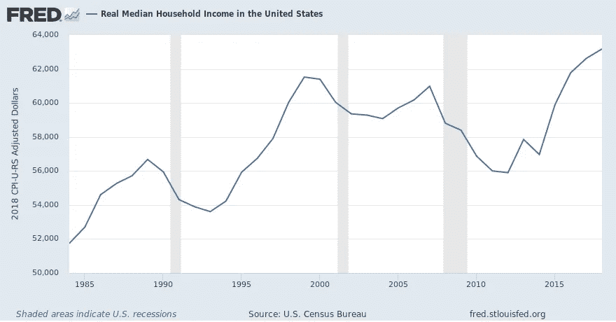
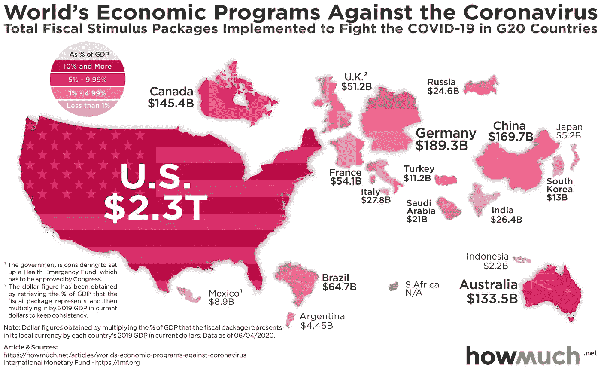
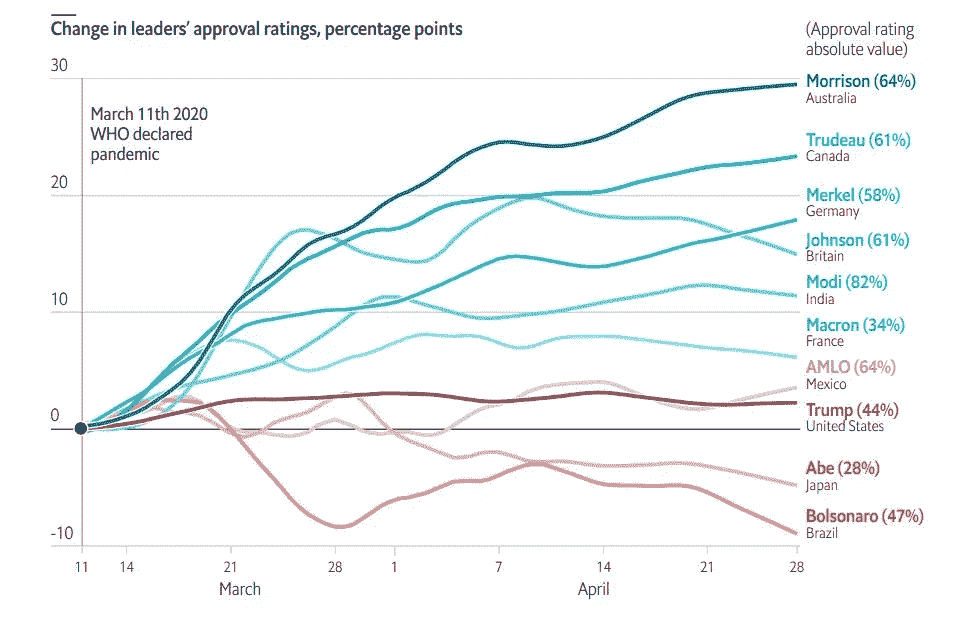

# 这个十年将以政治民粹主义为特征

> 原文：<https://medium.datadriveninvestor.com/this-decade-will-be-defined-by-political-populism-bde34c2b50a5?source=collection_archive---------10----------------------->

## 政治家们试图在新冠肺炎事件后提供解决方案

随着 COVID-19 的袭击，世界各国政府实施了封锁，以防止病毒的传播。在协调中，各国央行实施了各种形式的货币宽松政策，以稳定市场并为企业提供流动性。然后，政府为其公民提供资金，以便在经济上支撑他们度过危机。随着全球失业率的上升和经济开放的延长，“经济复苏”的确切性质或时间很难预测。

[Data From The St. Louis Federal Reserve](https://fred.stlouisfed.org/series/MEPAINUSA672N)

2008 年债务危机爆发时，标准普尔 500 花了大约六年时间(从 2007 年到 2013 年)才完全恢复(达到之前的峰值)。然而，美国的实际个人中等收入用了大约八年半时间(从 2007 年到 2015 年中期)才达到 2008 年债务危机前的水平。这种复苏带来了新的政治浪潮，加大了左翼和右翼之间的分歧。特别是美国，在伯尼·桑德斯的帮助下经历了一场新的左翼政治浪潮。与此同时，唐纳德·特朗普出现了。两人都反复列举了美国随着时间的推移所遭受的经济损失，并承诺改善美国公民的生活。

 [## 保护主义、政治和经济动荡|数据驱动的投资者

### 美国股市昨日出现 400 多点的大幅反转，为未来的事情发出了警告信号。市场…

www.datadriveninvestor.com](https://www.datadriveninvestor.com/2018/06/28/protectionism-politics-economic-turmoil/) 

类似地，经济上的疑虑以许多不同的方式在政治上表现出来并被引导。这导致了德国 AfD(*Alternative für Deutschland)*等政党和 Marine La Pen(法国)、Rodrigo Roa Duterte(菲律宾)等政治人物的崛起。每出现一个博尔索纳罗和特朗普，就会出现一个科尔宾和桑德斯——两人都承诺实现经济繁荣。这些政治竞赛在选民中展开，各自的获胜者出现了。

[Visualization From HowMuch](https://howmuch.net/articles/worlds-economic-programs-against-coronavirus)

然而，2008 年的危机无法与当前的经济损害相比。首先，这场危机正在影响世界上的每一个国家；他们每个人都在借贷和量化宽松(更多或更少的印钞)以维持各自的经济运转。实际上，政府现在只是在维持经济运转，反过来借更多的债，印更多的钱。左边的图表有助于直观显示每个国家向其经济注入了多少流动性。然而，应该指出的是，这是截至 4 月 6 日的数据。随着封锁时间的推移，各国将花费更多的钱来维持现状。此外，失业率正升至新高，国内生产总值正以创纪录的速度萎缩。

这就带来了一个问题:经济能多快复苏，更重要的是，复苏到底是什么？这个以不同形式提出的特殊问题将成为新十年政治的定义。要求全民基本收入的呼声已经越来越高。在美国，越来越多的工人福利和一些全民健康系统的福利正在增加。同样，有人呼吁开放经济，呼吁企业自我调整，呼吁政府减少借贷和支出。

[Data From The Economist](https://www.economist.com/graphic-detail/2020/05/09/covid-19-has-given-most-world-leaders-a-temporary-rise-in-popularity)

各国在后 COVID 时代的危险处境将是债务高企、失业率高企、GDP 萎缩。截至目前，许多政府首脑的支持率都在上升(这种效应被称为团结在旗帜周围效应)。然而，这种影响是暂时的——就像温斯顿·丘吉尔领导英国经历了第二次世界大战，但在下一次大选中落败——一旦潜在的危险(在这种情况下是新冠肺炎)消除，人们的优先事项就会改变。

走出这场危机后，将会出现一些政治家，他们将公众的不满转化为自己的政治成功。后 COVID 时代的经济将是一个公共和私人债务高企、消费需求低迷和经济萎缩的时代。两个思想流派(已经一次又一次出现)将以某种形式再次出现。首先，涉及放松限制、减税和为企业提供各种经济救济以促进就业和增加消费者需求的解决方案是否可行。第二种解决方案是，政府通过创造就业、发放某种形式的全民基本收入或增加福利来干预市场，以提振需求，并增加对企业和富人的税收。

不管解决方案如何，政客们接受民粹主义的头衔和竞选风格只会更有利。即使是现在，政治家也倾向于避免被贴上“中间”的标签。因为“中心”意味着妥协、政治交易和不真实。相反，政治家承诺不切实际的政策(在立法机构无法通过)在政治上变得有利，因为政策失败的责任不会落在承诺该政策的政治家身上，而是落在未能通过该政策的立法机构身上。

政治的本质已经分裂了，意识形态，或者更确切地说，政治竞选和对话的方法也日益分裂。政府和民众所承受的经济负担将过于沉重，以至于政治格局无法回到泰然自若、细致入微的决策方式。在 COVID 之后，政客们会发现把自己定位为不满人群的代言人是有利的。尤其是第一次竞选的新政客。牛津词典将民粹主义定义为，

> “这是一种努力吸引普通民众的政治手段，他们觉得自己的关切被老牌精英集团忽视了。”

左翼政治家将自己定位为反对富裕精英的普通人的盟友，而右翼政治家将自己定位为反对精英全球组织的普通人的盟友。手指将被指出，各种实体将被指责。这场政治斗争将如何收场——只有时间能告诉我们。有一件事是肯定的，民粹主义会继续存在。