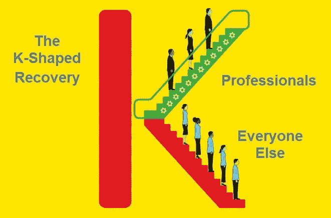
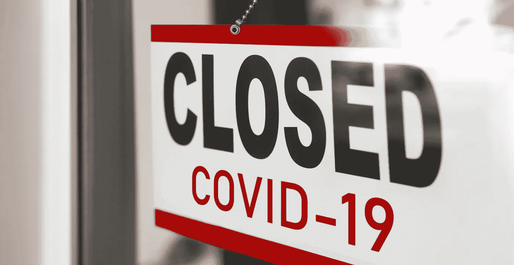

# 这次经济复苏不太好！

> 原文：<https://medium.datadriveninvestor.com/this-economic-recovery-is-not-ok-9b4b45f88e79?source=collection_archive---------3----------------------->

当美国正从它的第一个(希望是唯一的)疫情万圣节中恢复过来时，美国公民继续受到错误信息的困扰——我个人觉得这比 D.I.Y. Joe 的奇装异服更可怕。

在我的上一篇[文章](https://uxdesign.cc/the-top-3-socio-technical-impacts-of-the-pandemic-era-dcdb86f4579)中，我们谈到了塑造疫情时代的三大*社会技术*影响。这里有一个简短的回顾:COVID 引发了远程一切的迁移，刺激了加速采用*货币化*技术，这间接扩大了不平等差距，因为社会经济弱势群体难以获得保持生产力的必要手段。我还提到，这只是混乱的开始，我必须承认这不是什么好兆头。避开 COVID 需要自制力&无私，这两样东西在我们的社会中似乎越来越少。所以，我要重申，这场斗争还远未结束，这一点从连续几天破纪录的案件中可见一斑。

也就是说，白宫官员告诉我们，我们已经度过了一个拐角，正在经历 V 型经济反弹。对一部分人来说，这可能是真的，但对大多数美国人来说，情况并非如此。据《华尔街日报》报道，我们现在知道，没有学士学位的人比受过高等教育的人的就业率要低得多。我们已经知道，有色人种在这个群体中所占的比例不成比例，部分原因是系统性的不公正和不受约束的隐性偏见。但是这到底意味着什么呢？好吧，服务业的人们受到了伤害，如果你住在一个相对大都市的地区，你每次走出去都会看到。相反，那些在信息技术或专业服务领域工作的人却蒸蒸日上。几乎所有这些工作都需要学士学位才能被考虑就业，所以根据我前面的观点，我们可以大致估计这个群体的人口构成。这是我们*实际上*正在经历的发散的、K 形复苏的本质；而不是经济安全的统一和公平的反弹。这是一个我可以自信地说不 OK 的趋势！

[It’s professionals versus everyone else in the K-shaped economy.](https://www.thestreet.com/mishtalk/economics/its-professionals-vs-everyone-else-in-the-k-shaped-recovery)

让我们花一些时间来更好地理解复苏的每个阶段的情况。处于曲线上臂的工人受益于高技能工作(转换成本高)、获得技术和在家工作的能力。几个月前，我对研究生进行了一项定量研究，以更好地理解这一特权群体中员工的心理特征。为此，我在 Tableau 中使用 K-means 算法进行了聚类分析。不，我不是因为“K”才选择这种模式的，我使用它是因为它是一种在最大化集群间距离的同时最小化集群内距离的有效方法。基本上，它通过观察受访者的整体体验而不是孤立的数据点来描述他们。

旁注:这是我作为产品经理在日常工作中使用的一种有价值的方法，用来分析不同用户群之间的行为差异。

从这些数据中，这个模型发展出了四个集群，我在下面根据它们的轮廓定向定义了四个集群。这就是科学与艺术相遇的地方。

**上回收臂的四种情绪:**

1.有弹性的(39%)——远程工作也不是那么糟糕。

这些受访者表示，在读研之前，远程工作的舒适度最低。他们还报告说，在这些群体中，工作与生活的平衡得到了唯一的改善。最后，与 COVID 之前相比，他们对工作的态度有了最大的改善，同时报告了工作时间的第二大增长。这个集群偏年轻，拥有不成比例的设计师数量——这表明这个专业细分市场可能在这个新世界取得成功。这也意味着某些行业的雇主可能有比他们想象的更多的时间来决定如何重新安置他们的办公室。

2.感同身受(29%)——*我同情那些没有这种奢侈的人。*

这些受访者开始非常适应远程工作，并认为他们同事的工作质量比他们自己的工作质量有显著的提高。这突显出，雇主可能比他们想象的更容易获得在家工作的支持者和情感支持资源。这意味着他们可以通过给员工领导的机会来部分解决一些压力引发的变化。这些是应该抓住的时机，因为它们可以建立更强大的公司文化，培养新的管理者。

 [## 一瞬间学会数据科学！？数据驱动的投资者

### 在我之前的职业生涯中，我是一名训练有素的古典钢琴家。还记得那些声称你可以…

www.datadriveninvestor.com](https://www.datadriveninvestor.com/2020/07/23/learn-data-science-in-a-flash/) 

3.**未实现的**(18%)——*我怀念以前的常态。*

这些受访者观察到工作质量下降幅度最大，而他们的工作时间和工作生活平衡保持不变。他们非常适应远程工作，但是自从呆在家里后，他们对工作的态度发生了最坏的变化。似乎个人贡献者正在努力在他们的工作中找到满足感，因为远程协作尚未成为集中创造性参与的完美替代品。

4.不满的(13%)——*嗯……并不是每个人都蒸蒸日上。*

这些受访者观察到工作时间增加最多，同事和个人工作质量下降第二多。此外，他们观察到，在研究生院和家庭订单之后，远程工作的舒适度下降幅度最大。最后，与 COVID 之前相比，他们报告了对工作态度的最大变化。这部分人年龄较大，而且由经理组成的比例不成比例。雇主们需要意识到，他们的经理似乎是最努力向远程工作转变的人。他们很可能被虚拟会议淹没了，感觉不到这种交流方式的好处。雇主需要记住，他们的经理提供的价值往往来自于身体互动提供的即兴对话和传递最新信息。

对于处于曲线上臂的工人来说，感谢你有机会免受疫情带来的大部分动荡的影响。归根结底，很明显，远程工作是为某些行业和职业保留的奢侈品。但是从数据来看，似乎并不是所有的远程工作都是平等的。

参见— [“人们对远程工作的真正爱与恨”](https://www.wsj.com/articles/what-people-really-love-and-hate-about-remote-work-11603018844)。

**下恢复臂的关键策略:**

现在，让我们把注意力转向曲线的下臂。这是一个复杂和多方面的问题，我没有学术上产生的数据。但是，我拥有的是商业头脑，设计训练，最重要的是，同情心。我利用这些优势来设计以下策略。

[Nearly 100,000 businesses that shut down are now out of business.](https://fortune.com/2020/09/28/covid-buisnesses-shut-down-closed/)

对于处于曲线下臂的**被打乱的业务**，努力实现连续性和利润最大化，我的建议是高度关注高参与度的客户。根据您的业务模式调整以下策略，开始行动:

1.  **消除客户获取中的摩擦。这从第一天起就建立了好感和信任。**
2.  **开发优质服务&产品。**这使您能够瞄准新的使用案例并创造更多收入流。
3.  **简化您的客户体验。**限制接触透明定价&改进的*浏览能力*无论你在哪里推销你的产品。

这些策略将提高您的运营效率，并确保您从资本中获得最高的效用。

对于曲线下臂的失业工人，我的建议有两点:

1.  **保持安全！认真对待你自己和你所爱的人的健康安全。与主流错误信息相反，疫情比以往任何时候都更糟糕，现在不是放松自律的时候。如果你生病了，你就不能重新工作。**
2.  **自我投资！**仔细审视你的核心能力，列出一份在新经济中对你有用的潜在互补技能清单。我们正在进入一个时代，在这个时代，持续学习将是保持劳动力竞争力的必要条件。如果人们认为他们的处境已经不可挽回，他们需要确定他们可以转移的技能或再技能。

[Reskilling can soften the blow from the pandemic.](https://hbr.org/2020/06/how-reskilling-can-soften-the-economic-blow-of-covid-19)

正如我们所知，与一些白宫附属机构不同，要保持运转，需要的不仅仅是“想要成功”。谁不想成功？！这将需要个人投资(新技能)和经济投资(新政策)来弥补大部分下层民众起步时的不平衡禀赋。最后，我将留给你们三个关键的统计数据来说明我们错位的激励和脱离实际的政策的状况:

1.  不到一个月，共和党向最高法院确认了一名保守派法官
2.  在不到两个月的时间里，他们还通过了针对 T2 超级富豪的 1.9 万亿美元减税法案
3.  现在，距离**允许数百万美国人的扩大失业福利到期已经过去三个月**…猜猜他们现在处于复苏曲线的哪个部分？

当我们在 11 月 3 日之后规划前进的道路时，请记住这一点。

## 访问专家视图— [订阅 DDI 英特尔](https://datadriveninvestor.com/ddi-intel)