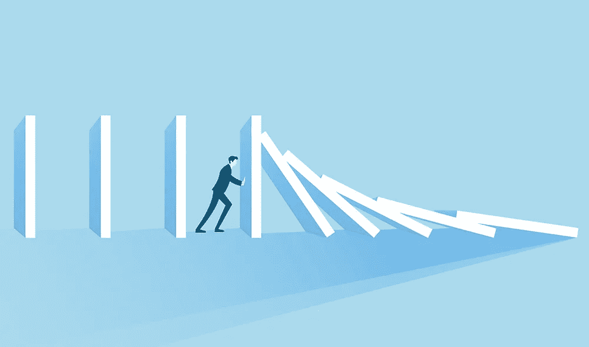

# 这次金融危机不同于上次——这最终可能是一件好事

> 原文：<https://medium.datadriveninvestor.com/this-financial-crisis-is-not-like-the-last-one-and-that-may-end-up-being-a-good-thing-14b7bf3a2e60?source=collection_archive---------6----------------------->

像你一样，我也一直在试图理解经济、市场和我们的健康在过去的一个月中似乎如此迅速地瓦解的速度。此外，和你一样，我被困在家里，花了比平时更多的时间看新闻和与家人和朋友交谈。鉴于我在投资行业，正如你所料，我收到了大量关于 COVID19 金融危机方面的问题。

我发现自己一遍又一遍地与投资者进行着同样的对话。我想我会分享它，希望它能帮助其他人对经济和金融市场正在发生的事情有更多的了解。我不认为这是正确的或终极真理。我只是试图从过去的金融危机中识别出一些模式，并希望利用这些模式来帮助这次的决策。

 [## 更好的预算，打造更大的|数据驱动型投资者

### 即使是专家也承认它们并不完美。从 1 到 10 的范围内，安东尼·科普曼和德尔…

www.datadriveninvestor.com](https://www.datadriveninvestor.com/2018/11/08/budget-better-to-build-bigger/) 

每次金融危机都是独一无二的。然而，所有的金融危机都有可重复和可识别的模式。这场金融危机正以自然灾害的模式展开。大衰退金融危机以银行业危机的模式展开。有区别，理解就足够有意义了。这两者之间的差异可以有意义地决定复苏会是什么样子，以及复苏需要多长时间。理解这种差异有助于我们思考和行动。

所有的自然灾害都会在有限的时间内摧毁经济

显而易见，我们现在经历的是一场灾难。在任何灾难中都会有人丧生。这发生在像战争或恐怖事件这样的人为灾难中。它也发生在自然灾害中，如飓风、洪水、火灾、地震等。在这个特殊的例子中，灾难是由一种全球性的病毒引起的。大多数灾害都局限于特定的地理区域。这场危机的不同之处在于，它是全球性的。

就经济学而言，几乎所有的灾难都有一个共同点——失业。当灾难发生时，灾区的经济会立即停止运转。普通商品或服务的供应——餐馆、家庭用品、服务等。—都走开。与此同时，消费者对普通商品和服务的需求也立即消失了。当然，我说的不是生存必须品。这里我指的是在正常经济条件下经常交换的正常商品和服务。因此，在灾难期间，消费品和服务的供应和需求都不复存在。

这就是现在正在发生的事情。灾难来袭，政府立即关闭了所有企业。这实际上切断了日常商品和服务的需求和供应。正如你所料，一场金融危机随之而来。

我们可以从过去的自然灾害中找到一些可识别的模式。在每一次自然灾害中，商品和服务的供应以及对商品和服务的需求在特定时期(取决于灾害)都保持在非常低的水平。然而，一旦自然灾害的直接影响过去，供应和需求的活动水平往往会迅速回升。

这是因为供应和需求都被一些外力(自然灾害)人为地压低了。个人在一段时间内不能消费商品和服务。然而，一旦这种人为的力量被移除，个人倾向于“弥补”他们无法消费的那段时间。你可以把它比作一根橡皮筋，被拉得很开，然后又迅速弹回。

在许多情况下，灾难刚刚过去，消费水平就迅速超过了灾难前的水平。飓风和洪水等灾害通常会造成一定程度的物质破坏。在这种情况下，基础设施需要重建，因此对物资和服务的需求超过了以前的水平。在 COVID19 的情况下，没有材料和基础设施的破坏。然而，消费商品和服务的能力遭到了破坏，比如旅游、酒店和餐馆(以及其他许多东西)。我怀疑，一旦灾难的危险过去，由于被抑制的需求，个人将大大增加他们对这些商品和服务的消费。

在危机的这个阶段，我仍然认为，商品和服务的供需可能会出现相当快速的反弹。人们想要工作、消费和走出家门。企业希望提供这些服务。

**强劲的经济体往往会从自然灾害中迅速反弹**

在自然灾害中，个人和社会可以拥有的最大资产是拥有丰富资产、劳动力和资源的强大经济的支持和后盾。美国拥有所有这些东西。然而，帮助个人和企业在尽可能安全的情况下尽快崛起是极其重要的。时间是至关重要的。

在过去的灾难中(如第二次世界大战、911 袭击、旧金山地震)，美国之所以能够成功而迅速地复苏，是因为它拥有丰富的资源、充足的劳动力和创新的企业。工业和经济帮助美国从那些灾难造成的生命和商业损失中恢复过来。如果处理得当，工业和经济也有能力帮助我们从这次危机中迅速复苏。

然而，诀窍(也是棘手的)是当经济再次变得安全时，让它恢复运行。在诸如战争、飓风和洪水等灾难中，知道何时再次安全是相当明显的。我们发现，在疫情期间，确定安全性并不容易。不管怎样，我们都要想办法弄清楚。

密度似乎在这个疫情中起了很大的作用。人口密度较高的城市和州往往会受到更严重的危机影响。那些人口密度较低的国家似乎更好地经受住了这场风暴——至少在现阶段是这样(是的，我意识到我在简化这一点)。

随着企业重新上线，我怀疑劳动力密度可能会发挥作用。从理论上讲，员工密度较低的工作环境可以更快地恢复运行。酒吧和餐馆等高密度工作环境可能需要更长时间才能恢复服务。

我认为很明显，所有的企业都不会马上开始运营。最有可能的是，某些经济领域将在几周或几个月内以交错的步伐发展。打个比方，这不会像打开电灯开关一样。这更像是重启一台电脑，先启动某些系统，然后再启动其他系统。

与大衰退(08/09)和大萧条(20 世纪 30 年代)的比较是不准确的

在过去的几周里，我听到人们将这次金融危机与大衰退(08/09)和大萧条(20 世纪 30 年代)相比较。所有的金融危机都是痛苦的，它们都包含不同程度的失业。然而，我认为这些比较是不准确的。这是一场非常不同的金融危机。

大衰退和大萧条都是由银行系统、经济和商业周期健康的系统性长期问题造成的。在这两种情况下，由于个人和企业过度举债，导致了大规模的银行体系问题。就大衰退而言，是由华尔街衍生品加剧的住房债务问题。在大萧条的例子中，是股票市场保证金杠杆的过度使用伴随着大量的政府政策错误。多年来，政策失误加剧了失业。在这两种情况下，银行和金融体系都走向了彻底崩溃的边缘。

现在不是这样——至少在现阶段不是。

然而，这场危机已经导致数百万人瞬间失去工作。我们在大衰退(08/09)中没有经历过这种情况。正因为如此，人们很自然地把这比作大萧条。这场危机影响到每个人。每个人都感到不适和某种程度的流离失所。

是的，数百万人失去了工作，这本身就是一场灾难。然而，今天没有一家企业因为过度负债或经济状况不佳而倒闭。由于自然灾害，企业被迫关闭。这是一个重要的区别。如果过去的灾难可以作为指导，理论上，一旦灾难的影响过去，大多数企业将立即恢复营业。

**我们可以从灾难中恢复过来，重新开始工作**

不幸的是，一场由灾难引发的金融危机，有可能演变成一场由银行体系的弱点引发的更大规模的金融危机。当消费者对商品和服务的需求遭到永久、持久的破坏时，就会出现这种情况。可以肯定的是，我们已经经历了这种程度。如果我们继续让经济停止运转，没有明确的、有计划的、明确的回归日期，我们就很有可能对经济造成长期的损害。然而，我认为仍然有时间来避免这种情况。

为了从这场灾难中恢复过来，我们的领导人需要避免错误的、二元的选择。说我们要么需要回去工作并冒着生命危险，要么完全呆在家里以避免生命损失是一个错误的选择。我们需要做到这两点。我们有能力做这两件事。

我知道有些人失去了朋友和家人。这对他们来说是灾难和悲剧。我知道有些人失去了工作，面临着经济破产。这对他们来说也是一场灾难和悲剧。这两件事都是悲剧。让人们重返工作岗位和保护人们免受伤害并不相互排斥。这两件事我们都可以做。我们足够聪明，知道如何做到这两点。我们很棒。

马克·帕特森

P2 合伙人

4–13–2020