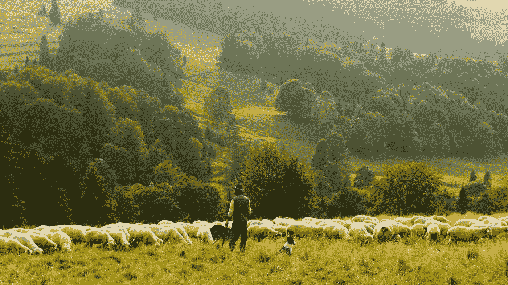
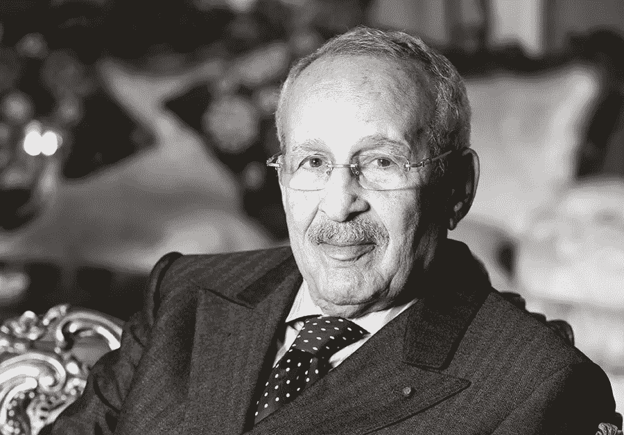

# 这个文盲从一个饥饿的牧羊人变成了一个拥有 30 亿美元的人

> 原文：<https://medium.datadriveninvestor.com/this-illiterate-went-from-a-starving-shepherd-to-a-man-of-3-billion-5b22058c37f7?source=collection_archive---------11----------------------->

## 15 岁的牧羊人。18 岁的企业家。56 岁的百万富翁。

Photo by [Biegun Wschodni](https://unsplash.com/@biegunwschodni?utm_source=medium&utm_medium=referral) on [Unsplash](https://unsplash.com?utm_source=medium&utm_medium=referral)

很少有人白手起家成为亿万富翁。更罕见的是那些没有受过教育却合法地变得疯狂富有的人。

据《福布斯》杂志报道，房地产大亨米洛德·查阿比的情况就是如此，他积累了大约 30 亿美元的财富。累积起来，这个里程碑是在一个非洲发展中国家，摩洛哥达到的。

# 早期生活

米洛德出生在索维拉郊区的一个偏远村庄。他经历了艰苦的教养，伴随着一连串无与伦比的不幸。

他的家庭遭受了八年的极度贫困。他的一个弟弟就在他眼前饿死了。*他说*“我们正遭受着索马里的贫困”。**

*由于学校远在天边，他被委托照看一群羊。但是很快，一只狼捕食了他的一只山羊。*

*由于害怕父亲，他逃离了部落，开始了新的冒险，希望过上更好的生活。*

# *进入商界*

*此后，Chaabi 在这个国家流浪了几年，做些粗活，最后在 Kenitra 定居下来，成了一名蓝领工人。*

*在做石工的时候，米卢德对房地产产生了浓厚的兴趣。所以，他在 18 岁时决定开始自己的建筑生意。*

*这家初创公司由两名员工组成，开始时并没有产生巨额利润。但对我们的企业家来说，这是一个培养精明的商业头脑和留出一些钱的好机会。*

*16 年过去了，我们才开始拓展业务，探索新的市场机会。下一站是瓷器市场。*

*因此，米卢德创立了瓷器生意*“超级陶瓷”*并不断增加他的资产，甚至超越了摩洛哥本土。*

*他说，在他成为一名商人之前，贸易和商业只限于一些犹太人、法国人以及摩洛哥被殖民时期一些著名的摩洛哥家族。因此，涉足贸易行业是一个漫长而艰难的过程。*

# *转折点*

*Chaabi 想成为一家名为*“DIMATIT”*的法国公司的投资者。但不幸的是，他们拒绝了他的请求。20 年后，当公司濒临破产时，他介入并购买了公司的大部分股份。*

*成为*【迪玛蒂特】*的主人，是他人生的敲门砖。该公司帮助他建立了新的业务，专门从事从石化到酒店行业的广泛活动。所有这些过去和现在都非常有利可图。*

*他在 56 岁时创立了价值数十亿美元的公司" *Ynna Holding"* ，这成为他大部分财富的来源，也是他成为亿万富翁的原因。*

*截至 2020 年， *Ynna Holding* 的估计营业额为 20 亿美元，拥有超过 20 000 名贡献者。*

* [## 首次创业的 4 个资金管理技巧|数据驱动的投资者

### 超过 82%的企业倒闭是由于财务管理不善和现金流问题。开始新的…

www.datadriveninvestor.com](https://www.datadriveninvestor.com/2020/10/23/4-money-management-tips-for-first-time-entrepreneurs/)* 

# *晚年*

*在令人难以置信的记录之后。我们的亿万富翁回到了马拉喀什。他搬出家乡时找不到工作的那个当时的鬼城。但现在，由于他创建的连锁酒店，这里成了游客的热门目的地。*

*在马拉喀什，他享受着做梦也想不到的奢华生活。开法拉利，打高尔夫。*

*当被问及他巨大成功背后的秘密时，Chaabi 说，如果没有自信和对上帝的信仰，他不可能达到如此高的地位。*

*他接着说，这份荣耀的一部分要归功于他亲爱的、支持他的、忠诚的妻子，她在他所有的起起落落中都站在他的身边。*

*在成为非洲著名的慈善家后，查比在德国汉堡去世，享年 85 岁。*

**

*Source: [challenge.ma](https://www.challenge.ma/hommage-a-miloud-chaabi-67814/)*

# *课程*

*这个故事的目的不是讲述一个在写这个故事的时候已经死去的人的传记。*

*而是从一个小时候一无所有，长大后却拥有一切的人身上吸取一些教训。*

*最重要的一点是，米洛德的愿景与大多数白手起家的亿万富翁的愿景一致。这个愿景源于这些信念:*

*   *你现在所在的地方不是你明天要去的地方。*
*   *不要只关注自己的专长。也探索新的领域。你永远不知道头奖藏在哪里。*

> *记住:
> 哥伦布发现美洲是一种运气。
> 埃隆·马斯克在三个截然不同的领域证明了自己。金融、汽车和航天工业。*

*   *实践经验应该优先于理论知识。在一天结束的时候，你最终会进入商业世界。对吗？所以为什么不早点进入呢。*
*   *要耐心*

*同样值得注意的是，你不能通过复制他人的生活来获得成功。相反，投入你的生命去解决共存的问题。*

*问题就越大。奖励也是。*

## *获得专家观点— [订阅 DDI 英特尔](https://datadriveninvestor.com/ddi-intel)*