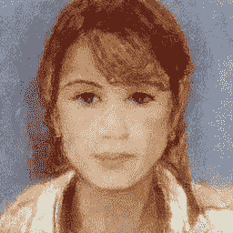
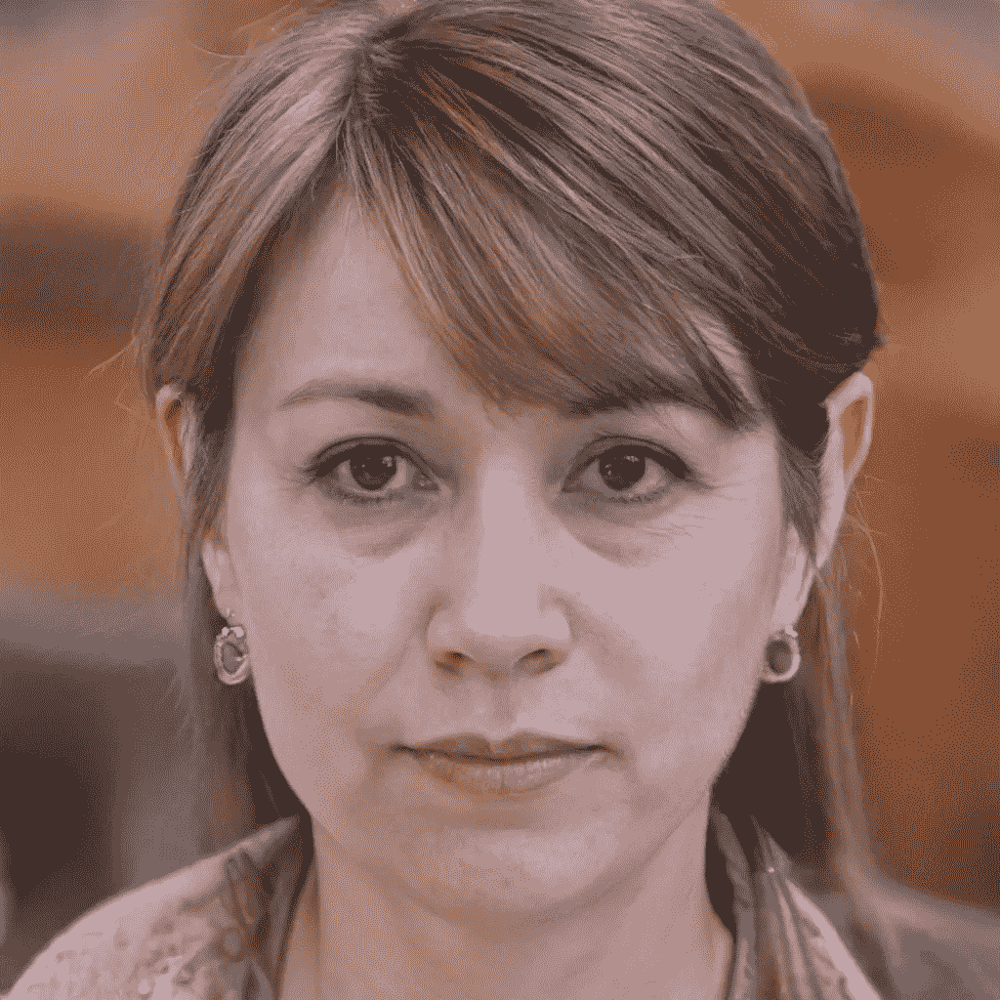
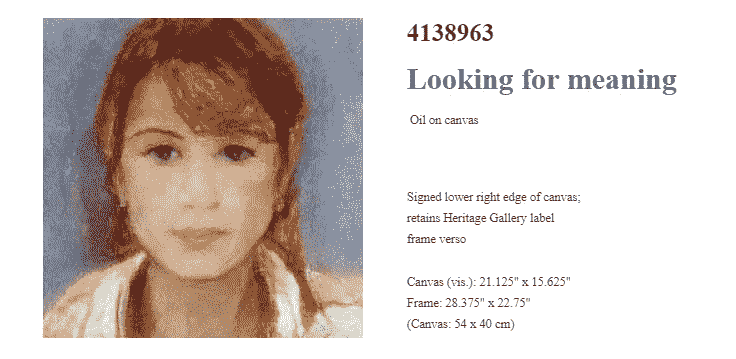
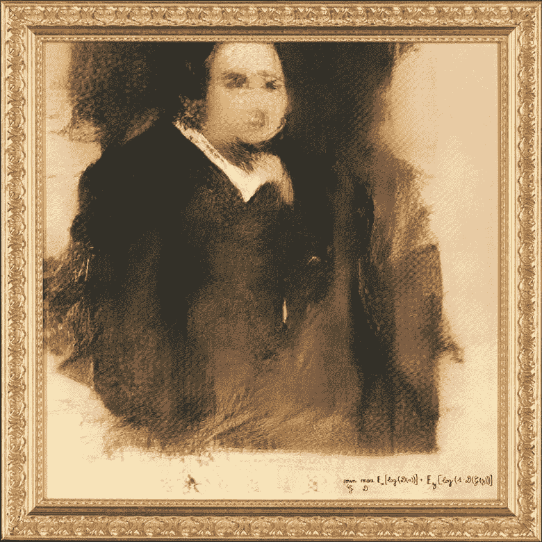
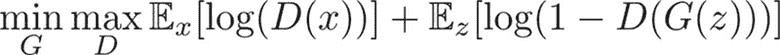

# 这是一个不存在的人的人工智能作品

> 原文：<https://medium.datadriveninvestor.com/this-is-an-ai-generated-artwork-from-a-person-who-doesnt-exist-f81b224984f0?source=collection_archive---------5----------------------->

你现在看到的这个，是我用人工智能制作的艺术品。首先创建一个根本不存在的人，用甘模型(检查[https://www.thispersondoesnotexist.com/](https://www.thispersondoesnotexist.com/)得到一个你自己！).然后，使用造型模型创建绘画作品。

An AI-generated person for the creation of the artwork

最近，我不幸碰到了一件艺术品，这件艺术品让我想起了著名的“墙上的香蕉”这件作品。只是这一次，它躲过了动物虐待，实际上使用了标签。

我看到这张图片的原因是，最近有人提醒我，社交平台中存在与辱骂和暴力内容相关的巨大问题。尤其是对动物，可悲的是，动物在所有国家都没有同样的权利。比如匈牙利、芬兰、罗马尼亚，甚至美国的一些州。我考虑下次再讨论动物权利和社交媒体的话题。

 [## 一名大学生使用语言生成人工智能工具创建了一个病毒式博客帖子|数据驱动…

### 作为作家，我们喜欢告诉自己，我们处在一个无法自动化的职业中，至少短期内不会。但是…

www.datadriveninvestor.com](https://www.datadriveninvestor.com/2020/09/15/a-college-student-used-a-language-generating-ai-tool-to-create-a-viral-blog-post/) 

当我看到那张照片时，我被激怒了，我只想到了被我们的社会压迫的数百万只动物，它们生活在乳制品行业、肉类行业、有斗牛的休闲行业，以及现在的艺术领域。

我说出了情况，用一种也许有些夸张的方式说出了我的想法和观点。我从这位艺术家的一位朋友那里得到的回答之一是，我不懂艺术，如果我认为这不是艺术，那是因为我没有头脑。回答中剩下的“争论”主要是关于我的长相，以及我的其他身体特征。他们不会回答他们是否通过这种类型的“艺术”支持/促进虐待动物。但相反，每次我问起这件事，这个人只是把话题改回我的长相和内容，抱怨我做的事情和这个领域没有用，没有人从中看到价值。

当我在为大学和工作做无止境的作业时，我想到了它。我想，有些人对自动化、技术以及它们在未来不可避免的影响有多么不同。

也许有些人认为，作为艺术家、画家、雕塑家或编剧，算法永远不会比他们更好。或许他们是对的。

或者也许有一天，AI 将能够再造一个“墙上的香蕉”，并且无需拥有人脑就能理解艺术。

我可以肯定的是，今天，在男性所知的所有专业和非专业领域，科技仍有很长的路要走，才能继续给我们带来惊喜。

# 自己试试！

我很乐意与你分享一些免费的在线工具，让你尝试使用人工智能来创作艺术:

*   [**Runway ML**](https://runwayml.com/)——一个简单的、无代码的工具，让以创造性的方式实验机器学习模型变得简单。我们全体员工的选择。
*   [**【ganbreader】**](https://ganbreeder.app/)——使用 ganbreader 繁殖两个图像以创建新颖的新图像。(注意 GANbreeder 改名为 ArtBreeder，有几个 AI 模型操纵照片)。
*   [**Magenta**](https://magenta.tensorflow.org/)——一个开源研究项目，探索机器学习作为一种工具在创作过程中的作用。(需要编码技能)。
*   [**处理**](https://processing.org/) —一个灵活的软件速写本和语言，用于学习如何在视觉艺术的背景下编码。包括 [p5js](http://p5js.org/) (针对 JavaScript 的处理)和 [Processing.py](https://py.processing.org/) (针对 Python 的处理)。【处理不使用 AI，但却是生成性视觉艺术的伟大工具】。
*   [**ml5 . js**](https://ml5js.org/)—ml5 . js 旨在通过网络让艺术家、创意程序员和学生等广大受众能够接触到机器学习。

# 人工智能生成的音乐/声音:

*   [**Magenta Studio**](https://magenta.tensorflow.org/studio)—基于 Magenta 开源工具和模型构建的音乐插件集合。
*   [**AI 二重奏**](https://experiments.withgoogle.com/ai-duet)——用一架回应你的钢琴演奏。
*   [**NSynth Sound Maker**](https://experiments.withgoogle.com/sound-maker)—创造自己的混合声音和乐器。
*   [**MuseNet**](https://openai.com/blog/musenet/) —用 10 种乐器生成 4 分钟的音乐作品，用 MuseNet(GitHub 上也有)组合从乡村到莫扎特的风格。
*   [**基音检测**](https://ml5js.org/docs/PitchDetection) —使用预先训练好的基音检测模型，通过电脑麦克风估计声音文件的基音。

# 人工智能生成的图像/图片:

*   [**深度梦境生成器**](https://deepdreamgenerator.com/) —使用深度梦境生成器，使用谷歌深度梦境的增强版本来风格化您的图像。
*   [**DeepArt.io**](https://deepart.io/) —上传一张照片，用这个人工智能图像生成器应用不同的艺术风格，或者将一张照片变成自己的人工智能肖像(也可以查看 DreamScope)。
*   [**Visionist**](https://apps.apple.com/us/app/visionist/id1071126584) :上传并应用 AI 艺术风格到你的照片上，包括抽象滤镜、剪影人像等(iOS。由 3DTOPO 公司制造)。
*   [**GoArt**](http://goart.fotor.com/) —使用这个 AI 图像生成器创建 AI 照片效果，使您的照片看起来像著名的肖像画。(Web，Android 和 iOS。由 Fotor 制造)。
*   [**深度天使**](http://deepangel.media.mit.edu/) —自动从图像中移除物体或人物。(Web。麻省理工制造)。
*   [**Google Deep Dream**](https://github.com/google/deepdream)—实现 Google Deep Dream 的 GitHub 库。
*   [**gan breader**](https://ganbreeder.app/)—将图像合并在一起，创建新的图片，制作混合 AI 刻画，并创建从未见过的野生新形式。(GANbreeder 现在叫 ArtBreeder)。

# 人工智能艺术品售价 43.25 万美元

[*Portrait of Edmond Belamy*, 2018, created by GAN (Generative Adversarial Network)](https://www.christies.com/lotfinder/prints-multiples/edmond-de-belamy-from-la-famille-de-6166184-details.aspx?from=salesummery&intObjectID=6166184&sid=18abf70b-239c-41f7-bf78-99c5a4370bc7). Sold for $432,500 on 25 October at Christie’s in New York. Image © Obvious

这幅镀金相框里的画像描绘了一位肥胖的绅士，可能是法国人，从他深色的厚外套和朴素的白领来判断，他是一名教徒。这幅作品似乎还未完成:面部特征有些模糊，画布上还有空白区域。奇怪的是，整个构图略微向西北方向偏移。墙上的一个标签上写着，画中人名叫埃德蒙·贝拉米，但关于这幅作品的来源的线索是右下角艺术家的签名。用高卢草书写着:

Image © Obvious

这幅画像不是人类头脑的产物。它是由一种算法创建的，这种算法是由带有许多括号的代数公式定义的。当它在 10 月 23 日至 25 日在佳士得的*版画&倍数*拍卖会上被拍卖时，*埃德蒙·贝拉米的肖像*以令人难以置信的 432，500 美元售出，标志着人工智能艺术在世界拍卖舞台上的到来。

该团队从在线艺术百科全书[维基百科](https://www.wikiart.org/)收集了一组 15000 幅肖像，时间跨度从 14 世纪到 19 世纪，并将它们输入到 GAN 算法中。GAN 算法有两个部分:生成器和鉴别器。生成器学习了肖像的“规则”，“例如，每样东西都有两只眼睛和一个鼻子，”Caselles-Dupré说，描述了一个大约需要两天的过程。然后，它开始根据这些规则创建新的图像。与此同时，鉴别者的工作是审查图像，并猜测哪些是来自数据集的“真实”图像，哪些是来自生成器的“虚假”图像。

我们很难自然而然地认为 AI 可以成为我们的盟友，而不是我们的敌人。但这就是为什么我们都应该参与这场新的现代革命。

## 获得专家视图— [订阅 DDI 英特尔](https://datadriveninvestor.com/ddi-intel)