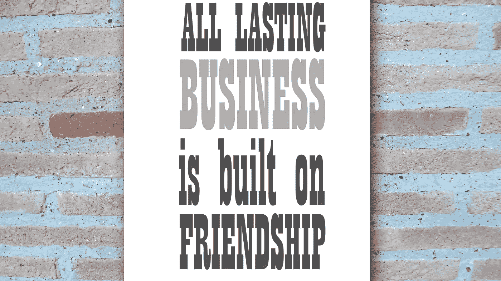

# 这是致富的第一秘诀

> 原文：<https://medium.datadriveninvestor.com/this-is-chamath-palihapitiya-1-secret-to-becoming-rich-add17b35ae4d?source=collection_archive---------11----------------------->

## 如何以正确的方式积累资本

Canva Pro Image

在作为创始 CEO 领导公司超过 27 年后，杰夫·贝索斯从亚马逊离职。

毫无疑问，自 1994 年迈出第一步以来，杰夫·贝索斯已经建立了世界上最伟大的公司之一。

在一本股市杂志上，我读到过他自 1997 年 IPO 以来，为他的投资者创造了 225，000%的资本收益。

这对亚马逊的投资者意味着什么？

让我们假设有人在 1997 年亚马逊首次公开募股时投资了 100 美元。它会购买 5 股。

杰夫·贝索斯在股票分割方面做出了一些神奇的举动。1998 年，他进行了第一次 2:1 拆分，这将使虚拟人物在亚马逊的持股数量翻了一番。

毕竟，从 5 股中拆分出来的股票将总共产生 60 股，长话短说。

在我写这篇文章的时候，亚马逊的标价是 3321 美元，1997 年的 100 美元现在大约是 20 万美元，这意味着 20 万的资本收益。

# 如何致富？

现在是 2021 年，回顾 1994 年——很明显，亚马逊是成功的，杰夫·贝索斯是地球上最富有的人。

但是，许多公司在 90 年代后半期试图创造一个类似杰夫·贝索斯的成功，让我们面对它，说实话。

这些公司都不存在了，促进电子商务的先行者不存在了。

上世纪 90 年代，微软(Microsoft)或苹果(Apple)等其他拥有长期技术记录的公司，从事的不是电子商务，而是与互联网无关的其他行业。

投资亚马逊、苹果或微软等公司会创造大量财富。从字面上什么都没有或 100 美元，可以创造 20 万美元的价值，并有更高的投资和更高的回报。

在这个世界上，致富的唯一途径就是投资企业，或者作为创始人创办一家企业，让它成为另一个亚马逊。

说起来容易，做起来不容易。

当一个行业出现淘金热时，在众多企业家中找出持久公司的秘诀是什么？

# 选股的秘密

美国-斯里兰卡投资者 Chamath Palihapitiya 找到了解决方案，他在 1997 年的一次演讲中提出了这个方案。

Chamath 在创建自己的社会资本基金之前，曾在美国在线和脸书任职，职业生涯非常有趣。该基金已经投资了 350 多家公司，如 Box、Slack 或 Yammer，并有超过 50 家退出的记录。

问题是，如何增加人们在众多 20 年代上市的公司中找到下一个亚马逊的机会

社会资本的创始人对想要创造财富的人有一些合理的回答。

好消息是:企业家、投资者和企业家投资者的规则是一样的。

那么我们应该寻找什么呢？

# 为一个非常困难的实际问题找到一个聪明有用的解决方案

对于那些感受到作为创始人创建持久公司的火花的人来说，这是一个可以作为起点的公式。

首先，确定一个困难的实际问题。我最喜欢的一个例子是史蒂夫·乔布斯通过 iPod 和 iTunes 对音乐产业的影响。

但是不要问客户；你需要观察它们，因为大多数人既没有意识到问题，也没有解决方案。大多数人唯一做的事就是抱怨。

在这种情况下，企业家和投资者只做一件事:

仔细倾听和观察，找出到底发生了什么。

iPod 和这有什么关系？史蒂夫·乔布斯彻底改造了整个行业的价值链，使数字直接交付给消费者成为可能。

好消息是，这条规则适用于投资者和企业家。

投资者的优势是不需要进入业务和建立业务。他必须找到能够用合理的解决方案最好地解决问题的企业家，并投资这些公司。

# 让你的大脑重新适应长期思考

对冲基金最近被一群开始押注 Gamestop 的年轻投资者吓坏了。

他们在 Reddit 上组织了 r/wallstreetbets 小组。

他们实际上做了什么？

无非是推荐 Gamestop 公司的买入并持有策略。

Chamat 在他的演讲中也指出了一个叙事——不是在 2017 年回购 Gamestop 而是大脑对长期思维的重新布线。

建立一个持久的企业是一个缓慢的过程，不会立即显示出结果，有时企业家必须工作多年，并没有太多的机会。

这同样适用于投资者。从今天的价格发展来看亚马逊的第一批投资者，直到 2011 年似乎都没有发生什么。

2012 年初，一股亚马逊股票的价格约为 200 美元；今天的价格超过 3300 美元。

这意味着亚马逊今天 90%的价值是在过去 10 年里创造的。

问题在于，如今的社交媒体经济通过赞和评论让大脑获得即时满足。

像史蒂夫·乔布斯和查马斯·帕里哈皮提亚这样的人认为，这些训练出来的习惯也会蔓延到其他生活领域。

期待短期满足是创业和投资的错误方法。

这两个学科都是需要几十年才能产生坚实结果的过程，对于坚持这个过程的人来说，最终，坚实的结果是不可避免的。

通往财务独立的道路是陡峭而漫长的。大多数时候，人们都在寻找一种快速致富的方法。

他们为“快速致富计划网络研讨会”支付巨额资金，或者投资彩票，或者试图欺骗他人。

当我查看福布斯 100 名实时亿万富翁排行榜前 10 名时，他们通过将时间和金钱投资于建立企业和投资于他人的企业而变得富有。

这个规则在本世纪 20 年代仍然很有效。学习一项让你赚钱的技能，学会在股票市场上识别有前途的公司，并对它们进行投资。一旦你发现一个你知道的问题，你可以解决它，很多人需要它，然后建立一个企业。

**更多关于理财素养的故事:** [**点击此处**](https://christian-soschner.medium.com/17-great-stories-on-financial-literacy-4c7cbe5dbb10)

自 1999 年以来，我是各行各业公司的执行官、顾问和教练。我专攻企业发展和金融，从种子轮到 IPO 级别，从 2006 年开始专注于生命科学。

[**加入我的邮件列表保持联系！**](https://mailchi.mp/5a50875fb5ea/newsletter)

*本文仅供参考。不应将其视为财务或法律建议。在做任何重大财务决定之前，先咨询财务专家。*

# 读者:

[https://www . investopedia . com/articles/investing/082715/If-you-had-invested-right-after-amazons-IPO . ASP #:~:text = If % 20 you % 20 invested % 20a % 20 simple，shares % 20 closed % 20 at % 20% 242% 2c 153.10% 20 每股。&text = In % 20 fact % 2C % 20 with % 20 the % 20 new，about % 2012% 2C 040% 25% 20 since % 20 its % 20 IPO](https://www.investopedia.com/articles/investing/082715/if-you-had-invested-right-after-amazons-ipo.asp#:~:text=If%20you%20invested%20a%20simple,shares%20closed%20at%20%242%2C153.10%20each.&text=In%20fact%2C%20with%20the%20new,almost%2012%2C040%25%20since%20its%20IPO)。

[https://en . Wikipedia . org/wiki/Chamath _ Palihapitiya #:~:text = Chamath % 20 Palihapitiya % 20 is % 20a % 20 Sri，of % 20 the % 20 golden % 20 state % 20 warriors](https://en.wikipedia.org/wiki/Chamath_Palihapitiya#:~:text=Chamath%20Palihapitiya%20is%20a%20Sri,of%20the%20Golden%20State%20Warriors)。

 [## 为什么史蒂夫·乔布斯不听他的顾客——帮助侦察

### 按焦点小组设计产品真的很难。很多时候，直到你表现出来，人们才知道自己想要什么…

www.helpscout.com](https://www.helpscout.com/blog/why-steve-jobs-never-listened-to-his-customers/)