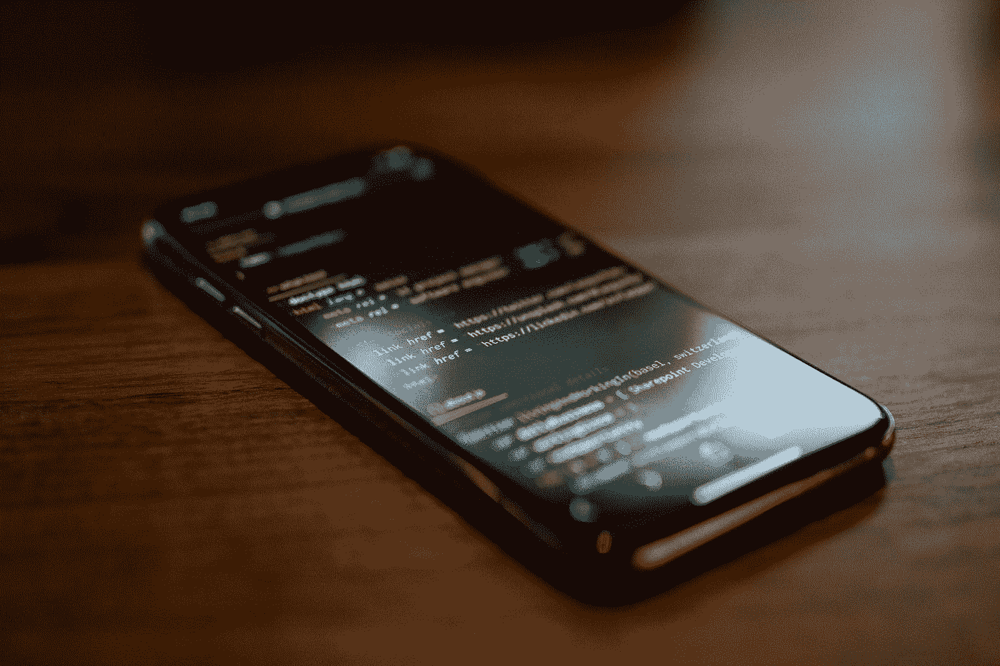
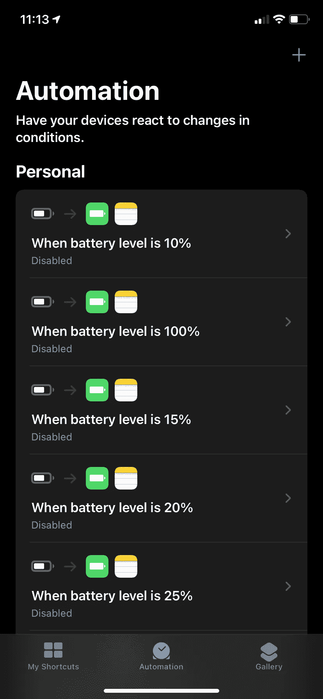
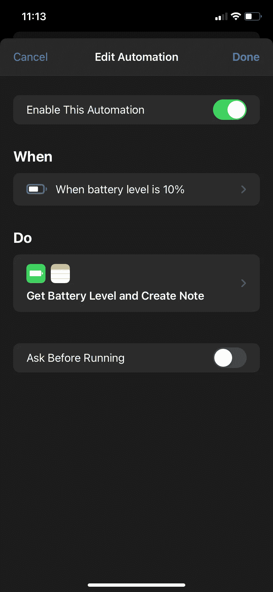
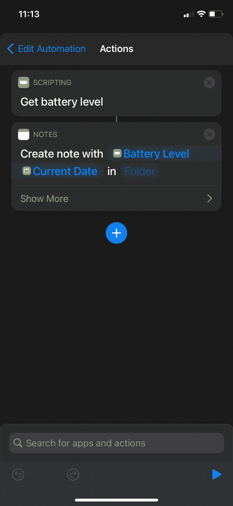
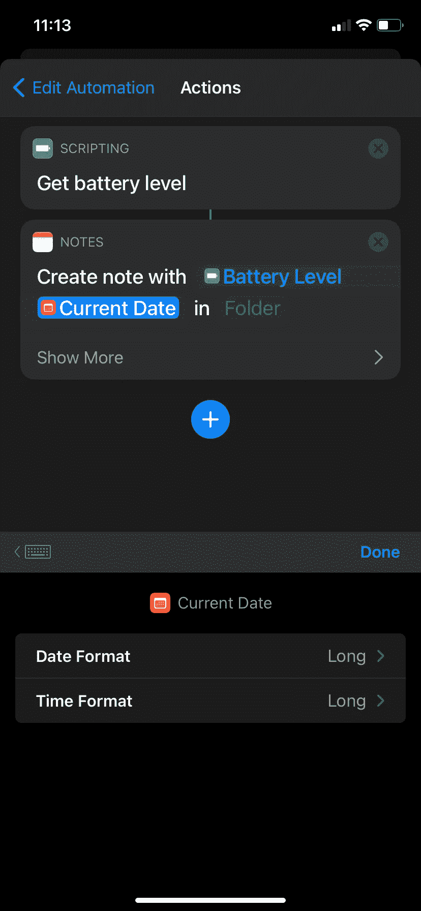
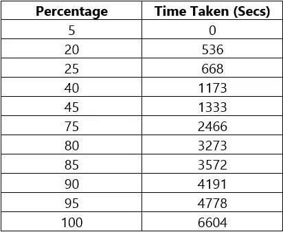
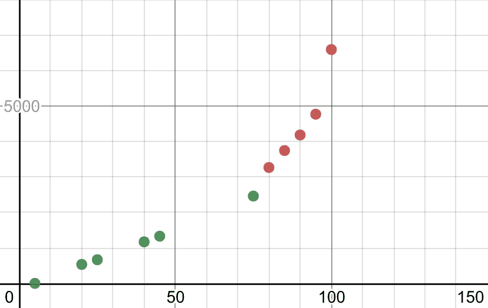
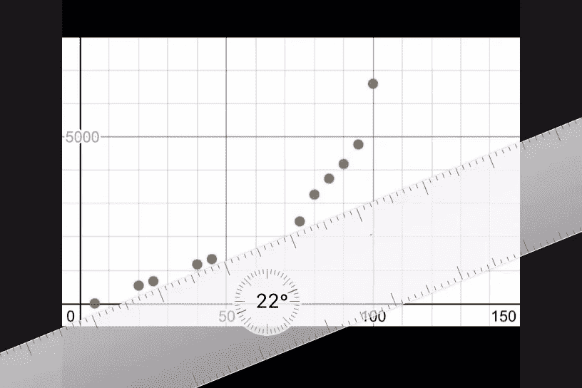
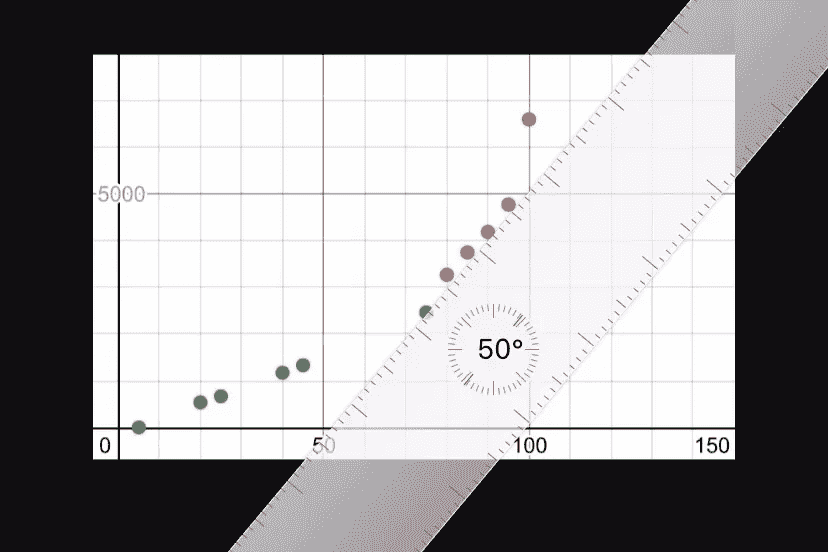

# 这就是*iPhone*的充电方式

> 原文：<https://medium.datadriveninvestor.com/this-is-how-an-iphone-charges-4d768f6bf643?source=collection_archive---------20----------------------->

Photo by [Caspar Camille Rubin](https://unsplash.com/@casparrubin?utm_source=medium&utm_medium=referral) on [Unsplash](https://unsplash.com?utm_source=medium&utm_medium=referral)

## ios

## 我获得并分析了它充电时的一些数据。

> 为了了解'**优化电池充电**的效果如何，我们在'**快捷方式**应用程序中创建了一个自动化程序，存储充电时电池达到特定水平的“一天中的时间”。

让我们将百分比保持在 5%、10%、15%、…、100%，因为它们在自动化中是默认的，很容易监控。

## 现在，为每个百分比创建自动化，如下所示。

How the Automations are set

现在，让我们将 iPhone 设置为飞行模式。因为:

1.  网络波动不会扰乱图形。
2.  在进行细致的实验时，没有人会打电话给我。

我们也关闭了所有耗电的应用程序。

## 我们充电吧！

同时，这里有一些事情需要考虑。

1.  我用的是 [Ausmo XTRA Charge PD(双口)](https://www.ausmo.com/products/xtra-charge-pd) 18W **充电器**。
2.  我的电缆— [雷电到 C 型(PD)芯线**电缆**](https://www.ausmo.com/collections/other-products/products/lightning-to-type-c-core) **。**
3.  我在我的 **iPhone XR** 上最新的 **iOS 14.3** 。
4.  我的电池**最大容量**最近降到了 98%。它支持“**峰值性能能力**”。**优化的电池充电**启用。

[**优化电池充电**](http://blank.org) **:**
充电器从 0%快速充电到 80%，但慢慢超过 80%。所以我们假设图表变慢了 80%以上。

。
。
。

## 电池现在充满了！让我们看看结果。

我找出了时间之间的差异(以秒为单位),并根据我们得到的结果创建了一个列表。

但是嘿！我们没有获得我们实际计划的所有百分比。这可能是由于一个错误。你也可以试试。

但我希望我们能找到一种模式。所以没什么区别。

## 让我们制作一个图表

Graph made in Desmos

Angle measured in Markup

我们在这里发现一件有趣的事情。

从 0%到 80%，角度约为 22%，那么，80%之后，角度为 50%。

最重要的是，从 95%到 100%的斜率变化很大。它表示充电非常慢。充满电的手机不健康。苹果做了一个很好的算法，从 95%到 100%高度涓滴，照顾电池。

## 这是苹果优化的电池充电

这只是一个好奇的实验。它证明了充电曲线将是一条直线，而不是指数或对数，或任何其他任意曲线，还显示了曲线如何在过程中变化，以保护电池。