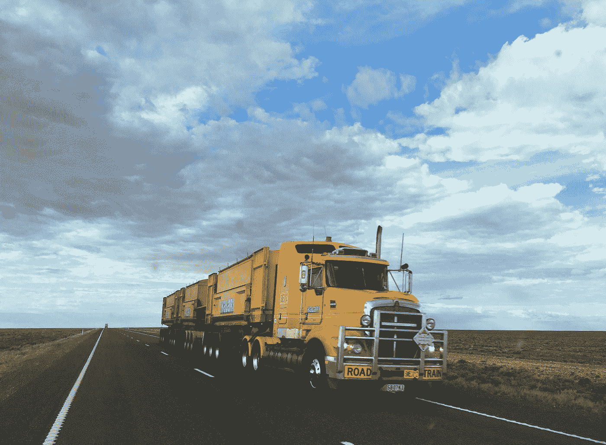
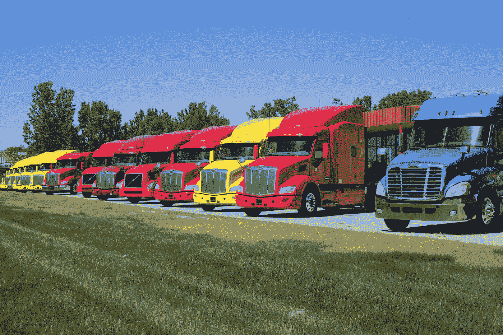
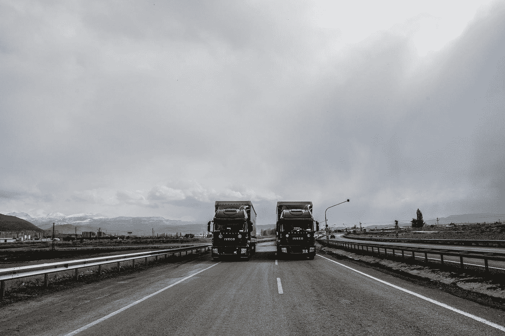
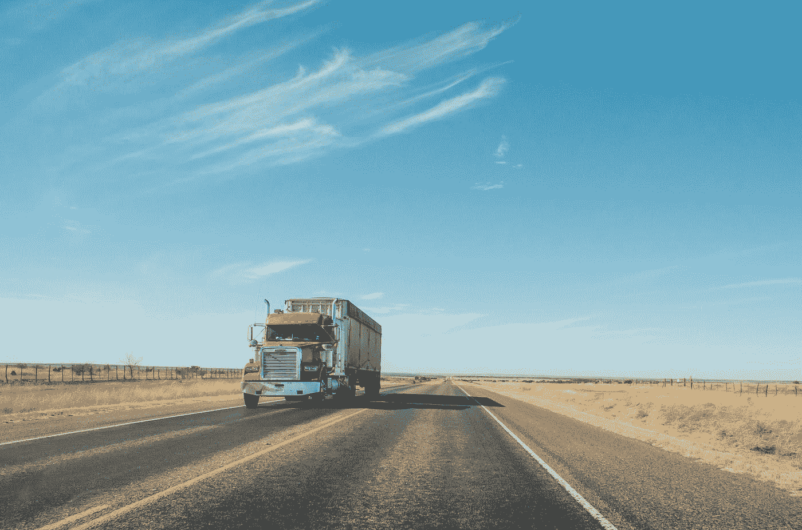
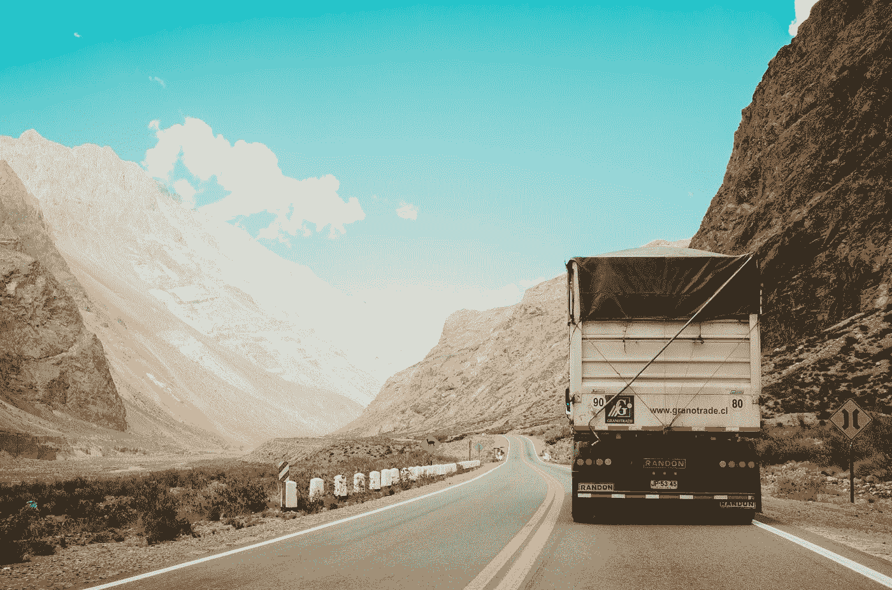
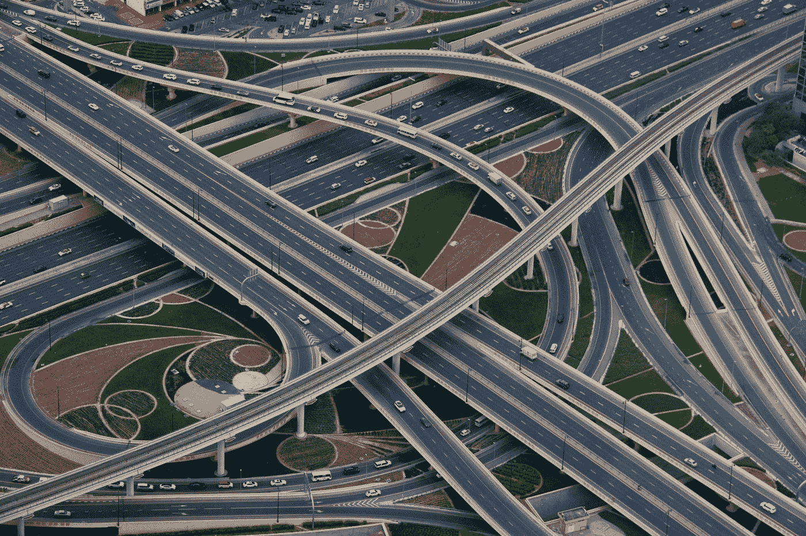
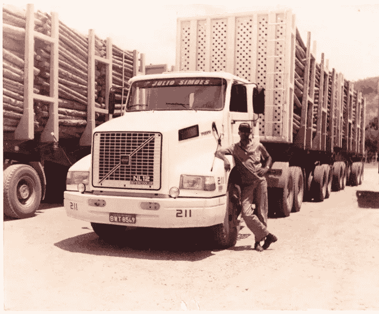

# 这就是自动驾驶卡车将如何重塑运输行业。

> 原文：<https://medium.datadriveninvestor.com/this-is-how-driverless-trucks-will-reshape-the-transportation-industry-eadca7559a47?source=collection_archive---------3----------------------->

Photo by [Rhys Moult](https://unsplash.com/@rhysatwork?utm_source=medium&utm_medium=referral) on [Unsplash](https://unsplash.com?utm_source=medium&utm_medium=referral)

## 自动驾驶卡车将在几年内成为现实，代表着整个运输行业的巨大变革。

未来几年，无人驾驶卡车将在公共道路上例行运输货物——而不仅仅是在矿山和港口这样的受限环境中，因为这种情况已经发生了。

当然，这可能不会在今天发生——可能要到 2023 年或 2025 年，即使目前所有售出的卡车中有 35%**已经预计会有某种程度的高级驾驶辅助(例如，自动制动)，已经有人担心较低级别的自动驾驶卡车对社会的影响会有多大。**

****

**Photo by [Dale Staton](https://unsplash.com/@dstaton?utm_source=medium&utm_medium=referral) on [Unsplash](https://unsplash.com?utm_source=medium&utm_medium=referral)**

# **自动驾驶卡车的赌注是什么？**

**赌注非常高；例如，麦肯锡 [**预测**](https://www.mckinsey.com/industries/travel-transport-and-logistics/our-insights/distraction-or-disruption-autonomous-trucks-gain-ground-in-us-logistics) 完全自治可以削减 45%的运营成本——或仅在美国就削减 850 亿至 1250 亿美元 ，而美国的[****【800 亿美元****](https://www.businessinsider.com/trucking-truck-drivers-job-loss-september-2019-10) 卡车运输业运输了全国 65%的消费品。**

**但其他因素正在推动该行业走向自动驾驶卡车；首先，安全——初步报告显示，2018 年卡车事故死亡人数增长**3%，很可能是**的 30 年新高。******

******鉴于**94%的严重车辆事故归咎于人为错误，一些研究认为 [**部署高度自动化的卡车将拯救生命**](https://www.rand.org/pubs/research_reports/RR2150.html) 。********

****满足 [**高周期性卡车运输行业**](https://www.businessinsider.com/why-trucking-industry-slowdown-trucker-job-loss-2019-7#the-economy-has-weakened-2)——在卡车/司机短缺和产能过剩之间摇摆不定——的需求是另一个主要驱动力。****

****根据麦肯锡的估计，不受服务时间规定限制的全自动卡车将能够每天行驶 [**20 小时**](https://www.mckinsey.com/industries/travel-transport-and-logistics/our-insights/distraction-or-disruption-autonomous-trucks-gain-ground-in-us-logistics)——实现更大的利用率(今天的卡车利用率不到[**60%**](https://www.mckinsey.com/featured-insights/future-of-work/jobs-lost-jobs-gained-what-the-future-of-work-will-mean-for-jobs-skills-and-wages))和车队减少 [**达 20%**](https://www.mckinsey.com/industries/travel-transport-and-logistics/our-insights/distraction-or-disruption-autonomous-trucks-gain-ground-in-us-logistics) 。****

****自动驾驶汽车进入我们的道路带来了各种各样的可能性和收入流——例如，物流业的电子应用， [**半卡车驾驶的租赁，如**](https://medium.com/@futurride/einride-reveals-pod-platform-for-autonomous-electric-freight-4cd1e82ec6c4) **[Einride](https://medium.com/u/583654f4c9d5?source=post_page-----eadca7559a47--------------------------------) 的创新商业模式，现场服务、远程信息处理和分析的外包。******

****一旦自动驾驶卡车市场更加成熟，将需要围绕许多领先标准和几个用于自动驾驶卡车自动化**的顶级平台进行重大整合。******

******用于收集运输数据和获取客户信息的此类系统的所有者将被定位为从应用程序、数据和服务中获取价值，例如对托运人及其客户的洞察。******

******一篇名为 [**的有趣文章详细分析了自动驾驶汽车技术在货运行业**](https://medium.com/@michael.wishart1990/a-detailed-commercialization-analysis-of-autonomous-vehicle-technology-in-the-trucking-industry-366fc888cbcc) 中的商业化，作者是[迈克尔·维沙特](https://medium.com/u/9c29156ba947?source=post_page-----eadca7559a47--------------------------------) [乔伊·斯卡夫罗内克](https://medium.com/u/c4067859b679?source=post_page-----eadca7559a47--------------------------------)和[斯文·贝克-硅谷移动](https://medium.com/u/1a1b7343e2a5?source=post_page-----eadca7559a47--------------------------------)探索道，还将有一类新的公司成长起来，以满足人类在一个空间内分享的需求，在这个空间内，他们由自动驾驶技术支持，如优化&培训、跟踪、故障排除、与客户的远程互动&其他人。******

****在更快、更多样化的供应链的推动下，货运服务的新老商业模式将有发展空间。****

********

****Photo by [İsmail Enes Ayhan](https://unsplash.com/@ismailenesayhan?utm_source=medium&utm_medium=referral) on [Unsplash](https://unsplash.com?utm_source=medium&utm_medium=referral)****

# ****我们现在在哪里？****

****这个领域的许多顶级玩家(我将很快写一篇关于这一点的文章)正在推出具有 [**二级自治**](https://towardsdatascience.com/an-introduction-to-autonomous-vehicles-b39024788cd6) 的卡车——但这一新功能推出时的价值可能会非常小。****

****麦肯锡关于重型卡车 [**自主性的研究**](https://www.mckinsey.com/industries/travel-logistics-and-transport-infrastructure/our-insights/distraction-or-disruption-autonomous-trucks-gain-ground-in-us-logistics) 预计，实现 [**第 5 级自动驾驶**](https://towardsdatascience.com/an-introduction-to-autonomous-vehicles-b39024788cd6) 后，将实现总节约量的 25%的预期节约量。尽管如此，有趣的是，我们注意到，由于技术的复杂性，向更高水平的自治发展的成本并不相等。它花费更多的钱。换句话说，从一个阶段到另一个阶段不是一个容易的、线性的或直接的过程。****

****只有当市场份额获得充分动力时，才会成为一个指数级增长的市场，根据[**【Trucks.com】**](https://www.trucks.com/2019/03/28/automated-driving-tech-grow-through-2030/)估计达到 90%的 CAGR。****

********

****Photo by [Christian Chen](https://unsplash.com/@christianchen?utm_source=medium&utm_medium=referral) on [Unsplash](https://unsplash.com?utm_source=medium&utm_medium=referral)****

# ****先来后到，更好的服务于长途市场？****

****正如我们在自动驾驶汽车行业看到的那样，如果潜在的技术发展将成为创新未来的关键因素，那些愿意率先进入自动驾驶卡车行业的人将拥有强大的竞争优势，特别是当自动驾驶技术最终部署在长途卡车上，而不是最后一英里的送货车辆上时。****

****长途旅行通常反映不太困难的交通，是一个不太通用的用例。可能影响长途自主旅行的一件事是，这是一个利润不太丰厚的用例。更准确地说，人工智能和复杂传感器的结合对于长途旅行行业来说可能过于昂贵。****

****近期对长途运输的强调已经推动了新的方法——比如 [**队列**](https://www.volvogroup.com/en-en/news/2018/jun/news-2971141.html) 。一辆领头的人类驾驶卡车被其他自动驾驶卡车“跟随”(最初有一名安全驾驶员，然后最终靠自己)。公路附近的货物转运枢纽，允许在 [**无人驾驶卡车和本地手动卡车**](https://medium.com/embark-trucks/2019-disengagement-report-update-753ffb72649e) **s** 之间转运货物，参见 Embark。****

********

****Photo by [Matthew T Rader](https://unsplash.com/@matthew_t_rader?utm_source=medium&utm_medium=referral) on [Unsplash](https://unsplash.com?utm_source=medium&utm_medium=referral)****

# ****自治道路上的一些障碍****

****高度自动化的卡车技术可能在 [**三年内**](https://www.forbes.com/sites/stevebanker/2019/09/10/should-government-promote-autonomous-trucks/#41bcc619665e) 成为现实，因为所需的技术今天还没有进展到那个阶段。****

****但是障碍(双关语)不仅仅是技术上的。在一些国家，政府的控制意愿是阻止商用自动驾驶应用最终部署在公共道路上的主要障碍之一。****

****另一个可能的障碍是，自动驾驶卡车可能被视为对社会的威胁，并有可能受到负面的公共媒体报道。****

****自动驾驶卡车有望 [**安全、安静、可预测**](https://www.youtube.com/watch?v=2Gc1zz5bl8I) ，比人类司机更稳定；然而，公众对涉及大型卡车的灾难性事故的记忆肯定会影响公众舆论和监管机构的反应。****

****大约每 1 亿 英里(相当于每天一辆车撞上你)就有 1600 人死亡，需要大量研究来证明现代汽车技术的安全性。****

****2009 年首次亮相的 Waymo，现在已经在其所有的自动驾驶技术试验中打破了 [**1 亿英里**](https://www.fool.com/investing/2019/07/12/why-matters-waymo-passed-10b-autonomous-miles.aspx) ，证明了它的高度可靠性，能够实现很大程度的控制。****

****想要引领完全自动驾驶汽车发展道路的公司必须与监管机构合作，创造更准确、更多样的方法来测试安全的无人驾驶汽车，并开发 [**创新的研究方法**](https://www.fool.com/investing/2019/07/12/why-matters-waymo-passed-10b-autonomous-miles.aspx) ，例如在恶劣的环境中测试车辆，以更快地让无人驾驶汽车上路。****

********

****Photo by [Rodrigo Abreu](https://unsplash.com/@rodrigospabreu?utm_source=medium&utm_medium=referral) on [Unsplash](https://unsplash.com?utm_source=medium&utm_medium=referral)****

# ****对基础设施的需求****

****建立一个全面的自动卡车运输网络将需要新的基础设施，以及人工智能驾驶技术的重大发展。****

****这些要求包括:****

*   ****[**5G 网络**](https://medium.com/swlh/introduction-to-the-future-with-5g-and-artificial-intelligence-10239bd452a1) 和允许车辆连接和监控的技术。****
*   ****使用云存储的边缘计算，从自动驾驶汽车每天将创建的 [**万亿字节数据**](https://www.tuxera.com/blog/autonomous-and-adas-test-cars-produce-over-11-tb-of-data-per-day/) 中处理和生成见解。****
*   ****基于卡车载重量、天气状况和交通状况的现代动态路线工具。****

****当然，大量的数据和复杂的 IT 基础设施也意味着网络安全将在保护组织 IT 和相关技术方面至关重要，以阻止不良行为者未经授权访问车辆并窃取机密数据 [**劫持自动驾驶汽车**](https://www.trucks.com/2017/02/08/cybersecurity-autonomous-vehicles-concerns/) **。******

********

****Photo by [Nick Fewings](https://unsplash.com/@jannerboy62?utm_source=medium&utm_medium=referral) on [Unsplash](https://unsplash.com?utm_source=medium&utm_medium=referral)****

# ****新卡车，新道路！一个新的生态系统。****

****相比今天的自动驾驶卡车，它们使用与今天的卡车类似的结构，可能需要为自动驾驶卡车开发更复杂的 [**道路和车道**](https://jackmathew.medium.com/cavnue-an-alphabet-backed-startup-to-develop-self-driving-road-of-the-future-cd0bbfb8cb11) 。****

****我们还将需要新的车库概念，这种车库必须在高速公路上提供服务，并且可以被构造成让人类驾驶员可以接管旅程的最后一英里。****

****自动卡车运输生态系统仍处于早期阶段，但它将成为更大的卡车运输行业重塑的一部分。****

****对超优化和便捷车辆(特别是卡车)的研究将很快包括对复杂的车载传感器和远程信息处理、电动和混合动力以及更强大的货运匹配功能的依赖。****

********

****Photo by [Junshen Zeng](https://unsplash.com/@junshen?utm_source=medium&utm_medium=referral) on [Unsplash](https://unsplash.com?utm_source=medium&utm_medium=referral)****

# ****卡车自动化的影响****

****这种超优化和自动化将影响 [**数百万卡车司机**](https://www.trucks.com/2018/02/01/truckers-autonomous-tech-threat-overstated/) ，他们将需要学习新的工作技能。至少有一群人会发现他们的工作会被引入其他交通行业。****

****麦肯锡认为，随着自动驾驶卡车数量的增加，运输公司可以一天 24 小时运营，加上电子商务的增长，无人驾驶卡车带来的劳动力成本减少将超过[**【240 亿美元**](https://www.mckinsey.com/industries/travel-transport-and-logistics/our-insights/distraction-or-disruption-autonomous-trucks-gain-ground-in-us-logistics) 。****

********

****My brother (in the picture) used to be a truck driver in Brazil in the 90s. And one of the most beautiful memories I have from that time was when he used to come back home, after many days, sometimes months away… I will never forget the sound of the diesel engine of the NL12 when he was parking in front of our house. Photo by myself, Brazil, 1993****

# ****结论****

****自主技术将长期存在，可能在最后一英里交付之前——但我们仍然需要 4 或 5 年时间才能开始成为一件普通的事情。然而，随着行业整合，认真的玩家今天在前排争夺一席之地，成为赢家之一。****

****但随着这些突破性的变化，企业需要适应，员工需要学习新技能。需要对这些劳动力进行再培训，以确保他们能够为交通运输行业提供健康、高效的劳动力。****

****一场革命即将到来！****

******访问专家视图—** [**订阅 DDI 英特尔**](https://datadriveninvestor.com/ddi-intel)****

# ****参考****

**** [## 我们需要无人驾驶卡车的原因是

### 自动化将如何改变卡车运输行业

medium.com](https://medium.com/datadriveninvestor/the-reason-we-need-self-driving-trucks-e5b85e4de402)  [## CAV NUE-一家由 Alphabet 支持的初创公司，旨在开发自动驾驶的“未来之路”

### 作为一家初创公司，Cavnue 将在密歇根州建立一条首开先河的 40 英里连接走廊，为…

jackmathew.medium.com](https://jackmathew.medium.com/cavnue-an-alphabet-backed-startup-to-develop-self-driving-road-of-the-future-cd0bbfb8cb11)  [## 通往自动驾驶卡车的漫长道路

### 卡车运输是一个价值 7000 亿美元的行业，运输美国 70%的货物——那么它能多快适应…

medium.com](https://medium.com/@meharris/the-long-road-to-self-driving-trucks-d142229832d6)  [## 2019 年脱离接触报告更新

### 一年前，Embark 发布了一份自愿的 2018 年脱离报告。基于我们在 2019 年学到的知识，我们决定不…

medium.com](https://medium.com/embark-trucks/2019-disengagement-report-update-753ffb72649e)  [## 自动驾驶初创公司 Embark 将如何改变卡车运输行业

### 今天标志着自动驾驶行业的一个激动人心的里程碑。Embark 正式推出，揭开其…

startupsventurecapital.com](https://startupsventurecapital.com/how-embark-will-transform-the-trucking-industry-5db61d741836)  [## 中间一英里

### 帕洛阿尔托的初创企业 Gatik 最近因专注于“中间一英里”物流的自动箱式卡车而成为新闻。

medium.com](https://medium.com/self-driving-cars/the-middle-mile-1fc33aef4a8e)  [## Einride 展示自主电动货运平台 Pod

medium.com](https://medium.com/@futurride/einride-reveals-pod-platform-for-autonomous-electric-freight-4cd1e82ec6c4)  [## 自动驾驶初创公司 Embark 将如何改变卡车运输行业

### 今天标志着自动驾驶行业的一个激动人心的里程碑。Embark 正式推出，揭开其…

startupsventurecapital.com](https://startupsventurecapital.com/how-embark-will-transform-the-trucking-industry-5db61d741836)  [## 体验 Flux Auto 在印度的自动驾驶卡车

### 查看 Flux Auto 的原型车在印度的 10 公里自动公路驾驶！

medium.com](https://medium.com/udacity/experience-self-driving-trucks-in-india-with-flux-auto-b1faaeba0089)  [## 自动驾驶汽车介绍

### 自杰森一家以来，自动驾驶汽车一直存在于我们的想象中，如果我们能想象，我们就能做到。的…

towardsdatascience.com](https://towardsdatascience.com/an-introduction-to-autonomous-vehicles-b39024788cd6) 

# 还有一件事…

如果你想在学习之旅中走得更远，我为你准备了一份令人惊叹的清单，其中包含 60 多门关于人工智能、机器学习、深度学习和数据科学的培训课程，你现在就可以免费参加:

*   [**什么是预测分析，你今天如何使用它？**](https://towardsdatascience.com/what-is-predictive-analytics-dc6db9759936)
*   [**今天学习 AI、ML、数据科学的最佳免费课程。**](https://jairribeiro.medium.com/my-favorite-free-or-free-to-audit-courses-to-learn-ai-ml-and-data-science-f15f614a84e5)
*   [**60 多门课程，有评分，有总结(当然是 AI 做的)。**](https://jairribeiro.medium.com/my-favorite-free-or-free-to-audit-courses-to-learn-ai-ml-and-data-science-f15f614a84e5)
*   [**是不是我们所知道的作品的终结？**](https://medium.com/predict/is-it-the-end-of-the-work-as-we-know-it-bf2f9a64e89a)[**世界经济论坛**](https://medium.com/predict/is-it-the-end-of-the-work-as-we-know-it-bf2f9a64e89a) 报告《2020 年就业前景》简析

如果你想继续发现新的资源并了解人工智能，在我的电子书(下方的[链接)中，我正在分享关于人工智能、机器学习、深度学习、数据科学、商业智能、分析和其他方面的最佳文章、网站和免费在线培训课程，以帮助你开始学习和发展职业生涯。](https://www.amazon.com/dp/B08WJ59G2V)

> [***学习 AI 在线:200 多个资源在线开始学习 AI***](https://www.amazon.com/dp/B08WJ59G2V)

此外，我刚刚在亚马逊上发布了其他有趣的[电子书，我相信其中一些可能会让你感兴趣……让我们保持联系，关注我，让我们一起做吧。](https://www.amazon.com/dp/B08RSJRNSN/)

*   [**人工智能、机器人技术和编码(给父母):模拟父母和数字孩子的实用指南**](https://www.amazon.com/gp/product/B08SLGQR5C/)
*   [**终结者悖论:神经科学如何帮助我们理解移情和对人工智能的恐惧**](https://www.amazon.com/gp/product/B08STRHZ46)
*   [**人工智能从 A 到 Z:揭秘 AI 的本质概念**](https://www.amazon.com/gp/product/B08WZ3VDHB)
*   [**A . I . 2020 年:写关于人工智能的一年**](https://www.amazon.com/gp/product/B08RSJRNSN)

# 你愿意支持我吗？

*为了获得无限的故事，你也可以考虑* [*注册*](https://jairribeiro.medium.com/membership) *成为中等会员，只需 5 美元。此外，如果您使用我的链接注册***，我会收到一小笔佣金(无需您额外付费)。**

* [## 通过我的推荐链接加入媒体- Jair Ribeiro

### 阅读我分享的每一个故事(以及媒体上成千上万的其他作者)。你的会员费直接支持其他…

jairribeiro.medium.com](https://jairribeiro.medium.com/membership)*****