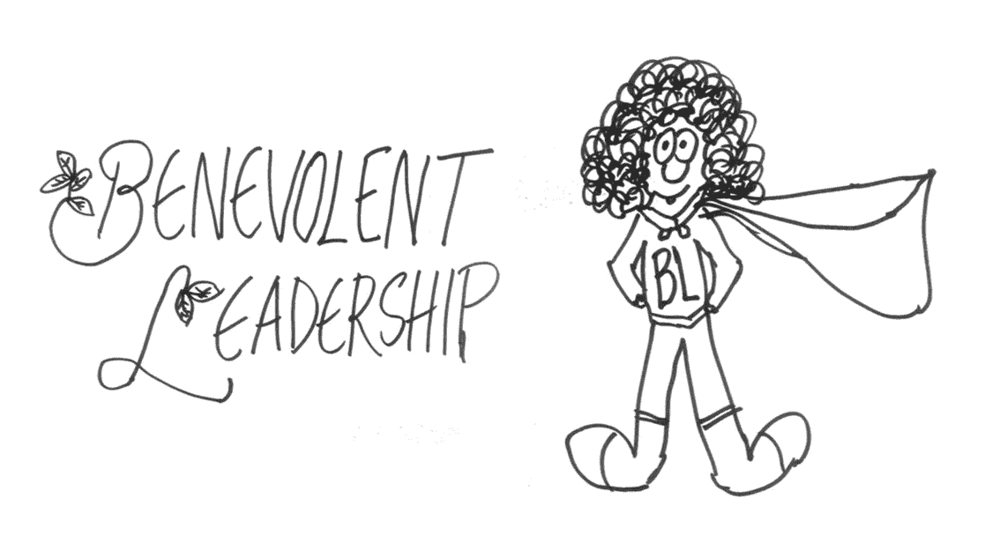
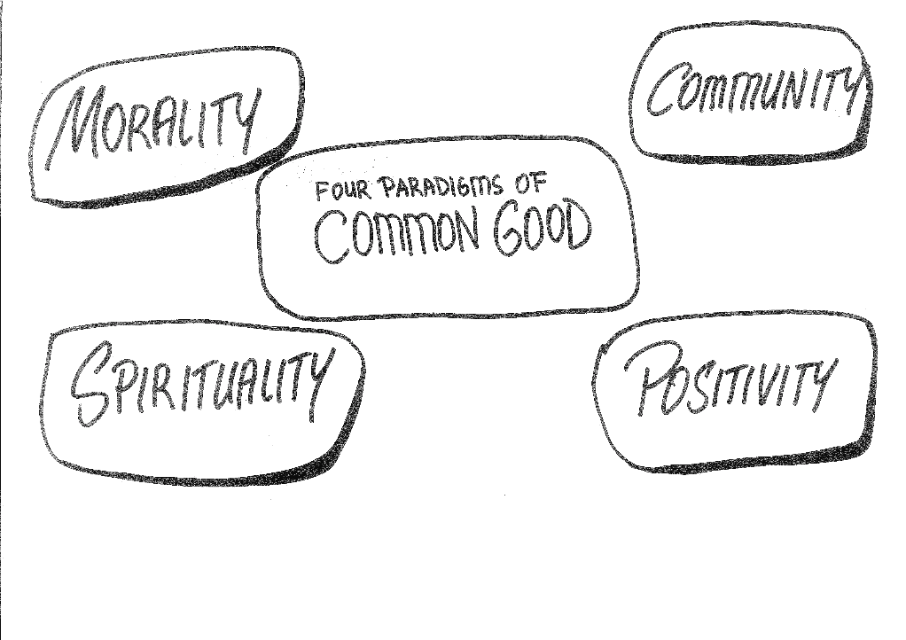
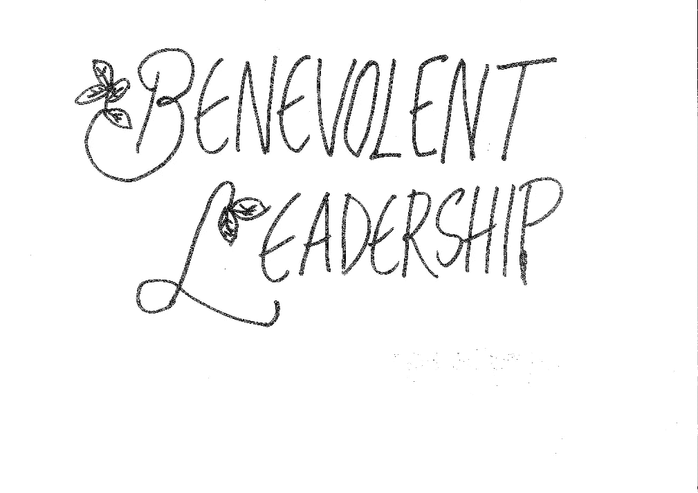
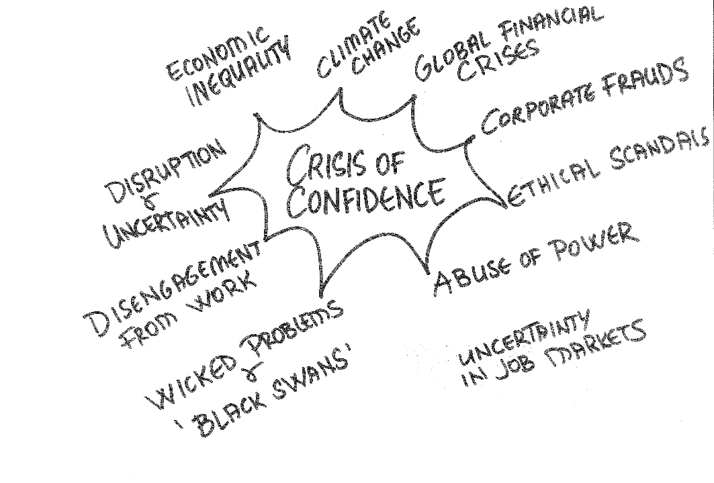
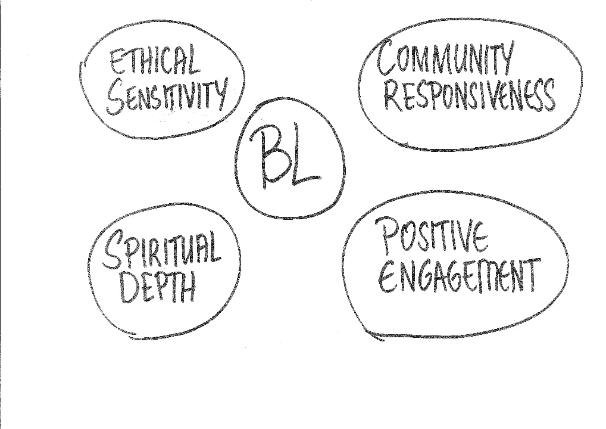
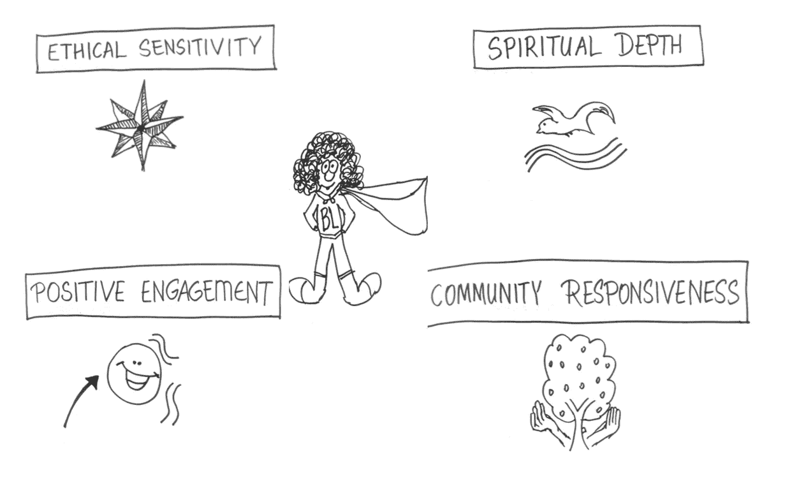
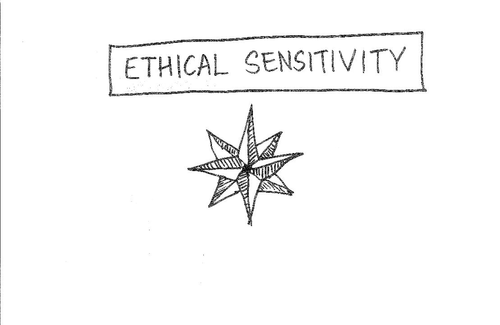
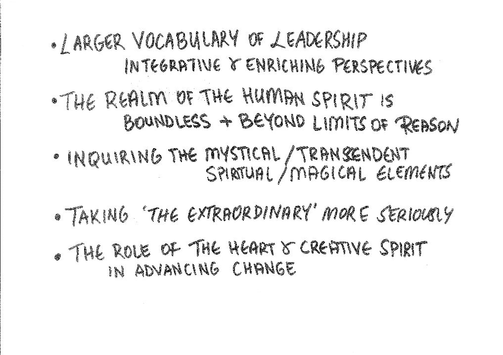

# 这就是我如何开发出一个新的尺度:仁慈的领导

> 原文：<https://medium.datadriveninvestor.com/this-is-how-i-developed-a-new-scale-benevolent-leadership-e69b3707b37b?source=collection_archive---------5----------------------->

## 基于研究的见解

## 沟通道德敏感性、精神深度、积极参与、社区响应

Photo by [Morning Brew](https://unsplash.com/@morningbrew?utm_source=medium&utm_medium=referral) on [Unsplash](https://unsplash.com?utm_source=medium&utm_medium=referral)

在这篇文章中，我将时光倒流，带你去看我十年前完成的博士论文。那时我在加拿大的麦吉尔大学，我的论文是关于仁慈的领导。

Image created by Author

我将重温并与你分享这篇论文的理论模型。在做这个的时候，我会用涂鸦来说明模型，让模型对你来说容易理解，实用。

在我的论文中，我试图整合组织研究中公共利益的四种范式:道德、精神、积极性和社区。仁慈的领导是基于这样一种假设，即这四个领域的研究可以为领导学者和实践者提供理论上的坚实基础和丰富的知识，从而在组织中创造共同利益。

仁慈的领导者是那些为公众利益创造显著利益、行动或结果的人。术语“共同利益”是指一个社区的成员共享利益或积极成果。因此，仁慈的领导者在工作中展现出全心全意、真诚的行动，造福周围的人。因此，他们倾向于做好事，做好事或慈善行为，因为他们觉得有义务利用他们发展的和有意的爱和慈善的属性。

本研究通过整合这四种范式并探究领导者如何导致积极的变革，为领导力文献做出了贡献。

这项研究考察了仁慈的领导，并对组织研究做出了三个关键贡献。

第一个贡献是理论上的；基于在组织中创造共同利益的四个流，开发一个基于理论的仁慈领导的概念模型；道德、精神、活力和社区。

 [## 领导力。赢得|数据驱动型投资者需要更广阔的视角

### 不管他们愿不愿意，领导者都是快速运转的机器中的齿轮，这就要求他们夹住自己的爪子…

www.datadriveninvestor.com](https://www.datadriveninvestor.com/2020/02/07/leadership-it-takes-a-wider-perspective-to-win/) 

第二个贡献是开发了一个工具(仁慈领导量表)来测量仁慈领导的结构。该量表由四个维度组成:道德敏感度、精神深度、积极参与度和社区响应度。

第三个贡献是经验性的；探索组织中仁慈领导的潜在结果。

通过涂鸦展示仁慈的领导模式

# 四种公共利益

仁被定义为一种哲学信仰，认为人类具有潜在的善，并相应地认为人类有义务利用其自然本能以及爱和慈善的发展态度；做好事、做好事或慈善行为的倾向。本研究介绍了仁慈领导的概念模型，该模型基于组织研究中的四个公共利益流:

(1)道德范式，其基于商业伦理、领导价值观和伦理以及伦理决策文献(重点是领导者的伦理和价值观)；

(2)灵性流(Spirituality stream)，以工作中的灵性和精神领袖文学(重点是领袖的内在风景和精神行动)为基础；

(3)活力流，其基于积极的组织奖学金和基于实力的方法(重点是领导者如何在组织和世界中创造积极的变化)；而且，

(4)社区流，基于企业社会责任和企业公民文献(重点是领导者对社会和社区服务的贡献)。

Image created by Author

我认为，这四个流派之间的相互作用可以提供对仁慈领导的更全面的理解，综合它们将导致领导理论比这四个流派中的每一个单独具有更强和更广泛的解释力。

这种集成在几个方面是有用的。

首先，这是朝着为共同利益而领导的整体理论迈出的一步。这里对公共利益的强调是至关重要的；因为仁慈的领导专注于创造积极的变化或参与有益于所有人的行动。

第二，概念框架既有规范功能，也有实用功能。这四个流为领导者在组织中创造积极的变革提供了有用的标准和实践指南。

第三，由此产生的模型强调了在对组织现象进行理论化或研究时考虑所有四个维度的重要性。

这四个领域的研究可以为领导学者和实践者提供理论基础和丰富的知识来创造组织的共同利益。

# 什么是仁慈的领导？

Image created by Author

我将仁慈的领导定义为创造一个良性循环的过程，通过以下方式鼓励和发起组织中的积极变革:

*   道德决策，
*   创造一种意义感，
*   激发积极行动的希望和勇气，以及
*   给更大的社区留下积极的影响。

仁慈的领导者是那些为公众利益创造显著利益、行动或结果的人。

“共同利益”一词是指一个社区的所有或大多数成员共享利益或积极成果。

仁慈的领导者在工作中展现出全心全意、真诚的行动，造福周围的人。因此，他们倾向于做好事、善良的事或慈善行为，因为他们觉得有义务利用他们发展的和有意的爱和慈善的属性。

仁慈的领导不同于其他的领导概念，因为它强调为“共同利益”创造可见的利益、行动或结果。在过去的二十年里，公共利益这个术语变得流行起来；如《为了共同利益:将经济导向社区、环境和可持续发展的未来》或《为了共同利益的领导力:在共享权力的世界中解决公共问题》等书所见。

# 寻求仁慈的领导

出于多种原因，呼吁理解仁慈领导的根源、特征和结果是及时的。首先也是最重要的一点是，人们对领导力不再抱有幻想，对领导力的信任危机激增就说明了这一点。具体而言，它表现在企业裁员、人们对工作的心理脱离、失业率上升导致的经济衰退、裁员和重组带来的背叛感以及道德丑闻。

学术和专业管理文献中充满了令人信服的商业领袖滥用权力、自私自利的例子。这种对领导力的信任危机也体现在 2008 年的全球金融危机中，这场危机与无节制的贪婪等道德和伦理根源有关。我们在当前由冠状病毒引发并加剧的经济危机中看到了类似的迹象。

除了对领导力不再抱有幻想之外，由于技术进步、并购和日益全球化，当今工作场所的不确定性和流动性也越来越大。席卷商业世界的变革浪潮包括人工智能、数字化、高度竞争、高度波动性、人口变化和高度动荡的环境。

Image created by Author

此外，日益增加的复杂性和相互依赖性意味着变化变得越来越非线性和不可预测。由此带来的竞争和经济压力导致了大规模的成本削减、大规模的公司裁员和不断增加的压力。在过去的十年中，财富 500 强公司裁员 400 万人，这对受影响的员工和家庭(受害者)，以及留在公司的同事和经理(幸存者)造成了严重的精神伤害。

在过去的几十年中，许多裁员、重新设计和重组战略意味着旧的心理契约已经改变，这种契约提供工作保障以换取忠诚。今天的领导者面对的员工的态度不是信任和参与；而是怀疑、恐惧和愤世嫉俗。作为这些转变的结果，过去为我们服务的基于竞争和等级制度的旧的领导模式不太适合上述多方面的挑战。我们需要一种新的领导理念，以更好地应对这些独特的挑战。

在过去的十年中，人们一直在讨论领导力理论和实践的范式转变。虽然对这种新的领导概念的名称尚未达成共识，但人们越来越认识到，领导领域中一些最重要的研究前沿围绕着道德、精神、积极变化和社会责任。

阐明领导者作为组织中积极变革的代理人的作用具有理论和实践的重要性。为了理解领导者如何为他们周围的世界做出贡献，学者们借用了其他学科的许多概念和理论，如商业伦理、工作中的精神性、积极的组织奖学金、欣赏性调查和企业社会责任。

所有这些领域都试图帮助领导者更好地应对竞争唯物主义商业格局的挑战，但将这些不同的领域折衷地整合到一个更广泛的慈善领导力框架中还没有出现。通过仁慈领导的概念模型，所有这些领域的融合和协同作用可能是组织走向繁荣的一个转折点。

# 组织研究中的四种公共利益

我进行了一项多学科的文献综述，以确定关于领导者如何鼓励和发起组织积极变革的替代理论和研究流。这项审查得到了计算机检索的帮助，检索使用了伦理、价值观、美德、精神和积极变化等关键词。

通过归纳检查这些理论的实质和知识遗产，我发现它们中的大多数可以归为四个基本流派。尽管不同的学科使用不同的术语，这四个流派都有着丰富而悠久的知识传统。

我们提出的仁慈领导模式建立在三个关键假设之上。首先，这四个流与在组织中创造公共利益相关。它们可以用来鼓励和发起组织中的积极变化。第二，这四个流是不同的，从某种意义上说，它们所追求的目标是不可互换的，尽管它们彼此之间高度互动。第三，这四个流提供了关于在组织中创造公共利益的一整套假设和研究结果。

因此，这四个流，当放在一起时，可以为我们提供领导的概念模型的基石。

这项研究呼吁整合这四个方面，为领导力文献做出了贡献。更具体地说，仁慈的领导模式位于组织行为中四个重要研究方向的十字路口。

首先，在道德流中，我从管理和道德决策的价值文献中构建，声称道德原则是解释领导者如何道德行为的关键因素。

第二，在灵性方面，我借鉴了工作中的灵性研究和精神领导力研究，这些研究将领导者描绘为寻找意义感、更深层次的自我意识和超越，以探索领导者如何将灵性融入他们的工作行动中。

第三，在活力流中，我建立在基于力量的方法之上；如积极心理学、积极组织行为、积极组织奖学金和欣赏性调查，以便从理论上理解领导者如何培养人的优势并导致工作组织的积极变化。

第四，在社区流中，我利用对企业社会责任、企业公民和组织公民行为的研究来询问领导者如何履行他们的社会责任并为他们的社区做出贡献。

这四个流是探索领导者如何在组织和他们周围的世界创造积极变化的有用的研究主体。将这些流描绘成共享公共概念空间但拥有独特知识属性的四个重叠的圈是有用的。

# 关于仁慈领导模式的提议

Image created by Author

我在四个组织研究流的基础上开发了一个仁慈领导的量表，这四个组织研究流集中在创造共同利益的领导责任的主要方面:

*   (1)伦理敏感性，
*   (2)精神深度，
*   (3)积极参与，以及
*   (4)社区响应。

仁慈的领导模式强调了在理论化或研究组织中的积极变化时考虑所有四个维度的重要性。迄今为止，大多数研究都只关注其中一项领导职责；而仁慈的领导模式是建立在综合和考虑所有这四个方面的基础上的。

# 开发仁慈领导量表

我的目标是建立一个多维的基于理论的仁慈领导的测量(仁慈领导量表(BLS)，并为其结构效度提供初步证据。

我使用由四个分量表组成的仁慈领导量表(BLS)操作了仁慈领导结构。

*道德敏感性*指领导者对工作中的是非行为进行道德反思和考虑的过程。

*精神深度*指的是领导者在工作中寻找意义感和目标感。

*积极参与*是指通过激发希望和勇气在组织中创造积极的变化。

最后，*社区响应*是指领导者在解决社会问题和使社会创新对社会做出贡献方面的作用。

Image created by Author

我用演绎和归纳的方法生成项目，以评估领导者如何展示仁慈的领导。最初的内容规范是根据以下内容制定的:

*   对构成仁慈领导的四个支柱的四个研究流派的文献进行了广泛的回顾，
*   对三位经理进行试点访谈，探讨仁慈的领导和仁慈的领导者行为的构成，以及
*   一系列与领域专家的学术讨论和会议，重点关注结构的清晰度、有效性和项目验证。

在回顾了大约 300 篇关于组织科学中以创造公共利益为中心的四个研究领域的文章和书籍后，我对加拿大的 10 位经理进行了试点采访。我使用理论抽样来识别那些在组织中创造积极变革方面有丰富经验和理想主义的个人。为了评估上述类别的适当性，我让这些经理描述一个他们认为是仁慈的领导者的人(例如，是什么让他或她成为仁慈的领导者？).然后对他们的回答进行内容分析。新兴类别与刚刚描述的类别非常匹配(在内容分析中产生了 90%相似的主题)，为仁慈的领导结构的多维性提供了初步证据。

基于这一全面的文献综述、试点访谈和内容分析，上述四个子量表被认为适合构成仁慈的领导结构。

接下来，根据四个包含结构化项目开发策略的研究流，为每个维度生成 20-25 个项目。从理论上讲，我总共获得了 90 个样本项，后来被细化为 40 个最能抓住建议的内容领域，并且被认为是最不模糊和最有行为性的项。项目已经被写为清楚和一致的理论描述和以前的工作在四个研究流。然后，三位主题专家对修订后的项目进行了表面效度测试。

我确保了四个子量表中的项目:

*   捕捉仁慈的领导态度和行为；
*   在理论上与每个研究流中确定和提议的领导者行为一致；
*   避免在一个项目中衡量多种态度或行为，以减少歧义和错误。

Image created by Author

第一个子量表是*道德敏感度*，包含 10 个项目，捕捉领导者在工作中基于道德的原则和道德规则；例如“*当我在工作中做出管理决策时，我会反思我的决策的道德后果*”；以及“*当我的同事在工作中违背道德价值观时，我会向他们提出挑战*”

Image created by Author

第二个子量表*精神深度*，包含 10 个项目，捕捉领导者对意义和自我反思的探索，以及在工作中融入精神；例如“*当我全身心地投入工作时，我感到充满活力和激情”*和“*我相信我们都是相互联系的，是一个有意义的整体的一部分”。*

Image created by Author

第三个子量表，*积极参与度*，包含 10 个项目，捕捉领导者在组织中发起和鼓励积极变革的热情；例如“*我努力为我周围的人提供希望和勇气，让他们采取积极的行动*”和“*我坚信我们有能力在这个组织中产生预期的结果或积极的成果。*

Image created by Author

第四个子量表*社区响应度*，包含 10 个项目，捕捉领导者在为社区留下社会遗产和贡献方面的敏感性和理想主义；例如“*我超越我的工作定义，为我的社区和世界做出贡献*”和“*我积极参与社会责任项目，造福社区”。*按照从 1 ( *非常不同意*)到 5 ( *非常同意*)的 5 分制进行回答。

仁慈领导量表是由这四个子量表组成的附加指数。加法指数意味着这四个维度是相辅相成的，它们共同构成了仁慈领导的概念。使用下一节介绍的标准方法来评估所提出的量表的心理测量学特性。

Image created by Author

我在不同的国际样本上测试了仁慈领导力量表，但那是另一篇文章的主题。在进一步的研究中，我的目标是使用不同的样本和文化背景来操作仁慈的领导结构，以增强普遍性，并进一步证实仁慈的领导量表的判别，收敛和预测的有效性。

仁慈的领导模式为整合以创造共同利益为中心的组织研究的不同领域提供了机会:商业道德、工作中的精神性、积极的组织学术和企业社会责任。我提出了仁慈领导的效用，作为一个统一的结构，为这些领域的进一步研究提供方向。

在积极的组织学术、领导力、商业道德和工作中的精神性的未来研究中包括仁慈的领导力量表，可以为学者提供一个测量领导者各种仁慈倾向的清单。

# 讨论和含义

对组织领导力的信任危机已经成为企业界高度关注的问题。

新的挑战需要新层次的勇敢、有原则和综合的领导，作为回应，我提议仁慈的领导，同时平衡伦理、精神、变革和社会问题。

当组织试图解决道德、精神、转型和社会挑战时；仁慈的领导模式可以为领导者提供一个全新的视角来处理和解决这些复杂的问题。

基于访谈的方法可以丰富地描述仁慈的领导者如何在组织中创造积极的变化。纵向研究可以描绘出仁慈的领导者反思自己、做出决策、采取积极行动、提高组织效率和影响周围人的过程。

管理者可以采用不同的领导风格来取得积极的结果，如道德领导、精神领导、变革型领导和服务型领导。未来的研究需要解决不同的领导风格和角色如何相互关联和相互补充，以创造组织的共同利益。

仁慈领导的先例也提供了研究机会。例如，情商、灵活性和对经验的开放性等变量，或者教育、组织文化和接触仁慈的领导者等情境变量，都可以作为前因。

对仁慈领导的组织成果进行清晰的评估和测量是进一步研究的重要议程。仁慈的领导可能与其他积极的结果正相关，如工作满意度、活力、创新的工作行为和对组织有效性的感知。仁慈的领导者在多大程度上促进了积极的组织成果，这是一条充满希望的实证研究路线。

仁慈的领导模式表明，这四个维度构成了一个有意义的整体，是对创造积极变革感兴趣的领导者的综合工具包。

仁慈型领导模式的活力和效用基于该模式为领导者在工作中的决策和行动提供的洞察力和宏观图景。如果没有这种在细致入微的思考和平衡的行动的实质性层面上的整合，领导者可能会面临分析瘫痪和做出片面决策的威胁。

Image created by Author

这项研究声称，在 21 世纪的组织中，使用仁慈领导的四种关键心态将是领导积极变革和创造共同利益的关键成功因素。

随着组织投入大量资源来创造公共利益，对仁慈领导的更好理解的需求持续增长。虽然不是关于这个话题的最终陈述，这项研究增加了越来越多的证据，证明做好事有助于在组织中做得更好。通过了解领导者如何在组织中实现积极的变革，我们可以发现为我们的社区创造“共同利益”的新途径。因此，这篇文章有助于积极的组织学术文献，有助于揭示人类系统中积极变化的动力。

我希望这篇关于仁慈领导的文章(和我的研究)对你有用。

真诚；

法赫利

## 法赫里·卡拉卡斯是《自制工作室》的作者。你可以在这里探索更多[。](https://selfmakingstudio.com/)

非常感谢 Emine Sarigollu 博士。

## 获得专家观点— [订阅 DDI 英特尔](https://datadriveninvestor.com/ddi-intel)