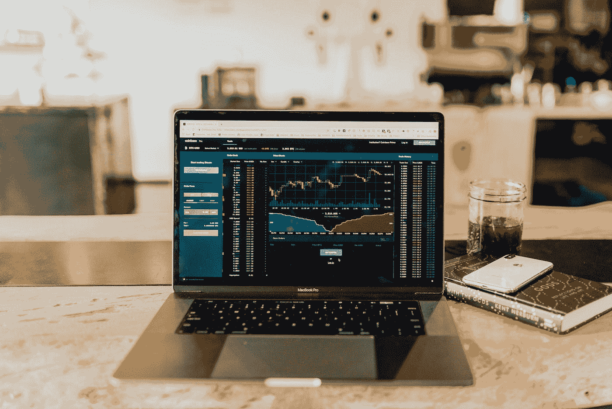

# 这就是你如何评估股票的价值——很容易解释！

> 原文：<https://medium.datadriveninvestor.com/this-is-how-you-can-value-shares-easily-explained-a717e2924087?source=collection_archive---------11----------------------->

要正确评估股票价值，你应该分两步走。第一步是理解商业模式。这是没有办法的。

第二步，你看一下现在的估值，和过去比较一下。如果股票估值低于历史平均水平，该股票可能被看好。

Photo by [Austin Distel](https://unsplash.com/@austindistel?utm_source=medium&utm_medium=referral) on [Unsplash](https://unsplash.com?utm_source=medium&utm_medium=referral)

# 我如何评估股票的价值

## 理解商业模式

在你考虑给一只股票估值之前，你必须掌握商业模式。你需要知道公司目前为什么赚钱。你要问问自己，公司 10 年后还会赚钱吗，公司支持哪些大趋势？目标群体在增长吗？目标群体还会使用其他产品吗？

这些问题至关重要。如果股价下跌，你应该知道你当初买股票的原因。

 [## 对有商业头脑的投资者有用的行为经济学概念|数据驱动的投资者

### 在美国企业界，高斯统计，对我们周围世界的确定性解释，以及理性…

www.datadriveninvestor.com](https://www.datadriveninvestor.com/2020/07/09/helpful-behavioral-economics-concepts-for-the-business-minded/) 

## 同伴群体比较

如果你在寻找优质股票，某个特定行业往往会有竞争。有吸引力的行业吸引竞争。在极少数情况下，你是否幸运地发现了垄断？

挑出几个关键数字，然后比较这些公司。我喜欢看销售回报、销售增长、自由现金流&自由现金流增长。

看市值！小公司通常发展得更快。这就是为什么增长更重要。然而，一旦公司达到相当大的规模，增长往往会放缓。如果有疑问，你应该始终购买该领域最大的公司。他们仍然可以收购一家规模较小的公司。

有了同行群体对比，你就要确定自己有没有一个行业最好的公司！

 [## 投资的神奇三角洲

### 魔术三角是一个很好的方向来优先考虑你的目标

medium.com](https://medium.com/datadriveninvestor/the-magic-delta-of-investments-1d07a9b8fb7) 

# 自下而上的方法

自下而上的方法是用来估计一个公司可能的规模。一个小例子很有帮助:

我们回到 2007 年，那时智能手机还没有被“发明”。那时候智能手机很贵，只有少数人买得起。一旦智能手机站稳脚跟，生产成本就会下降，越来越多的人愿意购买智能手机。

现在我们假设已经有 5 亿人拥有智能手机。但在那个时候，70 亿人生活在我们的星球上。因此，我们现在可以假设，在某个时候，每个人都将拥有一部智能手机。所以我们可以估计一个公司的潜在市场。

例如，如果该公司有 5 亿客户，并赚了 50 亿美元，那么它未来将赚 700 亿美元。但这需要每个人都从那个制造商那里购买一部智能手机。利润率也必须保持不变。

你明白原理吗？如此广阔的市场吸引着竞争。然而，你可以很快估计一个潜在的市场。

用这种方法，你应该想一想，一只股票是否还能成为多掘金者！保持现实。

 [## 欧洲央行对你的私人投资有什么影响？

medium.com](https://medium.com/datadriveninvestor/what-influence-does-the-ecb-have-on-your-private-investments-287b677d48b9) 

# 当前股票估值

以上步骤是学习如何给股票估值所必需的。

## 与历史的比较

将当前形势与历史进行比较。要做到这一点，你应该使用一个简单的关键数字，如市盈率。现在的市盈率相比过去有多高？

## 现在的市盈率比过去高:

该股目前可能被高估了。投资者对前景寄予很大希望。如果没有达到预期，份额将很快回落到平均值。只有当候选人取得了极大的进步，这支股票才可能在此时买入。

## 现在的市盈率和过去一样:

这部分股票目前可能估值合理。再次检查:增长前景是否同步？这些趋势仍然存在吗？目标群体在那里吗？它在增长吗？你应该已经回答了上面的这些问题。

## 现在的市盈率比过去低:

为什么大多数投资者都很悲观？想想你此刻可能错过了什么。再查查，趋势，增长前景，目标群体。找不到破绽吗？恭喜你，这只股票被低估了！

 [## 通货膨胀——以及如何抵御通货膨胀！

### 究竟什么是通货膨胀，它是如何发生的，你能保护自己免受其害吗？

medium.com](https://medium.com/datadriveninvestor/inflation-and-how-you-protect-yourself-against-it-f0f23d0feb83) 

# 股票估值不是一门科学；这是艺术！

摆脱有 Excel 工具给你当前估值的想法。如果是这样的话，你无论如何都没有机会。大型机构有更多资本，人工智能无论如何都会打败你。

这不是缺点，而是你的优点！人在股市上交易，人往往是情绪化的。感情用事的人经常犯错。为了获得超额回报，你必须无情地利用他人的错误。没有别的办法。

# 5 分钟检查

这种方法非常耗时。如果你对每只股票都这样估值，你就分析了你的一生，但你什么都没买到。

我在每月一期的 [**简讯中分享了更多私密的想法，你可以在这里**](https://mailchi.mp/bf8f8e8ed697/keep-in-touch-with-lukas) 查看。请在评论中告诉我，并在各种社交媒体平台上加入我:

[**推特**](https://twitter.com/WiesfleckerL)●[**insta gram**](https://www.instagram.com/lukaswiesflecker/)●[**脸书**](https://www.facebook.com/lukaswiesfleckerr)●[**Snapchat**](https://www.snapchat.com/add/luggooo)**●[**LinkedIn**](https://www.linkedin.com/in/lukas-wiesflecker-1b11251a5/)**

**无论你做什么，都要带着爱和激情去做！**

****访问专家视图—** [**订阅 DDI 英特尔**](https://datadriveninvestor.com/ddi-intel)**