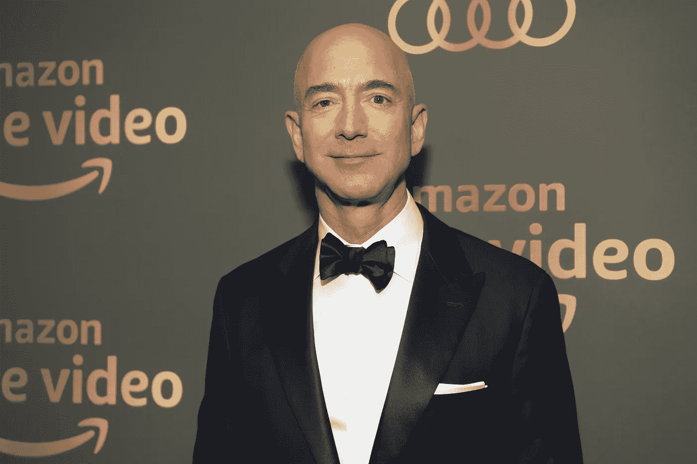

# 这是杰夫·贝索斯成功的最重要的一课

> 原文：<https://medium.datadriveninvestor.com/this-is-jeff-bezoss-most-important-lesson-for-success-fa624749803b?source=collection_archive---------2----------------------->

## 创造奇迹:杰夫·贝索斯文集为亚马逊的成功提供了显而易见的经验。

[Jeff Bezos](https://www.google.com/url?sa=i&url=https%3A%2F%2Fwww.bbc.com%2Fpidgin%2Fworld-53927496&psig=AOvVaw1sK9sAsdVEY8S-2uGsdmzK&ust=1608180688828000&source=images&cd=vfe&ved=0CAQQtaYDahcKEwjAyZPF2tHtAhUAAAAAHQAAAAAQHQ)

杰夫·贝索斯经受了火的洗礼。

1994 年辞去六位数的工作后，他在车库里创办了亚马逊网上书店。今天，亚马逊的价值超过了[1.7 万亿美元](https://www.cnbc.com/2020/08/26/amazon-ceo-jeff-bezos-worth-more-than-200-billion.html#:~:text=As%20of%20Wednesday%2C%20the%20company,as%20well%20as%20ordering%20groceries.)，成为美国第二大最有价值的公司，仅次于苹果。

他也是世界上最富有的人，拥有 2000 亿美元财富。

[*发明&游走:杰夫·贝索斯文集*](https://www.amazon.com/Invent-Wander-Collected-Writings-Introduction-ebook/dp/B08BCCT6MW) 为亚马逊的成功提供了隐藏在明处的教训。这对企业家和投资者来说是一个信息宝库，并进一步解释了亚马逊的核心价值观。

## 如今，许多科技公司都有一个核心理念:

*   **谷歌:**“不作恶”
*   **苹果公司:**“我们其余人的电脑

科技公司如此强大，以至于它们需要一部法律。一个所有硅谷人都可以崇拜的宗教教条。

亚马逊的第一条戒律是:**确定谁是传教士，谁是雇佣兵。**

# 你是传教士还是雇佣兵？

Image from Canva

雇佣兵是无情的。我们都知道一个。他们是冷酷、以任务为导向的杀手，会不惜一切代价摧毁竞争对手。他们是没人邀请去酒吧的同事。

雇佣兵经常成功。但是他们的成功是有限度的。

一旦他们用他们那种割喉式的，不择手段的态度杀光了所有人，烧了几座桥，就没有人会袖手旁观他们了。雇佣军可以创造商业，但他们永远不会创造帝国。

另一方面，传教士可以改变世界。

## 这是贝佐斯对他们的评价:

> “我总是试图首先弄清楚一件事:那个人是传教士还是雇佣兵，”贝佐斯在他的书的第一页写道。“雇佣军正试图抛售他们的股票。传教士热爱他们的产品或服务，热爱他们的客户，并试图建立一个伟大的服务。”

> "顺便说一句，这里最大的矛盾是，通常是传教士赚更多的钱."—杰夫·贝索斯

他在另一次采访中补充道，他认为成为一名传教士对于成为一名成功的企业家至关重要。他说，事实上，是关心的人赢了。

企业家像优秀的四分卫一样思考。他们知道他们只是更大游戏中的一部分。所以他们把合适的人放在身边，让团队获胜。或者像贝佐斯那样，让团队变得暴富。

 [## 取代你的风投？企业家的 5 条原则|数据驱动的投资者

### 在 Tau Ventures，我们建议所有企业家将融资过程中的勤奋过程视为双向的…

www.datadriveninvestor.com](https://www.datadriveninvestor.com/2020/11/29/replacing-your-vc-5-principles-for-entrepreneurs/) 

# 拥抱失败

传教士的生活不容易。很多人会往你脸上吐口水。有些人会在你做的每件事上都拉屎。但你不能让这些人影响你。

拥抱失败，接受你的善意不会总是被他人接受的事实。专注于长期的比赛，不要让一些混蛋毁了你作为传教士的生活。

贝佐斯本人也多次摔了个嘴啃泥。当他爬到顶端时，许多人嘲笑他。例如，当亚马逊 Prime 在 2005 年推出时，怀疑者怀疑顾客是否会每年支付 79 美元。

今天，这项服务在全球拥有 1 . 26 亿用户。

> “如果我们要移动针头，我们需要大的失败”——十亿美元规模的失败，”贝佐斯在[亚马逊网站上说。"如果我们没有，我们就没有足够努力."](https://www.geekwire.com/2019/amazon-launches-remars-event-focusing-ai-second-stage-invite-mars/)

# 你可能是一个雇佣兵，却不自知

我们很多人喜欢认为自己是像贝佐斯一样的传教士，但事实上，我们是雇佣军，我们甚至不知道:

*   我们忽视我们的朋友，或者从不花五分钟给他们打电话。
*   我们变得懒惰，决定不回复有潜在机会的邮件。
*   我们用“我们太忙了”这样站不住脚的借口来掩盖没有接触到有价值的关系。

雇佣兵就在我们身边，你可能就是其中之一。风险投资家[约翰·杜尔登](https://www.usatoday.com/story/tech/2013/11/04/amazon-book-brad-stone-missionary-tech-firms/3433697/)解释说，即使是小小的嫉妒也是一种唯利是图的态度。

> “唯利是图的公司偏执多疑，痴迷于竞争，经理们是狼群的老板，而不是团队的导师和教练。”

回到我们之前的四分卫类比，总有一个人太专注于自己而没有意识到他正在毁掉整个团队。我认为约翰尼·曼齐尔，蒂姆·泰博，或者前新英格兰爱国者凸轮·牛顿。

这些人在球场外可能很棒，但在比赛中，一切都是为了他们自己。他们没有提升他们周围的团队。很可能不是国际性的。他们是雇佣军，甚至不知道自己的成功。

# 外卖食品

为了结束 2021 年，我正在做蒂姆·菲利斯最近在 Twitter 上推荐的事情:**“过去一年的回顾。”**回顾你当传教士的时代，和你更唯利是图的时代。

对我个人来说，我能够在朋友的帮助下[直线跑 30 英里](https://medium.com/yardcouch-com/how-i-became-an-ultramarathoner-in-less-than-a-year-91bfa42f426d)，并成为一名超级马拉松运动员。我们计划好了，他们跟踪我，拍摄了整个过程，并在最后的五英里给我带了两瓶佳得乐。

没有他们我不可能做到。作为一个团队，我们超越了我从未想过我能做到的事情。

更像一个传教士，你的成功将是无限的。

> “品牌对于一个公司来说，就像一个人的声誉。你通过努力把困难的事情做好来赢得声誉。”—杰夫·贝索斯

*阅读以赛亚·麦考尔的另一篇文章*

 [## 一个愚蠢的快速指南，告诉我如何在一年内成为超级马拉松运动员

### 只用了一年的努力就改变了我的生活

medium.com](https://medium.com/yardcouch-com/how-i-became-an-ultramarathoner-in-less-than-a-year-91bfa42f426d) 

## 访问专家视图— [订阅 DDI 英特尔](https://datadriveninvestor.com/ddi-intel)