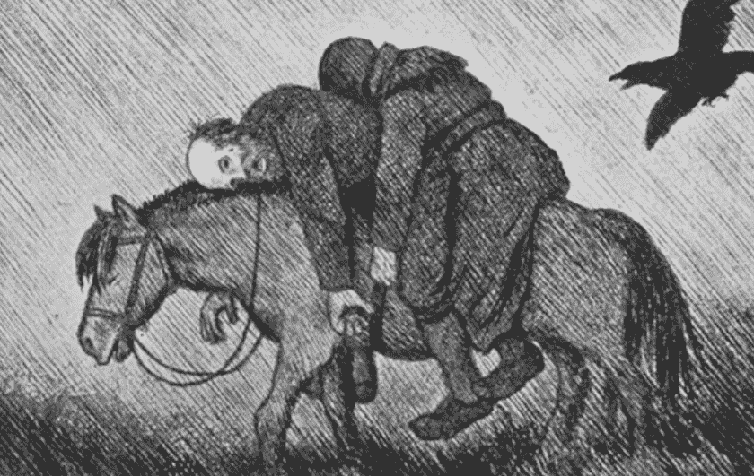

# 这不是黑死病

> 原文：<https://medium.datadriveninvestor.com/this-is-not-the-black-death-1a99472bd57a?source=collection_archive---------11----------------------->

## 将来的

## 措施必须与威胁、后果、成本和收益相称。

[T](http://kittelsen.se/pesten/)he Plague [| Theodor Kittelsen](http://kittelsen.se/pesten/)

# 最重要的词是恐惧

但是

## 这不是黑死病。

既不是西班牙病，也不是铜流行病。

*   黑死病是一种流行病，在中世纪对欧洲打击很大。人们预计超过 2 亿人死亡。
*   这种疾病在各大洲肆虐了至少 500 年。在南美洲，它几乎灭绝了整个国家，在欧洲，每年约有 40 万人死亡。人们预计有 3-5 亿人死于铜，平均每年高达 100 万人。
*   西班牙病(1918-1920 年)是历史上第一次世界性流行病。这是一种类似流感的疾病，导致免疫系统疯狂，导致 5000 万至 1 亿人死亡。

这些流行病的共同点是，它们发生在人们缺乏关于疾病、感染、感染控制和病人治疗的知识和信息的时候。社会结构是原始的，无法提供有效的防御黑死病，铜流行病和西班牙疾病。人类和这些国家缺乏足够的领导力、有效的沟通工具、有效的医疗体系以及应对疫情的各方面知识。

2020 年不是这样的。所有这些在今天的大多数国家或多或少都有，尤其是像挪威这样的国家！

 [## 在医疗保健中使用人工智能的伦理|数据驱动的投资者

### 人工智能(AI)正被应用于任何管理大量数据的行业，并且在一个…

www.datadriveninvestor.com](https://www.datadriveninvestor.com/2020/03/21/the-ethics-of-using-ai-in-healthcare/) 

## 信息

事实上，在今天的情况下，最关键的因素是信息，特别是大众媒体和政府处理这种情况的方式。大众媒体和政府一起代表了大量的黑色油漆和在和平时期无与伦比的恐吓宣传！已经进入紧急状态，许多最重要的社会功能已经关闭。政府做出的决定给挪威政府带来了惊人的成本，并严重削减了挪威石油基金——也许没有足够好的理由。

我们正面临着一个可怕而危险的局面，挪威社会和人民在经济、社会和健康方面都面临着严重伤害的风险。

所有这些都是政府在从各个角度发布关于冠状病毒 2020 有多危险的灾难公告的基础上实施的。

## **恐惧**

当我们看到和听到有关疫情电晕的信息时，我们许多人都会想到黑死病，也许是西班牙病和 1918 年的铜流行病，我们自然会感到恐惧。上述三种流行病的共同点是什么？是的，他们盲目袭击并夺走了世界大部分地区数百万手无寸铁的人的生命。

当我们试图找到一个安全的位置来应对这一对我们所有人的新威胁时，这就是我们的背景。

我们受到了威胁。我们不得不承认这一点。政府和政客，街上的女人，男人和孩子。

那些受这种新恐惧影响最小的人可能是职业环境的一部分，尤其是那些从事感染控制和统计工作的人。

2020 年 4 月 11 日，奥斯陆大学和奥斯陆大学医院**临床影响研究**研究小组和特罗姆瑟大学医学生物学研究所的八名研究人员发表了研究报告**新冠肺炎和季节性流感在瑞典、挪威和丹麦的患病率和死亡率。**

研究人员和其他人一起

> 比较了 2020 年 2 月 26 日至 4 月 11 日期间挪威、瑞典和丹麦检测呈阳性并死于新冠肺炎的人数，并比较了 2015/2016 年至 2018/19 年期间这些国家新冠肺炎的死亡率和季节性流感的死亡率。
> (临床影响研究，2020)

他们取得了以下发现:

> 从 3 月 11 日瑞典第一个人死亡到 4 月 11 日期间，挪威平均每天有 4 人死于新冠肺炎，瑞典有 28 人，丹麦有 8 人，而流感季节平均死亡率为每天 21 人、53 人和 23 人死亡。
> (临床影响研究，2020 年)

> 结果显示，在挪威，由于季节性流感，平均每天有 21 人死亡，而新冠肺炎有 4 人。换句话说，季节性流感导致的死亡人数是新冠肺炎的五倍多。

截至 2020 年 4 月 16 日，来自新冠肺炎的死亡人数随后已增至总共 127 人。

我们在邻国瑞典和丹麦也发现了类似的模式。

# 从中我们应该得出什么结论？

首先:

*   新冠肺炎是一个严重的疫情，世界各地的事件表明，政府需要认真对待这种情况。疫情必须得到控制，必须制备有效的疫苗。
*   控制(“减缓”或“击倒”)疫情的措施必须与威胁、后果、成本和收益相称。

这意味着

1.  所有国家的卫生保健必须是威胁的前兆，并能够防止病毒不受控制的传播
2.  一个国家四分之一地区和下级的领导人必须对可靠的信息负责，并采取适当和适应的措施。
3.  政府必须选择和设计与威胁相称的有效措施。这至少不适用于下一点:

4.“关闭学校和大学等全国性措施严重阻碍了社会的基本运作。这些措施的效用应该与社会的成本和不利因素有合理和充分的关系。因流行病而关闭学校的影响尚不确定”(临床影响研究，2020 年)

5.应尽快恢复重要的社会功能，参见《晚邮报》，2020 年 3 月 22 日:

> “3 月 12 日星期四，政府决定在挪威实行和平时期最严格的措施，以阻止冠状病毒的传播。
> 
> 所有学校和幼儿园都关闭了。健身中心、餐馆和夜总会关门，文化和体育活动被取消。
> 在政府上周四出台挪威和平时期最严厉的措施之前，无论是财政部、挪威公共卫生研究所还是其他任何学术环境都没有进行任何经济分析。
> 
> 当局要求对让人们呆在家里的经济后果进行分析。然后他们不等回答就做了决定。
> 
> 政府表示，现在还不是指望部分关闭国家的财政后果的时候。"

## **现在就行动！**

现在是时候仔细看看部分关闭这个国家的财政后果了。

何时采取行动——应该在健康和财政后果变得太严重之前尽快采取行动——这份报告是一份重要的读物:

[**临床影响研究:新冠肺炎和季节性流感在瑞典、挪威和丹麦的患病率和死亡率，UiO**](https://www.med.uio.no/helsam/forskning/grupper/klinisk-effektforskning/aktuelle-saker/2020/norge-sverige-dk.pdf)