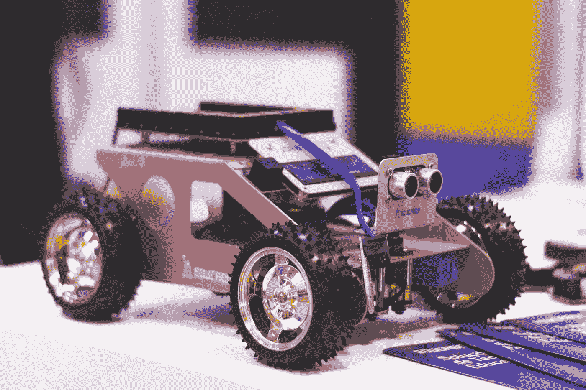

# 当只有自动驾驶车辆时，就会发生这种情况

> 原文：<https://medium.datadriveninvestor.com/this-is-what-happens-when-there-are-only-self-driving-cars-d72919ea7df0?source=collection_archive---------25----------------------->

## 对完全自治世界的 6 个预测

Photo by [Marília Castelli](https://unsplash.com/@liacastelli?utm_source=unsplash&utm_medium=referral&utm_content=creditCopyText) on [Unsplash](https://unsplash.com/s/photos/robot-car?utm_source=unsplash&utm_medium=referral&utm_content=creditCopyText)

一架载着数百名乘客在全球不间断飞行 10 多个小时的巨型喷气式飞机，大部分是由电脑自动驾驶的。一旦飞行计划确定，方向、速度和高度达成一致，就没有真正的人在旅程的每一秒钟主动驾驶飞机。对于其他运输方式来说也是如此，比如大船，也许还有今天的一些火车。

我们的未来当然是自主的。不是部分自治。但是 100%自主，任何世俗的任务，包括驾驶，都交给计算机运行算法。所以我们来探索一下这样的世界是什么样子的。

# 基础设施

当每辆车都自动驾驶时，光是交通量就足以证明改善基础设施所需的投资是合理的。

我们今天的基础设施由静态资产组成——道路、交通灯、停车标志。并且由道路的硬编码规则引导。但是如果计算机能让我们的基础设施可编程会怎么样呢？每项资产、每条规则都可以动态变化，以更好地管理手头的交通或运输需求。

从绿灯亮多久到改变速度限制，停车标志的位置等等。由无所不知的计算机进行实时优化。传感器可以促进车辆、基础设施和城市官员之间的即时通信。任何瓶颈或事件都可以得到快速响应，并立即得到解决。

更进一步，谁说你可以只在路的一边开车？根据交通状况，两侧的所有车道都可以用来单向疏导需求。事情可以根据需要恢复原状。

车辆可以在路上互相协商。交通灯可以适应实时的需要。软件堆栈中帮助车辆在地图上准确定位的定位部分将变得没有必要。车辆上简单的全球定位系统结合来自嵌入道路的传感器的信息，可以帮助车辆精确定位。

 [## 一名大学生使用语言生成人工智能工具创建了一个病毒式博客帖子|数据驱动…

### 作为作家，我们喜欢告诉自己，我们处在一个无法自动化的职业中，至少短期内不会。但是…

www.datadriveninvestor.com](https://www.datadriveninvestor.com/2020/09/15/a-college-student-used-a-language-generating-ai-tool-to-create-a-viral-blog-post/) 

# 人工智能交通控制

如果每辆车和每件基础设施都连接起来，那么我们就相当于一个实时数据库，一个无所不知的数据库。

该数据库存储了每辆车的路线计划、每个骑手的偏好，并与基础设施进行通信，以了解最新的实时路况。此外，该数据库可以存储一组实时约束。例如，建筑工程关闭了一条车道，或者骑车人想去医院急救等等。

然后，算法可以读取该数据库(输入)，并根据约束集，输出用于流量管理的编排计划。随着现实世界中输入和约束的改变，它可以改变这个计划。

这样一个管弦乐队的影响将是巨大的。任何不听从指挥者指导的流氓演员都会被立即发现。我们不需要活跃的交通警察在路上监控车辆。

不利的一面是，任何怀有恶意的黑客都可能对访问这样的流量系统造成严重破坏。这种系统必须不仅仅是防呆的，还要有一个嵌入的计划 B、C、D 等等。以防主动威胁。

# 自动驾驶技术

不言而喻，所有这一切都将改变自动驾驶技术的工作方式。今天正在设计的技术，解释了世界上的活力和低效。消除了大量此类问题后，就没有必要再去解决它们了。

例如，今天的人工智能网络不仅用于感知物体，还可以预测它们的意图。但在一个互联的世界里，路上的所有行动者只需通过 V2V 信号广播他们的位置和意图。那么这样的网络有什么用呢？类似地，车辆可以通过转弯、合并等。与其他车辆。这将简化规划和控制算法。

今天，自动驾驶汽车使用各种算法在地图上精确定位或指出他们的位置。但在这个新世界，嵌入基础设施的传感器可以定期传递这类信息。这将使本地化成为历史。

# 汽车设计

为什么把车辆的设计局限于轿车、SUV、卡车？随着自动驾驶汽车变得无处不在，汽车拥有量将大幅下降。因为按需呼叫和租用交通工具变得非常经济，但拥有它却非常昂贵。

如果这就是未来，我提议一个新的设计，叫做——豆荚。把 pod 想象成一把椅子，有一个玻璃外壳和几个轮子，可以在路上自动驾驶。虽然一个吊舱只能携带一个人，但这种吊舱是模块化设计的。因此，多个吊舱可以连接成一个大型车辆。所以你可以有一个 2/3/4/..按需动态制造的四座汽车。此外，吊舱将不会仅限于携带人类。你可以运输杂货、包裹、宠物或任何东西！

# 车辆黑匣子

当飞机坠毁时，调查人员首先寻找的是飞行记录器，也称为黑匣子。这个盒子存储了驾驶舱的语音记录和数百个电气、机械和其他参数的记录，有助于描绘飞机的整体健康状况。这个盒子是精心设计的，可以在碰撞中存活下来，并且有法律对此进行监管。

自动驾驶汽车也需要类似的东西。调查人员想知道导致事故发生的所有事情。车辆感知到了什么，它发出了什么驱动命令，速度和航向是多少等等。但这些记录的消息将特定于自动驾驶技术所有者。其他任何人都很难理解和解释。

这就是我怀疑监管会介入的地方。这种记录的消息将必须遵守一些商定的和强制的标准。某些方面，如车辆的世界观，它的决策，它的基本原理，将需要定期记录时间戳。这当然是对车辆机械和电气健康状况参数的补充。

# 汽车保险

有两个明显的趋势会影响汽车保险的运作。随着所有权的下降，人们只会在乘车时购买保险。责任转移到了自动驾驶技术的所有者身上。

船队所有者将做出选择。自驾游是自己投保还是从另一家公司购买保险。法律如何改变和影响这些决定？一方面，车队所有者拥有大量数据来准确预测故障率，从而向乘客收取适当的保险费用。但另一方面，保险公司可能会游说法律强制车队使用他们的服务。

保险的成本必然会反映自动驾驶技术的成熟度和安全性。法律可能会强制车队公开披露此类费率。但他们会成为镇上根除整个行业的新精算师吗？时间会证明一切。

# 最后的想法

未来既恐怖又刺激。这一切可能会比我们预期的来得更快。但是，我希望我们所有人都积极参与建设，而不仅仅是辩论和分析结果。一步一步小心前进。

## 访问专家视图— [订阅 DDI 英特尔](https://datadriveninvestor.com/ddi-intel)