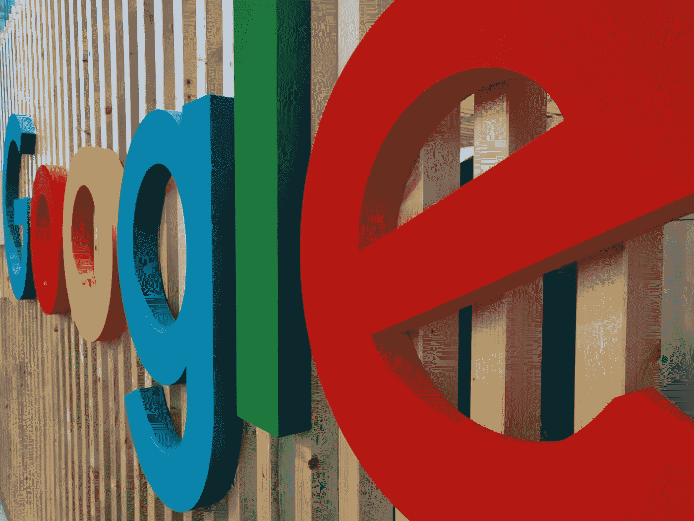

# 这就是领导的样子

> 原文：<https://medium.datadriveninvestor.com/this-is-what-leadership-looks-like-3ee85bb65559?source=collection_archive---------24----------------------->

## 谷歌宣布，在 2021 年 7 月之前，他们不会将员工召回校园或办公室。

Photo by [Kai Wenzel](https://unsplash.com/@kai_wenzel?utm_source=unsplash&utm_medium=referral&utm_content=creditCopyText) on [Unsplash](https://unsplash.com/s/photos/google?utm_source=unsplash&utm_medium=referral&utm_content=creditCopyText)

这个很重要，因为这就是领导力的样子。作为领导者，我们必须做出判断，果断，设定期限，并传达我们的决定。

想想这个决定所传达的明确信息，这个决定影响的所有人:123，000 名全职员工，一些在职父母，他们的配偶和孩子。

隔离生活中最困难的事情之一就是不确定性、未知性和模糊性。双职工父母尤其需要规划他们的生活、学校和家庭的未来。

当他们在家工作时，但这是暂时的，他们不知道会持续多久，这导致了不必要的压力，因为有一种隐现的焦虑，即一切都将再次改变，但什么时候改变呢？当然，也许，工作的父母将不得不回到办公室，但时间是一个移动的目标，不可能确定，尽管它的重要性。

对你的员工说，我们什么时候回来，是的，这是真的，任何事情都可能发生，日期可能会改变，但你有一年的时间。*你还有一年在家工作的时间。*

# 然后，就不再是实验了。

这不再是忍受或等待的事情。一年的时间足够拥抱你的新现实:利用它，做相应的计划，最大化它，尽你所能。

它没有坚持到底，而是将心态从让它发挥作用转移到实施战略性的、成功的 WFH 最佳实践。这是新的常态。

# 你怎么能把这延伸到你自己的生活中呢？

如果你是老板，给你的员工同样的礼貌。他们也是人，安度着疫情。你能提供的确定性越多，你就能更清楚地传达你的决定和决定的背景，你的员工就能更自信地出现，适应新的常态，并随机应变。

要求他们无限期地在地狱边缘徘徊是麻木不仁和令人沮丧的。他们会记得你是如何处理这场危机的。

如果你是家长，在第一学期、第一学期或第二学年选择远程学习还是现场学习，无论哪种间隔对你的家庭都有意义。与你的孩子、老师和管理人员交谈，一旦利益相关者参与进来，考虑他们的意见和建议，与你的伴侣讨论，然后做出决定。

通过提醒自己没有决定是不可逆转的来减轻压力，并且知道等待决定会给你和你的孩子带来不必要的压力，从而得到安慰。等待总是比选择更糟糕。

你的孩子想知道期待什么；无论你做出什么决定，他们都需要时间来适应这个计划，并与他们的朋友交谈。他们指望你来领导，定下基调，并传达期望。告诉他们什么对你的家庭最好，即使这与你的邻居或朋友的决定不同。

用不可协商的，但充满同情和爱的语言解释你的决定，并为你的孩子提供一个持续表达意见的论坛。同意实时重新评估。

领导力不仅仅是最大、最赚钱、行业领先的公司的特权。这是我们指导和决定自己生活的方式，正直、透明、符合我们的价值观、优雅。这很重要。做人吧。相信自己，考虑理想的结果，对那些受你领导影响的人慷慨大方。