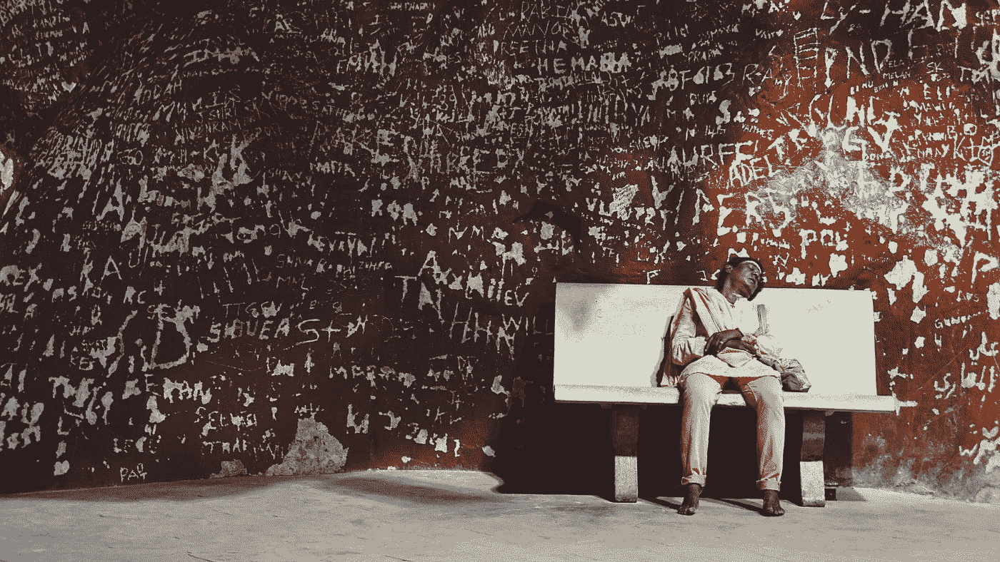

# 为什么什么都不做会让你觉得累

> 原文：<https://medium.datadriveninvestor.com/this-is-why-doing-nothing-makes-you-feel-tired-4121369ea074?source=collection_archive---------0----------------------->

## 你能做些什么来让自己更清醒、更有活力

Photo by [Pim Chu](https://unsplash.com/@pimchu?utm_source=medium&utm_medium=referral) on [Unsplash](https://unsplash.com?utm_source=medium&utm_medium=referral)

随着全球范围内对自由流动的限制作为对冠状病毒爆发的回应，你可能会发现自己坐在家里几乎什么也不做。或许，这是一个非常需要的休息和恢复的好机会？然而，出于某种原因，你觉得累了。

根据心理治疗师露西·贝雷斯福德的说法，人类“生来就渴望成长和刺激”。她在接受《赫芬顿邮报》英国版采访时表示，这意味着如果每天都没有目标，我们往往会感到“挫败、倦怠甚至沮丧”。

这种形式的疲劳的特殊问题是，让自己有更多的时间休息、放松和放松只会让你感觉更累，而不是更少。正如贝雷斯福德解释的那样，对一些人来说，这可能会演变成抑郁。有些人可能还会发现，缺乏动力加剧了他们对新冠肺炎局势的压力。

这可能会澄清我们中的一些人感到的精神疲惫，但它不能解释为什么尽管你比平时休息得多，却可能会感到身体疲劳。在同一篇[《赫芬顿邮报》的文章](https://www.huffingtonpost.co.uk/entry/this-is-why-you-feel-so-tired-right-now_uk_5e85c47ec5b60bbd734fc9d7)中，罗杰·亨德森博士(英国的一名全科医生)解释说，“体内与焦虑相关的激素水平升高，如肾上腺素，会……影响身体，降低能量水平，导致身体和精神疲劳”。

根据亨德森博士的说法，无所事事会增加引发焦虑的荷尔蒙水平，而这些荷尔蒙通常会被锻炼“烧掉”。这种加剧的焦虑可能会导致睡眠模式恶化，这意味着睡眠时间和质量都下降了。长时间不活动也会降低我们对日常活动的耐受性，这意味着肌肉功能开始衰退。

糟糕的睡眠质量和高于正常水平的焦虑诱导激素有可能对判断和情绪控制产生负面影响。最终，这会导致烦躁、不安、注意力不集中和疲惫感。

Photo by [Shane](https://unsplash.com/@theyshane?utm_source=medium&utm_medium=referral) on [Unsplash](https://unsplash.com?utm_source=medium&utm_medium=referral)

那么，如何才能回到正轨呢？

为了感觉更有活力，集中精力改善你的睡眠，减少压力，获得足够的情感、智力和社会刺激。为了确定你应该把注意力放在哪里，把可能的解决方案分成三类(锻炼、睡眠和刺激)可能会有帮助:

**演习**

每天划出一个明确的时间段来做一些运动，可以帮助减少焦虑，并为每天提供一个目标。无论是原地慢跑还是高强度间歇训练(HIIT)，锻炼都可以改善你的睡眠质量、能量水平和肌肉功能。

**睡眠**

英国 NHS 建议，如果可能的话，坚持规律的就寝时间，每晚在相同的时间上床睡觉。一个相当严格的睡眠时间表，允许每晚 6 到 9 个小时的睡眠，让你的大脑和身体每天都得到重置，帮助你保持活力和精力充沛。

为了优化你的睡眠质量，NHS 还建议你每天晚上优先放松一下。这意味着在每晚睡觉前，安排时间放松，为睡眠做准备。这种放松可能包括轻度锻炼(如伸展运动或瑜伽)或阅读。

无论你选择做什么来放松，重要的是在睡觉前一个小时左右避免使用电子设备。这些设备屏幕上的光线会欺骗你的大脑，让它认为现在还是白天，从而对你的睡眠产生负面影响。

根据英国国民健康保险制度，你的卧室应该“黑暗、安静、整洁”并且“温度保持在 18 摄氏度到 24 摄氏度之间”以优化睡眠。

**刺激**

确保你每天在情感、智力和社交方面都受到刺激是至关重要的，这让你获得必要的“成长和刺激”。如果你没有工作，或者只是比平时有更多的空闲时间，留出时间来学习、实验和交流。例如，你可能希望通过像 Duolingo 或 Memrise 这样的免费应用程序学习一门新语言来保持智力上的刺激。

你还应该确保通过电话或视频与朋友和家人保持(虚拟)联系。或许可以尝试在 FaceTime、Zoom、Houseparty 或类似平台上安排定期的个人或集体通话？由于人类是天生的群居动物，这样的互动可以为你提供保持精力充沛所必需的情感刺激。

Photo by [Carles Rabada](https://unsplash.com/@carlesrgm?utm_source=medium&utm_medium=referral) on [Unsplash](https://unsplash.com?utm_source=medium&utm_medium=referral)

虽然为了方便起见，这里将“锻炼”、“睡眠”和“刺激”分开，但实际上，它们是有内在联系的。每天获得足够的锻炼和精神刺激有助于改善睡眠，这反过来又会激发对身体、智力、情感和社会活动的追求。

总而言之，每一天都应该提供工作和娱乐的平衡，包括锻炼、社交、智力刺激和睡眠。如果可以的话，在冠状病毒爆发期间，考虑为那些无法去购物、取药或做其他重要事情的老年人和弱势人群提供志愿服务。

*本文并非专业医疗建议的来源。对于医疗问题，请寻求专业意见。*

 [## 我如何用概念组织我的生活

### 你需要的唯一生产力工具的初学者指南

medium.com](https://medium.com/@theo.sheppard/how-i-organise-my-life-with-notion-b85c8a33e4da)